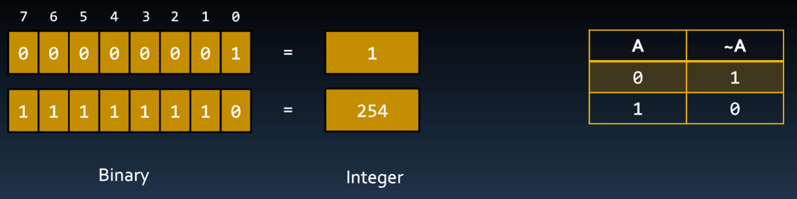
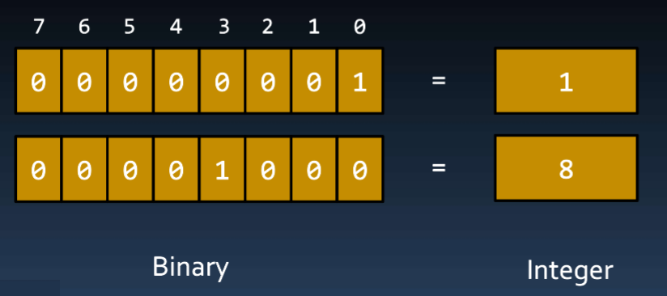
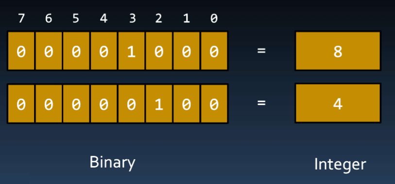

# Boolean ( sizeof() operator | Bitwise Operators (+casting) )

## Contents

 - [Intro to Boolean type (+sizeof() operator)](#intro-to-boolean)
 - [Bitwise Operators (+casting)](#bitwise-operators)
 - **Tips and Tricks:**
   - [Bitwise operation (Video)](#bitwise-video)

---

<div id="intro-to-boolean"></div>

## Intro to Boolean type

The **"bool"** type stores one of the boolean values:

 - **False** (0)
 - **True** (1)

For example:

```cpp
bool ready = true;
```

**NOTE:**  
 - In the truth, only 1 bit was necessary to store a boolean (0 or 1).
 - But, in practice, this is not possible because the smallest (menor) possible block (memory address) of memory is 1 Byte (8 bits).

For example, the program below shows the **"bool"** amount of Byte:

[bool_size.cpp](src/bool_size.cpp)
```cpp
#include <iostream>
using namespace std;

int main()
{
    bool ready;

    cout << "Bool size (in Bytes) is: " << sizeof(ready);

    return 0;
}
```

**COMPILATION AND RUN:**
```cpp
g++ bool_size.cpp -o testBool

./testBool
```

**OUTPUT:**  
```cpp
Bool size (in Bytes) is: 1
```

**NOTE:**  
An observation is that **sizeof() operator** always return the amount in Bytes.

---

<div id="bitwise-operators"></div>

## Bitwise Operators

How we knowing the boolean type have 8 bits (1 Byte), however, only use 1 bit. We can explore that to solve some problems.

For example, imagine we have 8 lamps in our house. We can use each bit from bool type (1 Byte = 8 bits) to mapped the lamps:

```cpp
bool lamps;

lamps (bits) = [ 0 ] + [ 0 ] + [ 0 ] + [ 0 ] + [ 0 ] + [ 0 ] + [ 0 ] + [ 0 ] 
                 |       |       |       |       |       |       |       |
             First lamp  |       |       |       |       |       |       |
                    Second lamp  |       |       |       |       |       |
                            Third lamp   |       |       |       |       |
                                    Fourth lamp  |       |       |       |
                                            Fifth light  |       |       |
                                                     Sixth lamp  |       |
                                                            Seventh lamp |
                                                                    Eighth lamp
```

 - **Now, we can use each bit to manage the lamps:**
   - **0 (false)** to the lamp is **off**.
   - **1 (true)** to the lamp is **on**.

The C++ programming language has some **Bitwise Operators** to work with each bit:

 - The **& (bitwise AND)** in C or C++ takes two numbers as operands and does *AND* on every bit of two numbers:
   - The result of AND is *1* only if both bits are *1*.
 - The **| (bitwise OR)** in C or C++ takes two numbers as operands and does **OR** on every bit of two numbers:
   - The result of *OR* is *1* if any of the two bits is *1*.
 - The **^ (bitwise XOR)** in C or C++ takes two numbers as operands and does **XOR** on every bit of two numbers:
   - The result of *XOR* is *1* if the two bits are different.
 - The **<< (left shift)** in C or C++ takes two numbers, left shifts the bits of the first operand, the second operand decides the number of places to shift.
 - The **>> (right shift)** in C or C++ takes two numbers, right shifts the bits of the first operand, the second operand decides the number of places to shift.
 - The **~ (bitwise NOT)** in C or C++ takes one number and inverts all bits of it. 

> **NOTE:**  
> Now, let's see some examples, however, we use **"unsigned char"** integer type because is easier to work with each bit.

---

**~ (BITWISE NOT) EXAMPLE:**  
The **~ (bitwise NOT)** in C or C++ takes one number and inverts all bits of it. For example:

[not_example.cpp](src/not_example.cpp)
```cpp
#include <iostream>
using namespace std;

int main()
{
    unsigned char state = 1;

    cout << "Initial number: " <<  (int) state;
    state = ~state;
    cout << "\nAfter apply NOT (~) operator: " << (int) state;

    return 0;
}
```

**COMPILATION AND RUN:**
```cpp
g++ not_example.cpp -o notExample


./notExample
```

**OUTPUT:**  
```cpp

Initial number: 1
After apply NOT (~) operator: 254
```

  

**NOTE:**  
We used **"(int)"** after **"state"** variable in the code to **casting** the char letter (character or symbol) to an integer.

---

**LEFT SHIFT (<<) EXAMPLE:**  
The LEFT SHIFT (<<) operator shifts a certain amount of bits to the left. For example:

[left_shift_example.cpp](src/left_shift_example.cpp)
```cpp
#include <iostream>
using namespace std;

int main()
{
    unsigned char state = 1;

    cout << "Initial number: " <<  (int) state;
    state = state << 3;
    cout << "\nAfter apply LEFT SHIFT (<<) operator: " << (int) state;

    return 0;
}
```

**COMPILATION AND RUN:**
```cpp
g++ left_shift_example.cpp -o leftShiftExample

./leftShiftExample
```

**OUTPUT:**  
```cpp
Initial number: 1
After apply LEFT SHIFT (<<) operator: 8
```



**NOTE:**  
See that we displaced **3 bits** to the LEFT.

---

**RIGHT SHIFT (>>) EXAMPLE:**  
The **RIGHT SHIFT (>>)** operator shifts a certain amount of bits to the right. For example:

[right_shift_example.cpp](src/right_shift_example.cpp)
```cpp
#include <iostream>
using namespace std;

int main()
{
    unsigned char state = 8;

    cout << "Initial number: " <<  (int) state;
    state = state >> 1;
    cout << "\nAfter apply RIGHT SHIFT (<<) operator: " << (int) state;

    return 0;
}
```

**COMPILATION AND RUN:**
```cpp
g++ right_shift_example.cpp -o rightShiftExample

./rightShiftExample
```

**OUTPUT:**  
```cpp
Initial number: 8
After apply RIGHT SHIFT (<<) operator: 4
```

  

---

<div id="bitwise-video"></div>

## Bitwise operation (Video)

You can see how apply [Bitwise operation clicking here...](https://www.youtube.com/watch?v=n3foWc_n2eA&t=4515s)

---

**REFERENCES:**  
[Aula 07 - Tipos Caractere e Booleano | Tabela ASCII | Operadores Bit a Bit | Curso de C++](https://www.youtube.com/watch?v=n3foWc_n2eA&list=PLX6Nyaq0ebfgWfHqVHVAEPCDG54RLArJh&index=9&t=1s)  

---

Ro**drigo** **L**eite da **S**ilva - **drigols**
