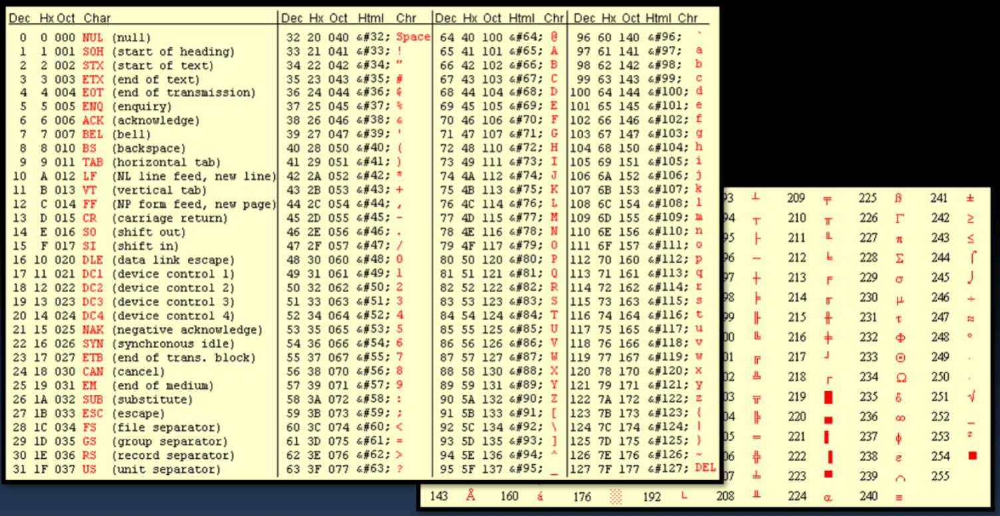
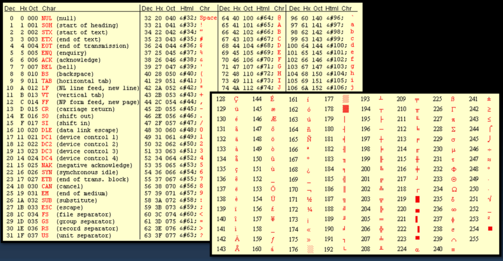

# Character (char)

## Contents

 - [Intro to char (character) type](#intro-to-char)
 - [The relationship between char type and ASCII/Unicode tables](#relationship-ascii-unicode)

---

<div id="intro-to-char"></div>

## Intro to char (character) type

The **"char"** type store 8 bits integers:

 - Numbers from **-128** to **127** for char.
 - Numbers from **0** to **255** for unsigned char.

**NOTE:**  
Knowing that the **char** type store integers of 8 bits we could for example, add some integer values within the range specified *(-128 to 127 or 0 to 255)*:

```cpp
char number = 65;
```

---

<div id="relationship-ascii-unicode"></div>

## The relationship between char type and ASCII/Unicode tables

The **char** type is an integer that is utilized to store characters, for example:

```cpp
char letter = 'A';
```

> But, how the computer stores a letter *'A'* in **char** type that store integers?

In the truth, the computers represent letters and symbols with numbers. This letters and symbols are mapped in a range of numbers using tables, like:

 - **EBCDIC** (IBM Mainframes)
 - **ASCII** (American Standard)
 - **Unicode** (International support - Support many languages)

For example, see the ASCII table below:

  

 - See that in the truth in the table above, we just used half of the bits:
   - That because the table above was the first ASCII table.
 - We also don't have accents on letters in the table above.

**NOTE:**  
How the half of the bits was available was created another ASCII extended table:

  

For example, let's see the program that receives the user a character and show the character integer number in the ASCII table:

[character_to_ascii.cpp](src/character_to_ascii.cpp)
```cpp
#include <iostream>
using namespace std;

int main()
{
    char character;

    cout << "Enter the character: ";
    cin >> character;

    cout << "\nThe passed character was: " << character << endl;

    // Get (convert) the passed character number.
    int ascii_number = character;

    cout << "The ASCII number to " << character << " letter is "
         << ascii_number;

    return 0;
}
```

**COMPILATION AND RUN:**
```cpp
g++ character_to_ascii.cpp -o convertToASCII

./convertToASCII
```

**OUTPUT:**  
```cpp
Enter the character: A

The passed character was: A
The ASCII number to A letter is 65
```

---

**REFERENCES:**  
[Aula 07 - Tipos Caractere e Booleano | Tabela ASCII | Operadores Bit a Bit | Curso de C++](https://www.youtube.com/watch?v=n3foWc_n2eA&list=PLX6Nyaq0ebfgWfHqVHVAEPCDG54RLArJh&index=9&t=1s)  

---

Ro**drigo** **L**eite da **S**ilva - **drigols**
