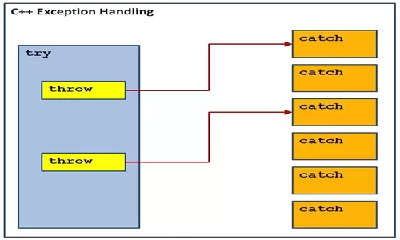
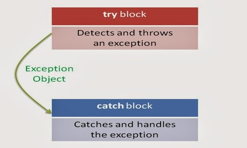

# Exception Handling in C++

## Contents

 - **Theory:**
   - [LBYL vs. EAFP](#lbyl-eafp)
   - [try, catch, throw concepts (+Flow (fluxo) example)](#try-catch-throw)
   - [Throwing Exceptions (forcing an exception)](#throwing-exceptions)
   - [Catching Exceptions](#catching-exceptions)
   - [catch(…) or catch all](#catch-all)
   - [Exception without caught/captura (in catch blocks) | Terminated program](#exception-w-caught)
 - **[C++ Standard Exceptions](#cpp-std-exceptions)**
   - [std::bad_alloc (Fail to allocate the requested space)](#bad-alloc)

---

<div id="lbyl-eafp"></div>

## LBYL vs. EAFP

Well, before starting the studies on Exceptions, let's understand two very important concepts:

 - **Loock Before You Leap (if approach):**
   - Olhe antes de saltar
 - **Easier to Ask for Forgiveness than Permission (try... except approach):**
   - Mais fácil tentar do que pedir permissão

**Did not understand?**  
Let's, see two practical examples (in Python):

```cpp
// LBYL Approach.
dic = {}

if 'a' in dic:
  print(dic['a'])
else:
  print("Don't have 'a' in dictionary!")
```

**NOTE:**  
See that in this approach we are looking (verifying) before **(Loock Before You Leap - LBYL)**.

```cpp
#EAFP Approach.
dic = {}

try:
  print(dic['a'])
except:
  print("Don't have 'a' in dictionary!")
```

**NOTE:**  
Unlike the *if approach*, this one doesn't ask (verify) permission... It just tries (try), if it doesn't get it it throws an exception.

---

<div id="try-catch-throw"></div>

## try, catch, throw concepts (+Flow (fluxo) example)

> One of the advantages of C++ over C is **Exception Handling**.

Exceptions are runtime anomalies or abnormal conditions that a program encounters during its execution. There are two types of exceptions:

 - **Synchronous**
 - **Asynchronous:**
   - i.e., exceptions which are beyond the program’s control, such as disc failure, keyboard interrupts etc.

C++ provides the following specialized keywords for this purpose:

 - **try:**
   - Represents a block of code that can throw an exception.
   - The try statement allows you to define a block of code to be tested for errors while it is being executed.
 - **catch:**
   - Represents a block of code that is *executed when a particular exception is thrown*.
   - The catch statement allows you to define a block of code to be executed if an error occurs in the try block.
 - **throw:**
   - Used to throw (force) an exception.
   - Also used to list the exceptions that a function throws **but doesn’t handle itself**.
   - The throw keyword throws an exception when a problem is detected, which lets us create a custom error.

For example:


  

See that:

 - We have a block **try** to identifies if exceptions will be activated.
 - If have an exception the **throw** statement is activated.
 - Finally, if have an exception we use the block **catch** to handle the exception (lidar com a exceção).

The following is a simple example to show exception handling in C++. The output of the program explains the flow of execution of try/catch blocks. 

[flow.cpp](src/flow.cpp)
```cpp
#include <iostream>
using namespace std;

int main()
{
    int x = -1;

    cout << "Before try \n";
    try
    {
        cout << "Inside try \n";
        if (x < 0)
        {
            throw x; // Stop the block, not the program.
            cout << "After throw (Never executed) \n";
        }
    }
    catch (int x)
    {
        cout << "Exception Caught \n";
    }

    cout << "After catch (Will be executed) \n";
    return 0;
}
```

**COMPILATION AND RUN:**
```cpp
g++ flow.cpp -o flowEG.out && ./flowEG.out
```

**OUTPUT:**  
```cpp
Before try 
Inside try 
Exception Caught 
After catch (Will be executed) 
```

**NOTE:**  
See that "throw" statement stops the block, not the program... The flow continues.

---

<div id="throwing-exceptions"></div>

## Throwing Exceptions (forcing an exception)

> Exceptions can be thrown anywhere within a code block (bloco de código) using **throw** statement.

For example, see how to force an **exception** to **division by zero**:

[div_throw.h](src/div_throw.h)
```cpp
double div(double x, double y);
```

[div_throw.cpp](src/div_throw.cpp)
```cpp
double div(double x, double y)
{
    if (y == 0)
        throw "Division by zero not allowed!";
    return (x / y);
}
```

[drive_div_throw.cpp](src/drive_div_throw.cpp)
```cpp
#include <iostream>
#include "div_throw.h"

using namespace std;

int main()
{
    double x, y, z;

    cout << "Enter the first number: ";
    cin >> x;
    cout << "Enter the second number: ";
    cin >> y;

    z = div(x, y);
    cout << "The divsion is: " << z << endl;

    return 0;
}
```

**COMPILATION AND RUN:**
```cpp
g++ div_throw.cpp drive_div_throw.cpp -o divThrow.out && ./divThrow.out
```

**OUTPUT:**  
```cpp
Enter the first number: 10
Enter the second number: 0


terminate called after throwing an instance of 'char const*'
Aborted
```

---

<div id="catching-exceptions"></div>

## Catching Exceptions

> The **catch** block following the **try** block catches any exception.

You can specify what type of exception you want to catch and this is determined by the exception declaration that appears in parentheses following the keyword catch.

For example, see the code below:

[drive_catch.cpp](src/drive_catch.cpp)
```cpp
#include <iostream>
#include "div_throw.h"

using namespace std;

double div(double x, double y)
{
    if (y == 0)
        throw "Division by zero not allowed!";
    return (x / y);
}

int main()
{
    double x, y, z;

    cout << "Enter the first number: ";
    cin >> x;
    cout << "Enter the second number: ";
    cin >> y;

    try
    {
        z = div(x, y);
        cout << "The divsion is: " << z << endl;
    }
    catch (const char *msg)
    {
        cerr << msg << endl;
    }

    return 0;
}
```

**COMPILATION AND RUN:**
```cpp
g++ drive_catch.cpp -o catchEG.out && ./catchEG.out
```

**OUTPUT:**  
```cpp
Enter the first number: 10
Enter the second number: 0


Division by zero not allowed!
```

**NOTE:**  
Because we are raising an exception of type `const char*`, so while catching this exception, we have to use `const char*` in catch block.

---

<div id="catch-all"></div>

## catch(…) or catch all

> There is a special catch block called the **‘catch all’** block, written as **catch(…)**, that can be used to catch all types of exceptions.

For example, in the following program, an **int** is thrown as an exception, but there is no catch block for **int**, so the **catch(…)** block will be executed:

[catch_all.cpp](src/catch_all.cpp)
```cpp
#include <iostream>
using namespace std;

int main()
{
    try
    {
        throw 10;
    }
    catch (char *excp)
    {
        cout << "Caught " << excp;
    }
    catch (...)
    {
        cout << "Default Exception\n";
    }

    return 0;
}
```

**COMPILATION AND RUN:**
```cpp
g++ catch_all.cpp -o catchAll.out && ./catchAll.out
```

**OUTPUT:**  
```cpp
Default Exception
```

**NOTE:**  
See that we did not have specific catch to **"throw 10"**, however, **catch all (catch (...))** worked.

---

<div id="exception-w-caught"></div>

## Exception without caught/captura (in catch blocks) | Terminated program

> If an exception is thrown and not caught anywhere, the program terminates abnormally.

For example, in the following program, a char is thrown, but there is no catch block to catch the char:

[exception_without_caught.cpp](src/exception_without_caught.cpp)
```cpp
#include <iostream>
using namespace std;

int main()
{
    try
    {
        throw 'a';
    }
    catch (int x)
    {
        cout << "Caught ";
    }

    cout << "Never printed!";
    return 0;
}
```

**COMPILATION AND RUN:**
```cpp
g++ exception_without_caught.cpp -o withoutCaught.out
./withoutCaught.out
```

**OUTPUT:**  
```cpp
terminate called after throwing an instance of 'char'
Aborted
```

**NOTE:**  
See that the statement `"cout << "Never printed!";"` is never will run because the program was terminated.

---

<div id="cpp-std-exceptions"></div>

## C++ Standard Exceptions

C++ provides a list of standard exceptions defined in `<exception>` which we can use in our programs. These are arranged in a parent-child class hierarchy shown below:

  

 - **std::exception**
   - An exception and parent class of all the standard C++ exceptions.
   - Uma exceção e classe pai de todas as exceções C++ padrão.
 - **std::bad_alloc**
   - This can be thrown by *new*.
   - Isso pode ser lançado por *new*.
 - **std::bad_cast**
   - This can be thrown by *dynamic_cast*.
   - Isso pode ser lançado por *dynamic_cast*.
 - **std::bad_exception**
   - This is useful device to handle unexpected exceptions in a C++ program.
   - Este é um dispositivo útil para lidar com exceções inesperadas em um programa C++.
 - **std::bad_typeid**
   - This can be thrown by *typeid*.
   - Isso pode ser lançado por *typeid*.
 - **std::logic_error**
   - An exception that theoretically can be detected by reading the code.
   - Uma exceção que teoricamente pode ser detectada pela leitura do código.
 - **std::domain_error**
   - This is an exception thrown when a mathematically invalid domain is used.
   - Esta é uma exceção lançada quando um domínio matematicamente inválido é usado.
 - **std::invalid_argument**
   - This is thrown due to invalid arguments.
   - Isso é lançado devido a argumentos inválidos.
 - **std::length_error**
   - This is thrown when a too big `std::string` is created.
   - Isso é lançado quando um `std::string` muito grande é criado.
 - **std::out_of_range**
   - This can be thrown by the 'at' method, for example a `std::vector` and `std::bitset<>::operator[]()`.
   - Isso pode ser lançado pelo método 'at', por exemplo, um `std::vector` e `std::bitset<>::operator[]()`.
 - **std::runtime_error**
   - An exception that theoretically cannot be detected by reading the code.
   - Uma exceção que teoricamente não pode ser detectada pela leitura do código.
 - **std::overflow_error**
   - This is thrown if a mathematical overflow occurs.
   - Isso é lançado se ocorrer um estouro matemático.
 - **std::range_error**
   - This is occurred when you try to store a value which is out of range.
   - Isso ocorre quando você tenta armazenar um valor que está fora do intervalo.
 - **std::underflow_error**
   - This is thrown if a mathematical underflow occurs.
   - Isso é lançado se ocorrer um underflow matemático.

---

<div id="bad-alloc"></div>

## std::bad_alloc (Fail to allocate the requested space)

 - **std::bad_alloc** is a type of exception that occurs when the **new** operator fails to allocate the requested space.
 - This type of exception is thrown by the standard definitions of ​operator **new** (declaring a variable) and operator **new[]** (declaring an array) when they fail to allocate the requested storage space.

For example, see the code below where occurs fail to allocate the requested space:

[bad_alloc.cpp](src/bad_alloc.cpp)
```cpp
#include <iostream> // std::cout
#include <new>      // std::bad_alloc

int main()
{
    try
    {
        int *myarray = new int[1000000000000];
    }
    catch (std::bad_alloc &ba)
    {
        std::cerr << "bad_alloc caught: " << ba.what() << '\n';
    }
    return 0;
}
```

**OUTPUT:**  
```cpp
bad_alloc caught: std::bad_alloc
```

---

**REFERENCES:**  
[C++ Exception Handling](https://www.tutorialspoint.com/cplusplus/cpp_exceptions_handling.htm)  
[Exception Handling in C++](https://www.geeksforgeeks.org/exception-handling-c/)  
[What is the std::bad_alloc exception in C++?](https://www.educative.io/answers/what-is-the-stdbadalloc-exception-in-cpp)  

---

Ro**drigo** **L**eite da **S**ilva - **drigols**
