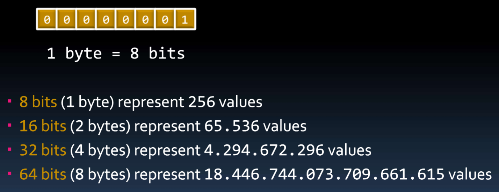
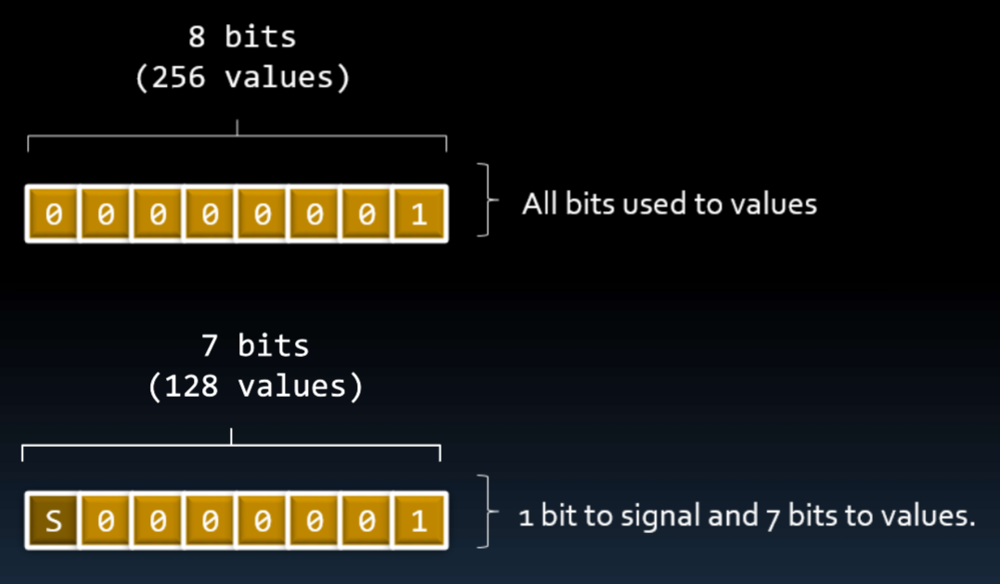

# Integer

## Contents

 - [Review binary number system (+Byte)](#review-binary-system)
 - [Signal bit](#signal-bit)
 - [Integers in C++](#intergers-in-cpp)
 - [Unsigned (Only positive intergers)](#unsigned)

---

## Review binary number system (+Byte)

> The fundamental unit system of a computer is a **bit** *(represented by 0 or 1)*.

For example:

  

**NOTE:**  
See that each additional bit doubles the number of representations (or storage) in decimal system.

**BYTE:**  
One Byte corresponds to 8 bits of memory:

  

---

## Signal bit

An observação is that a **bit set** can be represented by:

 - Only positive numbers.
 - Positives and negative numbers.

**NOTE:**  
See that when we are working with **positive** and **negative numbers** we have 1 less bit to work with, that is, now we have **27 = 128**.

---

## Integers in C++

 - **char** (8 bits)
 - **short int** (16 bits)​
 - **int** (32 bits)
 - **long int** (32 bits)
 - **long long int** (64 bits)

**NOTE:**  ​
 - All integers in C++ are with signal by default, that's, can represents *positive* and negative *numbers*.
 - To find out how many Bytes each one corresponds to, just divide by 8.

---

## Unsigned (Only positive intergers)

> One way to define an integer variable that will receive only positive values is using **"unsigned"** keyword.

For example:

 - **short:**
   - Represent **-32.768** to **32.767**​ values
 - **unsigned short:**
   - Represent **0** a **65.535** values

**NOTE:**  
The advantage of eliminating negative values is that there is more room (spaces) for positives.

---

**REFERENCES:**  
[Aula 06 - Tipos Inteiros | Variáveis | Constantes | Overflow | Underflow | Curso de C++](https://www.youtube.com/watch?v=N2xfTZuLrFI&list=PLX6Nyaq0ebfgWfHqVHVAEPCDG54RLArJh&index=8&t=1604s)  

---

Ro**drigo** **L**eite da **S**ilva - **drigols**
