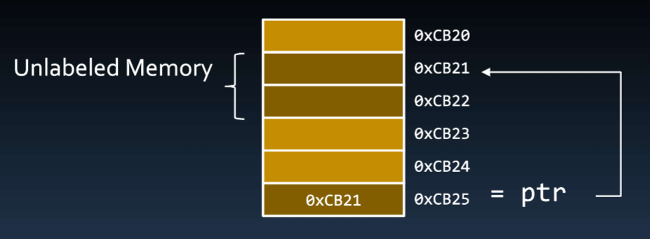
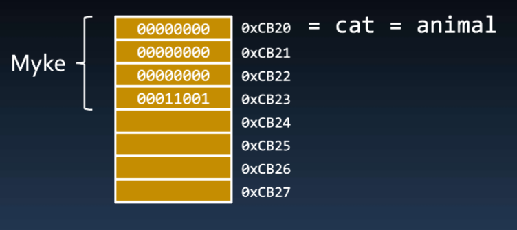
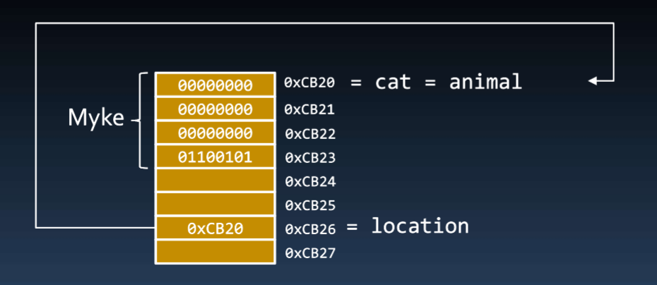

# Pointers & References

## Contents

 - **Pointers:**
   - [Intro to Pointers](#intro-to-pt)
   - [Pointers: Advantages & Disadvantages](#advantages-disadvantages)
   - [Pointers to struct (+Accessing data: Struct (".") vs. Pointer to a struct ("->"))](#pointers-to-structs)
   - [Pointers and Dynamic Memory Allocation](#pointers-dma)
 - **References:**
   - [Intro to References (Reference is not a variable, it is a name attached (atrelado) to a memory location by the compiler)](#intro-to-ref)
 - **Tips & Tricks:**
   - ["&" operator (Address Operator)](#address-operator)
   - ["`*`" operator (Indirection Operator)​](#indirection-operator)
   - [Pointers vs. References in the Memory](#pointers-vs-references)
   - [Function (or method) arguments copies problem: Pointer vs. Reference solution](#copy-var-problem)


<!-- Pointers section -->

---

<div id="intro-to-pt"></div>

## Intro to Pointers

 - A **pointer** is a *special type* that **store address (Memory Address)**.
 - A **pointer points** to a **Memory Addresses**. That is, it can **save a specific memory address**.

For example, see the image below to understand more easily:

  

 - See that a pointer (ptr) can save the Memory Address of variables (ch variable).
 - If you pay attention you can see that the pointer also have *Memory Address (0x27FCFD)*.

See the definition below how declares a **pointer**:

  

**NOTE:**  

 - See that is not enough (suficiente) to say that a variable is a pointer.
 - You must also *specify* what *data type it points to*.

---

<div id="advantages-disadvantages"></div>

## Pointers: Advantages & Disadvantages

 - **Advantages of Pointers:**
   - Pointers are used for dynamic memory allocation and deallocation.
   - An Array or an structure can be accessed efficiently with pointers.
   - Pointers are useful for accessing memory locations.
   - Pointers are used to form complex data structures such as *linked lists*, *graphs*, *trees*, etc.
   - Pointers reduces length of the program and its execution time as well.
 - **Disadvantages of pointers:**
   - Memory corruption can occur if an incorrect value is provided to pointers.
   - Pointers are Complex to understand.
   - Pointers are majorly responsible for *memory leaks*.
   - Pointers are comparatively slower than variables in C.
   - Uninitialized pointers might cause segmentation fault.

---

<div id="pointers-to-structs"></div>

## Pointers to struct (+Accessing data: Struct (".") vs. Pointer to a struct ("->"))

> A **pointer** can point to type created by the programmer *(struct, union, enum)*.

 - To access data of a struct directly we use **dot (".") operator**.
 - However, to access data of a struct from a pointer (a partir de um ponteiro) we use the **arrow ("->") operator**.

For example, see the pointer point to a struct and how access data of a struct from a pointer:

[player.h](src/player.h)
```cpp
#pragma once

struct player
{
    char name[20];
    float salary;
    unsigned goals;
};
```

[main_player.cpp](src/main_player.cpp)
```cpp
#include <iostream>
#include "player.h"

int main()
{
    player messi{"Messi", 100000.00f, 600};
    player *pptr = &messi;

    std::cout << "Data taken ('.') directly of a struct:"
              << "\n";
    std::cout << "Player: " << messi.name << "\n";
    std::cout << "Salary: " << messi.salary << "\n";
    std::cout << "Goals: " << messi.goals << "\n";

    std::cout << "\nData taken ('->') of a struct from a pointer (memory address):"
              << "\n";
    std::cout << "Player: " << pptr->name << "\n";
    std::cout << "Salary: " << pptr->salary << "\n";
    std::cout << "Goals: " << pptr->goals << "\n";

    return 0;
}
```

**COMPILATION AND RUN:**
```cpp
g++ main_player.cpp -o test.out && ./test.out
```

**OUTPUT:**  
```cpp
Data taken ('.') directly of a struct:
Player: Messi
Salary: 100000
Goals: 600

Data taken ('->') of a struct from a pointer (memory address):
Player: Messi
Salary: 100000
Goals: 600
```

---

<div id="pointers-dma"></div>

## Pointers and Dynamic Memory Allocation

> The real power of pointers is in pointing to unlabeled memory - For example, memory allocated during program execution​.

  

**NOTE:**  
See that in the memory abstraction above, we have a **pointer points** to **unlabeled memory**, that's, **not have a variable name to reference, just memory address to points**.

<!-- References section -->

---

<div id="intro-to-ref"></div>

## Intro to References (Reference is not a variable, it is a name attached (atrelado) to a memory location by the compiler)

> When a variable is declared as a reference (using & operator), it becomes an **alternative name for an existing variable**.

Imagine we have a **variable "cat"**, we can reference this variable as **"animal"** because the **"cat"** is an **"animal"**. For example, see the code below:

[main_cat_animal.cpp](src/main_cat_animal.cpp)
```cpp
#include <iostream>

int main()
{
    std::string cat = "Myke";
    std::string &animal = cat;

    std::cout << "\nThe name of the 'cat' is: " << cat << "\n";
    std::cout << "The Memory Address of 'cat' variable is: " << &cat << "\n";
    std::cout << "The name of the 'animal' is: " << animal << "\n";
    std::cout << "The Memory Address of 'animal' variable reference is: " << &animal << "\n";

    animal = "Jhon";

    std::cout << "\nThe name of the 'cat' is: " << cat << "\n";
    std::cout << "The Memory Address of 'cat' variable is: " << &cat << "\n";
    std::cout << "The name of the 'animal' is: " << animal << "\n";
    std::cout << "The Memory Address of 'animal' variable reference is: " << &animal << "\n";

    return 0;
}
```

**COMPILATION AND RUN:**
```cpp
g++ main_cat_animal.cpp -o test.out && ./test.out
```

**OUTPUT:**  
```cpp
The name of the 'cat' is: Myke
The Memory Address of 'cat' variable is: 0x61fde0
The name of the 'animal' is: Myke
The Memory Address of 'animal' variable reference is: 0x61fde0

The name of the 'cat' is: Jhon
The Memory Address of 'cat' variable is: 0x61fde0
The name of the 'animal' is: Jhon
The Memory Address of 'animal' variable reference is: 0x61fde0
```

See that:

 - The **variable "animal"** is a reference to **"cat" variable**:
   - A variable can be declared as a reference by putting **"&" operator** in the declaration: `&animal`.
   - This label (or alias) is assigned by the compiler.
 - We can **access** and **change** the value in a *variable (e.g, "cat")* from a *reference variable (e.g, "animal")*.
 - *Both* have *the same value (Myke next Jhon)*.
 - *Both* have *the same memory address (0x61fde0)*.

You can see the abstraction below to understand more easily:

  

> **NOTE:**  
> Knowing all this, we can see that **a reference is not a variable**, it **is a name attached (atrelado) to a memory location** by the compiler.

<!-- Tips & Tricks section -->

---

<div id="address-operator"></div>

## "&" operator (Address Operator)

The **"&" Operator (Address Operator)** is a pointer operator and is used to represent the *memory address* of an *operand*.

For example, see the code below to understand more easily:

[main_address_operator.cpp](src/main_address_operator.cpp)
```cpp
#include <iostream>

int main()
{
    int number = 100;

    std::cout << "Value stored in 'number' variable: " << number << "\n";
    std::cout << "Memory Address of 'number' variable: " << &number;

    return 0;
}
```

**COMPILATION AND RUN:**
```cpp
g++ main_address_operator.cpp -o test.out && ./test.out
```

**OUTPUT:**  
```cpp
Value stored in 'number' variable: 100
Memory Address of the 'number' variable: 0x61fe1c
```

**NOTE:**  
See that we use **"&" operator (Address Operator)** to get the *memory address of "number" variable*.

---

<div id="indirection-operator"></div>

## "`*`" operator (Indirection Operator)​

> The **"`*`" operator (Indirection Operator)** is a unary operator that can be **used to obtain the value stored at the memory location referenced by a pointer variable**.

For example, see the code below to understand more easily:

[main_indirection_operator.cpp](src/main_indirection_operator.cpp)
```cpp
#include <iostream>

int main()
{
    int number = 100;
    int *iptr = &number;

    std::cout << "Value stored in 'number' variable: " << number << "\n";
    std::cout << "Memory Address of 'number' variable: " << &number << "\n";
    std::cout << "Memory Addres saved in 'iptr' pointer: " << iptr << "\n";
    std::cout << "Value stored at 'number' variable referenced by a 'iptr' pointer: " << *iptr;

    return 0;
}
```

**COMPILATION AND RUN:**
```cpp
g++ main_indirection_operator.cpp -o test.out && ./test.out
```

**OUTPUT:**  
```cpp
Value stored in 'number' variable: 100
Memory Address of 'number' variable: 0x61fe14
Memory Addres saved in 'iptr' pointer: 0x61fe14
Value stored at 'number' variable referenced by a 'iptr' pointer: 100
```

**NOTE:**  
See that we are using the **"`*`" operator (Indirection Operator)** to get (directly) the value stored in the memory address that the pointer has saved.

---

<div id="pointers-vs-references"></div>

## Pointers vs. References in the Memory

> To understand the difference between **Pointers** and **References** we need to think how they works on the memory.

For example, imagine we have:

 - **"cat" variable**.
 - **"animal" reference:**
   - Label or alias to "cat" variable.
   - This label (or alias) is assigned by the compiler.
 - **"location" pointer variable.**

[pointer_vs_ref.cpp](src/pointer_vs_ref.cpp)
```cpp
#include <iostream>

int main()
{
    std::string cat = "Myke";
    std::string &animal = cat;
    std::string *location = &animal;

    // Get values.
    std::cout << "The name of the 'cat' is: " << cat << "\n";
    std::cout << "The name of the 'animal' is: " << animal << "\n";
    std::cout << "The name 'animal/cat' get from a pointer is: " << *location << "\n"
              << "\n";

    // Get memory addresses.
    std::cout << "The Memory Address of 'cat' variable is: " << &cat << "\n";
    std::cout << "The Memory Address of 'animal' reference is: " << &animal << "\n";
    std::cout << "The Memory Address of 'location' pointer is: " << &location << "\n";

    return 0;
}
```

**COMPILATION AND RUN:**
```cpp
g++ pointer_vs_ref.cpp -o test.out && ./test.out
```

**OUTPUT:**  
```cpp
The name of the 'cat' is: Myke
The name of the 'animal' is: Myke
The name 'animal/cat' get from a pointer is: Myke

The Memory Address of 'cat' variable is: 0x61fde0
The Memory Address of 'animal' reference is: 0x61fde0
The Memory Address of 'location' pointer is: 0x61fdd8
```

See that:

 - **We have three ways to access the data:**
   - From original variable "cat".
   - From reference "animal":
     - Label or alias to "cat" variable.
     - This label (or alias) is assigned by the compiler.
   - From a pointer:
     - Has memory address of "cat" variable saved.
 - **The "cat" variable" and "animal" reference have the same memory address:**
   - *0x61fde0*
 - **However, the "location" pointer has its own (tem seu próprio) memory address:**
   - Pointer memory address: *0x61fdd8*
   - Memory address saved in the pointer: *0x61fde0*

To understand more easily, see the abstration below:

  

 - **See that a reference is a label (or alias) to an existing variable:**
   - *"cat" variable*.
   - And *"animal" is a reference* to *"cat" variable*.
   - This label (or alias) is assigned by the compiler.
 - **Different of a reference a pointer has its own (tem seu próprio) memory address and save the memory address of another variable:**
   - Memory address of a "location" pointer (in the above image): *0xCB26*
   - Memory address saved in the "location pointer (in the above image): *0xCB20*

**NOTE:**  
Another observation is that a reference needed be initialized in your declaration.

For example, the code below would generate an error:

```cpp
std::string cat = "Myke";
std::string &animal; // ERROR!
animal = cat;
```

You need always initialize a reference in your declaration:

```cpp
std::string cat = "Myke";
std::string &animal = cat;
```

**NOTE:**  
However, a pointer don't need be initialized in your declaration:

```cpp
std::string cat = "Myke";
std::string &animal = cat;

std::string *location;
location = &anima;
```

**NOTE:**  
This is an advantage of a pointer over a reference. We don't always want to initialize.

> **NOTE:**  
> **This is, the difference between Pointers and References:**
> - A **reference** is the label (or alias) to an existing variable:
>   - And has the same memory address of the existing variable.
>   - This label (or alias) is assigned by the compiler.
>   - A reference *need* be initialized in your declaration.
> - A **pointer** save the memory address of another variable:
>   - And has its own (tem seu próprio) memory address.
>   - A pointer *don't need* be initialized in your declaration:

---

<div id="copy-var-problem"></div>

## Function (or method) arguments copies problem: Pointer vs. Reference solution

Let's, getting start with the following problem... Imagine we have a function that:

 - Receives a number (argument);
 - And print (cout) the number in the console.

Something like that:

[show_number.h](src/show_number.h)
```cpp
#pragma once

void showNumber(int number);
```

[show_number.cpp](src/show_number.cpp)
```cpp
#include <iostream>

void showNumber(int number_arg)
{
    std::cout << "The number passed was: " << number_arg;
}
```

[main_number.cpp](src/main_number.cpp)
```cpp
#include <iostream>
#include "show_number.h"

int main()
{
    int number;

    std::cout << "Enter a number: ";
    std::cin >> number;

    showNumber(number);

    return 0;
}
```

**COMPILATION AND RUN:**
```cpp
g++ show_number.cpp main_number.cpp -o test.out && ./test.out
```

**OUTPUT:**  
```cpp
Enter a number: 10
The number passed was: 10
```

**NOTE:**  
The problem here is that when we pass **"number"** variable as argument we passed a copy of **"number"** variable, not the original variable. For example, see the image below to understand more easily:

  
​
 - The problem here is that we have two variables (original + copy) in the memory address to the same goal.
 - Another problem is if that our variable has big data amount (e.g struct or object) we will need to copy this big amount.

> **Ok, but how solve that?**  
> One approach would be to use a **pointer** to the **"number" variable**.

For example, let's use a **pointer** to pass the memory address of the variable **"number"**, avoiding copies (evitando copias) of the original variable:

[show_number_pointer.h](src/show_number_pointer.h)
```cpp
#pragma once

void showNumber(int *number);
```

[show_number_pointer.cpp](src/show_number_pointer.cpp)
```cpp
#include <iostream>
#include "show_number_pointer.h"

void showNumber(int *number)
{
    std::cout << "The number passed was: " << *number;
}
```

[main_number_pointer.cpp](src/main_number_pointer.cpp)
```cpp
#include <iostream>
#include "show_number_pointer.h"

int main()
{
    int number;
    int *iptr = &number;

    std::cout << "Enter a number: ";
    std::cin >> number;

    showNumber(iptr);

    return 0;
}
```

**COMPILATION AND RUN:**
```cpp
g++ show_number_pointer.cpp main_number_pointer.cpp -o test.out && ./test.out
```

**OUTPUT:**  
```cpp
Enter a number: 100
The number passed was: 100
```

See that:

 - We use **"&" operator (Address Operator)** to pass memory address of *"number"* variable to the pointer:
   - `int *iptr = &number;`
 - And we use **"`*`" operator (Indirection Operator)** to access the value that the pointer reference:
   - `cout << "The number passe was: " << *number;`

**PERFORMANCE NOTE:**  
A **pointer** also takes up space in memory, it can be less than the *original variable (struct or object)*, but it is also saved in memory.

> **Okay, so how do I work with the original (struct or object) variable without copying or having to waste memory with a pointer?**
> Using a **reference** to **"number" variable**.

 - The **main references advantages** are as **function (or method) parameters**.
 - The function (or method) that declares your parameters as reference (using &) works with original data:
   - This avoids copies of variables in the memory.
   - And avoids waste memory with a pointer.

For example, let's see how to solve our problem using a reference:

[show_number_by_ref.h](src/show_number_by_ref.h)
```cpp
#pragma once

void showNumber(int &number);
```

[show_number_by_ref.cpp](src/show_number_by_ref.cpp)
```cpp
#include <iostream>

void showNumber(int &number)
{
    std::cout << "The number passed was: " << number;
}
```

[main_show_number_by_ref.cpp](src/main_show_number_by_ref.cpp)
```cpp
#include <iostream>
#include "show_number_by_ref.h"

int main()
{
    int number;

    std::cout << "Enter a number: ";
    std::cin >> number;

    showNumber(number);

    return 0;
}
```

**COMPILATION AND RUN:**
```cpp
g++ show_number_by_ref.cpp main_show_number_by_ref.cpp -o test.out && ./test.out
```

**INPUT:**  
```cpp
Enter a number: 100
```

**OUTPUT:**  
```cpp
The number passed was: 100
```

See that now:

 - We are working with the original variable "number".
 - We avoid copying of the original variable "number".
 - We avoid waste memory with a pointer.

---

<!-- References links section -->

**REFERENCES:**  
[Aula 14 - Ponteiros | Apontador de Memória | Operador de Endereço e Indireção | Curso de C++](https://www.youtube.com/watch?v=napD2SXz4Fo&t)  
[Aula 28 - Armazenamento e Referências | Escopo | Ligação Interna Externa | Curso de C++](https://www.youtube.com/watch?v=awuPGwo_sIw)  
[Indirection Operator (*)](https://docs.revenera.com/installshield26helplib/LangRef/LangrefIndirection_operator_.htm)  
[C Pointers](https://www.geeksforgeeks.org/c-pointers/)

---

Ro**drigo** **L**eite da **S**ilva - **drigols**
