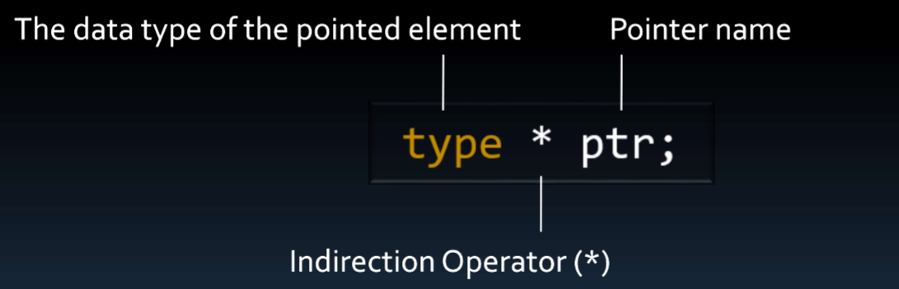

# Pointers

## Contents

 - [Intro to Pointers](#intro-to-pt)
 - [Pointers to struct (+Accessing data: Struct (".") vs. Pointer to a struct ("->"))](#pointers-to-structs)
 - [Pointers and Dynamic Memory Allocation](#pointers-dma)
 - **Variables problems & Pointer solutions:**
   - [The variable (as argument) copy problem](#cp-problem)
   - [Scope variables problem](#scope-problem)
 - **Tips & Tricks:**
   - ["&" operator (Address Operator)](#address-operator)
   - ["`*`" operator (Indirection Operator)​](#indirection-operator)

---

<div id="intro-to-pt"></div>

## Intro to Pointers

 - A **pointer** is a *special type* that **store address (Memory Address)**.
 - A **pointer points** to a **Memory Addresses**. That is, it can **save a specific memory address**.

For example, see the image below to understand more easily:

  

 - See that a pointer (ptr) can save the Memory Address of variables (ch variable).
 - If you pay attention you can see that the pointer also have Memory Address.

See the definition below how declares a **pointer**:

  

**NOTE:**  

 - See that is not enough (suficiente) to say that a variable is a pointer.
 - You must also *specify* what *data type it points to*.

---

<div id="pointers-to-structs"></div>

## Pointers to struct (+Accessing data: Struct (".") vs. Pointer to a struct ("->"))

> A **pointer** can point to type created by the programmer *(struct, union, enum)*.

 - To access data of a struct directly we use **dot (".") operator**.
 - However, to access data of a struct from a pointer (a partir de um ponteiro) we use the **arrow ("->") operator**.

For example, see the pointer point to a struct and how access data of a struct from a pointer:

[player.h](src/player.h)
```cpp
#pragma once

struct player
{
    char name[20];
    float salary;
    unsigned goals;
};
```

[drive_player.cpp](src/drive_player.cpp)
```cpp
#include <iostream>
#include "player.h"

using namespace std;

int main()
{
    player messi{"Messi", 100000.00f, 600};
    player *pptr = &messi;

    cout << "Data taken ('.') directly of a struct:" << endl;
    cout << "Player: " << messi.name << endl;
    cout << "Salary: " << messi.salary << endl;
    cout << "Goals: " << messi.goals << endl;

    cout << "\nData taken ('->') of a struct from a pointer:" << endl;
    cout << "Player: " << pptr->name << endl;
    cout << "Salary: " << pptr->salary << endl;
    cout << "Goals: " << pptr->goals << endl;

    return 0;
}
```

**COMPILATION AND RUN:**
```cpp
$ g++ drive_player.cpp -o testingPlayer

$ ./testingPlayer
```

**OUTPUT:**  
```cpp
Data taken ('.') directly of a struct:
Player: Messi
Salary: 100000
Goals: 600

Data taken ('->') of a struct from a pointer:
Player: Messi
Salary: 100000
Goals: 600
```

---

<div id="pointers-dma"></div>

## Pointers and Dynamic Memory Allocation

> The real power of pointers is in pointing to unlabeled memory - For example, memory allocated during program execution​.


**NOTE:**  
See that in the memory abstraction above, we have a **pointer point** to **unlabeled memory**, that's, **not have a variable name to reference, just memory address**.


---

<div id="cp-problem"></div>

## The variable (as argument) copy problem

One reason of use pointers is the follow... Imagine we have a function the receive a variable as argument:

[show_number.h](src/show_number.h)
```cpp
#pragma once

void showNumber(int number);
```

[show_number.cpp](src/show_number.cpp)
```cpp
#include <iostream>
#include "show_number.h"

using namespace std;

void showNumber(int number_arg)
{
    cout << "The number passe was: " << number_arg;
}
```

[driver_number.cpp](src/driver_number.cpp)
```cpp
#include <iostream>
#include "show_number.h"

using namespace std;

int main()
{
    int number;

    cout << "Enter a number: ";
    cin >> number;

    showNumber(number);

    return 0;
}
```

**COMPILATION AND RUN:**
```cpp
g++ show_number.cpp driver_number.cpp -o numberProgram

./numberProgram
```

**OUTPUT:**  
```cpp
Enter a number: 10
The number passe was: 10
```

**NOTE:**  
The problem here is that when we pass **"number"** variable as argument we passed a copy of **"number"** variable, not the original variable.

For example, see the image below to understand more easily:
​
  
​
 - The problem here is that we have two variable (original + copy) in the memory address to the same goal.
 - Another problem is if that our variable has big data amount (e.g struct) we will need to copy that many big amount.

> **Ok, but how solve that?**  
> Using **pointers**.

For example, let's use a pointer to pass the memory address of the variable "number", avoiding copies (evitando copias): 

[show_number_pointer.h](src/show_number_pointer.h)
```cpp
#pragma once

void showNumber(int *number);
```

[show_number_pointer.cpp](src/show_number_pointer.cpp)
```cpp
#include <iostream>
#include "show_number_pointer.h"

using namespace std;

void showNumber(int *number)
{
    cout << "The number passe was: " << *number;
}
```

[driver_number_pointer.cpp](src/driver_number_pointer.cpp)
```cpp
#include <iostream>
#include "show_number_pointer.h"

using namespace std;

int main()
{
    int number;
    int *iptr = &number;

    cout << "Enter a number: ";
    cin >> number;

    showNumber(iptr);

    return 0;
}
```

**COMPILATION AND RUN:**
```cpp
g++ show_number_pointer.cpp driver_number_pointer.cpp -o testNotCopyVar

./testNotCopyVar
```

**OUTPUT:**  
```cpp
Enter a number: 100
The number passe was: 100
```

See that:

 - We use **"&" operator (Address Operator)** to pass memory address of "number" variable to the pointer:
   - `int *iptr = &number;`
 - And we use **"`*`" operator (Indirection Operator)** to access the value that the pointer reference:
   - `cout << "The number passe was: " << *number;`

---

<div id="scope-problem"></div>

## Scope variables problem

Another common problem with variables is when the variables are created in the functions (scope variables). For example, see the function below:

```cpp
void initialize()
{
    Bitmap explosion;
    explosion = LoadImage("BigExplosion.bmp");
}
```

The **"explosion"** variable above has a problem. Is deleted from the memory when the function finish.


> **Ok, but how to allocate memory that is still "alive" after executing a function?**  
> Using **pointers** with **Memory Address Allocation**.

---

<div id="address-operator"></div>

## "&" operator (Address Operator)

The **"&" Operator (Address Operator)** is a pointer operator and is used to represent the *memory address* of an *operand*.

For example, see the code below to understand more easily:

[drive_address_operator.cpp](src/drive_address_operator.cpp)
```cpp
#include <iostream>

using namespace std;

int main()
{
    int number = 100;

    cout << "Value stored in 'number' variable: " << number << endl;
    cout << "Memory Address of 'number' variable: " << &number;

    return 0;
}
```

**COMPILATION AND RUN:**
```cpp
g++ drive_address_operator.cpp -o testAddressOperator

./testAddressOperator
```

**OUTPUT:**  
```cpp
Value stored in 'number' variable: 100
Memory Address of 'number' variable: 0x61fe1c
```

**NOTE:**  
See that we use **"&" operator (Address Operator)** to get the *memory address of "number" variable*.

---

<div id="indirection-operator"></div>

## "`*`" operator (Indirection Operator)​

> The **"`*`" operator (Indirection Operator)** is a unary operator that can be **used to obtain the value stored at the memory location referenced by a pointer variable**.

For example, see the code below to understand more easily:

[drive_indirection_operator.cpp](src/drive_indirection_operator.cpp)
```cpp
#include <iostream>

using namespace std;

int main()
{
    int number = 100;
    int * iptr = &number;

    cout << "Value stored in 'number' variable: " << number << endl;
    cout << "Memory Address of 'number' variable: " << &number << endl;
    cout << "Memory Addres saved in 'iptr' pointer: " << iptr << endl;
    cout << "Value stored at 'number' variable referenced by a 'iptr' pointer: "<< *iptr;

    return 0;
}
```

**COMPILATION AND RUN:**
```cpp
g++ drive_address_operator.cpp -o testAddressOperator

./testIndirectionOperator
```

**OUTPUT:**  
```cpp
Value stored in 'number' variable: 100
Memory Address of 'number' variable: 0x61fe14
Memory Addres saved in 'iptr' pointer: 0x61fe14
Value stored at 'number' variable referenced by a 'iptr' pointer: 100
```

**NOTE:**  
See that we are using the **"`*`" operator (Indirection Operator)** to get (directly) the value stored in the memory address that the pointer has saved.

---

**REFERENCES:**  
[Aula 14 - Ponteiros | Apontador de Memória | Operador de Endereço e Indireção | Curso de C++](https://www.youtube.com/watch?v=napD2SXz4Fo&list=PLX6Nyaq0ebfgWfHqVHVAEPCDG54RLArJh&index=18&t=2s)  
[Indirection Operator (*)](https://docs.revenera.com/installshield26helplib/LangRef/LangrefIndirection_operator_.htm)  

---

Ro**drigo** **L**eite da **S**ilva - **drigols**
