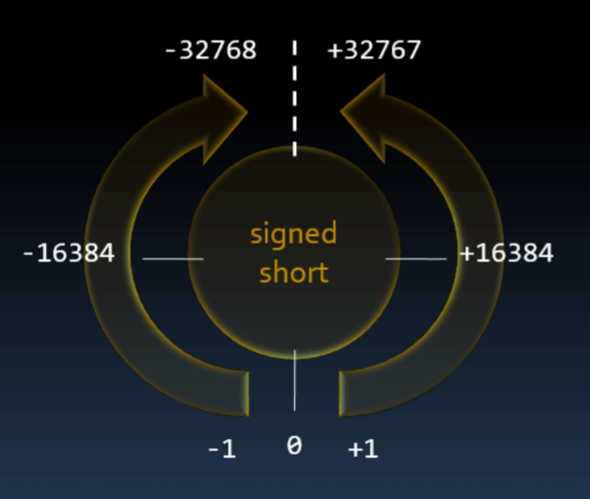
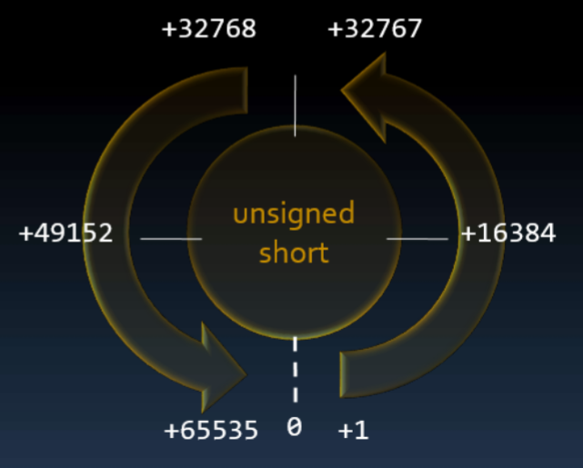

# Overflow & Underflow

## Contents

 - [Analog odometer analogy](#analogy)
 - [Overflow](#overflow)

---

<div id="analogy"></div>

## Analog odometer analogy

> The integer types behave like an **analog odometer**.

  

> **NOTE:**  
> Yes, when we reach (chegar a) the last possible value if we continue we go back to the first value.

For example, let's see the **signed short**:

  

See that the **signed short** goes from:

 - **0** to **-32.768**
 - and **0** to **+32.768**

> - **What happens if I add "1" to "+32.768"?**  
> - Like an *analog odometer* it will jump from **"+32,768"** to **"-32,768"**.

**NOTE:**  
If you have **"-1"** and add **"1"** you will jump from **0 (zero)** on the *analog odometer*. To test you can run the code below:

[analog_odometer_test.cpp](src/analog_odometer_test.cpp)
```cpp
#include <iostream>
using namespace std;

int main()
{
    signed short n = -1;

    cout << "Current value: " << n << endl;
    cout << "Updated value: " << n+1 << endl;

    return 0;
}
```

**COMPILATION AND RUN:**
```cpp
g++ analog_odometer_test.cpp -o analogTes

./analogTest.exe 
```

**OUTPUT:**  
```cpp
Current value: -1
Updated value: 0
```

Now, let's check *analog odometer* to **unsigned short**:

  

---

<div id="overflow"></div>

## Overflow

 - To understand Overflow, let's imagine we have a program to store employee salaries and use **short** and **unsigned short** to store the values.
 - We also let's start with the max value to **short** and **unsigned short**.

> **What happens if I add 1 to each of the max short and unsigned short values?**

**NOTE:**  
We have an **"Overflow"**. That is, we burst (estouramos) the stack.

For example, see the code below to understand more easily:

[overflow.cpp](src/overflow.cpp)
```cpp
#include <iostream>
#include <climits>
using namespace std;

int main()
{
    short john = SHRT_MAX;
    unsigned short mary = SHRT_MAX;

    cout << "john have " << john << " dollars." << endl;
    cout << "Maria have " << mary << " dollars." << endl;

    cout << endl
         << "Added 1 dollar to each..." << endl
         << endl;
    john = john + 1;
    mary = mary + 1;

    cout << "Agora john have " << john << " dollars." << endl;
    cout << "Agora Maria have " << mary << " dollars." << endl;

    return 0;
}
```

**COMPILATION AND RUN:**
```cpp
g++ overflow.cpp -o overflowTest

./overflowTest.exe 
```

**OUTPUT:**  
```cpp
john have 32767 dollars.
Maria have 32767 dollars.

Added 1 dollar to each...

Agora john have -32768 dollars.
Agora Maria have 32768 dollars.
```

---

**REFERENCES:**  
[Aula 06 - Tipos Inteiros | Variáveis | Constantes | Overflow | Underflow | Curso de C++](https://www.youtube.com/watch?v=N2xfTZuLrFI&list=PLX6Nyaq0ebfgWfHqVHVAEPCDG54RLArJh&index=8&t=1604s)  

---

Ro**drigo** **L**eite da **S**ilva - **drigols**
