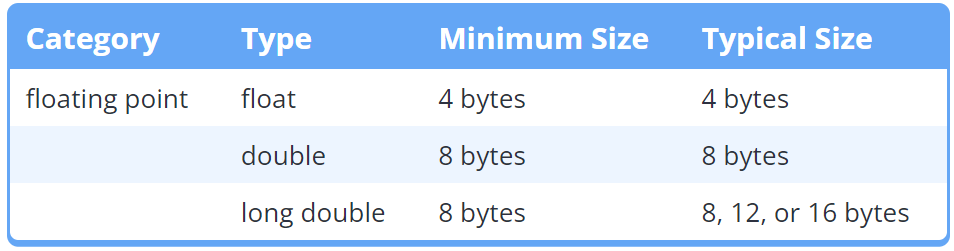
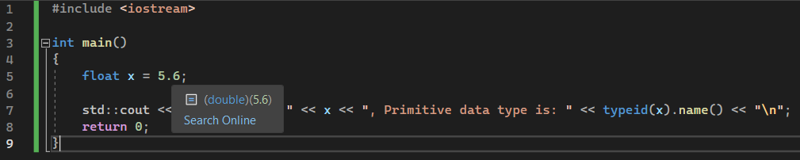
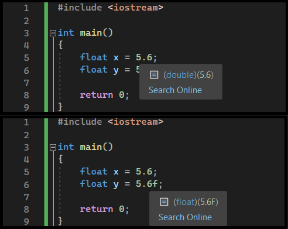

# Floating-point

## Contents

 - [Intro to Floating-Point](#intro-to-fp)
 - **Tips & Tricks:**
   - [`Checking variables data type in C++ (<typeinfo> typeid(variable).name())`](#typeid-name)
   - [Add "f (or F)" suffix to float literal](#float-literal)

---

<div id="intro-to-fp"></div>

## Intro to Floating-Point

> Integers are great for counting whole numbers, but sometimes we need to store very large numbers, or numbers with a fractional component.

A floating-point type variable is a variable that can hold a real number, such as:

 - **4320.0**.
 - **-3.33**.
 - **0.01226**...

**NOTE:**  
The *floating* part of the name *floating-point* refers to the fact that the decimal point can “float”; **that is, it can support a variable number of digits before and after the decimal point**.

There are three different floating point data types:

 - **float**.
 - **double**.
 - **long double**.

**NOTE:**  
As with integers, C++ does not define the actual size of these types **(but it does guarantee minimum sizes)**. On modern architectures, floating point representation almost always follows IEEE 754 binary format. In this format:

 - A **float** is **4** bytes.
 - A **double** is **8**.
 - A **long double** can be equivalent to a *double (8 bytes)*, *80-bits (often padded to 12 bytes)*, or *16 bytes*.

> **NOTE:**  
> **Floating-Point** data types **are always signed (can hold positive and negative values)**.

  

---

<div id="typeid-name"></div>

## `Checking variables data type in C++ (<typeinfo> typeid(variable).name())`

To check the primitive data type of a variable we use **typeid(variable).name()** in C++, for example:

[main_fpl.cpp](src/main_fpl.cpp)
```cpp
#include <iostream>
#include <typeinfo>

int main()
{
    int x{5};      // 5 means integer.
    double y{5};   // 5.0 is a floating point literal (no suffix means double type by default).
    double z{5.0}; // 5.0 is a floating point literal (no suffix means double type by default).
    float w{5.0f}; // 5.0 is a floating point literal, f suffix means float type.

    std::cout << "'x' value is " << x << ", Primitive data type is: " << typeid(x).name() << "\n";
    std::cout << "'y' value is " << x << ", Primitive data type is: " << typeid(y).name() << "\n";
    std::cout << "'z' value is " << x << ", Primitive data type is: " << typeid(z).name() << "\n";
    std::cout << "'w' value is " << x << ", Primitive data type is: " << typeid(w).name() << "\n";

    return 0;
}
```

**COMPILATION AND RUN:**
```cpp
g++ main_fpl.cpp -o test.out && ./test.out
```

**OUTPUT:**  
```cpp
'x' value is 5, Primitive data type is: i
'y' value is 5, Primitive data type is: d
'z' value is 5, Primitive data type is: d
'w' value is 5, Primitive data type is: f
```

---

<div id="float-literal"></div>

## Add "f (or F)" suffix to float literal

To understand because use **"f (or F)" suffix** in float literal, first let's see the following code:

[test_float.cpp](src/test_float.cpp)
```cpp
#include <iostream>

int main()
{
	float x = 5.6;

	std::cout << "'x' value is " << x << ", Primitive data type is: " << typeid(x).name() << "\n";
	return 0;
}
```

**COMPILATION AND RUN:**
```cpp
g++ test_float.cpp -o test.out && ./test.out
```

**OUTPUT:**  
```cpp
'x' value is 5.6, Primitive data type is: f
```

> **Well, what's the problem, we have a float (f) as a return?**

**NOTE:**  
We have a float as return because the compiler converted to float when we call the **"x"** variable, but in the memory the **"x"** variable was saved as double.

For example, to test its use **Visual Studio IDE** and check which data type the **"x"** variable was saved:

  

**NOTE:**  
See that we have a **"x"** variable saved as *double data type*.

> **But what's the problem here?**
> This may result in *data loss*.

To solve that we use the **"f (or F)" suffix**. For example, let's check again in **Visual Studio IDE**:

  

 - See that the **"x" variable** *was saved* in the memory as **double**.
 - However, the **"y" variable** *was saved* in the memory as a **float**:
   - It's because we use **"f (or F)" suffix** to force that.

---

**REFERENCES:**  
[C++ float and double](https://www.programiz.com/cpp-programming/float-double)  

---

Ro**drigo** **L**eite da **S**ilva - **drigols**
