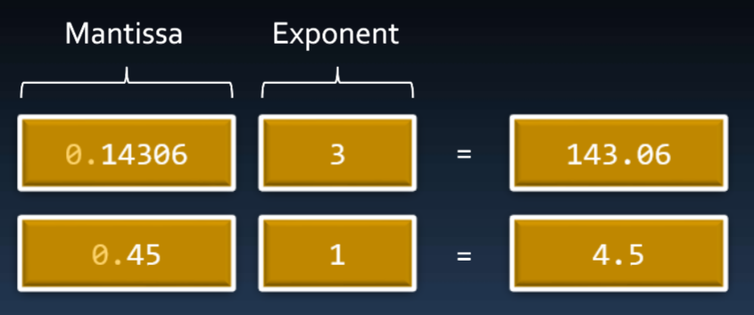
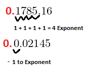

# Floating-point

## Contents

 - [How Floating Point are stored (Mantissa and Exponent)](#mantissa-exponent)
 - [Floating-Point Limits (+Significative digits)](#limits)

---

## Intro to Floating-Point

> Integers are great for counting whole numbers, but sometimes we need to store very large numbers, or numbers with a fractional component.

A floating-point type variable is a variable that can hold a real number, such as:

 - **4320.0**.
 - **-3.33**.
 - **0.01226**...

**NOTE:**  
The *floating* part of the name *floating-point* refers to the fact that the decimal point can “float”; **that is, it can support a variable number of digits before and after the decimal point**.

There are three different floating point data types:

 - **float**.
 - **double**.
 - **long double**.

**NOTE:**  
As with integers, C++ does not define the actual size of these types **(but it does guarantee minimum sizes)**. On modern architectures, floating point representation almost always follows IEEE 754 binary format. In this format:

 - A **float** is **4** bytes.
 - A **double** is **8**.
 - A **long double** can be equivalent to a *double (8 bytes)*, *80-bits (often padded to 12 bytes)*, or *16 bytes*.

> **NOTE:**  
> **Floating-Point** data types **are always signed (can hold positive and negative values)**.

  

---

## How Floating-Point are storaged (Mantissa and Exponent)

The computer storage a real number in two parts:

 - **A value** (Mantissa)
 - **Scale factor** (Exponent)

For example, see the image below:

  

 - If you pay attention will see that the values **"34.125"** and **"341.25"** have the same value when stored in the memory:  **"0.34125"**.
 - The difference is the **scale (or expoente)**, that's, **how many times the  floating-point shift left**:
   - Each time the floating-point shift left increases 1 scale (or expoente).

For example:

  

To back to real value storaged only multiply the *mantissa* value storaged in the memory by the *scale factor*:

  

**NOTE:**  
However, the **scale factor** is not storaged in the memory as a *multiplier (10, 100, 100)*, but as **exponent**:

  

---

## Floating-Point Limits (+Significative digits)

As much as there is a bit difference in the **float**, **double**, and **long double** types, the main difference between these types is:

 - **Significative digits of mantissa.**
 - **Max value to exponent:**
   - Scale factor.

> **BUT, WHAT'S "SIGNIFICATIVE DIGITS"?**

Imagine you have the follow numbers:

 - **143.06:**
   - Have 5 significative digits.
 - **4.50:**
   - Have 2 significative digits, since if we remove the last digit (0) it does not change **4.50**, because **4.50 = 4.5**.

  

**NOTE:**  
That's, **significative digits** are important digits of the number.

> **OK, NOW, WHAT'S "MAX VALUE OF EXPONENT"?**

To understand **"max value of exponent"** see the image below:

  
  

 - In the image above only the part after the dot is storaged in the mantissa:
   - That is, the **"0."** is ignored when storing the mantissa in memory.
 - However, when getting the mantissa in memory the **"0."** is put back to make the mantissa return to its true value when multiplied by the exponent in base 10:
   - **Mantissa * 10exponent = Real value**.

---

**REFERENCES:**  
[Aula 08 - Tipos Ponto Flutuante | Float | Double | Long Double | Precisão | Curso de C++](https://www.youtube.com/watch?v=CXuW85ZNf9E&t)  

---

Ro**drigo** **L**eite da **S**ilva - **drigols**
