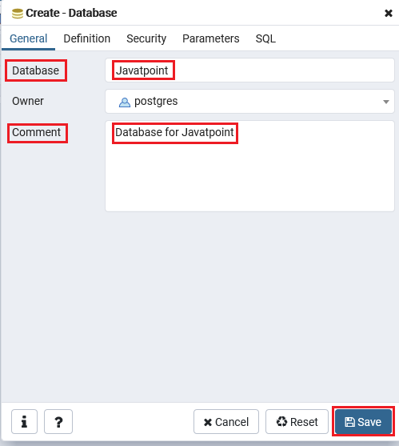
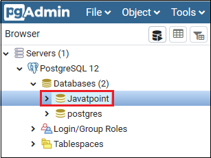
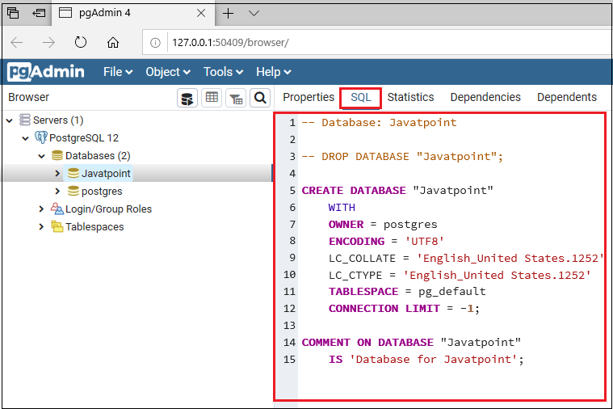
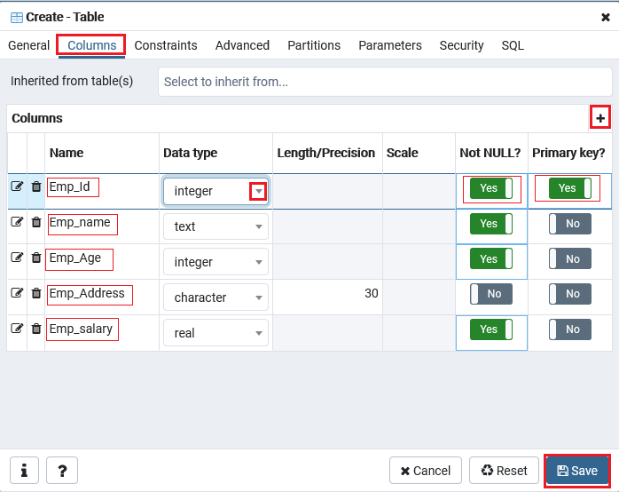
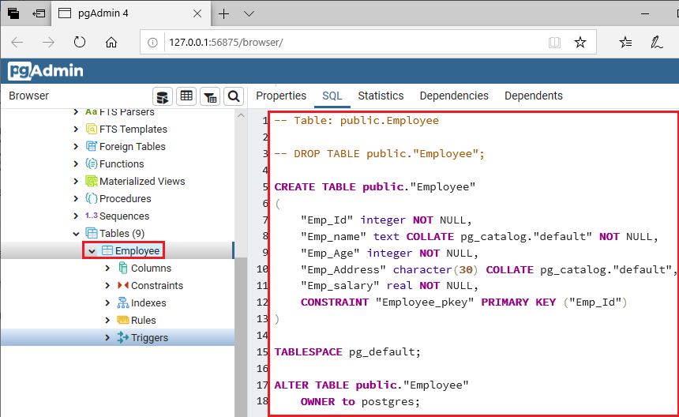

# PostgreSQL

## Contents

 - **CREATE:**
   - [CREATE DATABASE](#create-database)
   - [CREATE TABLE](#create-table)
 - **READ:**
   - [Listing databases](#listing-databases)
   - [SELECT Statement (CREATE TABLE, INSERT and SELECT Statement)](#select-statement)
 - **UPDATE:**
 - **DELETE:**
   - [Delete/Drop Database](#delete-drop-database)
   - [Drop/Delete Table](#drop-delete-table)
 - **Settings:**
   - [Docker Compose Settings](#docker-compose-settings)
 - [References](#references)

<!--- ( "CREATE" SECTION ) --->

---

<div id="create-database"></div>

## CREATE DATABASE

First, let's see how create a database using pgAdmin:

**Databases → Create → Database**  
  

After that, the create database window will open where we need to provide some necessary details (Database name, Comment) for creating a database and then click on the Save:

  

The database is created and display in Object tree as we can see in the below screenshot:

  

**NOTE:**  
And the right-hand side window will give us the SQL which is used to create the Database as we can see in the below image:

  

Now, let's see how to create a database from the command line (psql):

**INTPUT:**  
```
CREATE DATABASE mydb;
```

**OUTPUT:**  
```
CREATE DATABASE
```

**NOTE:**  
You can check on pgAdmin or using the following command line:

**INTPUT:**  
```
\l
```

**OUTPUT:**  
```
                                             List of databases
   Name    | Owner | Encoding |  Collate   |   Ctype    | ICU Locale | Locale Provider | Access privileges 
-----------+-------+----------+------------+------------+------------+-----------------+-------------------
 mydb      | root  | UTF8     | en_US.utf8 | en_US.utf8 |            | libc            | 
 postgres  | root  | UTF8     | en_US.utf8 | en_US.utf8 |            | libc            | 
 root      | root  | UTF8     | en_US.utf8 | en_US.utf8 |            | libc            | 
 template0 | root  | UTF8     | en_US.utf8 | en_US.utf8 |            | libc            | =c/root          +
           |       |          |            |            |            |                 | root=CTc/root
```

Now, to connect to a database, we will enter the below command:

**INTPUT:**  
```
\c mydb
```

**OUTPUT:**  
```
You are now connected to database "mydb" as user "root".
```

---

<div id="create-table"></div>

## CREATE TABLE

First, let's see how to create a table from **pgAdmin**:

 - YourDB:
   - Schemas:
     - public:
       - table:
         - create > table.

Once we click on the Table, the Create-table window will appear on the screen where we will enter all the necessary details like Table name. In our case, we will create a table called **Employee**:

  

 - After that, we will move to the Column tab in the same window then click on the **"+"** sign to add columns in a particular table.
 - And we can select the Data types from the given drop-down list as well as we can change the columns **Not-null** preference and also set the **Primary key**.
 - And then click on **Save** to complete the process of creating a table as we can see in the below screenshot:



And we can see that the Employee table is created under the Table section:



Now, let's see how to create a table from psql. First connect to a test database:

**INTPUT:**  
```
\c db_test
```

**OUTPUT:**  
```
You are now connected to database "db_test" as user "root".
```

Now, we will enter the below command to create a table in the **"db_test"** database:

**INTPUT:**  
```
CREATE TABLE Student(
    Stu_id int,
    Stu_Name text,
    Stu_Age int,
    Stu_address char(30)
);  
```

**OUTPUT:**  
```
CREATE TABLE
```

<!--- ( "READ" SECTION ) --->

---

<div id="listing-databases"></div>

## Listing databases

To list all databases in Postgres using **psql**, you can use the **"\l"** or **"\list"** command. This command will display a table with information about each database, including:

 - The database name.
 - The owner of the database.
 - The encoding for the database.
 - The collation for the database.

For example:

**INTPUT:**  
```
\l
```

**OUTPUT:**  
```
   Name    | Owner | Encoding |  Collate   |   Ctype    | ICU Locale | Locale Provider | Access privileges 
-----------+-------+----------+------------+------------+------------+-----------------+-------------------
 postgres  | root  | UTF8     | en_US.utf8 | en_US.utf8 |            | libc            | 
 root      | root  | UTF8     | en_US.utf8 | en_US.utf8 |            | libc            | 
 template0 | root  | UTF8     | en_US.utf8 | en_US.utf8 |            | libc            | =c/root          +
           |       |          |            |            |            |                 | root=CTc/root
 template1 | root  | UTF8     | en_US.utf8 | en_US.utf8 |            | libc            | =c/root          +
           |       |          |            |            |            |                 | root=CTc/root
(4 rows)
```

---

<div id="select-statement"></div>

## SELECT Statement (CREATE TABLE, INSERT and SELECT Statement)

To understand SELECT Statement, let's start creating a table "Actor":

**INTPUT:**  
```
CREATE TABLE Actor(
    actor_id character(15),
    first_name character(15),
    last_name character(15),
    last_update time without time zone
);
```

**OUTPUT:**  
```
CREATE TABLE
```

Now, let's insert some data:

**INTPUT:**  
```
INSERT INTO Actor VALUES ('ACT001','Alan','Nixon','15:22:43');
INSERT INTO Actor VALUES ('ACT002','Zeon','Haus','07:15:14');
INSERT INTO Actor VALUES ('ACT003','Ramsekhar','Alfanso','11:47:23');
INSERT INTO Actor VALUES ('ACT004','McKord','Hill','09:36:45'); 
```

**OUTPUT:**  
```
INSERT 0 1
INSERT 0 1
INSERT 0 1
INSERT 0 1
```

Now, let's use the SELECT asterisk(*) statement to fetch all rows:

**INTPUT:**  
```
SELECT * FROM Actor;
```

**OUTPUT:**  
```
    actor_id     |   first_name    |    last_name    | last_update 
-----------------+-----------------+-----------------+-------------
 ACT001          | Alan            | Nixon           | 15:22:43
 ACT002          | Zeon            | Haus            | 07:15:14
 ACT003          | Ramsekhar       | Alfanso         | 11:47:23
 ACT004          | McKord          | Hill            | 09:36:45
```


<!--- ( "UPDATE" SECTION ) --->


<!--- ( "DELETE" SECTION ) --->

---

<div id="delete-drop-database"></div>

## Delete/Drop Database

The **Drop/delete command** is used to eternally delete all the file entries and data directory from the **PostgreSQL** platform. Therefore, we have to use this command very carefully.

Here, we only let's use the command line approach to delete a database:

**INTPUT:**  
```
DROP DATABASE IF EXISTS mydb;
```

**OUTPUT:**  
```
DROP DATABASE
```

**WITH (FORCE):**
The **WITH (FORCE)** option is available in PostgreSQL version 13 and higher. The **DROP DATABASE** method won't remove the database if it's in use. If the database is in use, the terminal prints an error that a database session is open.

Add the **WITH (FORCE)** option to forcefully close the session and delete the database:

**INTPUT:**  
```
DROP DATABASE IF EXISTS mydb WITH (FORCE);
```

**OUTPUT:**  
```
DROP DATABASE
```

---

<div id="drop-delete-table"></div>

## Drop/Delete Table

Here, we only let's use the command line approach to delete a database. For example, to delete a table we use the following commands line.

First, let's use the database that has the table to delete:

**INTPUT:**  
```
\c mydb;
```

Now, let' check the tables on the database:

**INTPUT:**  
```
\dt
```

**OUTPUT:**  
```
public | Employee | table | root
```

**NOTE:**  
Here, we have a *public table* **"Employee"**, owned by *root*.

Finally, let's delete this table:

**INTPUT:**  
```
DROP TABLE IF EXISTS public."Employee";
```

**OUTPUT:**  
```
DROP TABLE
```

<!--- ( "SETTINGS" SECTION ) --->

---

<div id="docker-compose-settings"></div>

## Docker Compose Settings

I strongly recommender install Docker container that contains **PostgreSQL** installed:

```
sudo docker compose up -d
```

Now, only enter into **PostgreSQL** into the container:

```
sudo docker exec -it postgres-container bash
```

Finally, to run the **PostgreSQL** inside the container run:

```
psql
```

To quit run:

```
exit
```

**NOTE:**  
You can also open the **"pgAdmin 4"** on the browser to test your database queries:

 - **URLs:**
   - [http://localhost:8080](http://localhost:8080) or [http://127.0.0.1:8080](http://127.0.0.1:8080)
 - **Email/User:**
   - `admin@admin.com`
 - **Password:**
   - secret
 - **Connecting on your server:**
   - In server click on "Register" > "Server".
   - Add Server name: server-postgresql
   - In the "connection" tab add:
     - Host name/Addres: postgres-container
     - Port: 5432
     - Username: root
     - Password: toor

---

<div id="references"></div>

## References

 - **FUNDAMENTALS:**
   - [PostgreSQL Data Types](https://www.w3resource.com/PostgreSQL/data-types.php)
   - [PostgreSQL CONSTRAINTS](https://www.w3resource.com/PostgreSQL/constraint.php)
 - **CREATE:**
   - [PostgreSQL Create Database](https://www.javatpoint.com/postgresql-create-database)
   - [PostgreSQL Create Table](https://www.javatpoint.com/postgresql-create-table)
 - **READ:**
   - [How to List Databases Using the psql command line tool](https://www.beekeeperstudio.io/blog/how-to-list-databases-in-postgres#:~:text=To%20list%20all%20databases%20in,each%20database%20on%20the%20server.)
   - [PostgreSQL WHERE](https://www.w3resource.com/PostgreSQL/where.php)
   - [PostgreSQL GROUP BY](https://www.w3resource.com/PostgreSQL/postgresql-group-by.php)
   - [PostgreSQL HAVING](https://www.w3resource.com/PostgreSQL/postgresql-having.php)
   - [PostgreSQL JOIN](https://www.w3resource.com/PostgreSQL/postgresql-join.php)
   - [PostgreSQL CROSS JOIN](https://www.w3resource.com/PostgreSQL/postgresql-cross-join.php)
   - [PostgreSQL INNER JOIN](https://www.w3resource.com/PostgreSQL/postgresql-inner-join.php)
   - [PostgreSQL LEFT JOIN or LEFT OUTER JOIN](https://www.w3resource.com/PostgreSQL/postgresql-left-join.php)
   - [PostgreSQL RIGHT JOIN or RIGHT OUTER JOIN](https://www.w3resource.com/PostgreSQL/postgresql-right-join.php)
   - [PostgreSQL FULL OUTER JOIN](https://www.w3resource.com/PostgreSQL/postgresql-full-outer-join.php)
 - **UPDATE:**
 - **DELETE:**
   - [PostgreSQL Delete/Drop Database](https://www.javatpoint.com/postgresql-drop-database)
   - [PostgreSQL Drop/Delete Table](https://www.javatpoint.com/postgresql-drop-table)
 - **Settings:**
   - [Setting up PgAdmin Docker Connection: 3 Critical Steps](https://hevodata.com/learn/pgadmin-docker/)
   - [Connect to PostgreSQL Database on Linux, Windows](https://www.w3resource.com/PostgreSQL/connect-to-postgresql-database.php)
   - [Install PostgreSQL on Linux and Windows](https://www.w3resource.com/PostgreSQL/install-postgresql-on-linux-and-windows.php)

---

Ro**drigo** **L**eite da **S**ilva - **drigols**
