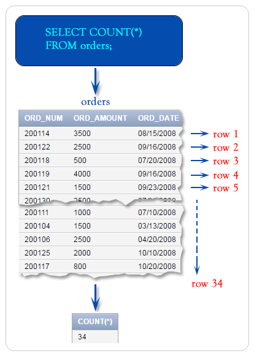
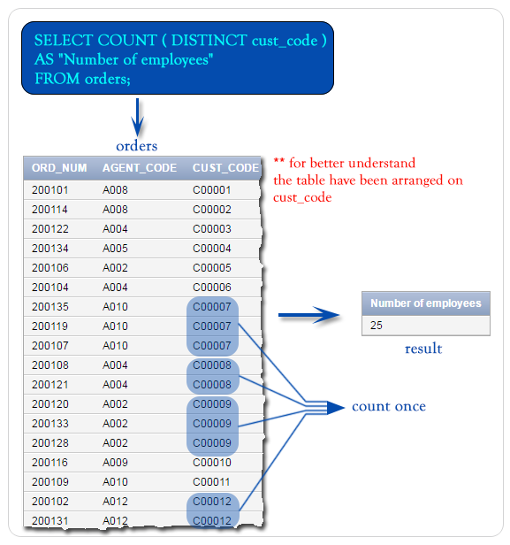

# COUNT() function

## Contents

 - [Intro to COUNT() Function](#intro)
 - [COUNT rows in a table](#count-rows)
 - [COUNT() with where clause](#count-and-where)
 - [COUNT() function with distinct clause](#distinct-01)
 - [COUN(*) vs. COUNT(ALL)](#ast-all)
 - [COUNT() with GROUP by](#wgb)

---

<div id="intro"></div>

## Intro to COUNT() Function

> The SQL **COUNT() function** returns the number of rows in a table satisfying the criteria specified in the **WHERE** clause.

---

<div id="count-rows"></div>

## COUNT rows in a table

In the following example, an asterisk character `( * )` is used followed by the SQL **COUNT()** which indicates all the rows of the table even if there is any NULL value.

To get number of rows in the 'orders' table, the following SQL statement can be used:

**INPUT:**  
```sql
SELECT COUNT(*)
FROM orders;
```

**OUTPUT:**  
```sql
+----------+
| COUNT(*) |
+----------+
|       34 |
+----------+
```

**Pictorial Presentation:**  
  

---

<div id="count-and-where"></div>

## COUNT( ) with where clause

> The **WHERE** clause can be used along with SQL **COUNT() function** to select specific records from a table against a given condition.

For example, to get number of rows in the 'orders' table with following condition:

> **ord_amount** against the order is more than **1500**.

**INPUT:**  
```sql
SELECT COUNT( * ) as "Number of Rows"
FROM orders
WHERE ord_amount > 1500;
```

**OUTPUT:**  
```sql
+----------------+
| Number of Rows |
+----------------+
|             20 |
+----------------+
```

---

<div id="distinct-01"></div>

## COUNT() function with distinct clause

> SQL **COUNT() function** with **DISTINCT** clause <u>eliminates the repetitive appearance of the same data</u>.

**NOTE:**  
The DISTINCT can come only once in a given select statement.

For example, to get unique number of rows from the **'orders'** table with following conditions:

 1. only unique **cust_code** will be counted;
 2. result will appear with the heading "Number of employees".

The following SQL statement can be used:

**INPUT:**  
```sql
SELECT COUNT(DISTINCT cust_code) AS "Number of employees" 
FROM orders;
```

**OUTPUT:**  
```sql
+---------------------+
| Number of employees |
+---------------------+
|                  25 |
+---------------------+
```

**Pictorial Presentation:**  
  

---

<div id="ast-all"></div>

## COUN(*) vs. COUNT(ALL)

In the following, we have discussed the usage of **ALL** clause with SQL **COUNT()** function to count only the non NULL value for the specified column within the argument.

The difference between `‘*’(asterisk)` and `ALL` are:

 - `'*'` counts the NULL value also;
 - But `ALL` counts only NON NULL value.

For example, to get data of number of valid **'grade'** from the <u>'customer'</u> table with the following condition:

 1. every customer must be a valid grade.

The following SQL statement can be used:

**INPUT:**  
```sql
SELECT COUNT(ALL grade)
FROM customer;
```

**OUTPUT:**  
```sql
+------------------+
| COUNT(ALL grade) |
+------------------+
|               25 |
+------------------+
```

---

<div id="wgb"></div>

## COUNT() with GROUP by

The use of **COUNT() function** in conjunction with **GROUP BY** is useful for characterizing our data under various groupings. A combination of same values (on a column) will be treated as an individual group.

For example, to get data of **'working_area'** and number of <u>agents</u> for this **'working_area'** from the <u>agents</u> table with the following condition:

 1. 'working_area' should come uniquely

The following SQL statement can be used:

**INPUT:**  
```sql
SELECT working_area, COUNT(*) 
FROM agents 
GROUP BY working_area;
```

**OUTPUT:**  
```sql
+--------------+----------+
| working_area | COUNT(*) |
+--------------+----------+
| Bangalore    |        3 |
| Mumbai       |        1 |
| London       |        2 |
| Torento      |        1 |
| Brisban      |        1 |
| New York     |        1 |
| Hampshair    |        1 |
| Chennai      |        1 |
| San Jose     |        1 |
+--------------+----------+
```

**Pictorial Presentation:**  
  

---

**REFERENCES:**  
[SQL COUNT() with distinct](https://www.w3resource.com/sql/aggregate-functions/count-with-distinct.php)  
[SQL COUNT() with GROUP by](https://www.w3resource.com/sql/aggregate-functions/count-with-group-by.php)  
[SQL COUNT() with HAVING](https://www.w3resource.com/sql/aggregate-functions/count-having.php)  

---

Ro**drigo** **L**eite da **S**ilva - **drigols**
