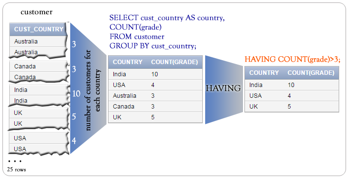

# HAVING

## Contents

 - [Intro to HAVING clause](#intro)
 - [HAVING using where](#where)
 - [HAVING with order by](#order-by)

---

<div id="intro"></div>

## Intro to HAVING clause

> SQL **HAVING** clause specifies a search condition for **a group** or **an aggregate**.

**NOTE:**  
**HAVING clause** is usually used in a GROUP BY clause, but even if you are not using GROUP BY clause, you can use HAVING to function like a WHERE clause.

**NOTE:**  
You must use HAVING with SQL **SELECT clause**.

**How a HAVING clause works IN SQL?**
 - The select clause specifies the columns.
 - The from clause supplies a set of potential rows for the result.
 - The where clause gives a filter for these potential rows.
 - The group by clause divide the rows in a table into smaller groups.
 - The having clause gives a filter for these group rows.

For example, the following query display **cust_country** and **number of customers** for the same grade for each **cust_country**, with the following condition:

> Number of customer for a same **'grade'** must be more than 2.

**INPUT:**  
```sql
SELECT cust_country, COUNT(grade)
FROM customer
GROUP BY cust_country
HAVING COUNT(grade)>2;
```

**OUTPUT:**  
```sql
+--------------+--------------+
| cust_country | COUNT(grade) |
+--------------+--------------+
| USA          |            4 |
| Canada       |            3 |
| Australia    |            3 |
| India        |           10 |
| UK           |            5 |
+--------------+--------------+
```

**Pictorial presentation:**  
  

---

<div id="where"></div>

## HAVING using where

In the following example, the SQL WHERE clause along with the HAVING clause have used to make a select statement.

To get **list of cust_city**, **sum of opening_amt**, **average of receive_amt** and **maximum payment_amt** from <u>customer</u> table with following conditions:

 1. grade of customer table must be 2;
 2. average of receive_amt for each group of cust_city must be more than 500.

The following SQL statement can be used:

**INPUT:**  
```sql
SELECT
  cust_city,
  SUM(opening_amt),
  AVG(receive_amt),
  MAX(payment_amt)
FROM customer
WHERE
  grade=2
GROUP BY
  cust_city
HAVING
  AVG(receive_amt)>500;
```

**OUTPUT:**  
```sql
+-----------+------------------+------------------+------------------+
| cust_city | SUM(opening_amt) | AVG(receive_amt) | MAX(payment_amt) |
+-----------+------------------+------------------+------------------+
| New York  |             3000 |             5000 |             2000 |
| Torento   |             8000 |             7000 |             7000 |
| London    |            10000 |             7000 |             7000 |
| Bangalore |            29000 |             8250 |             7000 |
| Brisban   |             7000 |             7000 |             9000 |
| Mumbai    |             7000 |            11000 |             9000 |
+-----------+------------------+------------------+------------------+
```

---

<div id="order-by"></div>

## HAVING with order by

In the following example, the SQL WHERE clause along with the HAVING clause is used to make a query. An ORDER BY clause arranges the final result in the specific order. The default order is ascending.

To get **list of cust_city**, **sum of opening_amt**, **average of receive_amt** and **maximum payment_amt** from <u>customer</u> table with following conditions:

 1. grade of customer table must be 2;
 2. average of receive_amt for each group of cust_city must be more than 500;
 3. the output should be arranged in the ascending order of SUM(opening_amt).

The following SQL statement can be used:

**INPUT:**  
```sql
SELECT
  cust_city,
  SUM(opening_amt),
  AVG(receive_amt),
  MAX(payment_amt)
FROM customer
WHERE
  grade=2
GROUP BY
  cust_city
HAVING
  AVG(receive_amt)>500
ORDER BY
  SUM(opening_amt);
```

**OUTPUT:**  
```sql
+-----------+------------------+------------------+------------------+
| cust_city | SUM(opening_amt) | AVG(receive_amt) | MAX(payment_amt) |
+-----------+------------------+------------------+------------------+
| New York  |             3000 |             5000 |             2000 |
| Brisban   |             7000 |             7000 |             9000 |
| Mumbai    |             7000 |            11000 |             9000 |
| Torento   |             8000 |             7000 |             7000 |
| London    |            10000 |             7000 |             7000 |
| Bangalore |            29000 |             8250 |             7000 |
+-----------+------------------+------------------+------------------+
```

---

**REFERENCES:**  
[SQL HAVING clause](https://www.w3resource.com/sql/having-clause/sql-having-clause.php)  

---

Ro**drigo** **L**eite da **S**ilva - **drigols**
