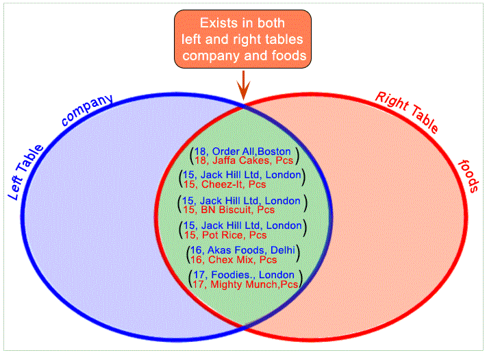
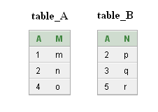
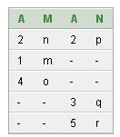
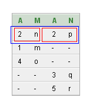
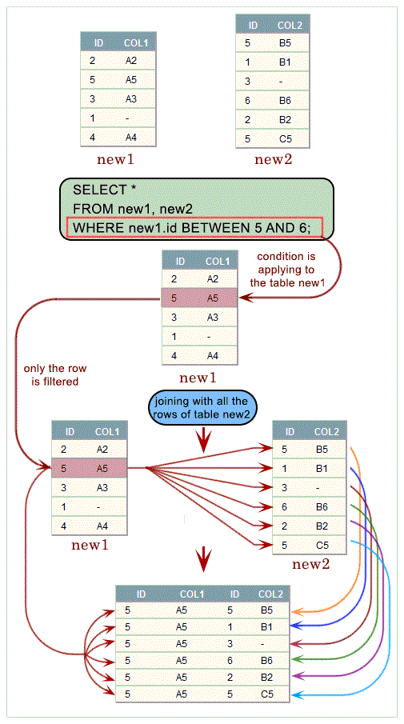

# JOIN

## Contents

<div id=""></div>

 - [Intro to JOIN clause](#intro)
 - [INNER JOIN](#inner-join)
 - [NATURAL JOIN](#natural-join)
 - [LEFT JOIN](#left-join)
 - [RIGHT JOIN](#right-join)
 - [CROSS JOIN](#cross-join)
 - [OUTER JOIN](#outer-join)
 - [FULL OUTER JOIN](#full-outer-join)
 - **Tips & Tricks:**
   - ["Equi" (=) JOIN](#equi-join)
   - ["Non" Equi (>, <, >=, <=) JOIN](#no-equi)
   - [Difference between "NATURAL JOIN" and "INNER JOIN"](#nj-ij)
   - [Difference between WHERE and ON in SQL](#on-where)
   - [JOIN and Veen Diagrams](#diagrams)
   - [JOINs and UNION mindset](#join-union-mindset)
 - **Examples:**
   - [Coming soon...](#)

---

<div id="intro"></div>

## Intro to JOIN clause

 - An **SQL JOIN** clause combines rows from **two** or **more tables**.
 - It creates a set of rows in a **temporary table**.

For example, imagine you have two tables <u>faceboook</u> and <u>linkedin</u>. Now, you want:

 - All rows from <u>faceboook</u> and <u>linkedin</u> tables;
 - All columns from <u>faceboook</u> and <u>linkedin</u> tables;
 - where (ON) name (column value) in <u>faceboook</u> is the equal name (column value) in <u>linkedin</u>;

  

**NOTE:**  
See that just **Matt** and **Lisa** has same name in the two tables.

---

<div id="inner-join"></div>

## INNER JOIN

> **NOTE:**  
> **INNER JOIN** is the default type of **JOIN** in SQL, in fact you do not even need to specify **INNER JOIN** when writing a query. Only writing **JOIN** is an **INNER JOIN**.

Another thing you need to know is that **INNER JOIN (JOIN)** is equivalent to <u>Intersection</u> in **set theory**.

**Pictorial presentation of SQL INNER JOIN (JOIN):**  
  

For example:

```sql
SELECT
    *
FROM facebook JOIN linkedin
ON
    facebook.name = linkedin.name
```

SQL first creates a new table with the columns of both of the tables you are trying to combine:

  

**NOTE:**  
It then tries to find values that match between the columns you specify in the **ON statement**.

```sql
ON
    facebook.name = linkedin.name
```

**NOTE:**  
Putting the table name with a *period (.)* before the column name makes it clear which two columns of the tables SQL will be looking for matches between.

  

SQL then starts with the first value of the specified column in the first table **(facebook.name)** and then looks through every value in the specified column of the second table **(linkedin.name)** for a match:

  

 - If there is a match (correspondência) it copies the data from both the row of the first table and the row of the second table and puts it into the newly created table.
 - SQL will not add in any rows that did not have a match.

For example, **Jeff** had not match (correspondência):

  

> **NOTE:**
> Another thing to consider is that SQL will join the rows every time there is a match. So if your data in the columns you are joining on are not unique you will get **duplicate** data in the final table.

For example, non Unique data in Second table:

  

Non Unique data in First table:

  

**NOTE:**  
As we can see the non unique data pulls in the same value from the other table twice. This is a common situation that can cause you to double count data if you are not aware that this is happening.

Let's see another example, using **INNER JOIN (JOIN)**:

**INPUT:**  
```sql
SELECT
    foods.item_name, foods.item_unit,
    company.company_name, company.company_city
FROM foods JOIN company
ON
    foods.company_id = company.company_id;
```

**OUTPUT:**  
```sql
+--------------+-----------+---------------+--------------+
| item_name    | item_unit | company_name  | company_city |
+--------------+-----------+---------------+--------------+
| Chex Mix     | Pcs       | Akas Foods    | Delhi        |
| BN Biscuit   | Pcs       | Jack Hill Ltd | London       |
| Mighty Munch | Pcs       | Foodies       | London       |
| Pot Rice     | Pcs       | Jack Hill Ltd | London       |
| Jaffa Cakes  | Pcs       | Order All     | Boston       |
| Cheez-It     | Pcs       | Jack Hill Ltd | London       |
+--------------+-----------+---------------+--------------+
```

**Pictorial Presentation of SQL Inner Join of Company and Foods Tables:**  
  

---

<div id="natural-join"></div>

## NATURAL JOIN

> **NOTE:**  
> The SQL NATURAL JOIN is a type of EQUI JOIN and is structured in such a way that, <u>columns with the same name of associated tables will appear once only</u>.

**Pictorial presentation of the above SQL Natural Join:**  
  

For example, to get all the unique columns from foods and company tables, the following SQL statement can be used:

**INPUT:**  
```sql
SELECT
    *
FROM foods NATURAL JOIN company;
```

**OUTPUT:**  
```sql
+------------+---------+--------------+-----------+---------------+--------------+
| company_id | item_id | item_name    | item_unit | company_name  | company_city |
+------------+---------+--------------+-----------+---------------+--------------+
|         16 |       1 | Chex Mix     | Pcs       | Akas Foods    | Delhi        |
|         15 |       2 | BN Biscuit   | Pcs       | Jack Hill Ltd | London       |
|         17 |       3 | Mighty Munch | Pcs       | Foodies       | London       |
|         15 |       4 | Pot Rice     | Pcs       | Jack Hill Ltd | London       |
|         18 |       5 | Jaffa Cakes  | Pcs       | Order All     | Boston       |
|         15 |       6 | Cheez-It     | Pcs       | Jack Hill Ltd | London       |
+------------+---------+--------------+-----------+---------------+--------------+
```

---

<div id="left-join"></div>

## LEFT JOIN

> <u>LEFT refers to the first table</u>, or <U>the table you will be joining to</U>.

For example, see the image (Veen Diagram) below to understand more easily:

**Pictorial presentation of SQL Left Join:**  
  

Now, see the SQL query below:

```sql
SELECT
    *
FROM facebook LEFT JOIN linkedin
ON
    facebook.name = linkedin.name
```

**NOTE:**  
 - The <u>condition (ON)</u> was **facebook.name = linkedin.name**;
 - **LEFT JOIN** gets:
   - All rows that appear just in the first table:
     - Even if it does not satisfy the condition.
   - Rows of the first table that satify the condition.
   - Rows of the first table and second table that satisfy the condition simultaneously (Intersection).
   - <u>However, it does not take rows that appear only in the second table</u>.

**Animated example:**  
  

**NOTE:**  
See that **Louis** in second table was ignored because only appears in the second table.

Another example, to get **company_id** and **company_name** columns from <u>company</u> table and **company_id**, **item_name**, **item_unit** columns from <u>foods</u> table, after an OUTER JOINING with these mentioned tables, the following SQL statement can be used:

**INPUT:**  
```sql
SELECT
    company.company_id, company.company_name, company.company_city,
    foods.company_id, foods.item_name, foods.item_unit
FROM company LEFT JOIN foods
ON
    company.company_id = foods.company_id;
```

**OUTPUT:**  
```sql
+------------+---------------+--------------+------------+--------------+-----------+
| company_id | company_name  | company_city | company_id | item_name    | item_unit |
+------------+---------------+--------------+------------+--------------+-----------+
|         15 | Jack Hill Ltd | London       |         15 | Cheez-It     | Pcs       |
|         15 | Jack Hill Ltd | London       |         15 | Pot Rice     | Pcs       |
|         15 | Jack Hill Ltd | London       |         15 | BN Biscuit   | Pcs       |
|         16 | Akas Foods    | Delhi        |         16 | Chex Mix     | Pcs       |
|         17 | Foodies       | London       |         17 | Mighty Munch | Pcs       |
|         18 | Order All     | Boston       |         18 | Jaffa Cakes  | Pcs       |
|         19 | sip-n-Bite    | New York     |       NULL | NULL         | NULL      |
+------------+---------------+--------------+------------+--------------+-----------+
```

**Pictorial Presentation of the above example SQL Left Join:**  
  

---

<div id="right-join"></div>

## RIGHT JOIN

> SQL **RIGHT JOIN** is opposite to the **LEFT JOIN**.

For example, see the image (Veen Diagram) below to understand more easily:

**Pictorial presentation LEFT JOIN vs. SQL RIGHT JOIN:**  
  

Now, let's see **RIGHT JOIN** example:

```sql
SELECT
    *
FROM facebook RIGHT JOIN linkedin
ON
    facebook.name = linkedin.name
```

  

**NOTE:**  
See that now **Jeff** in the first table was ignored because only appears in the first table (LEFT).

> **NOTE:**  
> Now think with me... We can apply the same logic as the RIGHT JOIN by rewriting LEFT JOIN just changing the table order and we will have the same RIGHT JOIN result.

```sql
SELECT
    *
FROM linkedin LEFT JOIN facebook
ON
    linkedin.name = facebook.name
```

**NOTE:**  
Now we have the same **RIGHT JOIN** result, only changed table order.

Another example, to get **company_id**, **company_name** and **company_city** columns from <u>company</u> table and **company_id**, **item_name** columns from <u>foods</u> table, after an OUTER JOINING with these mentioned tables, the following SQL statement can be used:

**INPUT:**  
```sql
SELECT
    company.company_id, company.company_name, company.company_city,
    foods.company_id, foods.item_name
FROM company RIGHT JOIN foods
ON
    company.company_id = foods.company_id;
```

**OUTPUT:**  
```sql
+------------+---------------+--------------+------------+--------------+
| company_id | company_name  | company_city | company_id | item_name    |
+------------+---------------+--------------+------------+--------------+
|         16 | Akas Foods    | Delhi        |         16 | Chex Mix     |
|         15 | Jack Hill Ltd | London       |         15 | BN Biscuit   |
|         17 | Foodies       | London       |         17 | Mighty Munch |
|         15 | Jack Hill Ltd | London       |         15 | Pot Rice     |
|         18 | Order All     | Boston       |         18 | Jaffa Cakes  |
|         15 | Jack Hill Ltd | London       |         15 | Cheez-It     |
|       NULL | NULL          | NULL         |       NULL | Salt n Shake |
+------------+---------------+--------------+------------+--------------+
```

**Pictorial Presentation of the above example:**  
  

---

<div id="cross-join"></div>

## CROSS JOIN

> The **CROSS JOIN** statement <u>does not look for matches (correspondências)</u> between any values in the two data sets. Instead for each row in first table every row of second table will be attached to it and added to the final table one by one.

For example, see the query and image below to understand more easily:

```sql
SELECT
    *
FROM facebook CROSS JOIN linkedin
```

  

The SQL **CROSS JOIN** produces a result set which is the number of rows in the first table multiplied by the number of rows in the second table <u>if no WHERE clause is used</u> along with CROSS JOIN.

> This kind of result is called as **<u>Cartesian Product</u>**.

**NOTE:**  
If **WHERE** clause is used with **CROSS JOIN**, it functions like an **INNER JOIN**.

**Pictorial Presentation of SQL Cross Join syntax:**  
  

To get item name and item unit columns from foods table and company name, company city columns from company table, after a CROSS JOINING with these mentioned tables, the following SQL statement can be used:

**INPUT:**  
```sql
SELECT
    foods.item_name, foods.item_unit,
    company.company_name, company.company_city
FROM foods CROSS JOIN company;
```

or...

**INPUT:**  
```sql
SELECT
    foods.item_name, foods.item_unit,
    company.company_name, company.company_city
FROM foods, company;
```

**How cross joining happend into two tables:**  
  

**OUTPUT:**  
```sql
+--------------+-----------+---------------+--------------+
| item_name    | item_unit | company_name  | company_city |
+--------------+-----------+---------------+--------------+
| Chex Mix     | Pcs       | sip-n-Bite    | New York     |
| Chex Mix     | Pcs       | Order All     | Boston       |
| Chex Mix     | Pcs       | Foodies       | London       |
| Chex Mix     | Pcs       | Akas Foods    | Delhi        |
| Chex Mix     | Pcs       | Jack Hill Ltd | London       |
| BN Biscuit   | Pcs       | sip-n-Bite    | New York     |
| BN Biscuit   | Pcs       | Order All     | Boston       |
| BN Biscuit   | Pcs       | Foodies       | London       |
| BN Biscuit   | Pcs       | Akas Foods    | Delhi        |
| BN Biscuit   | Pcs       | Jack Hill Ltd | London       |
| Mighty Munch | Pcs       | sip-n-Bite    | New York     |
| Mighty Munch | Pcs       | Order All     | Boston       |
| Mighty Munch | Pcs       | Foodies       | London       |
| Mighty Munch | Pcs       | Akas Foods    | Delhi        |
| Mighty Munch | Pcs       | Jack Hill Ltd | London       |
| Pot Rice     | Pcs       | sip-n-Bite    | New York     |
| Pot Rice     | Pcs       | Order All     | Boston       |
| Pot Rice     | Pcs       | Foodies       | London       |
| Pot Rice     | Pcs       | Akas Foods    | Delhi        |
| Pot Rice     | Pcs       | Jack Hill Ltd | London       |
| Jaffa Cakes  | Pcs       | sip-n-Bite    | New York     |
| Jaffa Cakes  | Pcs       | Order All     | Boston       |
| Jaffa Cakes  | Pcs       | Foodies       | London       |
| Jaffa Cakes  | Pcs       | Akas Foods    | Delhi        |
| Jaffa Cakes  | Pcs       | Jack Hill Ltd | London       |
| Cheez-It     | Pcs       | sip-n-Bite    | New York     |
| Cheez-It     | Pcs       | Order All     | Boston       |
| Cheez-It     | Pcs       | Foodies       | London       |
| Cheez-It     | Pcs       | Akas Foods    | Delhi        |
| Cheez-It     | Pcs       | Jack Hill Ltd | London       |
| Salt n Shake | Pcs       | sip-n-Bite    | New York     |
| Salt n Shake | Pcs       | Order All     | Boston       |
| Salt n Shake | Pcs       | Foodies       | London       |
| Salt n Shake | Pcs       | Akas Foods    | Delhi        |
| Salt n Shake | Pcs       | Jack Hill Ltd | London       |
+--------------+-----------+---------------+--------------+
```

**More presentaion of the said output:**  
  

---

<div id="outer-join"></div>

## OUTER JOIN

The SQL **OUTER JOIN** returns all rows from both the participating tables which satisfy the join condition along with rows which do not satisfy the join condition.

**NOTE:**  
The SQL **OUTER JOIN** operator (+) is used only on one side of the join condition only.

**Pictorial Presentation of SQL Outer Join:**  
  

**The subtypes of SQL OUTER JOIN:**
 - LEFT OUTER JOIN or LEFT JOIN
 - RIGHT OUTER JOIN or RIGHT JOIN
 - FULL OUTER JOIN

For example, to get company name and company id columns from company table and company id, item name, item unit columns from foods table, after an OUTER JOINING with these mentioned tables, the following SQL statement can be used:

**INPUT:**  
```sql
SELECT
    company.company_name, company.company_id,
    foods.company_id, foods.item_name, foods.item_unit
FROM company, foods
WHERE
    company.company_id = foods.company_id(+);
```

**OUTPUT:**  
```sql
COMPANY_NAME    COMPANY_ID COMPANY_ID ITEM_NAME       ITEM_UNIT
--------------- ---------- ---------- --------------- ----------
Akas Foods      16         16         Chex Mix        Pcs
Jack Hill Ltd   15         15         Cheez-It        Pcs
Jack Hill Ltd   15         15         BN Biscuit      Pcs
Foodies.        17         17         Mighty Munch    Pcs
Jack Hill Ltd   15         15         Pot Rice        Pcs
Order All       18         18         Jaffa Cakes     Pcs
sip-n-Bite.     19
```

**NOTE:**  
 - This SQL statement would return all rows from the company table and only those rows from the foods table where the joined fields are equal.
 - The (+) after the foods.company_id field indicates that, if a company_id value in the company table does not exist in the foods table, all fields in the foods table will be displayed as NULL in the result set.

---

<div id="full-outer-join"></div>

## FULL OUTER JOIN

In SQL the **FULL OUTER JOIN** combines the results of both **left** and **right outer joins** and returns all (matched or unmatched) rows from the tables on both sides of the join clause.

**Pictorial Presentation: SQL Full Outer Join**  
  
  
  

**Example: SQL Full Outer Join**  
Let’s combine the same two tables using a full join.

  

**INPUT:**  
```sql
SELECT
    *
FROM table_A FULL OUTER JOIN table_B 
ON
    table_A.A = table_B.A;
```

**OUTPUT:**  
  

Because this is a full join, all rows (both matching and nonmatching) from both tables are included in the output. There is only one match between table table_A and table table_B, so **only one row of output displays values in all columns**. All remaining rows of output contain only values from table table_A or table table_B, with the remaining columns set to missing values

**Only one row of output displays values in all columns explain below:**
  

**NOTE:**  
As we know the **FULL OUTER JOIN** is the combination of the results of both **LEFT OUTER JOIN** and **RIGHT OUTER JOIN**, so, here we are going to describe how **FULL OUTER JOIN** perform internally.

**Pictorial Presentation SQL Full Outer Join:**  
  

---

<div id="equi-join"></div>

## "Equi" (=) JOIN

> SQL EQUI JOIN performs a JOIN against <u>equality</u> or <u>matching</u> column(s) values of the associated tables.

**NOTE:**  
An equal sign (=) is used as comparison operator in the where clause to refer equality.

For example, see image below:

  

**NOTE:**  
See that **"Equi Join"** <u>excludes different values</u> from the **SELECT** statement.

---

<div id="no-equi"></div>

## "Non" Equi (>, <, >=, <=) JOIN

> The SQL **NON EQUI JOIN** uses <u>comparison operator</u> instead of the equal sign like **>, <, >=, <=** along with conditions.

**Pictorial presentation of SQL Non Equi Join:**  
  

Another example is the following:

**INPUT:**  
```sql
SELECT
    a.ord_num, a.ord_amount,
    b.cust_name, b.working_area
FROM
    orders a, customer b
WHERE
    a.ord_amount BETWEEN b.opening_amt AND b.opening_amt;
```

**OUTPUT:**  
```sql
+---------+------------+-----------+--------------+
| ord_num | ord_amount | cust_name | working_area |
+---------+------------+-----------+--------------+
|  200101 |       3000 | Micheal   | New York     |
|  200108 |       4000 | Cook      | London       |
|  200108 |       4000 | Karl      | London       |
|  200110 |       3000 | Micheal   | New York     |
|  200113 |       4000 | Cook      | London       |
|  200113 |       4000 | Karl      | London       |
|  200119 |       4000 | Cook      | London       |
|  200119 |       4000 | Karl      | London       |
+---------+------------+-----------+--------------+
```

---

<div id="nj-ij"></div>

## Difference between "NATURAL JOIN" and "INNER JOIN"

There is one significant difference between **INNER JOIN** and **NATURAL JOIN** is the number of columns returned.

See the following example on company table and foods table:

**INPUT:**  
```sql
SELECT
    *
FROM company INNER JOIN foods
ON
    company.company_id = foods.company_id;
```

**OUTPUT:**  
```sql
+------------+---------------+--------------+---------+--------------+-----------+------------+
| company_id | company_name  | company_city | item_id | item_name    | item_unit | company_id |
+------------+---------------+--------------+---------+--------------+-----------+------------+
|         16 | Akas Foods    | Delhi        |       1 | Chex Mix     | Pcs       |         16 |
|         15 | Jack Hill Ltd | London       |       2 | BN Biscuit   | Pcs       |         15 |
|         17 | Foodies       | London       |       3 | Mighty Munch | Pcs       |         17 |
|         15 | Jack Hill Ltd | London       |       4 | Pot Rice     | Pcs       |         15 |
|         18 | Order All     | Boston       |       5 | Jaffa Cakes  | Pcs       |         18 |
|         15 | Jack Hill Ltd | London       |       6 | Cheez-It     | Pcs       |         15 |
+------------+---------------+--------------+---------+--------------+-----------+------------+
```

**NOTE:**  
See that INNER JOIN return all columns from company and foods tables *(Including duplicate "company_id" columns)*.

**INPUT:**  
```sql
SELECT
    *
FROM company NATURAL JOIN foods;
```

**OUTPUT:**  
```sql
+------------+---------------+--------------+---------+--------------+-----------+
| company_id | company_name  | company_city | item_id | item_name    | item_unit |
+------------+---------------+--------------+---------+--------------+-----------+
|         16 | Akas Foods    | Delhi        |       1 | Chex Mix     | Pcs       |
|         15 | Jack Hill Ltd | London       |       2 | BN Biscuit   | Pcs       |
|         17 | Foodies       | London       |       3 | Mighty Munch | Pcs       |
|         15 | Jack Hill Ltd | London       |       4 | Pot Rice     | Pcs       |
|         18 | Order All     | Boston       |       5 | Jaffa Cakes  | Pcs       |
|         15 | Jack Hill Ltd | London       |       6 | Cheez-It     | Pcs       |
+------------+---------------+--------------+---------+--------------+-----------+
```

**NOTE:**  
See that now we don't have duplicate columns (like "company_id").

---

<div id="on-where"></div>

## Difference between WHERE and ON in SQL

 - **ON:**
   - ON should be used to define the join condition.
 - **WHERE:**
   - WHERE should be used to filter the data.

---

<div id="diagrams"></div>

## JOIN and Veen Diagrams

Now, let's see some **JOIN** and **Veen Diagrams**:

  

---

<div id="join-union-mindset"></div>

## JOINs and UNION mindset

> Why use a **CROSS JOIN** vs a **UNION**, **LEFT JOIN**, **RIGHT JOIN**, **INNER JOIN**, **FULL OUTER JOIN**?

To help understand, Let’s think about the different questions they are asking:

 - **INNER JOIN:**
   - How many friends and connections do my friends who are on both on Facebook and LinkedIn have?
 - **LEFT JOIN:**
   - How many friends and connections do my Facebook friends have? (Regardless of if they are on LinkedIn)
 - **RIGHT JOIN:**
   - How many friends and connections do my LinkedIn connections have? (Regardless of if they are on facebook)
 - **CROSS JOIN:**
   - How many combinations of friends and connections do I have?
 - **FULL OUTER JOIN:**
   - How many friends and connections do my Facebook friends or LinkedIn connections have?
 - **UNION:**
   - How many friends do my Facebook friends have and how many connections do my LinkedIn connections have?

---

**REFERENCES:**  
[Difference between WHERE and ON in SQL](https://dataschool.com/how-to-teach-people-sql/difference-between-where-and-on-in-sql/)
[SQL Inner Join](https://www.w3resource.com/sql/joins/perform-an-inner-join.php)  
[SQL Natural Join](https://www.w3resource.com/sql/joins/natural-join.php)
[SQL Cross Join](https://www.w3resource.com/sql/joins/cross-join.php)
[SQL Outer Join](https://www.w3resource.com/sql/joins/perform-an-outer-join.php)
[SQL Left Join](https://www.w3resource.com/sql/joins/perform-a-left-join.php)
[SQL Right Join](https://www.w3resource.com/sql/joins/perform-a-right-join.php)
[SQL Full Outer Join](https://www.w3resource.com/sql/joins/perform-a-full-outer-join.php)
[Inner Join - Animated](https://dataschool.com/how-to-teach-people-sql/inner-join-animated/)

---

Ro**drigo** **L**eite da **S**ilva - **drigols**
