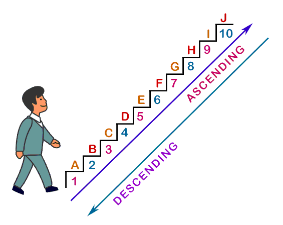
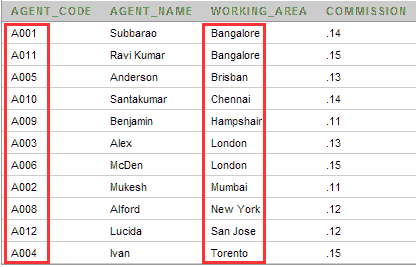

# ORDER BY

## Contents

 - [Intro to ORDER BY clause](#intro)
 - [Sorting on column names](#column-names)
 - [Ordering by more than one columns](#more-than-one-columns)
 - [Ordering by more than one columns in ascending or descending order](#ascending-or-descending-order)

---

<div id="intro"></div>

## Intro to ORDER BY clause

> The **ORDER BY** clause orders or sorts the result of a query according to the values in one or more specific columns.

**NOTE:**  
You can order/sort **ascending** or **descending** order (the default order is ascending).

**Pictorial Presentation: SQL ORDER BY ascending - descending:**
  

> **Note:**
> SQL ORDER BY clause always come at the <u>end of a SELECT statement</u>.

**Syntax:**
```sql
SELECT <column_list> FROM < table name >.
WHERE <condition>
ORDER BY <columns> [ASC | DESC];
```

---

<div id="column-names"></div>

## Sorting on column names

To get **'agent_name'**, **'agent_name'**,**'working_area'** and **'commission'** from the <u>agents</u> table with following condition:

 - 1. 'agent_code' should come in ascending order.

The following SQL statement can be used:

**INPUT:**  
```sql
SELECT agent_code,agent_name,working_area,commission
FROM agents ORDER BY agent_code;
```

**OUTPUT:**  
```sql
+------------+------------+--------------+------------+
| agent_code | agent_name | working_area | commission |
+------------+------------+--------------+------------+
| A001       | Subbarao   | Bangalore    |       0.14 |
| A002       | Mukesh     | Mumbai       |       0.11 |
| A003       | Alex       | London       |       0.13 |
| A004       | Ivan       | Torento      |       0.15 |
| A005       | Anderson   | Brisban      |       0.13 |
| A006       | McDen      | London       |       0.15 |
| A007       | Ramasundar | Bangalore    |       0.15 |
| A008       | Alford     | New York     |       0.12 |
| A009       | Benjamin   | Hampshair    |       0.11 |
| A010       | Santakumar | Chennai      |       0.14 |
| A011       | Ravi Kumar | Bangalore    |       0.15 |
| A012       | Lucida     | San Jose     |       0.12 |
+------------+------------+--------------+------------+
```

  

**NOTE:**  
Now, let's change to **descending approach**:

**INPUT:**  
```sql
SELECT agent_code,agent_name,working_area,commission
FROM agents ORDER BY agent_code DESC;
```

**OUTPUT:**  
```sql
+------------+------------+--------------+------------+
| agent_code | agent_name | working_area | commission |
+------------+------------+--------------+------------+
| A012       | Lucida     | San Jose     |       0.12 |
| A011       | Ravi Kumar | Bangalore    |       0.15 |
| A010       | Santakumar | Chennai      |       0.14 |
| A009       | Benjamin   | Hampshair    |       0.11 |
| A008       | Alford     | New York     |       0.12 |
| A007       | Ramasundar | Bangalore    |       0.15 |
| A006       | McDen      | London       |       0.15 |
| A005       | Anderson   | Brisban      |       0.13 |
| A004       | Ivan       | Torento      |       0.15 |
| A003       | Alex       | London       |       0.13 |
| A002       | Mukesh     | Mumbai       |       0.11 |
| A001       | Subbarao   | Bangalore    |       0.14 |
+------------+------------+--------------+------------+
```

---

<div id="more-than-one-columns"></div>

## Ordering by more than one columns

You can use the ORDER BY clause to sort the result of a query according to the values in more than one columns.

For example, to get **'agent_name'**, **'agent_name'**,**'working_area'** and **'commission'** from the <u>agents</u> table with following conditions:

 1. **'working_area'** should come in **ascending** order first;
 2. within the same **'working_area'**, **'agent_code'** should come in ascending order.

The following SQL statement can be used:

**INPUT:**  
```sql
SELECT agent_code, agent_name, working_area, commission
FROM agents ORDER BY working_area, agent_code;
```

**OUTPUT:**  
```sql
+------------+------------+--------------+------------+
| agent_code | agent_name | working_area | commission |
+------------+------------+--------------+------------+
| A001       | Subbarao   | Bangalore    |       0.14 |
| A007       | Ramasundar | Bangalore    |       0.15 |
| A011       | Ravi Kumar | Bangalore    |       0.15 |
| A005       | Anderson   | Brisban      |       0.13 |
| A010       | Santakumar | Chennai      |       0.14 |
| A009       | Benjamin   | Hampshair    |       0.11 |
| A003       | Alex       | London       |       0.13 |
| A006       | McDen      | London       |       0.15 |
| A002       | Mukesh     | Mumbai       |       0.11 |
| A008       | Alford     | New York     |       0.12 |
| A012       | Lucida     | San Jose     |       0.12 |
| A004       | Ivan       | Torento      |       0.15 |
+------------+------------+--------------+------------+
```

  

---

<div id="ascending-or-descending-order"></div>

## Ordering by more than one columns in ascending or descending order

> You can use the ORDER BY clause to sort the result of a query on multiple columns in various order (ascending or descending).

For example, to get **'agent_name'**, **'agent_name'**, **'working_area'** and **'commission'** from the <u>agents</u> table with following conditions:

 1. **'working_area'** comes in **ascending order** first;
 2. **'commission'** comes in **descending order**.

The following SQL statement can be used:

**INPUT:**  
```sql
SELECT agent_code, agent_name, working_area, commission
FROM agents ORDER BY working_area ASC, commission DESC;
```

**OUTPUT:**  
```sql
+------------+------------+--------------+------------+
| agent_code | agent_name | working_area | commission |
+------------+------------+--------------+------------+
| A007       | Ramasundar | Bangalore    |       0.15 |
| A011       | Ravi Kumar | Bangalore    |       0.15 |
| A001       | Subbarao   | Bangalore    |       0.14 |
| A005       | Anderson   | Brisban      |       0.13 |
| A010       | Santakumar | Chennai      |       0.14 |
| A009       | Benjamin   | Hampshair    |       0.11 |
| A006       | McDen      | London       |       0.15 |
| A003       | Alex       | London       |       0.13 |
| A002       | Mukesh     | Mumbai       |       0.11 |
| A008       | Alford     | New York     |       0.12 |
| A012       | Lucida     | San Jose     |       0.12 |
| A004       | Ivan       | Torento      |       0.15 |
+------------+------------+--------------+------------+
```

  

---

**REFERENCES:**  
[SQL ORDER BY clause](https://www.w3resource.com/sql/order-by.php)  

---

Ro**drigo** **L**eite da **S**ilva - **drigols**
