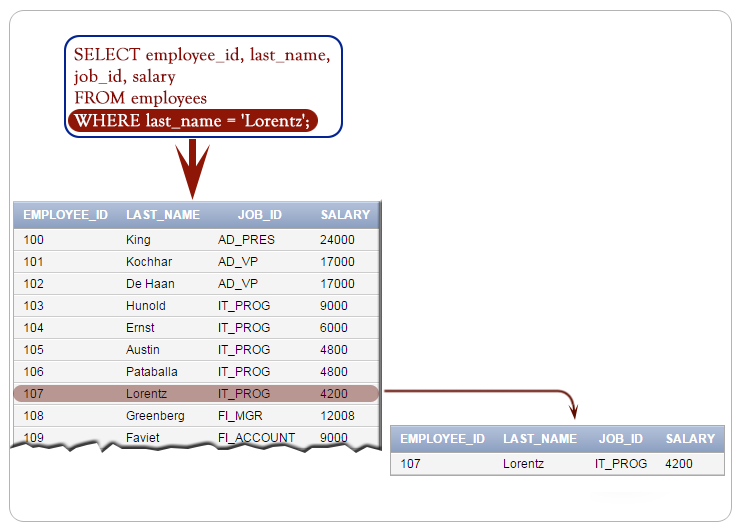
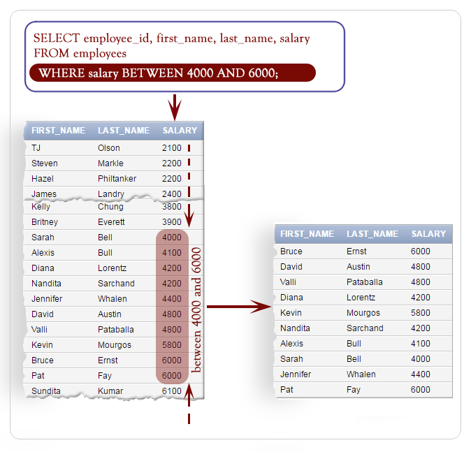
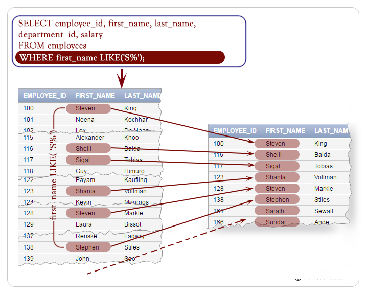
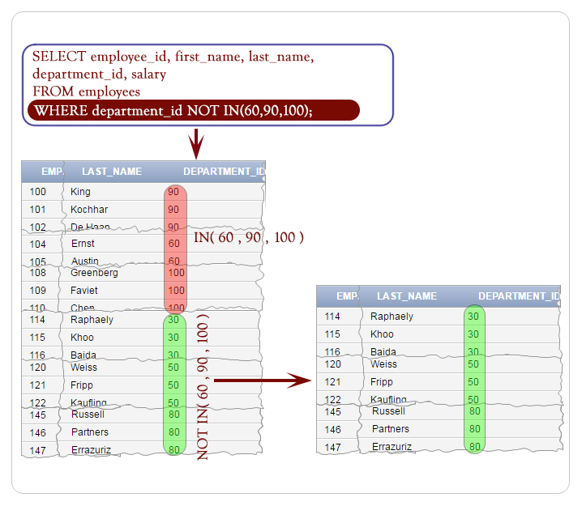

# WHERE

## Contents

 - [Intro to WHERE clause](#intro)
 - [Types of conditions](#types-conditions)
 - [Using the WHERE clause](#start)
 - [WHERE clause using comparison conditions](#using-comparison-conditions)
 - [WHERE clause using BETWEEN condition](#between)
 - [WHERE clause using IN condition](#in)
 - [WHERE clause using LIKE condition](#like)
 - [WHERE clause using the AND operator](#and)
 - [WHERE clause using the OR operator](#or)
 - [WHERE clause using the NOT operator](#not)

---

<div id="intro"></div>

## Intro to WHERE clause

The basic form of the SELECT statement is **SELECT-FROM-WHERE block**. In a SELECT statement, **WHERE** clause is optional.

In a **WHERE clause**, you can specify a search condition (logical expression) that has one or more conditions. When the condition (logical expression) evaluates to true the **WHERE clause** filter unwanted rows from the result.

**Here is the syntax:**

```sql
SELECT <column_list> 
FROM <table_name>
WHERE <condition>;
```

---

<div id="types-conditions"></div>

## Types of conditions

| Condition 	                                       | SQL Operators           |
|----------------------------------------------------|-------------------------|
| **Comparison**                                     |	=, >, >=, <, <=, <>    |
| **Range filtering**                                | BETWEEN                 |
| **Match a character pattern**                      | LIKE                    |
| **List filtering [Match any of a list of values]** | IN                      |
| **Null testing**                                   | IS NULL                 |


**Comparison Operators:**
| SQL Operators | Meaning                  |
|---------------|--------------------------|
| **=**         | Equal to                 |  
| **>**         | Greater than             |                                                              
| **>=**        | Greater than or equal to |
| **<**         | Less than                |
| **<=**        | Less than or equal to    |
| **<>**        | Not equal to             |

---

<div id="start"></div>

## Using the WHERE clause

The following query display the **employee_id**, **first_name**, **last_name**, **department_id** of **employees** whose **departmet_id=100**:

**INPUT:**  
```sql
SELECT employee_id, first_name, 
last_name, department_id
FROM employees 
WHERE department_id=100;
```

**OUTPUT:**  
```sql
+-------------+------------+-----------+---------------+
| employee_id | first_name | last_name | department_id |
+-------------+------------+-----------+---------------+
|         108 | Nancy      | Greenberg |           100 |
|         109 | Daniel     | Faviet    |           100 |
|         110 | John       | Chen      |           100 |
|         111 | Ismael     | Sciarra   |           100 |
|         112 | Jose Manue | Urman     |           100 |
|         113 | Luis       | Popp      |           100 |
+-------------+------------+-----------+---------------+
```

The following query displays the **employee_id**, **job_id**, **salary** of employees whose **last_name='Lorentz'**:

**INPUT:**  
```sql
SELECT employee_id, job_id, salary
FROM employees
WHERE last_name = 'Lorentz';
```

**OUTPUT:**  
```sql
+-------------+---------+--------+
| employee_id | job_id  | salary |
+-------------+---------+--------+
|         107 | IT_PROG |   4200 |
+-------------+---------+--------+
```
**Pictorial presentation:**

  

---

<div id="using-comparison-conditions"></div>

## WHERE clause using comparison conditions

The following query displays the **employee_id**, **first_name**, **last_name** and **salary** of employees whose salary is greater than or equal to 4000:

**INPUT:**  
```sql
SELECT employee_id, first_name, last_name, salary
FROM employees
WHERE salary>=4000;
```

**OUTPUT:**  
```sql
+-------------+------------+------------+--------+
| employee_id | first_name | last_name  | salary |
+-------------+------------+------------+--------+
|         100 | Steven     | King       |  24000 |
|         101 | Neena      | Kochhar    |  17000 |
|         102 | Lex        | De Haan    |  17000 |
|         103 | Alexander  | Hunold     |   9000 |
|         104 | Bruce      | Ernst      |   6000 |
|         105 | David      | Austin     |   4800 |
|         106 | Valli      | Pataballa  |   4800 |
|         107 | Diana      | Lorentz    |   4200 |
|         108 | Nancy      | Greenberg  |  12000 |
|         109 | Daniel     | Faviet     |   9000 |
|         110 | John       | Chen       |   8200 |
|         111 | Ismael     | Sciarra    |   7700 |
|         112 | Jose Manue | Urman      |   7800 |
|         113 | Luis       | Popp       |   6900 |
|         114 | Den        | Raphaely   |  11000 |
|         120 | Matthew    | Weiss      |   8000 |
|         121 | Adam       | Fripp      |   8200 |
|         122 | Payam      | Kaufling   |   7900 |
|         123 | Shanta     | Vollman    |   6500 |
|         124 | Kevin      | Mourgos    |   5800 |
|         145 | John       | Russell    |  14000 |
|         146 | Karen      | Partners   |  13500 |
|         147 | Alberto    | Errazuriz  |  12000 |
|         148 | Gerald     | Cambrault  |  11000 |
|         149 | Eleni      | Zlotkey    |  10500 |
|         150 | Peter      | Tucker     |  10000 |
|         151 | David      | Bernstein  |   9500 |
|         152 | Peter      | Hall       |   9000 |
|         153 | Christophe | Olsen      |   8000 |
|         154 | Nanette    | Cambrault  |   7500 |
|         155 | Oliver     | Tuvault    |   7000 |
|         156 | Janette    | King       |  10000 |
|         157 | Patrick    | Sully      |   9500 |
|         158 | Allan      | McEwen     |   9000 |
|         159 | Lindsey    | Smith      |   8000 |
|         160 | Louise     | Doran      |   7500 |
|         161 | Sarath     | Sewall     |   7000 |
|         162 | Clara      | Vishney    |  10500 |
|         163 | Danielle   | Greene     |   9500 |
|         164 | Mattea     | Marvins    |   7200 |
|         165 | David      | Lee        |   6800 |
|         166 | Sundar     | Ande       |   6400 |
|         167 | Amit       | Banda      |   6200 |
|         168 | Lisa       | Ozer       |  11500 |
|         169 | Harrison   | Bloom      |  10000 |
|         170 | Tayler     | Fox        |   9600 |
|         171 | William    | Smith      |   7400 |
|         172 | Elizabeth  | Bates      |   7300 |
|         173 | Sundita    | Kumar      |   6100 |
|         174 | Ellen      | Abel       |  11000 |
|         175 | Alyssa     | Hutton     |   8800 |
|         176 | Jonathon   | Taylor     |   8600 |
|         177 | Jack       | Livingston |   8400 |
|         178 | Kimberely  | Grant      |   7000 |
|         179 | Charles    | Johnson    |   6200 |
|         184 | Nandita    | Sarchand   |   4200 |
|         185 | Alexis     | Bull       |   4100 |
|         192 | Sarah      | Bell       |   4000 |
|         200 | Jennifer   | Whalen     |   4400 |
|         201 | Michael    | Hartstein  |  13000 |
|         202 | Pat        | Fay        |   6000 |
|         203 | Susan      | Mavris     |   6500 |
|         204 | Hermann    | Baer       |  10000 |
|         205 | Shelley    | Higgins    |  12000 |
|         206 | William    | Gietz      |   8300 |
+-------------+------------+------------+--------+
```

---

<div id="between"></div>

## WHERE clause using BETWEEN condition

> The **BETWEEN** condition is used to test for values in a list.

The following query displays the employee_id, first_name, last_name and salary of employees whose salary is greater than or equal to 4000 and less than equal to 6000 where 4000 is thelower limit and 6000 is the upper limit of the salary:

**INPUT:**  
```sql
SELECT employee_id, first_name, last_name, salary
FROM employees
WHERE salary BETWEEN 4000 AND 6000;
```

**OUTPUT:**  
```sql
+-------------+------------+-----------+--------+
| employee_id | first_name | last_name | salary |
+-------------+------------+-----------+--------+
|         104 | Bruce      | Ernst     |   6000 |
|         105 | David      | Austin    |   4800 |
|         106 | Valli      | Pataballa |   4800 |
|         107 | Diana      | Lorentz   |   4200 |
|         124 | Kevin      | Mourgos   |   5800 |
|         184 | Nandita    | Sarchand  |   4200 |
|         185 | Alexis     | Bull      |   4100 |
|         192 | Sarah      | Bell      |   4000 |
|         200 | Jennifer   | Whalen    |   4400 |
|         202 | Pat        | Fay       |   6000 |
+-------------+------------+-----------+--------+
```

**Pictorial presentation:**  
  

---

<div id="in"></div>

## WHERE clause using IN condition

> The **IN** condition is used to test for values in a list.

The following query displays the employee_id, first_name, last_name, department_id and salary of employees whose department_id 60, 90 or 100:

**INPUT:**  
```sql
SELECT employee_id, first_name, last_name, 
department_id, salary 
FROM employees
WHERE department_id IN(60, 90, 100);
```

**OUTPUT:**  
```sql
+-------------+------------+-----------+---------------+--------+
| employee_id | first_name | last_name | department_id | salary |
+-------------+------------+-----------+---------------+--------+
|         100 | Steven     | King      |            90 |  24000 |
|         101 | Neena      | Kochhar   |            90 |  17000 |
|         102 | Lex        | De Haan   |            90 |  17000 |
|         103 | Alexander  | Hunold    |            60 |   9000 |
|         104 | Bruce      | Ernst     |            60 |   6000 |
|         105 | David      | Austin    |            60 |   4800 |
|         106 | Valli      | Pataballa |            60 |   4800 |
|         107 | Diana      | Lorentz   |            60 |   4200 |
|         108 | Nancy      | Greenberg |           100 |  12000 |
|         109 | Daniel     | Faviet    |           100 |   9000 |
|         110 | John       | Chen      |           100 |   8200 |
|         111 | Ismael     | Sciarra   |           100 |   7700 |
|         112 | Jose Manue | Urman     |           100 |   7800 |
|         113 | Luis       | Popp      |           100 |   6900 |
+-------------+------------+-----------+---------------+--------+
```

**Pictorial presentation:**  
  

---

<div id="like"></div>

## WHERE clause using LIKE condition

> The **LIKE** condition is used to perform wildcard searches of string values.

The search condition can contain either numbers or literal characters:

 - **_**
   - Denotes one character
 - **%**
   - Denotes zero or many characters.

The following query displays the employee_id, first_name, last_name and salary of employees whose first_name starting with **'S'**:

**INPUT:**  
```sql
SELECT employee_id, first_name, last_name, 
department_id, salary
FROM employees
WHERE first_name LIKE('S%');
```

**OUTPUT:**  
```sql
+-------------+------------+-----------+---------------+--------+
| employee_id | first_name | last_name | department_id | salary |
+-------------+------------+-----------+---------------+--------+
|         100 | Steven     | King      |            90 |  24000 |
|         116 | Shelli     | Baida     |            30 |   2900 |
|         117 | Sigal      | Tobias    |            30 |   2800 |
|         123 | Shanta     | Vollman   |            50 |   6500 |
|         128 | Steven     | Markle    |            50 |   2200 |
|         138 | Stephen    | Stiles    |            50 |   3200 |
|         161 | Sarath     | Sewall    |            80 |   7000 |
|         166 | Sundar     | Ande      |            80 |   6400 |
|         173 | Sundita    | Kumar     |            80 |   6100 |
|         192 | Sarah      | Bell      |            50 |   4000 |
|         194 | Samuel     | McCain    |            50 |   3200 |
|         203 | Susan      | Mavris    |            40 |   6500 |
|         205 | Shelley    | Higgins   |           110 |  12000 |
+-------------+------------+-----------+---------------+--------+
```

**Pictorial presentation:**  
  

---

<div id="is-null"></div>

## WHERE clause using NULL condition

> **IS NULL** operator is used to test for **nulls**.

The following query displays the employee_id, first_name, last_name, email and salary of employees whose email is null:

**INPUT:**  
```sql
SELECT employee_id, first_name, last_name, 
email, salary
FROM employees
WHERE email IS NULL;
```

**OUTPUT:**  
```sql
+-------------+------------+-----------+-------+--------+
| employee_id | first_name | last_name | email | salary |
+-------------+------------+-----------+-------+--------+
|         100 | Steven     | King      | NULL  |  24000 |
|         108 | Nancy      | Greenberg | NULL  |  12000 |
|         120 | Matthew    | Weiss     | NULL  |   8000 |
|         144 | Peter      | Vargas    | NULL  |   2500 |
|         149 | Eleni      | Zlotkey   | NULL  |  10500 |
|         150 | Peter      | Tucker    | NULL  |  10000 |
|         151 | David      | Bernstein | NULL  |   9500 |
+-------------+------------+-----------+-------+--------+
```

---

<div id="and"></div>

## WHERE clause using the AND operator

The following query displays the employee_id, first_name, last_name and salary of employees whose first_name starting with 'S' and salary greater than or equal to 4000:

**INPUT:**  
```sql
SELECT employee_id, first_name, last_name, 
department_id, salary
FROM employees
WHERE first_name LIKE('S%')
AND salary>=4000;
```

**OUTPUT:**  
```sql
+-------------+------------+-----------+---------------+--------+
| employee_id | first_name | last_name | department_id | salary |
+-------------+------------+-----------+---------------+--------+
|         100 | Steven     | King      |            90 |  24000 |
|         123 | Shanta     | Vollman   |            50 |   6500 |
|         161 | Sarath     | Sewall    |            80 |   7000 |
|         166 | Sundar     | Ande      |            80 |   6400 |
|         173 | Sundita    | Kumar     |            80 |   6100 |
|         192 | Sarah      | Bell      |            50 |   4000 |
|         203 | Susan      | Mavris    |            40 |   6500 |
|         205 | Shelley    | Higgins   |           110 |  12000 |
+-------------+------------+-----------+---------------+--------+
```

---

<div id="or"></div>

## WHERE clause using the OR operator

The following query displays the employee_id, first_name, last_name and salary of employees whose first_name starting with 'S' or 'A':

**INPUT:**  
```sql
SELECT employee_id, first_name, last_name, 
department_id, salary
FROM employees
WHERE first_name LIKE('S%')
OR first_name LIKE('A%');
```

**OUTPUT:**  
```sql
+-------------+------------+-----------+---------------+--------+
|         100 | Steven     | King      |            90 |  24000 |
|         103 | Alexander  | Hunold    |            60 |   9000 |
|         115 | Alexander  | Khoo      |            30 |   3100 |
|         116 | Shelli     | Baida     |            30 |   2900 |
|         117 | Sigal      | Tobias    |            30 |   2800 |
|         121 | Adam       | Fripp     |            50 |   8200 |
|         123 | Shanta     | Vollman   |            50 |   6500 |
|         128 | Steven     | Markle    |            50 |   2200 |
|         138 | Stephen    | Stiles    |            50 |   3200 |
|         147 | Alberto    | Errazuriz |            80 |  12000 |
|         158 | Allan      | McEwen    |            80 |   9000 |
|         161 | Sarath     | Sewall    |            80 |   7000 |
|         166 | Sundar     | Ande      |            80 |   6400 |
|         167 | Amit       | Banda     |            80 |   6200 |
|         173 | Sundita    | Kumar     |            80 |   6100 |
|         175 | Alyssa     | Hutton    |            80 |   8800 |
|         185 | Alexis     | Bull      |            50 |   4100 |
|         187 | Anthony    | Cabrio    |            50 |   3000 |
|         192 | Sarah      | Bell      |            50 |   4000 |
|         194 | Samuel     | McCain    |            50 |   3200 |
|         196 | Alana      | Walsh     |            50 |   3100 |
|         203 | Susan      | Mavris    |            40 |   6500 |
|         205 | Shelley    | Higgins   |           110 |  12000 |
+-------------+------------+-----------+---------------+--------+
```

---

<div id="not"></div>

## WHERE clause using the NOT operator

The following query displays the employee_id, first_name, last_name and salary of employees except the department_id 90, 60 or 100:

**INPUT:**  
```sql
SELECT employee_id, first_name, last_name, 
department_id, salary
FROM employees
WHERE department_id
NOT IN (90, 60, 100);
```

**OUTPUT:**  
```sql
+-------------+------------+------------+---------------+--------+
| employee_id | first_name | last_name  | department_id | salary |
+-------------+------------+------------+---------------+--------+
|         114 | Den        | Raphaely   |            30 |  11000 |
|         115 | Alexander  | Khoo       |            30 |   3100 |
|         116 | Shelli     | Baida      |            30 |   2900 |
|         117 | Sigal      | Tobias     |            30 |   2800 |
|         118 | Guy        | Himuro     |            30 |   2600 |
|         119 | Karen      | Colmenares |            30 |   2500 |
|         120 | Matthew    | Weiss      |            50 |   8000 |
|         121 | Adam       | Fripp      |            50 |   8200 |
|         122 | Payam      | Kaufling   |            50 |   7900 |
|         123 | Shanta     | Vollman    |            50 |   6500 |
|         124 | Kevin      | Mourgos    |            50 |   5800 |
|         125 | Julia      | Nayer      |            50 |   3200 |
|         126 | Irene      | Mikkilinen |            50 |   2700 |
|         127 | James      | Landry     |            50 |   2400 |
|         128 | Steven     | Markle     |            50 |   2200 |
|         129 | Laura      | Bissot     |            50 |   3300 |
|         130 | Mozhe      | Atkinson   |            50 |   2800 |
|         131 | James      | Marlow     |            50 |   2500 |
|         132 | TJ         | Olson      |            50 |   2100 |
|         133 | Jason      | Mallin     |            50 |   3300 |
|         134 | Michael    | Rogers     |            50 |   2900 |
|         135 | Ki         | Gee        |            50 |   2400 |
|         136 | Hazel      | Philtanker |            50 |   2200 |
|         137 | Renske     | Ladwig     |            50 |   3600 |
|         138 | Stephen    | Stiles     |            50 |   3200 |
|         139 | John       | Seo        |            50 |   2700 |
|         140 | Joshua     | Patel      |            50 |   2500 |
|         141 | Trenna     | Rajs       |            50 |   3500 |
|         142 | Curtis     | Davies     |            50 |   3100 |
|         143 | Randall    | Matos      |            50 |   2600 |
|         144 | Peter      | Vargas     |            50 |   2500 |
|         145 | John       | Russell    |            80 |  14000 |
|         146 | Karen      | Partners   |            80 |  13500 |
|         147 | Alberto    | Errazuriz  |            80 |  12000 |
|         148 | Gerald     | Cambrault  |            80 |  11000 |
|         149 | Eleni      | Zlotkey    |            80 |  10500 |
|         150 | Peter      | Tucker     |            80 |  10000 |
|         151 | David      | Bernstein  |            80 |   9500 |
|         152 | Peter      | Hall       |            80 |   9000 |
|         153 | Christophe | Olsen      |            80 |   8000 |
|         154 | Nanette    | Cambrault  |            80 |   7500 |
|         155 | Oliver     | Tuvault    |            80 |   7000 |
|         156 | Janette    | King       |            80 |  10000 |
|         157 | Patrick    | Sully      |            80 |   9500 |
|         158 | Allan      | McEwen     |            80 |   9000 |
|         159 | Lindsey    | Smith      |            80 |   8000 |
|         160 | Louise     | Doran      |            80 |   7500 |
|         161 | Sarath     | Sewall     |            80 |   7000 |
|         162 | Clara      | Vishney    |            80 |  10500 |
|         163 | Danielle   | Greene     |            80 |   9500 |
|         164 | Mattea     | Marvins    |            80 |   7200 |
|         165 | David      | Lee        |            80 |   6800 |
|         166 | Sundar     | Ande       |            80 |   6400 |
|         167 | Amit       | Banda      |            80 |   6200 |
|         168 | Lisa       | Ozer       |            80 |  11500 |
|         169 | Harrison   | Bloom      |            80 |  10000 |
|         170 | Tayler     | Fox        |            80 |   9600 |
|         171 | William    | Smith      |            80 |   7400 |
|         172 | Elizabeth  | Bates      |            80 |   7300 |
|         173 | Sundita    | Kumar      |            80 |   6100 |
|         174 | Ellen      | Abel       |            80 |  11000 |
|         175 | Alyssa     | Hutton     |            80 |   8800 |
|         176 | Jonathon   | Taylor     |            80 |   8600 |
|         177 | Jack       | Livingston |            80 |   8400 |
|         178 | Kimberely  | Grant      |            80 |   7000 |
|         179 | Charles    | Johnson    |            80 |   6200 |
|         180 | Winston    | Taylor     |            50 |   3200 |
|         181 | Jean       | Fleaur     |            50 |   3100 |
|         182 | Martha     | Sullivan   |            50 |   2500 |
|         183 | Girard     | Geoni      |            50 |   2800 |
|         184 | Nandita    | Sarchand   |            50 |   4200 |
|         185 | Alexis     | Bull       |            50 |   4100 |
|         186 | Julia      | Dellinger  |            50 |   3400 |
|         187 | Anthony    | Cabrio     |            50 |   3000 |
|         188 | Kelly      | Chung      |            50 |   3800 |
|         189 | Jennifer   | Dilly      |            50 |   3600 |
|         190 | Timothy    | Gates      |            50 |   2900 |
|         191 | Randall    | Perkins    |            50 |   2500 |
|         192 | Sarah      | Bell       |            50 |   4000 |
|         193 | Britney    | Everett    |            50 |   3900 |
|         194 | Samuel     | McCain     |            50 |   3200 |
|         195 | Vance      | Jones      |            50 |   2800 |
|         196 | Alana      | Walsh      |            50 |   3100 |
|         197 | Kevin      | Feeney     |            50 |   3000 |
|         198 | Donald     | OConnell   |            50 |   2600 |
|         199 | Douglas    | Grant      |            50 |   2600 |
|         200 | Jennifer   | Whalen     |            10 |   4400 |
|         201 | Michael    | Hartstein  |            20 |  13000 |
|         202 | Pat        | Fay        |            20 |   6000 |
|         203 | Susan      | Mavris     |            40 |   6500 |
|         204 | Hermann    | Baer       |            70 |  10000 |
|         205 | Shelley    | Higgins    |           110 |  12000 |
|         206 | William    | Gietz      |           110 |   8300 |
+-------------+------------+------------+---------------+--------+
```

**Pictorial presentation:**  
  

---

**REFERENCES:**  
[SQL WHERE clause](https://www.w3resource.com/sql/where-clause.php)  

---

Ro**drigo** **L**eite da **S**ilva - **drigols**
