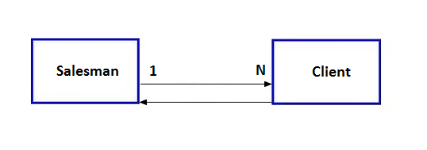

# Cardinalidade

## Conteúdo

 - [01 - Cardinalidade 1:1](#01)
 - [02 - Cardinalidade 1:N](#02)
 - [03 - Cardinalidade N:M](#03)
 - [04 - Cardinalidade - Mínimo e Máximo](#min-max)

---

## 01 - Cardinalidade 1:1

A **cardinalidade 1:1** indica que uma ocorrência da **Entidade A** pode se relacionar exclusivamente com uma ocorrência da **Entidade B** e vice-versa.

Por exemplo:

> Um vendedor ocupa um único escritório e um escritório pode ser ocupado por apenas um único vendedor (Isso é só um exemplo é claro).

  

---

## 02 - Cardinalidade 1:N

Em um relacionamento **(1:N)** uma ocorrência da **Entidade A** pode se relacionar com várias ocorrências da **Entidade B**, porém, `o inverso não é permitido`.

Por exemplo:

> Um vendedor atende muitos clientes, porém, cada cliente tem um vendedor específico (Isso é só um exemplo é claro).

---

## 03 - Cardinalidade N:M

Em um relacionamento binário **muitos-para-muitos (N:M)** uma ocorrência da **Entidade A** pode se relcionar com muitas ocorrências da **Entidade B** e vice-versa.

Por exemplo:

> Um vendedor atende muitos clientes, e um cliente pode ser atendido por diversos vendedores.

**NOTE:**  
Na prática, o relacionamento **(N:M)** é dividido em **duas relações 1:N** e uma nova entidade é criada para representar o relacionamento.

Veja o exemplo abaixo:

  

---

## 04 - Cardinalidade - Mínimo e Máximo

O **mínimo** e **máximo** de uma *cardinalidade* está relacionado ao tamanho da relação entre duas **Entidades A** e **B**.

Por exemplo:

  

Veja que na imagem acima:

 - **um Funcionário:**
   - Tem que trabalhar no mínimo em 1 departamento;
   - E pode trabalhar em vários departamentos.
 - **Um Departamento:**
   - Pode ter nenhum funcionário (zero/0);
   - Ou vários funcionários.

---

**REFERENCES:**  
[My graduation in Analysis and Systems Development](https://www.uninassau.digital/)
