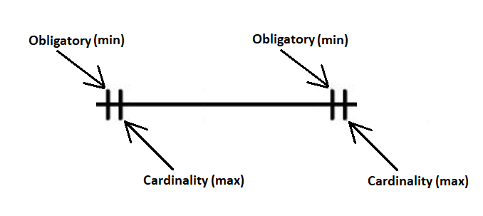
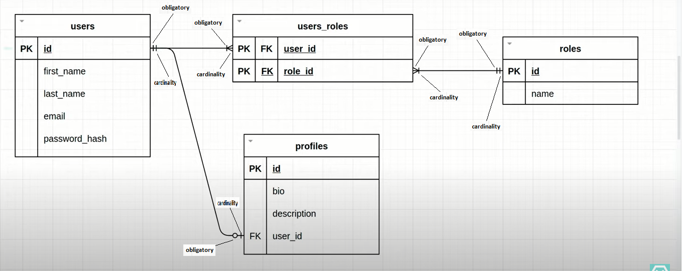
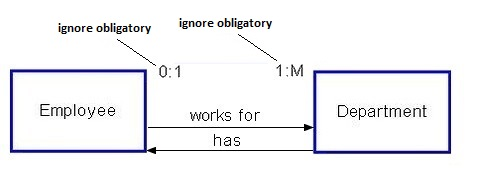

# Relationship & Cardinality

## Contents

 - [Obligatory (Obrigatoriedade) & Cardinality](#intro)
 - [Reading relationship cardinality](#reading-cardinality)
 - [One to One](#one-to-one)
 - [One to Many](#one-to-many)
 - [Many to One](#many-to-one)
 - [Many to Many](#many-to-many)
 - [Cardinality Notations (examples)](#examples)

---

## Obligatory (Obrigatoriedade) & Cardinality

Before starting with database cardinality, let's understand some concepts. First, see the image below:

  

See that:

 - **The first trace:**
   - Always represent the "obligatory".
 - **the second trace:**
   - Always represent the "cardinality".

For example, see the image below to understand more easily:

  

**NOTE:**  
See we have different **obligatory** and **cardinality**. For example, the tables **users** and **profiles**:

  

> **NOTE:**  
> **users** and **profiles** have different <u>obligatory</u>:
> - **users** table <u>obligatory</u> need minimum one (1) user.
> - **profiles** table <u>no obligatory</u> need minimum one (can be zero | 0) profile.

There a numeric approach to represent that **obligatory** and **cardinality**:

  

**NOTE:**  
See we have the same representation, however, using numbers.

---

## Reading relationship cardinality

To read **relationship cardinality** between tables first we <u>ignore obligatory in the tables</u> and <u>only focus in tables cardinalities</u>.

For example, see the **relationship cardinality** between **Employee** and **Departament** tables:

Ignoring obligatory in the tables, we have:

 - **The Employee can work (relationship) for many departments:**
   - one-to-many.
 - **Many Departments can have (relationship) one Employee:**
   - many-to-one

---

## One to One

A relationship between a **husband** and **wife** can be considered as <u>one to one</u>, where:

 - The <u>entities</u> are **Husband** and **Wife**.
 - And the <u>relationship</u> is **Marriage**.

> **NOTE:**  
> This means, if you put this information in a DBMS table, a particular row of one table only associates itself with single and unique row of another table.

For example, see the image below to understand more easily:

  

---

## One to Many

A relationship between a **Company (1)** and **Employees (n)** can be considered as <u>one to many</u>, where:

 - The <u>entities</u> are **company** and **employees**.
 - And the <u>relationship</u> is **pays**.

> **NOTE:**  
> This means, if you put this information in a DBMS table, a particular row of one table associates itself with multiple rows of another table.

For example, see the image below to understand more easily:

  

---

## Many to One

A relationship between a **Students** and **University** can be considered as <u>many to one</u>, where:

 - The <u>entities</u> are **Students** and **University**.
 - And the <u>relationship</u> is study.

> **NOTE:**  
> This means, if you put this information in a DBMS table, multiple rows of student table associates itselves with single row of University table.

For example, see the image below to understand more easily:

  

---

## Many to Many

A relationship between a **students** and **courses** can be considered as <u>many to many</u>, where:

 - The <u>entities</u> are **students** and **courses**.
 - And the <u>relationship</u> is enroll.

> **NOTE:**  
> This means, if you put this information in a DBMS table, a multiple rows of one table associates itself with multiple rows of another table.

For example, see the image below to understand more easily:

  

---

## Cardinality Notations (examples)

**Example-01:**  
  

**Example-02:**  
  

**Example-03:**  
  

---

**REFERENCES:**  
[Relacionamentos One-to-one, One-to-many e Many-to-many - Curso de SQL com MySQL - Aula 2](https://www.youtube.com/watch?v=4v-SzrpC738&list=PLbIBj8vQhvm2WT-pjGS5x7zUzmh4VgvRk&index=4)  
[Cardinality Relationship for Data Models](https://prepinsta.com/dbms/relationship-cardinality/)  

---

Ro**drigo** **L**eite da **S**ilva - **drigols**
