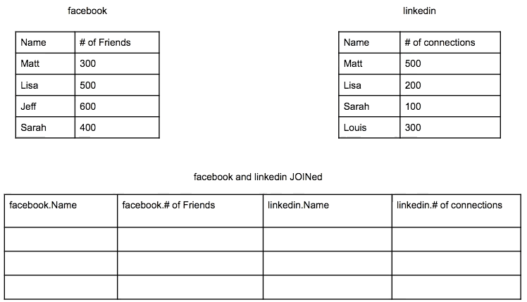
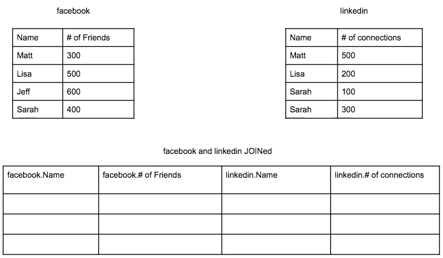
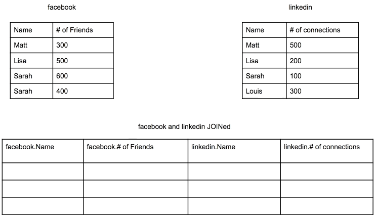
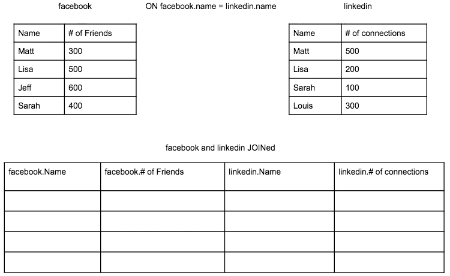
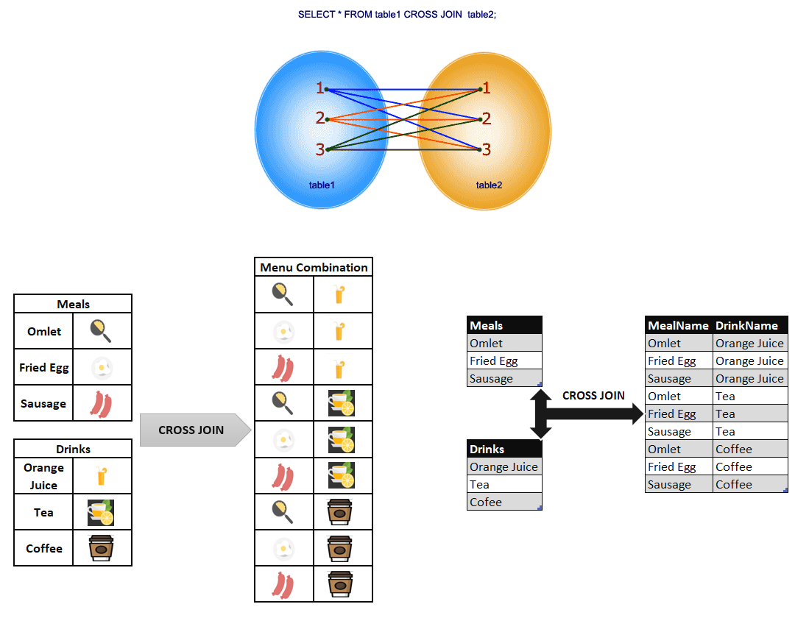
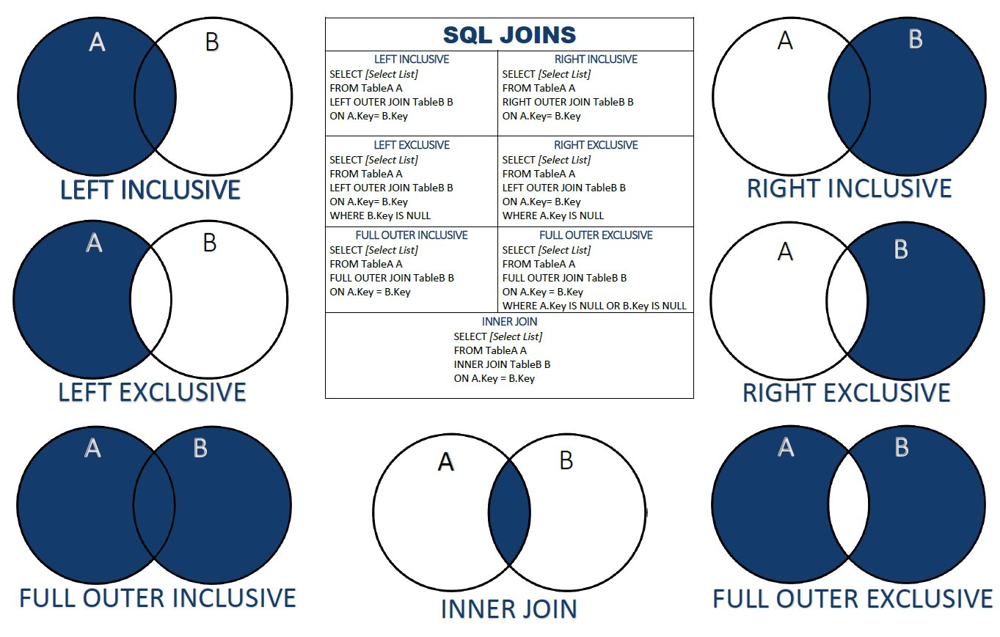

# Database (Theory and Practice)

## Contents

 - **Database Components:**
   - [Entity (Table)](#introtoentity)
     - [Table naming (Singular vs. Plural)](#table-naming)
   - [Attributes](#introtoattributes)
   - [Record/Row (Registro)](#introtorecord)
 - [**JOIN Clauses:**](#introtojoin)
   - [INNER JOIN](#inner-join)
   - [NATURAL JOIN](#natural-join)
   - [LEFT JOIN](#left-join)
   - [RIGHT JOIN](#right-join)
   - [FULL OUTER JOIN](#full-outer-join)
   - [CROSS JOIN](#cross-join)
   - [JOIN VENN DIAGRAM](#join-ven-diagram)
 - **PostgreSQL:**
   - [**PostgreSQL Settings**](#postgresql-settings)
   - **Useful Commands:**
     - [`List databases (\l or \list)`](#list-databases)
     - [`Connect to a database (\c or \connect)`](#connect-database)
     - [`Display Tables (\dt or \dt+)`](#display-tables)
   - **CRUD (Create, Read, Update, Delete):**
     - **CREATE:**
       - [`CREATE DATABASE`](#create-database)
       - [`CREATE TABLE`](#create-table)
     - **READ:**
     - **UPDATE:**
     - **DELETE:**
       - [`DROP DATABASE`](#drop-database)
       - [`DROP TABLE`](#drop-table)
 - **Interview (Q&A):**
   - **Select:**
     - [Recyclable and Low Fat Products (LeetCode 1757)](#leetcode-1757)
   - **Join:**
   - **Aggregation Functions:**
   - **Sorting and Grouping:**
   - **Subqueries:**
   - **Advanced String Functions / Regex / Clauses:**
 - [**Database (Old Studies)**](https://github.com/rodrigols89/studies/tree/old-studies/modules/old-studies/database-theory-and-practice)
 - [**REFERENCES**](#ref)
<!--- 
[WHITESPACE RULES]
- Same topic = "20" Whitespace character.
- Different topic = "50" Whitespace character.
--->


<!--- ( Database Components/Entity ) --->

---

<div id="introtoentity"></div>

## Entity (Table)

A *database* **Entity** can be anything that exists in the real world such as:

 - A person;
 - A book;
 - A product;
 - A company;
 - A event....

> **NOTE:**  
> **Entities** are represented by `tables` in a Database.

For example:

  

---

<div id="table-naming"></div>

## Table naming (Singular vs. Plural)

Narayana “Vyas” Kondreddi (long-time DBA and SQL Engineer) wrote back in 2001:

**Tables represent the instances of an entity:**  
 - For example, you store all your **customer** information in a table:
   - Here, **‘customer’** is an entity;
   - And all the **rows in the customers** table **represent the instances** of the entity **‘customer’**.

**Answer:**  
 - So, why not name your table using the entity it represents, ‘Customer’. Since the table is storing `‘multiple instances’` of customers, make your table name a plural word.
 - It feels logical, and somewhat *“natural”*. You store several customers inside a table (those `“multiple instances”`), so the table should naturally be names ***customers***.

It also makes sense when writing an SQL statement. When you want to go through all your customers, you:

```sql
SELECT * FROM customers
```

**NOTE:**  
When using plural name, one can consider a table like a crate (caixa) containing several items. A crate (caixa) of apples should be labelled Apples, whether it contains one or a hundred apples.

### My personal analysis

My personal analysis is the following... Imagine you have the entity **Users**:

> **NOTE:**  
> **Users table** can have on or many registers.

If I use the following select query:

```sql
SELECT id, name
FROM users;
```

**NOTE:**  
Even though the "Users" table has a single record. This entity (Users) represents a set of users that can have multiple rows.


<!--- ( Database Components/Attributes ) --->

---

<div id="introtoattributes"></div>

## Attributes

 - In the real world, almost everything has certain characteristics.
 - In databases, the characteristics are represented by attributes.

For example, a `person entity` may have attributes such as:

 - name;
 - surname;
 - age;
 - contact information;
 - address...

For example:

  


<!--- ( Database Components/Record ) --->

---

<div id="introtorecord"></div>

## Record/Row (Registro)

> A **Record** is a group of data saved in a table.

It is a set of fields, like an employee’s job record as shown below:


Let's see a more complete example:

  


<!--- ( JOIN ) --->

---

<div id="introtojoin"></div>

## JOIN Clauses

 - An **SQL JOIN** clause `combines rows` from **two** or **more tables**.
 - It creates a set of rows in a **temporary table**.

For example, imagine you have two tables **faceboook** and **linkedin** and want to:

 - All rows from *faceboook* and *linkedin* tables;
 - All columns from *faceboook* and *linkedin* tables;
 - `WHERE (ON)` name (column value) in *faceboook* is the equal name (column value) in *linkedin*.

```sql
SELECT *
FROM facebook JOIN linkedin
ON facebook.name = linkedin.name;
```

  

See that:

 - Only **Matt** and **Lisa** have the same name in both tables.
 - **Comparation Process:**
   - First, the first row (name) from the first table (facebook) is compared with each row (name) in the second table.
   - Next, the second row (name) from the first table (facebook) is compared with each row (name) in the second table (linkedin).
   - Next, the third row (name) from the first table (facebook) is compared with each row (name) in the second table (linkedin).
   - **NOTE:** This process repeats itself until the end...


<!--- ( JOIN/INNER JOIN ) --->

---

<div id="inner-join"></div>

## INNER JOIN

> The **INNER JOIN** is the default type of **JOIN** in SQL.

 - In fact you do not even need to specify **INNER JOIN** when writing a query.
 - Only writing **JOIN** is an **INNER JOIN**.

**NOTE:**  
Another thing you need to know is that **INNER JOIN** is equivalent to `Intersection` in **set theory**:

  

**Another thing to consider is that SQL will join the rows every time there is a "match":**  
So if your data in the columns you are joining on are not unique you will get **duplicate** data in the final table.

For example, let's see a non Unique data in second table:

```sql
SELECT *
FROM facebook INNER JOIN linkedin
ON facebook.name = linkedin.name;
```

  

Now, let's see a non Unique data in first table:

  

> **NOTE:**  
> If you are not interested in *duplicate rows* you have to handle this in your "query".


<!--- ( JOIN/NATURAL JOIN ) --->

---

<div id="natural-join"></div>

## NATURAL JOIN

> Use **NATURAL JOIN** when you want to `combine tables "based" on columns of the same name and type`, `without having to specify join conditions`.

For example:

  

See that:

 - The column with the same name and type is `COMPANY_ID`.
 - Then we take the other non-common columns from the other tables:
   - First table non-common columns: `ITEM_ID`, `ITEM_NAME`, `ITEM_UNIT`.
   - Second table non-common columns: `COMPANY_ID`, `COMPANY_NAME`, `COMPANY_CITY`.
 - Finally we join all the columns with the `COMPANY_ID` column as a column with the same name and type in common. 

The SQL to do that is:

**INPUT:**  
```sql
SELECT *
FROM foods NATURAL JOIN company;
```

**OUTPUT:**  
```sql
+------------+---------+--------------+-----------+---------------+--------------+
| company_id | item_id | item_name    | item_unit | company_name  | company_city |
+------------+---------+--------------+-----------+---------------+--------------+
|         16 |       1 | Chex Mix     | Pcs       | Akas Foods    | Delhi        |
|         15 |       2 | BN Biscuit   | Pcs       | Jack Hill Ltd | London       |
|         17 |       3 | Mighty Munch | Pcs       | Foodies       | London       |
|         15 |       4 | Pot Rice     | Pcs       | Jack Hill Ltd | London       |
|         18 |       5 | Jaffa Cakes  | Pcs       | Order All     | Boston       |
|         15 |       6 | Cheez-It     | Pcs       | Jack Hill Ltd | London       |
+------------+---------+--------------+-----------+---------------+--------------+
```


<!--- ( JOIN/LEFT JOIN ) --->

---

<div id="left-join"></div>

## LEFT JOIN

> *LEFT refers to the first table*, or *the table you will be joining to*.

For example, see the image (Veen Diagram) below to understand more easily:

  

See that:

 - We get all the data (rows) that belongs to the first table (set).
 - We get the data (rows) that *simultaneously belongs (intersection)* both tables (sets).
 - **NOTE:** But we do not get the data (rows) that belong only to the second table (set).

For example:

```sql
SELECT *
FROM facebook LEFT JOIN linkedin
ON facebook.name = linkedin.name;
```

  

> **NOTE:**  
> See that **Louis** in second table was ignored because only appears in the second table.


<!--- ( JOIN/RIGHT JOIN ) --->

---

<div id="right-join"></div>

## RIGHT JOIN

> SQL **RIGHT JOIN** is opposite to the **LEFT JOIN**.

For example, see the image (Veen Diagram) below to understand more easily:

  

Let's see a **RIGHT JOIN** example:

```sql
SELECT *
FROM facebook RIGHT JOIN linkedin
ON facebook.name = linkedin.name;
```

  

> **NOTE:**  
> See that now **Jeff** in the first table was ignored because only appears in the first table (LEFT).


<!--- ( JOIN/FULL OUTER JOIN ) --->

---

<div id="full-outer-join"></div>

## FULL OUTER JOIN

> The **FULL OUTER JOIN** combines the results of both LEFT and RIGHT outer joins and returns all (matched or unmatched) rows from the tables on both sides of the join clause.

For example, see the image (Veen Diagram) below to understand more easily:

  


<!--- ( JOIN/CROSS JOIN ) --->

---

## CROSS JOIN

> Use **CROSS JOIN** when you want to combine all the rows from *two* or *tables*, forming the `Cartesian Product` between them.

For example, see the images below to understand more easily:

  


<!--- ( JOIN/JOIN VENN DIAGRAM ) --->

---

<div id="join-ven-diagram"></div>

## JOIN VENN DIAGRAM

  


<!--- ( PostgreSQL/Settings ) --->

---

## <div id="postgresql-settings"></div>

## PostgreSQL Settings

**Run docker compose:**
```bash
sudo docker compose up -d
```

**Enter the container:**
```bash
sudo docker exec -it postgres-container bash
```

**Enter the psql:**
```bash
psql -h localhost -U postgres
```

**Exit from the psql:**
```bash
exit
```


<!--- ( PostgreSQL/Useful Commands ) --->

---

<div id="list-databases"></div>

## `List databases (\l or \list)`

To list all databases in Postgres using **psql**, you can use the **"\l"** or **"\list"** command.

 - The database name.
 - The owner of the database.
 - The encoding for the database.
 - The collation for the database.

For example:

**INTPUT:**  
```bash
\l
```

**OUTPUT:**  
```bash
   Name    | Owner | Encoding |  Collate   |   Ctype    | ICU Locale | Locale Provider | Access privileges 
-----------+-------+----------+------------+------------+------------+-----------------+-------------------
 postgres  | root  | UTF8     | en_US.utf8 | en_US.utf8 |            | libc            | 
 root      | root  | UTF8     | en_US.utf8 | en_US.utf8 |            | libc            | 
 template0 | root  | UTF8     | en_US.utf8 | en_US.utf8 |            | libc            | =c/root          +
           |       |          |            |            |            |                 | root=CTc/root
 template1 | root  | UTF8     | en_US.utf8 | en_US.utf8 |            | libc            | =c/root          +
           |       |          |            |            |            |                 | root=CTc/root
(4 rows)
```

---

<div id="connect-database"></div>

## `Connect to a database (\c or \connect)`

To connect to a existing database, you can use the `\c` or `\connect` command:

**INTPUT:**  
```bash
\c mydb
```

**OUTPUT:**  
```bash
You are now connected to database "mydb" as user "root".
```

---

<div id="display-tables"></div>

## `Display Tables (\dt or \dt+)`

To list all tables in a database, we can use the `\dt (display tables)` or `\dt+` command:

**INTPUT:**
```bash
\dt+
```

**OUTPUT:**
```bash
                                      List of relations
 Schema |  Name   | Type  |  Owner   | Persistence | Access method |    Size    | Description 
--------+---------+-------+----------+-------------+---------------+------------+-------------
 public | student | table | postgres | permanent   | heap          | 8192 bytes | 
(1 row)
```

> **NOTE:**
> The command `\dt+` will also display the size of each table.


<!--- ( PostgreSQL/CRUD/CREATE ) --->

---

<div id="create-database"></div>

## `CREATE DATABASE`

To create a database, we can use the `CREATE DATABASE dbname;` statement:

**INTPUT:**  
```bash
CREATE DATABASE dbname;
```

**OUTPUT:**  
```bash
CREATE DATABASE
```

---

<div id="create-table"></div>

## `CREATE TABLE`

To create a table, we can use the `CREATE TABLE table_name (column1 datatype, column2 datatype, ...);` statement:

**EXAMPLE:**  
```
CREATE TABLE Student(
    id int,
    name text,
    age int,
    address char(30)
);
```

**OUTPUT:**  
```
CREATE TABLE
```


<!--- ( PostgreSQL/CRUD/READ ) --->
<!--- ( PostgreSQL/CRUD/UPDATE ) --->


<!--- ( PostgreSQL/CRUD/DELETE ) --->

---

<div id="drop-database"></div>

## `DROP Database`

To delete a database, we can use the **DROP DATABASE** command:

**INTPUT:**
```bash
DROP DATABASE IF EXISTS dbname;
```

**OUTPUT:**
```bash
DROP DATABASE
```

**WITH (FORCE):**  
The **WITH (FORCE)** option is available in PostgreSQL version 13 and higher. The **DROP DATABASE** method won't remove the database if it's in use. If the database is in use, the terminal prints an error that a database session is open.

Add the **WITH (FORCE)** option to forcefully close the session and delete the database:

**INTPUT:**
```bash
DROP DATABASE IF EXISTS dbname WITH (FORCE);
```

**OUTPUT:**  
```bash
DROP DATABASE
```

---

<div id="drop-table"></div>

## `DROP TABLE`

To understand how to delete a table, let's imagine we have the following table:

```bash
          List of relations
 Schema |  Name   | Type  |  Owner   
--------+---------+-------+----------
 public | student | table | postgres
```

Now, to delete the table, we can use the **DROP TABLE** command following the syntax:

**INTPUT:**
```bash
DROP TABLE IF EXISTS schema_name."table_name";
```

For example, for our `student` table, we can use the following command:

**INTPUT:**
```bash
DROP TABLE IF EXISTS public."student";
```

**OUTPUT:**
```bash
DROP TABLE
```


<!--- ( Interview (Q&A)/Select ) --->

---

<div id="leetcode-1757"></div>

## Recyclable and Low Fat Products (LeetCode 1757)

Imagine we have the following table:

```sql
+-------------+---------+
| Column Name | Type    |
+-------------+---------+
| product_id  | int     |
| low_fats    | enum    |
| recyclable  | enum    |
+-------------+---------+
```

Where:

 - The `product_id` is the *primary key (column with unique values)* for this table.
 - The `low_fats` is an *ENUM (category)* of type ('Y', 'N') Where:
   - `Y` means this product is low fat.
   - `N` means it is not.
 - The `recyclable` is an *ENUM (category)* of types ('Y', 'N') where:
   - `Y` means this product is recyclable.
   - `N` means it is not recyclable.

**QUESTIONS:**  
Write a solution to find the ids of products that are both *"low fat"* and *"recyclable"*.

**EXAMPLE:**
```sql
Input: Products table
+-------------+----------+------------+
| product_id  | low_fats | recyclable |
+-------------+----------+------------+
| 0           | Y        | N          |
| 1           | Y        | Y          |
| 2           | N        | Y          |
| 3           | Y        | Y          |
| 4           | N        | N          |
+-------------+----------+------------+

Output: 
+-------------+
| product_id  |
+-------------+
| 1           |
| 3           |
+-------------+

Explanation: Only products 1 and 3 are both low fat and recyclable.
```

**MY SOLUTION = 335ms:**
```sql
SELECT product_id
FROM Products
WHERE low_fats = 'Y' AND recyclable = 'Y';
```

<!--- ( Interview (Q&A)/Join ) --->
<!--- ( Interview (Q&A)/Aggregation Functions) --->
<!--- ( Interview (Q&A)/Sorting and Grouping ) --->
<!--- ( Interview (Q&A)/Subqueries ) --->
<!--- ( Interview (Q&A)/Advanced String Functions / Regex / Clause ) --->


<!--- ( REFERENCES ) --->

---

<div id="ref"></div>

## REFERENCES

 - **General:**
   - [Google Gemini](https://gemini.google.com/app)
   - [ChatGPT](https://chatgpt.com/)
 - **Database Components:**
   - [The table naming dilemma: singular vs. plural](https://medium.com/@fbnlsr/the-table-naming-dilemma-singular-vs-plural-dc260d90aaff)

---

**Rodrigo** **L**eite da **S**ilva
