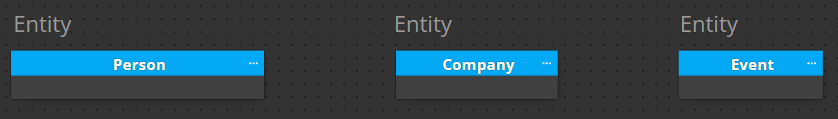
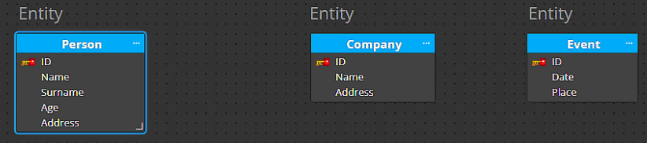
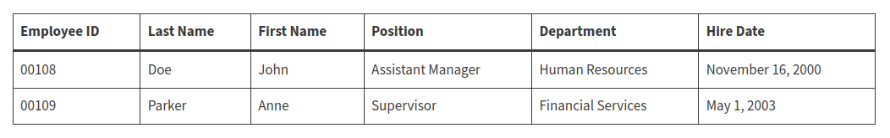

# Database (Theory and Practice)

## Contents

 - **Database Components:**
   - [Entity (Table)](#introtoentity)
     - [Table naming (Singular vs. Plural)](#table-naming)
   - [Attributes](#introtoattributes)
   - [Record/Row (Registro)](#introtorecord)
 - **PostgreSQL:**
   - [**PostgreSQL Settings**](#postgresql-settings)
   - **Useful Commands:**
     - [`List databases (\l or \list)`](#list-databases)
     - [`Connect to a database (\c or \connect)`](#connect-database)
     - [`Display Tables (\dt or \dt+)`](#display-tables)
   - **CRUD (Create, Read, Update, Delete):**
     - **CREATE:**
       - [`CREATE DATABASE`](#create-database)
       - [`CREATE TABLE`](#create-table)
     - **READ:**
     - **UPDATE:**
     - **DELETE:**
       - [`DROP DATABASE`](#drop-database)
       - [`DROP TABLE`](#drop-table)
 - **Interview (Q&A):**
   - **Select:**
     - [Recyclable and Low Fat Products (LeetCode 1757)](#leetcode-1757)
   - **Join:**
   - **Aggregation Functions:**
   - **Sorting and Grouping:**
   - **Subqueries:**
   - **Advanced String Functions / Regex / Clauses:**
 - [**Database (Old Studies)**](https://github.com/rodrigols89/studies/tree/old-studies/modules/old-studies/database-theory-and-practice)
 - [**REFERENCES**](#ref)
<!--- 
[WHITESPACE RULES]
- Same topic = "20" Whitespace character.
- Different topic = "50" Whitespace character.
--->


<!--- ( Database Components/Entity ) --->

---

<div id="introtoentity"></div>

## Entity (Table)

A *database* **Entity** can be anything that exists in the real world such as:

 - A person;
 - A book;
 - A product;
 - A company;
 - A event....

> **NOTE:**  
> **Entities** are represented by `tables` in a Database.

For example:

  

---

<div id="table-naming"></div>

## Table naming (Singular vs. Plural)

Narayana “Vyas” Kondreddi (long-time DBA and SQL Engineer) wrote back in 2001:

**Tables represent the instances of an entity:**  
 - For example, you store all your **customer** information in a table:
   - Here, **‘customer’** is an entity;
   - And all the **rows in the customers** table **represent the instances** of the entity **‘customer’**.

**Answer:**  
 - So, why not name your table using the entity it represents, ‘Customer’. Since the table is storing `‘multiple instances’` of customers, make your table name a plural word.
 - It feels logical, and somewhat *“natural”*. You store several customers inside a table (those `“multiple instances”`), so the table should naturally be names ***customers***.

It also makes sense when writing an SQL statement. When you want to go through all your customers, you:

```sql
SELECT * FROM customers
```

**NOTE:**  
When using plural name, one can consider a table like a crate (caixa) containing several items. A crate (caixa) of apples should be labelled Apples, whether it contains one or a hundred apples.

### My personal analysis

My personal analysis is the following... Imagine you have the entity **Users**:

> **NOTE:**  
> **Users table** can have on or many registers.

If I use the following select query:

```sql
SELECT id, name
FROM users;
```

**NOTE:**  
Even though the "Users" table has a single record. This entity (Users) represents a set of users that can have multiple rows.


<!--- ( Database Components/Attributes ) --->

---

<div id="introtoattributes"></div>

## Attributes

 - In the real world, almost everything has certain characteristics.
 - In databases, the characteristics are represented by attributes.

For example, a `person entity` may have attributes such as:

 - name;
 - surname;
 - age;
 - contact information;
 - address...

For example:

  


<!--- ( Database Components/Record ) --->

---

<div id="introtorecord"></div>

## Record/Row (Registro)

> A **Record** is a group of data saved in a table.

It is a set of fields, like an employee’s job record as shown below:



Let's see a more complete example:

  


<!--- ( PostgreSQL/Settings ) --->

---

## <div id="postgresql-settings"></div>

## PostgreSQL Settings

**Run docker compose:**
```bash
sudo docker compose up -d
```

**Enter the container:**
```bash
sudo docker exec -it postgres-container bash
```

**Enter the psql:**
```bash
psql -h localhost -U postgres
```

**Exit from the psql:**
```bash
exit
```


<!--- ( PostgreSQL/Useful Commands ) --->

---

<div id="list-databases"></div>

## `List databases (\l or \list)`

To list all databases in Postgres using **psql**, you can use the **"\l"** or **"\list"** command.

 - The database name.
 - The owner of the database.
 - The encoding for the database.
 - The collation for the database.

For example:

**INTPUT:**  
```bash
\l
```

**OUTPUT:**  
```bash
   Name    | Owner | Encoding |  Collate   |   Ctype    | ICU Locale | Locale Provider | Access privileges 
-----------+-------+----------+------------+------------+------------+-----------------+-------------------
 postgres  | root  | UTF8     | en_US.utf8 | en_US.utf8 |            | libc            | 
 root      | root  | UTF8     | en_US.utf8 | en_US.utf8 |            | libc            | 
 template0 | root  | UTF8     | en_US.utf8 | en_US.utf8 |            | libc            | =c/root          +
           |       |          |            |            |            |                 | root=CTc/root
 template1 | root  | UTF8     | en_US.utf8 | en_US.utf8 |            | libc            | =c/root          +
           |       |          |            |            |            |                 | root=CTc/root
(4 rows)
```

---

<div id="connect-database"></div>

## `Connect to a database (\c or \connect)`

To connect to a existing database, you can use the `\c` or `\connect` command:

**INTPUT:**  
```bash
\c mydb
```

**OUTPUT:**  
```bash
You are now connected to database "mydb" as user "root".
```

---

<div id="display-tables"></div>

## `Display Tables (\dt or \dt+)`

To list all tables in a database, we can use the `\dt (display tables)` or `\dt+` command:

**INTPUT:**
```bash
\dt+
```

**OUTPUT:**
```bash
                                      List of relations
 Schema |  Name   | Type  |  Owner   | Persistence | Access method |    Size    | Description 
--------+---------+-------+----------+-------------+---------------+------------+-------------
 public | student | table | postgres | permanent   | heap          | 8192 bytes | 
(1 row)
```

> **NOTE:**
> The command `\dt+` will also display the size of each table.


<!--- ( PostgreSQL/CRUD/CREATE ) --->

---

<div id="create-database"></div>

## `CREATE DATABASE`

To create a database, we can use the `CREATE DATABASE dbname;` statement:

**INTPUT:**  
```bash
CREATE DATABASE dbname;
```

**OUTPUT:**  
```bash
CREATE DATABASE
```

---

<div id="create-table"></div>

## `CREATE TABLE`

To create a table, we can use the `CREATE TABLE table_name (column1 datatype, column2 datatype, ...);` statement:

**EXAMPLE:**  
```
CREATE TABLE Student(
    id int,
    name text,
    age int,
    address char(30)
);
```

**OUTPUT:**  
```
CREATE TABLE
```


<!--- ( PostgreSQL/CRUD/READ ) --->
<!--- ( PostgreSQL/CRUD/UPDATE ) --->


<!--- ( PostgreSQL/CRUD/DELETE ) --->

---

<div id="drop-database"></div>

## `DROP Database`

To delete a database, we can use the **DROP DATABASE** command:

**INTPUT:**
```bash
DROP DATABASE IF EXISTS dbname;
```

**OUTPUT:**
```bash
DROP DATABASE
```

**WITH (FORCE):**  
The **WITH (FORCE)** option is available in PostgreSQL version 13 and higher. The **DROP DATABASE** method won't remove the database if it's in use. If the database is in use, the terminal prints an error that a database session is open.

Add the **WITH (FORCE)** option to forcefully close the session and delete the database:

**INTPUT:**
```bash
DROP DATABASE IF EXISTS dbname WITH (FORCE);
```

**OUTPUT:**  
```bash
DROP DATABASE
```

---

<div id="drop-table"></div>

## `DROP TABLE`

To understand how to delete a table, let's imagine we have the following table:

```bash
          List of relations
 Schema |  Name   | Type  |  Owner   
--------+---------+-------+----------
 public | student | table | postgres
```

Now, to delete the table, we can use the **DROP TABLE** command following the syntax:

**INTPUT:**
```bash
DROP TABLE IF EXISTS schema_name."table_name";
```

For example, for our `student` table, we can use the following command:

**INTPUT:**
```bash
DROP TABLE IF EXISTS public."student";
```

**OUTPUT:**
```bash
DROP TABLE
```


<!--- ( Interview (Q&A)/Select ) --->

---

<div id="leetcode-1757"></div>

## Recyclable and Low Fat Products (LeetCode 1757)

Imagine we have the following table:

```sql
+-------------+---------+
| Column Name | Type    |
+-------------+---------+
| product_id  | int     |
| low_fats    | enum    |
| recyclable  | enum    |
+-------------+---------+
```

Where:

 - The `product_id` is the *primary key (column with unique values)* for this table.
 - The `low_fats` is an *ENUM (category)* of type ('Y', 'N') Where:
   - `Y` means this product is low fat.
   - `N` means it is not.
 - The `recyclable` is an *ENUM (category)* of types ('Y', 'N') where:
   - `Y` means this product is recyclable.
   - `N` means it is not recyclable.

**QUESTIONS:**  
Write a solution to find the ids of products that are both *"low fat"* and *"recyclable"*.

**EXAMPLE:**
```sql
Input: Products table
+-------------+----------+------------+
| product_id  | low_fats | recyclable |
+-------------+----------+------------+
| 0           | Y        | N          |
| 1           | Y        | Y          |
| 2           | N        | Y          |
| 3           | Y        | Y          |
| 4           | N        | N          |
+-------------+----------+------------+

Output: 
+-------------+
| product_id  |
+-------------+
| 1           |
| 3           |
+-------------+

Explanation: Only products 1 and 3 are both low fat and recyclable.
```

**MY SOLUTION = 335ms:**
```sql
SELECT product_id
FROM Products
WHERE low_fats = 'Y' AND recyclable = 'Y';
```


<!--- ( Interview (Q&A)/Join ) --->
<!--- ( Interview (Q&A)/Aggregation Functions) --->
<!--- ( Interview (Q&A)/Sorting and Grouping ) --->
<!--- ( Interview (Q&A)/Subqueries ) --->
<!--- ( Interview (Q&A)/Advanced String Functions / Regex / Clause ) --->


<!--- ( REFERENCES ) --->

---

<div id="ref"></div>

## REFERENCES

 - **General:**
   - [Google Gemini](https://gemini.google.com/app)
   - [ChatGPT](https://chatgpt.com/)
 - **Database Components:**
   - [The table naming dilemma: singular vs. plural](https://medium.com/@fbnlsr/the-table-naming-dilemma-singular-vs-plural-dc260d90aaff)

---

**Rodrigo** **L**eite da **S**ilva
