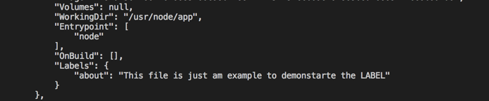

# Dockerfile

## Contents

 - [docker build](#build)
 - [docker build -f /path/to/a/Dockerfile .](#flag-f)
 - **Dockerfile Instructions:**
   - [FROM](#from)
   - [CMD](#cmd)
   - [ENTRYPOINT](#entrypoint)
   - [WORKDIR](#workdir)
   - [ENV](#env)
   - [COPY](#copy)
   - [ADD](#add)
   - [LABEL](#label)
   - [RUN](#run)
   - [EXPOSE](#expose)
   - [USER](#user)
   - [VOLUME](#volume)
   - [ONBUILD](#onbuild)

---

<div id="build"></div>

## docker build

The **docker build** command builds an image from a **Dockerfile** and a context. The build’s context is the set of files at a specified location **PATH** or **URL**.

 - The **PATH** is a directory on your local filesystem.
 - The **URL** is a Git repository location.

The **build context** is processed *recursively*. So, a **PATH** includes any subdirectories and the **URL** includes the repository and its submodules.

**CONSOLE:**
```python
docker build .
```

**NOTE:**  
This example above shows a build command that uses the current directory **(.)** as build context:

> **Warning:**
> Do not use your root directory, **/**, as the **PATH** for your build context, as it causes the build to transfer the entire contents of your hard drive to the Docker daemon.

---

<div id="flag-f"></div>

## docker build -f /path/to/a/Dockerfile .

Traditionally, the **Dockerfile** is called **Dockerfile** and located in the ***root of the context***. You use the **-f flag** with docker build to point to a Dockerfile anywhere in your file system:

**CONSOLE:**  
```python
sudo docker build -f /path/to/a/Dockerfile .
```

---

<div id="from"></div>

## FROM

> **FROM** is the first instruction in the Dockerfile. Without this, we can’t build an image. We can build the image just with this command.

There two approach to initialize images with FROM instruction:

 - Using ready images (base images).
 - Or creating your image [FROM scratch](https://docs.docker.com/develop/develop-images/baseimages/#create-a-simple-parent-image-using-scratch)

```python
# from base image node
FROM node:8.11-slim
```

```python
# from base image Java (JDK)
FROM openjdk
```

---

<div id="cmd"></div>

## CMD

> The **CMD** instruction is run just when the container is initialized **(created / docker run)**. That's, when the image is instantiated.

```python
FROM node:alpine

WORKDIR /usr/app

RUN npm init -y
RUN npm install cowsay
RUN npx cowsay Hello Rocketseat

RUN cat package.json

CMD npm start
```

**NOTE:**  
It doesn’t execute while build stage. For example:

**It does not work here:**  
```python
sudo docker build -f /path/to/a/Dockerfile .
```

**It works here:**  
```python
sudo docker run -t nodej/nodej
```

**NOTE:**  
Another observation here is that we can have only one **CMD** per Dockerfile, you can list multiple, but just the last one will be executed:

```python
FROM ubuntu:18.04
RUN apt-get update
RUN apt-get install openjdk-8-jdk -y
CMD touch first-file
CMD touch last-file
```

**NOTE:**  
In the example above just the last CMD instruction will be run.

---

<div id="entrypoint"></div>

## ENTRYPOINT

> The **ENTRYPOINT** instruction is used **as an executable** for the container.

Let’s look at the below example

```python
# from base image node
FROM node:8.11-slim

# command executable and version
CMD ["-v"]
ENTRYPOINT ["node"]
```

Now let's build and run the container:

```python
# build the image
docker build -t dockerfile3 -f Dockerfile3 .

# run the container
docker run -it dockerfile3
```

  

**NOTE:**  
See that as soon as we **initialize (create)** the container with the **run** command the ENTRYPOINT statement activated as a node executable.

---

<div id="workdir"></div>

## WORKDIR

> The **WORKDIR** instruction sets the working directory for all the consecutive instructions (CMD, RUN, ENTRYPOINT, ADD e COPY). 

For example, see Dockerfile example below:

```python
FROM node:alpine

WORKDIR /usr/app

COPY package.json ./

RUN npm install

CMD npm start
```

**NOTE:**  
Now, when we **initialize (create)** the container him go to directory /usr/app and copy (COPY instruction) from host package.json to current directory/context (usr/app). Another observation is that the follow instructions RUN and CMD will be executed in the current directory/context (usr/app).

**Multiples WORKDIR instructions:**  
We can have multiple WORKDIR instructions and will be appended with a relative path. For example:

```python
FROM ubuntu:18.04

RUN apt-get update
RUN ["apt-get", "install", "openjdk-8-jdk" ,"-y"]

WORKDIR /my-photos
COPY photo-01 photo-02

WORKDIR /usr/app
COPY package.json ./
RUN npm install
CMD npm start
```

**NOTE:**  
Now, each instruction have the context (current dir) to work.

---

<div id="env"></div>

## ENV

> The **ENV** instruction <u>sets the environment variables</u> for the subsequent instructions <u>in the build stage</u>.

To define ENV instructions we have two approaches:

**First Approach:**  
```python
# form1
ENV param value
```

**Second Approach:**  
```python
# form2
ENV param1=value1, param2=value2
```

Consider the below example where we define the environment variable **workdirectory** and we used that later with **$**.

```python
# from base image node
FROM node:8.11-slim

ENV workdirectory /usr/node

WORKDIR $workdirectory
WORKDIR app

RUN pwd

ENTRYPOINT ["node"]
```

---

<div id="copy"></div>

## COPY

> The **COPY**  is used to copy files or directories from source host filesystem to a destination in the container file system.

Consider this example where we are copying **package.json** from our system to container file system. We can verify that while building with the **RUN** instruction **ls -l**.

```python
# from base image node
FROM node:8.11-slim

ENV workdirectory /usr/node

WORKDIR $workdirectory
WORKDIR app

COPY package.json .

RUN ls -l
```

**NOTE:**  
The **dot ( . )** meaning get **package.json** from current directory.

---

<div id="add"></div>

## ADD

> The **ADD** instruction is to copy a **file**, **directory** or **even download a URL** from our host machine and place it inside the image in **docker build stage**.

The ADD instruction also has some interesting effects, such as:

 - If the file being passed is a **tar file**, it will automatically decompress it.
 - In addition to the aforementioned fact that it can download files via URLS.

**NOTE:**  
The **COPY** instruction only allows passing **files** or **directories**, unlike **ADD**, which allows downloads.

---

<div id="label"></div>

## LABEL

> LABEL is used to add some metadata to the image.

If we use the same label as the base image and the most recent label value is applied. For example:

```python
# from base image node
FROM node:8.11-slim

LABEL "about"="This file is just am example to demonstarte the LABEL"

ENV workdirectory /usr/node

WORKDIR $workdirectory
WORKDIR app

COPY package.json .

RUN ls -ll

# command executable and version
ENTRYPOINT ["node"]
```

**NOTE:**  
Now we can use the command **"docker image inspect Dockerfile"** to see the image label:

```python
// build the image
docker build -t dockerfile7 -f Dockerfile7 .

// inspect the image
docker image inspect dockerfile7
```

  

---

<div id="run"></div>

## RUN

> The **RUN** instruction can be run many times and is used at the time to build a container from Dockerfile.

```python
FROM ubuntu:18.04
RUN apt-get update
RUN apt-get install openjdk-8-jdk -y
```

**NOTE:**  
Now when I run the command `docker build .`, in addition to downloading the Ubuntu 18.04 image to put in my image, the build process will also run the commands to update the Ubuntu repositories through **apt-get update**, and to install Java 8 it will use **apt-get install openjdk-8-jdk-y**.

---

<div id="expose"></div>

## EXPOSE

> The **EXPOSE** instruction is used as documentation for the port. This is just a communication between the person who builds the image and the person who runs the container. 

**NOTE:**  
It doesn’t serve any other purpose other than documentation.

For example, we have used ***port 3070*** in the **index.js** file. So, we are letting people know who runs the container by using **EXPOSE** instruction in the Dockerfile:

```python
# from base image node
ARG NODE_VERSION=8.11-slim
FROM node:$NODE_VERSION

LABEL "about"="This file is just am example to demonstarte the LABEL"

ENV workdirectory /usr/node

WORKDIR $workdirectory
WORKDIR app

COPY package.json .

RUN ls -ll &&\
    npm install

ADD index.js .

RUN ls -l

EXPOSE 3070

# command executable and version
ENTRYPOINT ["node"]
```

---

<div id="user"></div>

## USER

> The **USER** instruction sets the user name and optionally the user group to use when running the image and for any instructions that follow it in the Dockerfile.

We can change the users to run the commands (instructions). In the example below I defined the ***user node*** to execute the commands and, as it does not need super user privileges (root), we can use user without so many privileges

```python
FROM node:alpine

USER node # Define use to run instructions.

RUN whoami # What user's.

WORKDIR /usr/app

COPY package.json ./

RUN npm install

CMD npm start
```

> **Warning:**  
> When the user doesn’t have a primary group then the image (or the next instructions) will be run with the root group.

---

<div id="volume"></div>

## VOLUME

> This **VOLUME** instruction creates a folder in our container that will be shared between the *container* and the **host**.
> VOLUME is used to create a **mount point** with the specified name. 

```
FROM ubuntu:18.04
RUN apt-get update
RUN apt-get install openjdk-8-jdk -y
VOLUME /foo
```

Now to see like it's works, let's go to the container:

  

---

<div id="onbuild"></div>

## ONBUILD

> The **ONBUILD** instruction adds to the image a ***trigger instruction*** to be executed at a later time, when the image is used as the base for another build. 

**Any build instruction can be registered as a trigger:**  
This is useful if you are building an image which will be used as a base to build other images, for example an application build environment or a daemon which may be customized with user-specific configuration.

> **Warning:**  
> Chaining ONBUILD instructions using ONBUILD ONBUILD isn’t allowed.

> **Warning:**  
> The ONBUILD instruction may not trigger FROM or MAINTAINER instructions.

---

**REFERENCES:**  
[Docker — A Beginner’s guide to Dockerfile with a sample project](https://medium.com/bb-tutorials-and-thoughts/docker-a-beginners-guide-to-dockerfile-with-a-sample-project-6c1ac1f17490)
[Dockerfile - Principais comandos para criar a receita da imagem](https://blog.rocketseat.com.br/dockerfile-principais-comandos-para-criar-a-receita-da-imagem/)
[Docker: Desvendando o DockerFile](https://www.alura.com.br/artigos/desvendando-o-dockerfile)  
[Dockerfile reference](https://docs.docker.com/engine/reference/builder/)  

---

**Rodrigo Leite -** *drigols*
