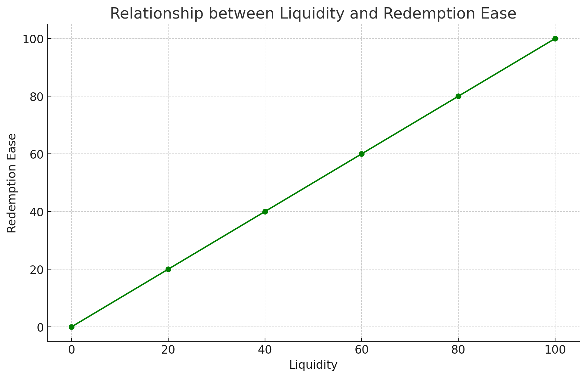
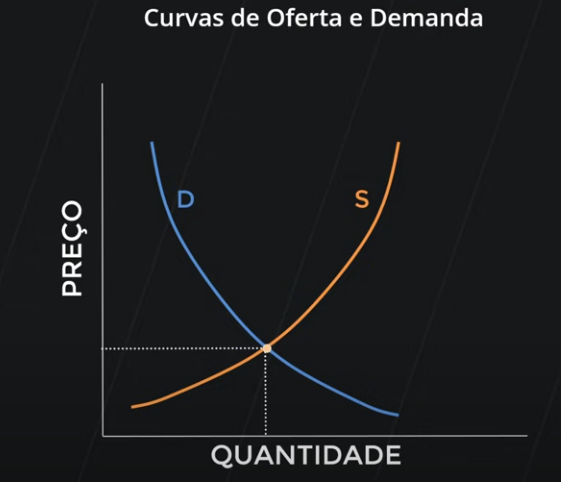
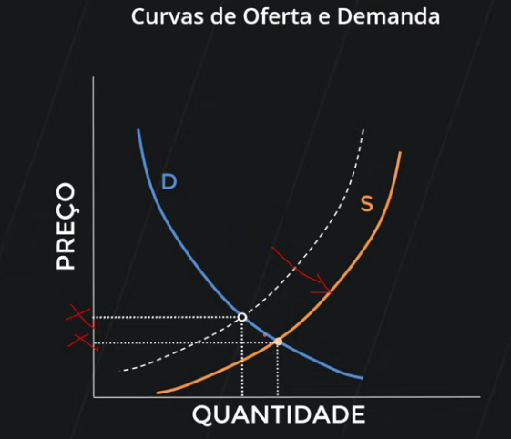
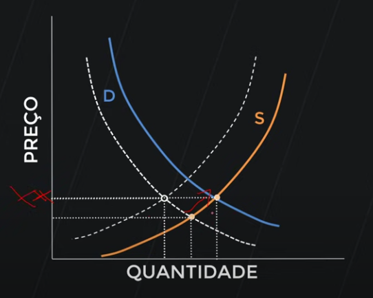

# Economics

## Contents

 - **Economics Concepts:**
   - [Liquidity](#intro-to-liquidity)
   - [Inflation and Deflation (PT-BR)](#inflation-deflation)
 - **Brazilian Economic System (Notes in Portuguese)**
 - [**REFERENCES**](#ref)
<!--- 
[WHITESPACE RULES]
- Same topic = "10" Whitespace character.
- Different topic = "50" Whitespace character.
--->

<!--- ( Economics Concepts/Liquidity ) --->

---

## Liquidity

> The term **"Liquidity"** is related to the speed and ease with which you can redeem (recover) the money from an investment.

 - The **higher** the liquidity, *the faster and easier the redemption (recovering)*.
 - The **lower** the liquidity, *the slower and more difficult the redemption (recovering)*.

For example, see the chart below to understand the relationship between the **"Liquidity"** and the redemption (recovering) speed:

 - **X-axis:** Liquidity (Liquidez).
 - **Y-axis:** Redemption Ease (Facilidade de Resgate).

  

> **NOTE:**  
> Note that the greater the *liquidity*, *the easier it is to redeem the amount invested*.

<!--- ( Economics Concepts/Inflation and Deflation ) --->

---

## Inflation and Deflation (PT-BR)

Segundo **Ludwig von Mises (Theory of Money and Credit)**:

 - **Inflação:**
   - É a perda do poder de compra do dinheiro.
 - **Deflação:**
   - É o aumento do poder de compra do dinheiro.

### Demanda (Demand) e Oferta (Supply)

Para entender melhor esses *conceitos (inflação e deflação)* vamos partir:

 - Do conceito de **Oferta (Supply=Fornecer)** e **Demanda (Demand)**.
 - E imaginar que temos um `bem/serviço em específico (petróleo no nosso caso)` que vai ser vendido:
   - Esse `bem/serviço (petróleo no nosso caso)` vai ter uma quandiade (eixo-x).
   - E um preço (eixo-y).

  

 - Vejam que o ponto equilíbrio do `bem/serviço (petróleo no nosso caso)` vai ser quando as linhas de **Demanda (Demand)** e **Oferta (Supply)** se cruzam. Ou seja:
   - Vamos ter o melhor preço do `bem/serviço (petróleo no nosso caso)`.
   - Para essa quantidade do `bem/serviço (petróleo no nosso caso)`.

> **O que acontece quando há uma maior Oferta (Supply) desse `bem/serviço (petróleo no nosso caso)`?**

  

**Vejam que há um *"novo preço de equilíbrio"* (o preço caiu!):**  
Isso porque existe mais pessoas (ou empresas) *ofertando (Supply)* esse `bem/serviço (petróleo no nosso caso)` do que é *demandando (Demand)*.

> **Ok, mas como aumentar o preço do bem/serviço (petróleo no nosso caso)?**  
> Para resolver esse problema nós teríamos que ter uma maior **demanda (demand)** desse `bem/serviço (petróleo no nosso caso)`.

Por exemplo:

  

**Vejam que agora nós temos um *"novo preço de equilíbrio"* (o preço subiu!):**  
Isso porque a **demanda (demand)** desse `bem/serviço (petróleo no nosso caso)` subiu.

### Inflação e Deflação

> O conceitos que nós apredemos (revisamos) acima de **Demanda (Demand)** e **Oferta (Supply)** também valem para o dinheiro.

Por exemplo, imagine que o gráfico abaixo representa a **Demanda (Demand)** e **Oferta (Supply)** do `dinheiro`:

  

No exemplo acima nós temos um ponto de equilíbrio do dinheiro.

> **O que acontece se há uma maior "Oferta (mais dinheiro circulando na economia)" desse dinheiro?**  
> Por exemplo, mais dinheiro foi injetado na economia pelo governo.

  

> **Vejam que o preço (ou valor) do dinheiro caiu!**  
> Isso é o que nós chamamos de `inflação (inflação)`.

Por outro lado, se a **demanda (demanda)** por dinheiro aumenta:

  

> **Vejam que o preço (ou valor) do dinheiro aumentou!**  
> Isso é o que chamamos de `deflação (deflação)`.

<!--- ( Brazilian Economic System (Notes in Portuguese) ) --->

<!--- ( REFERENCES ) --->

---

## REFERENCES

 - **Economics Concepts:**
   - [O que é inflação e deflação? (Fernando Ulrich)](https://www.youtube.com/watch?v=SaKZp44jzIw)

---

**Rodrigo** **L**eite da **S**ilva
