# Introdução à Eletricidade

## Conteúdo

 - [01 - Introdução aos Átomos](#01)
 - [02 - Estrutura de um Átomo](#02)
 - [03 - Tabela Periódica](#03)
 - [04 - Eletrização](#04)
 - [05 - Eletricidade](#05)
 - [06 - Circuito Elétrico](#06)
 - [07 - Corrente Elétrica](#07)
 - [08 - Materiais Condutores x Materiais Isolantes](#08)
 - [09 - Quantidade de Corrente Elétrica que passa por um Circuito ou Material](#09)

## 01 - Introdução aos Átomos

Para começar nossos estudos sobre **Eletricidade** vale lembrar que tudo no mundo é composto de **Átomos**. Isso mesmo, tudo. Por exemplo:

 - Carros são compostos de Átomos;
 - Animais são compostos de Átomos;
 - Nuvens são compostas de Átomos;
 - Os seres humanos são compostos de Átomos...

Sabendo disso suponha que nós queremos medir o tamanho de um **Átomo**. Para começar vamos pegar uma régua e reservar 1 centimétro:

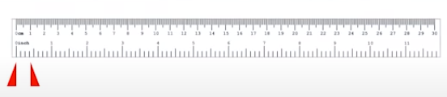  

1cm é pouco não acham? Mas se comparado com o tamanho de um **Átomo** issso ainda é muito grande. Então, agora vamos dividir esse 1cm por 10:

  

Ótimo, agora nós temos 1 milímetros. Veja essa divisão de forma visual abaixo:

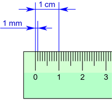  

> Ok, então agora já temos o tamanho de um **Átomo**? Infelizmente não!  

Agora vamos tentar dividir esse milímetro por mil partes iguais, vai ficar assim:

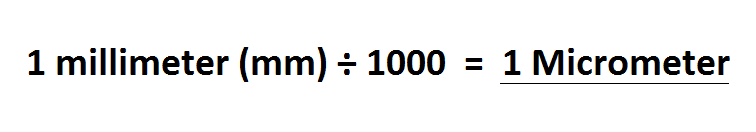  

> Ou seja, agora nós temos **1 micrômetro**. Ótimo, esse é o tamanho de um **Átomo**? **NÃO!!**  

Então, vamos dividir esse **1 micrômetro** por mil partes iguais, vai ficar assim:

  

Lindo! Agora nós temos **1 Nanômetro**, mas isso ainda é muito grande se comparado com o tamanho de um **Átomo**. Então o que fazer?  
Vamos dividir esse Nanômetro novamente por mil partes iguais:

  

Então, agora nós temos **1 picômetro** e é essa unidade de medida que tem os **Átomos**.

> **ALGUNS PICÔMETROS**.

Bem, até o momento não temos nenhum mecânismo que nos possibilite ver um **Átomo** *(nem mesmo um microscópio)*. Mas se isso fosse possível e nós quiséssemos ver os **Átomo** de um prego nós enxergaríamos algo parecido com isso:

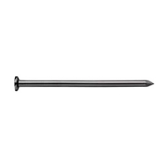  

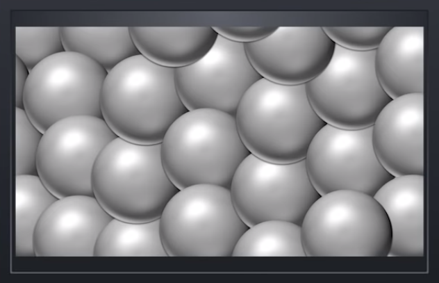  

Veja que o *prego* é composto de vários **Átomos**.

---

## 02 - Estrutura de um Átomo

Ok, agora que nós sabemos que um **Átomo** é extremamente pequeno, vamos ver como é composto um **Átomos** e sua estrutura:

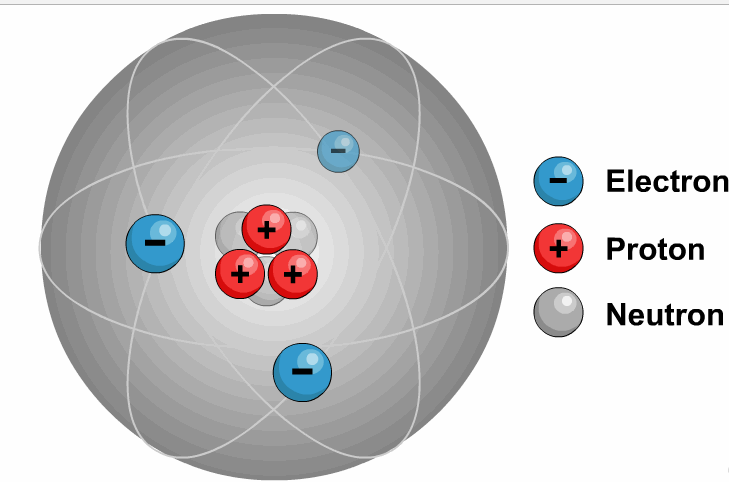  

Veja que um **Átomo** é composto de:

 - **Um Núcleo com:**
   - **Prótons -** Com cargas *Positivas*;
   - **Nêutrons -** Com cargas *Neutras*;
 - **Elétrons** - Com cargas *Negativas*.

---

## 03 - Tabela Periódica

**NOTE:**  
Vale lembrar que na natureza existem vários materiais diferentes. Por exemplo, veja a Tabela Periódica com esses vários materiais (elementos):

  

Veja que cada material (elemento) nós temos o número Atômico relacionado.

> **MAS O QUE É ESSE NÚMERO ATÔMICO?**

Esse número Atômico nada mais é do que o número de **Elétrons** que tem esse material (elemento). Por exemplo, o ferro **(Fe/Iron)** tem **26 Elétrons**.

## 04 - Eletrização

Voltando para os **Átomo**, um conceito bem importante é o de **Eletrização**. Vamos voltar para o exemplo do material (elemento) Ferro que tem como número atômico 26.

 - **Isso signifca que o Ferro (Iron) tem:**
   - **26 Elétrons** (Cargas negativas);
   - **26 Protons** (Cargas positivas).

**NOTE:**  
O problema é que elétrons de um material (elemento) não são constantes, ou seja, um material (elemento) pode ganhar ou perder elétrons.

**NOTE:**  
Um exemplo é quando um **Átomo** perde alguns de seus **elétrons** deixando o Átomo com uma *carga positiva*; Ou quando um Átomo ganha mais elétrons do que ele necessita deixando o com uma *carga negativa*.

Veja o exemplo abaixo para ficar mais claro visualmente:

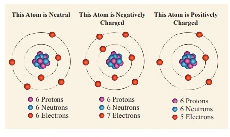  

## 05 - Eletricidade

Agora para entender melhor como realmente funciona a Eletricidade suponha que nós temos dois materiais:

 - Um com uma carga negativa;
 - E outro com uma carga positiva...

Agora vamos ligar esses dois materiais com algum material condutor. **Por exemplo um fio**.  
O que vai acontecer é que os elétrons que estão sobrando na carga negativa vão passar para a carga positiva.

Veja o exemplo abaixo para ficar mais claro:

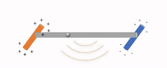  

> Esse é um fenômeno da natureza, não do homem!

**NOTE:**  
Mas o mais importante aqui é que você saiba que quando estamos passando elétrons da carga negativa para a positiva isso gera energia. Ou seja, esse é um processo que pode gerar *eletricidade*.

Por exemplo, uma tomada elétrica sempre vai ter no **mínimo dois pinos**:

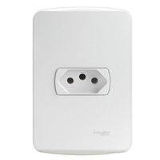  

 - Um pino vai ter uma carga positiva;
 - E o outro uma carga negativa.

Outro exemplo são as **pilhas** e **baterias**:

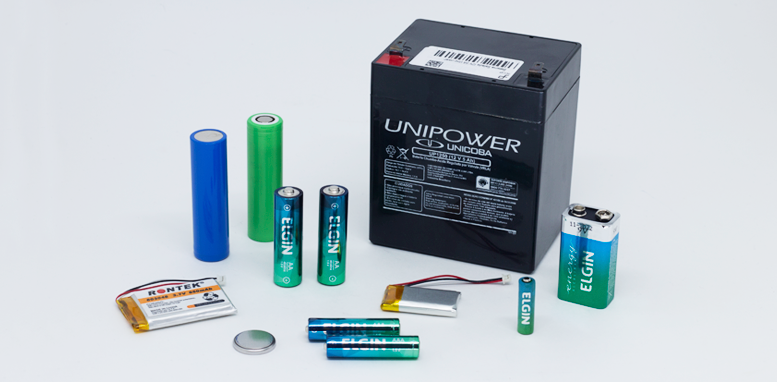  

Se você prestar atenção vai ver que as **pilhas** e **baterias** vão ter dois lados:

 - **(+) - Energizado positivamente;**
 - **(-) Energizado negativamente.**

---

## 06 - Circuito Elétrico

De início você tem que ter em mente e separar algumas partes que podem compor um **Circuito Elétrico**.

Veja alguns exemplos abaixo:

 - **Fonte de energia:**
   - Pilha;
   - Bateria;
   - Fornecedora de energia elétrica...
 - **Carga (Quem vai consumir a corrente elétrica do circuito):**
   - Lâmpada;
   - Motor de um Liquidificador;
   - Motor de uma Geladeira;
   - Motor de um Aquecedor...
 - **Controle do Circuito:**
   - Chave (Interruptor);

**NOTE:**  
Vale salientar que a **Carga** vai sempre consumir a energia para gerar algum benefício:

 - **Lâmpada** → Luz;
 - **Motor da Geladeira** → Gelo;
 - **Motor do Aquecedor** → Calor...

Um exemplo de **circuito elétrico** bem abstrado você pode ver na figura abaixo:

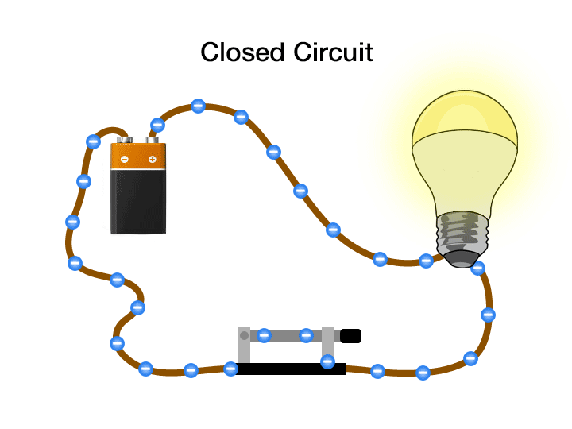  

**NOTE:**  
Veja que um **Circuito Elétrico** tem a aparência de um **Círculo**, por isso, Circuito.

---

## 07 - Corrente Elétrica

Bem, no exemplo anterior nós vimos como funciona um **Circuito Elétrico** e algumas de suas partes principais. Agora vamos focar em um exemplo onde temos uma *usina geradora de energia* como fonte e Casas, Fábricas e Edifícios como consumidoras de energia:

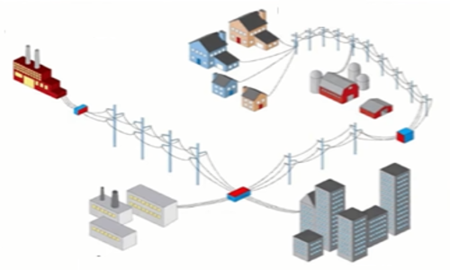  

> Ok, mas como essa essa *usina* faz para passar energia para às Casas, Fábricas e Edifícios?

Bem, é simples. Vocês sabem que é um fenômeno natural da natureza uma **carga positiva (Átomo com mais prótons do que elétrons)** atrair eletrons de uma **carga negativa (Átomo com mais elétrons do que prótons)**.

  

Sabendo disso o que uma *usina geradora de energia* tem que fazer é criar um mecanismo onde:

 - Tenha uma parte transmitindo uma carga com excesso de elétrons (Carga negativa);
 - E uma parte transmitindo uma carga com falta e elétrons (Carga negativa).

Conseguindo criar esse mecanismo que nós explicamos acima nós podemos criar 2 coisas que nós já aprendemos antes:

 - **Energia:**
   - Quando passamos elétrons de uma carga negativa para a positiva;
 - **Circuito Elétrico.**

> Bem, todo esse processo é o que nós conhecemos como **Corrente Elétrica**.

---

## 08 - Materiais Condutores x Materiais Isolantes

Outra coisa que você tem que saber é que para uma *usina geradora de energia* passar essas cargas ela tem que utilizar **Materiais Condutores**. Ou seja, que conduza as cargas gerando energia.

Veja alguns exemplos de **Materiais Condutores** e **Isolantes**:

  

**NOTE:**  
Dependendo do material ele vai conduzir mais ou menos eletricidade. Por exemplo, o Ouro vai conduzir mais eletricidade do que o cobre.

Veja a tabela abaixo com alguns exemplos de materiais condutores e seus níveis de condutividades:

| Material   |  Condutividades  |
|------------| ---------------- |
| Prata      | 62,5             |
| Cobre puro | 61,7             |
| Ouro       | 43,5             |
| Alumínio   | 34,2             |
| Tungstênio | 18,18            |
| Zinco      | 17,8             |
| Bronze     | 14,9             |
| Latão      | 14,9             |
| Níquel     | 10,41            |
| Ferro puro | 10,2             |
| Platina    | 9,09             |
| Estanho    | 8,6              |
| Manganina  | 2,08             |
| Constantan | 2                |
| Mercúrio   | 1,0044           |
| Nicromo    | 0,909            |
| Grafite    | 0,07             |

**NOTE:**  
Por curiosidade, veja esses dados:

- A água do mar é 100 vezes melhor condutora que a água doce;
- A prata é 1.000.000 vezes melhor condutora que a água do mar!

---

## 09 - Quantidade de Corrente Elétrica que passa por um Circuito ou Material

Outro ponto muito importante que nós devemos saber é que existe uma quantidade de corrente elétrica que passa pelo *Circuito* ou *Material Elétrico* **ao mesmo tempo**.

**NOTE:**  
A Unidade de Medida responsável por medir essa quantidade é o **Ampere - Símbolo "A"**.

Por exemplo, existem equipamentos que são identificados pelo a quantidade de Corrente Elétrica máxima que ele suporta **ao mesmo tempo**.

Veja alguns exemplos abaixo:

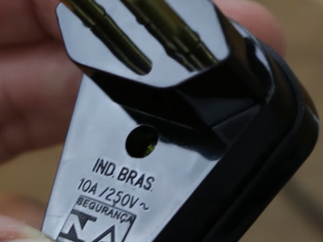
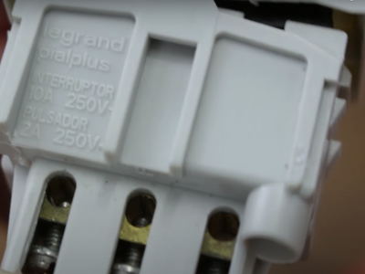
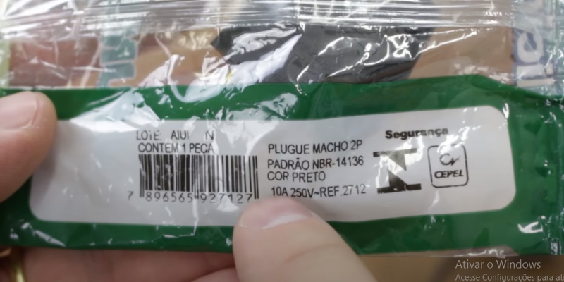  

Vejam que todos os equipamentos acima tem uma quantidade máxima de **Amperes (A)** que eles suportam.

---

**Rodrigo Leite -** *Software Engineer*
