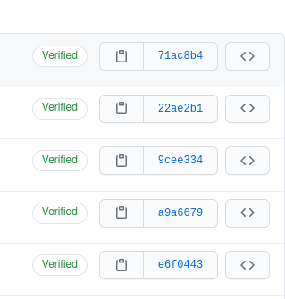
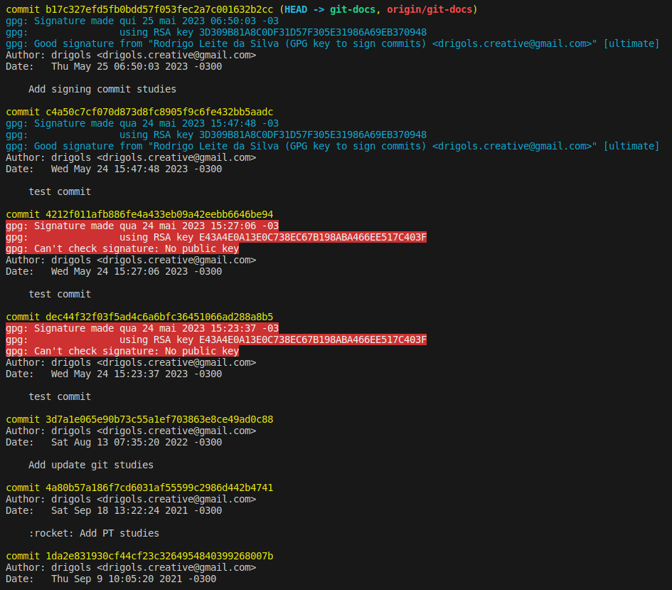

# Git

## Contents

 - **Useful commands:**
   - [`git checkout <branch-name>` and `git checkout -b <new-branch>`](#checkout-b)
   - [git commit -a -m 'commit message'](#add-plus-commit)
 - [Semantic Commit Messages](#semantic-commit-messages)
 - **Tags & Releases:**
   - [Choosing project version](#project-version)
   - **Tags:**
     - [Intro to Tags](#intro-to-tags)
     - [Create Tags](#create-tags)
     - [Looking for the git tags (git tag)](#looking-tags)
     - [Checking information about specific tags (git show `<tag>`)](#git-show-tag)
     - [Publishing a tag](#push-tag)
     - [LLVM (Tags)](https://github.com/llvm/llvm-project/tags)
   - **Releases:**
     - [Selenium (Releases)](https://github.com/SeleniumHQ/selenium/releases)
     - [TensorFlow (Releases)](https://github.com/tensorflow/tensorflow/releases)
 - **Settings:**
   - [Configurando sua identidade (Username + Email)](#identity)
   - [Verificando suas configurações (git config --list)](#check)
 - **Configuring a GPG key to sign commits::**
   - [Teoria Inicial](#gpg-theory)
   - [Listando chaves GPG](#listing-gpg-keys)
   - [Criando um par de chave GPG](#create-gpg-key)
   - [Ativando assinatura de commits no cliente Git (git config --global commit.gpgsign true)](#active-sign-gitclient)
   - [Adicionando o ID da chave GPG ao cliente Git](#add-gpg-key-to-gitclient)
   - [Adicionando sua chave no GitHub](#add-key-to-github)
   - [Salvando seu par de chaves](#save-gpg-keys)
   - [Adicionando seu par de chaves a um computador novo](#add-key-newpc)
   - [Assinando commits (git commit -S)](#git-commit-s)
   - [Verificando se o commit foi assinato (--show-signature)](#show-signature)
   - [Signing merges (git merge -S branch-name)](#git-merge-s)
 - [**References**](#references)


<!--- ( Useful commands ) -->

---

<div id="checkout-b"></div>

## `git checkout <branch-name>` and `git checkout -b <new-branch>`

 - O comando `git checkout <branch-name>` serve para você mudar/alternat de uma branch para outra.
 - O comando `git checkout -b <branch-name>` além de criar uma nova branch, ela já muda automaticamente para essa nova branch sem precisar utilizar o comando `git checkout <branch-name>`.

**CONSOLE:**  
```bash
git checkout -b fix-999
```

**OUTPUT:**  
```bash
Switched to a new branch 'fix-999'
```

---

<div id="add-plus-commit"></div>

## git commit -a -m 'commit message'

> As we know before committing something, first we must send it to "Staged" using the "add" command.

For example to **add all**:

```bash
git add .
```

**NOTE:**  
When we need to **add all** to the *"Staged"* we can skip the **"add ."** command and use the **"-a"** argument to the commit command knowing that need first **add all**:

```bash
git commit -a -m 'commit message'
```


<!--- ( Semantic Commit Messages ) -->

---

<div id="semantic-commit-messages"></div>

## Semantic Commit Messages

 - **Types:**
   - **feat (New Feature):** Tratam adições de novas funcionalidades ou de quaisquer outras novas implantações ao código.
     - **Examples:**
       - feat(login): Add user authentication via OAuth.
       - feat(cart): Implement product addition to the shopping cart.
       - feat(profile): Create user profile page with personal information.
       - feat(search): Introduce category-based product search.
       - feat(payment): Integrate payment gateway for checkout.
       - feat(orders): Display order history in the user account.
       - feat(wishlist): Allow users to save items in a wishlist.
       - feat(landing): Develop responsive landing page for mobile devices.
       - feat(reviews): Add ability to rate products and write comments.
       - feat(categories): Implement navigation by product categories.
   - **fix (Bug Fix):** Essencialmente definem o tratamento de correções de bugs.
     - **Examples:**
       - fix(navbar): Fix broken links in the navigation menu.
       - fix(validation): Resolve incorrect validation in the registration form.
       - fix(cart): Correct erroneous subtotal calculation in the cart.
       - fix(login): Fix redirection issue after authentication.
       - fix(search): Rectify search error not showing accurate results.
       - fix(order): Address failure to process orders with out-of-stock items.
       - fix(styles): Adjust styles for improved readability on smaller devices.
       - fix(filter): Correct non-functional product filtering by price.
       - fix(ui): Resolve issue of element overlap in the interface.
       - fix(wishlist): Fix improper removal of items from the wishlist.
   - **perf:** O tipo de commit *"perf"* em mensagens de commit semântico é usado para indicar mudanças relacionadas à performance. Esse tipo é utilizado quando um commit inclui otimizações ou alterações com o objetivo de melhorar o desempenho do código, como tornar algoritmos mais eficientes, reduzir o uso de memória ou aumentar a velocidade de execução.
     - **Examples:**
       - perf(search): Optimize product search algorithm for faster results.
       - perf(database): Improve database query performance for large datasets.
       - perf(rendering): Enhance component rendering speed through memoization.
       - perf(memory): Reduce memory usage in resource-intensive operations.
       - perf(caching): Implement caching to reduce repetitive network requests.
       - perf(loading): Speed up page loading by lazy loading non-critical assets.
       - perf(algorithms): Rewrite sorting algorithm to have better time complexity.
       - perf(network): Optimize API calls to minimize response time.
       - perf(compilation): Reduce build time by optimizing code compilation process.
       - perf(images): Implement lazy loading of images for quicker initial page load.
   - **refactor (Code Refactoring):** Tipo utilizado em quaisquer mudanças que sejam executados no código, porém não alterem a funcionalidade final da tarefa impactada.
     - **Examples:**
       - refactor(cart): Rearrange price calculation logic in the cart.
       - refactor(components): Split product component into smaller subcomponents.
       - refactor(api): Simplify API calls using utility functions.
       - refactor(database): Update database structure for better performance.
       - refactor(auth): Centralize authentication logic in a dedicated service.
       - refactor(routes): Restructure routing for better modularity.
       - refactor(styles): Group related styles into separate files.
       - refactor(tests): Improve unit test coverage in a critical module.
       - refactor(state): Migrate from local state management to Redux.
       - refactor(optimization): Apply performance optimizations to critical code parts.
   - **test (Test Changes):** Adicionando testes ausentes ou corrigindo testes existentes nos processos de testes automatizados (TDD).
     - **Examples:**
       - test(components): Add unit tests for cart components.
       - test(api): Create integration tests for authentication endpoints.
       - test(validation): Verify validation behavior in form fields.
       - test(utils): Write tests for formatting utility functions.
       - test(redux): Implement action and reducer tests for application state.
       - test(search): Add test cases for search results.
       - test(payment): Verify smooth integration with the payment gateway.
       - test(orders): Create tests for correct order processing.
       - test(wishlist): Verify addition, removal, and display of wishlist items.
       - test(e2e): Implement end-to-end tests for core user flows.
   - **style (Style Changes):** Alterações referentes a formatações, efeitos visuais ou outras alterações que afetam apenas a aparência do código, mas não alteram sua funcionalidade ou comportamento, como por exemplo: espaço em branco, formatação, ponto e vírgula ausente etc.).
     - **Examples:**
       - style(buttons): Standardize button colors and sizes.
       - style(typography): Update fonts and text sizes across the project.
       - style(navbar): Adjust navigation bar layout on mobile devices.
       - style(forms): Apply consistent spacing to form fields.
       - style(images): Optimize images to enhance page performance.
       - style(colors): Update color palette according to brand guidelines.
       - style(modal): Enhance appearance and animations of dialog modals.
       - style(grid): Refactor grid system for increased flexibility and responsiveness.
       - style(icons): Replace icons with newer and styled versions.
       - style(responsive): Make the interface more user-friendly on small and large screens.
       - **NOTE:** Lembre-se de que o tipo style deve ser usado somente para mudanças de estilo e formatação, sem impacto funcional no código.
   - **docs (Documentation Changes):** Referem-se a inclusão ou alteração somente de arquivos de documentação.
     - **Examples:**
       - docs(readme): Update setup instructions in the README file.
       - docs(api): Add documentation for product API endpoints.
       - docs(contributing): Clarify contribution guidelines in the developer guide.
       - docs(usage): Improve usage examples in a component's documentation.
       - docs(changelog): Update changelog with the latest project changes.
       - docs(installation): Correct installation instructions to reflect new dependencies.
       - docs(styleguide): Add section about code style conventions.
       - docs(architecture): Updated architecture diagram with new components.
       - docs(tutorials): Include step-by-step tutorial for initial setup.
       - docs(deployment): Document deployment process in a production environment.
   - **env:** Basicamente utilizado na descrição de modificações ou adições em arquivos de configuração em processos e métodos de integração contínua (CI), como parâmetros em arquivos de configuração de containers.
     - **Examples:**
       - env(config): Update environment configuration for development server.
       - env(production): Configure production environment variables for deployment.
       - env(testing): Adjust testing environment settings for integration tests.
       - env(staging): Set up staging environment with specific database parameters.
       - env(secrets): Add new secret keys to the environment configuration.
       - env(deployment): Modify deployment scripts to handle different environments.
       - env(ci/cd): Configure continuous integration and continuous deployment workflows.
       - env(plugins): Install new plugins for enhancing the development environment.
       - env(local): Update local environment settings for compatibility with new libraries.
       - env(aws): Configure AWS credentials for accessing cloud resources.
       - **NOTE:** Remember that the env type is typically used when making changes related to environment settings, configurations, or infrastructure, ensuring that the code can function properly in different contexts.
   - **build:**
     - Alterações que afetam o sistema de construção ou dependências externas (escopos de exemplo: gulp, broccoli, npm),
     - **Examples:**
       - build(dependencies): Update third-party libraries to their latest versions.
       - build(package): Update packaging configuration for improved distribution.
       - build(deployment): Enhance deployment scripts for smoother releases.
       - build(webpack): Configure Webpack for better asset bundling and optimization.
       - build(pipeline): Refine continuous integration pipeline for better testing.
       - build(docker): Update Dockerfile for better containerization and deployment.
       - build(ci/cd): Improve CI/CD setup for automated testing and deployment.
       - build(npm): Adjust npm scripts for building and packaging the application.
       - build(assets): Optimize asset generation process for improved performance.
       - build(compile): Update compilation process for compatibility with new tools.
       - **NOTE:** Remember that the build type is used when making changes related to the build process, tooling, dependencies, and overall build infrastructure.
   - **ci:** Changes to our CI configuration files and scripts (example scopes: Travis, Circle, BrowserStack, SauceLabs);
     - **Examples:**
       - ci(pipeline): Fix issue with failing tests in the CI pipeline.
       - ci(travis): Update Travis CI configuration for better integration.
       - ci(workflows): Refactor GitHub Actions workflows for smoother automation.
       - ci(coverage): Improve code coverage reporting in the CI process.
       - ci(deployment): Automate deployment to staging environment after successful build.
       - ci(tests): Add new end-to-end tests to the continuous integration suite.
       - ci(docker): Integrate Docker image build and push steps into CI workflow.
       - ci(plugins): Update and configure new plugins for enhanced CI capabilities.
       - ci(azure): Set up Azure Pipelines for seamless build and deployment.
       - ci(jenkins): Adjust Jenkins configuration for improved build and test execution.
       - **NOTE:** The ci type is used when making changes related to continuous integration and continuous deployment processes, workflows, configurations, and tools.
   - **chore (Maintenance Tasks):** Atualização de tarefas que não ocasionam alteração no código de produção, mas mudanças de ferramentas, mudanças de configuração e bibliotecas que realmente não entram em produção.
     - **Examples:**
       - chore(deps): Update dependencies to their latest versions.
       - chore(ci): Configure continuous integration pipeline with GitHub Actions.
       - chore(linting): Adjust linting rules to enhance code consistency.
       - chore(licenses): Update license files according to new company guidelines.
       - chore(docs): Fix broken links and improve navigation in the documentation.
       - chore(webpack): Optimize Webpack configuration for better performance.
       - chore(formatting): Apply automated formatting across the source code.
       - chore(cleanup): Remove unused code and obsolete files.
       - chore(data): Update test data to reflect more recent scenarios.
       - chore(release): Prepare version 1.2.0 for release with new features.


<!--- ( Tags & Releases ) -->

---

<div id="project-version"></div>

## Choosing project version

To choose the project version we need to pay attention to some things. For example, see the code version below:

[pyproject.toml](../pyproject.toml)
```python
version = "0.1.0"
```

That means:

```python
Major - 0
Minor - 1
Patch - 0
```

> All Software starts from version `"0.0.0"`:

 - Always you have a *stable version* we increment a **"minor"** in the software:
   - Then we continue to increment the patch until stays in another stable version.

For example:

```bash
Major - 0
Minor - 1
Patch - 0 > 1 > 2 > 3 > ... > Until another software stable version

Major - 0
Minor - 2
Patch - 0 > 1 > 2 > 3 > ... > Until another software stable 

Major - 0
Minor - 3
Patch - 0 > 1 > 2 > 3 > ... > Until another software stable 
```

> And the **"Major"** when it goes up?

**NOTE:**  
When we have an **"incompatible version"** we go up the "major".

Then, we continue the process, however, always we add a new feature we increment the **"minor"**:

```python
Major - 1
Minor - 0 > new feature (1) > new feature (2) > new feature (n)
Patch - 0
```

> And the **"Patch"** when it goes up?

**NOTE:**  
The **"Patch"** go up always we `solve a "bug"`. For example:

```python
Major - 1
Minor - 2
Patch - 0 > Bug solved (1) > Bug solved (2) > Bug solved (n)
```

 - **In short:**
   - **Always we add a `new feature`:**
     - We increment a `"minor"`.
   - **Always we that `solve a bug`:**
     - We increment a `"patch"`.
   - **Always that something `breaks the software`:**
     - We increment a `"major"`.
     - For example, change the CLI command.

For our project let's start with version `"0.1.0"`, that's the first stable version of our project.

---

<div id="intro-to-tags"></div>

## Intro to Tags

Tags are **labels** to **mark a commit point that represents some significant change** in the code. In other words, it is a version (or release) of the project.

### When to create a Tag?

 - When you want to create a *release* point for a *stable version* of your code.
 - When you want to create a historical point that you can refer to reuse in the future.

Git supports two types of tags, **Annotated** and **Lightweight**:

 - **Annotated:**
   - A *"Annotated Tag"* stores details about the repository state *at that moment (naquele momento)*.
   - *Lightweight tags* are simply pointers to commits, without any additional information. They are useful for marking specific commits for internal or temporary purposes.
   - **NOTE:** "Lightweight Tags" is the default. If you do not specify the `-a` (or `--annotate`) option when creating a tag, Git will create "Lightweight Tags".
 - **Lightweight:**
   - A *"Lightweight Tag"* store the checksum of the commit in which they were generated.

---

<div id="create-tags"></div>

## Create Tags

### Annotated Tag

To create an **Annotated Tag** we use the command `git tag` with the following parameters:

 - `-a` or `--annotate`
   - It says the tag is "Annotated".
 - `-m`
   - Add a message to the tag.

For example:

```bash
git tag -a (or --annotate) <name> -m <message>

Example:
git tag -a v1.0 -m “Sum functionality”
```

### Lightweight Tag

To create a **Lightweight Tag** we use the command `git tag` without the `-a` or `--annotate` parameters:

For example:

```bash
git tag <name> -m <message>

Example:
git tag v1.0 -m “Sum functionality”
```

---

<div id="looking-tags"></div>

## Looking for the git tags (git tag)

To looking for a git tags we can the the command **"git tag"**:

```bash
git tag
```

---

<div id="git-show-tag"></div>

## Checking information about specific tags (git show `<tag>`)

**Example:**
```bash
git show v1.0
```

---

<div id="push-tag"></div>

## Publishing a tag

To publish a tag to a remote (or specific remote) you can use the following syntax:

```bash
git push <remote-name> <tag-name>
```

For example:

```bash
git push origin v1.0
```


<!--- ( Settings ) -->

---

<div id="identity"></div>

## Configurando sua identidade (Username + Email)

A primeira coisa que você deve fazer quando instalar o **Git** é definir o seu:

 - **Nome de usuário;**
 - **Endereço de e-mail.**

Isso é importante porque todos os commits no **Git** utilizam essas informações, e está imutavelmente anexado nos commits que você realizar:

```bash
git config --global user.name "drigols"
```

```bash
git config --global user.email drigols.creative@gmail.com
```

 - Relembrando, você só precisará fazer isso uma vez caso passe a opção **--global**, pois o Git sempre usará essa informação para qualquer coisa que você faça nesse sistema.
 - Se você não utilizar a opção **--global** essa configuração vai ser por projeto.
 - **NOTE:** Por fim, mas não menos importante lembre-se de fazer essas configurações como *root (sudo)* também, porque lá são configurações diferentes.

> **NOTE:**  
> Caso você queira sobrepor estas com um nome ou endereço de e-mail diferentes para projetos específicos, você pode executar o comando **sem a opção --global** quando estiver no próprio projeto.

---

<div id="check"></div>

## Verificando suas configurações (git config --list)

Caso você queira verificar suas configurações, você pode utilizar o comando **"git config --list"** para listar todas as configurações que o Git encontrar naquele momento:

```bash
user.name=drigols
user.email=drigols.creative@gmail.com
core.editor=emacs
core.repositoryformatversion=0
core.filemode=true
core.bare=false
core.logallrefupdates=true
```

**NOTE:**  
Você também pode verificar qual o valor que uma determinada **chave** tem para o **Git** digitando **git config {key}**:

**Check username:**  
```bash
git config user.name
drigols
```

**Check email:**  
```bash
git config user.email
drigols.creative@gmail.com
```


<!--- ( Configuring a GPG key to sign commits ) -->

---

<div id="gpg-theory"></div>

### Teoria Inicial

> Antes de configurar uma **chave GPG para assinar nossos commits**, primeiros nós devemos saber **"por que utilizar uma?"**.

Bem, se eu utilizar os comandos:

```bash
git config user.name your-user-name
```

e

```bash
git config user.email your-email
```

**NOTE:**  
Se eu adicionar o username de outra pessoa e o e-mail dela corretamente o Git vai entender que é ela quem está fazendo o commit. E isso nos gera um problema de **"autenticidade"**. Ou seja, eu não posso garantir que sou a pessoa **"x"** sem assinar o commit.

 - Do ponto de vista do Git, isso está realmente funcionando conforme o esperado. Os detalhes do committer são projetados apenas para identificar quem de seus colaboradores fez uma alteração e não devem ser usados ​​para autenticar pessoas.
 - Ser capaz de representar outros committers não introduz uma vulnerabilidade por si só:

No entanto, embora isso não seja uma vulnerabilidade de segurança em si, pode causar outros problemas. Ao ver um commit não assinado, **você não tem garantia de que**:

 - O autor é realmente a pessoa cujo nome está no commit.
 - A mudança de código que você vê é realmente o que o autor escreveu (ou seja, não foi adulterado).
 - Outro exemplo é alguém criando uma Pull Request maliciosa em um projeto de código aberto e fazendo com que pareça outra pessoa, por exemplo, alguém com uma grande reputação, co-autor dela, para tornar mais provável que o PR seja aceito (se você mantiver bibliotecas de código aberto, você sabe como pode ser demorado revisar completa e minuciosamente cada PR).

Em vez disso, criar o hábito de assinar seus commits do Git dá a você:

 - A capacidade de provar que você foi o autor de uma alteração de código específica.
 - Oferece a capacidade de garantir que ninguém possa modificar seu commit (ou seus metadados, como a hora em que você afirmou que foi feito) no futuro.

> **NOTE:**  
> Observe que só porque você assina seus commits do Git, isso não impede que outras pessoas se passem por você. **"Porém, elas não podem garantir que são você"**.

---

<div id="listing-gpg-keys"></div>

### Listando chaves GPG

Os comandos utilizados para listas chaves GPG no Linux são:

 - **gpg --list-keys**
   - Lista as chaves públicas.
   - As chaves públicas são identificadas pelo campo **"pub"**.
   - Essas chaves ficam armazenas em `"~/.gnupg/pubring.kbx"`.
 - **gpg --list-secret-keys**
   - Lista as chaves privadas.
   - As chaves privadas são identificadas pelo campo **"sec"**.
   - Essas chaves também ficam armazenas em `"~/.gnupg/pubring.kbx"`.

Por exemplo:

```bash
pub   rsa4096 2023-05-24 [SC]
      09AEE02AC25FED16041267B04A233C93156944C5 <--- YOUR PUBLIC KEY
uid           [ultimate] Test Key (This is a test key) <testkey@gmail.com>
sub   rsa4096 2023-05-24 [E]

sec   rsa4096 2023-05-24 [SC]
      09AEE02AC25FED16041267B04A233C93156944C5 <---- YOUR SECRET KEY
uid           [ultimate] Test Key (This is a test key) <testkey@gmail.com>
ssb   rsa4096 2023-05-24 [E]
```

> **Ué, as chaves (públicas e privadas) são as mesmas, por quê?**

O **GPG (GNU Privacy Guard)** mostra a mesma chave para os campos **"sec" (Secret)** e **"pub" (Public)** porque, no **GPG**, a chave pública e a chave privada são essencialmente partes da mesma chave.

Em **criptografia de chave pública**, um par de chaves é usado:

 - **A chave pública é usada para:**
   - Verificar assinaturas.
   - E criptografar mensagens para o proprietário da chave privada.
 - **A chave privada é usada para:**
   - Descriptografar esses dados.
 - **Ambas as chaves são matematicamente relacionadas e derivadas uma da outra.**

No **GPG**, quando você gera um par de chaves, a chave privada é armazenada em seu **chaveiro (keyring)** junto com sua identificação e outras informações associadas. A chave pública correspondente também é derivada da chave privada e é armazenada no chaveiro junto com a chave privada.

 - Ao listar as chaves com o comando **"gpg --list-keys"** ou **"gpg --list-secret-keys"**, você verá a mesma chave listada tanto para **"sec"** quanto para **"pub"**. Isso ocorre porque é a mesma chave, com a chave pública derivada da chave privada.
 - Portanto, quando você compartilha sua chave pública com outros usuários, eles podem usar essa chave para criptografar mensagens para você, e você pode usar sua chave privada correspondente para descriptografar essas mensagens.

Você também pode utilizar o argumento **"--keyid-format=long"** para listar o formato longo das chaves GPG e também obter os **IDs** das chaves públicas e privadas (que vai ser o mesmo ID para ambas).

Por exemplo:

```bash
pub   rsa4096/4A233C93156944C5 2023-05-24 [SC]
      09AEE02AC25FED16041267B04A233C93156944C5
uid                 [ultimate] Test Key (This is a test key) <testkey@gmail.com>
sub   rsa4096/F8B889612DA0BE52 2023-05-24 [E]

sec   rsa4096/4A233C93156944C5 2023-05-24 [SC]
      09AEE02AC25FED16041267B04A233C93156944C5
uid                 [ultimate] Test Key (This is a test key) <testkey@gmail.com>
ssb   rsa4096/F8B889612DA0BE52 2023-05-24 [E]
```

Nós exemplos acima:

 - **O ID da chave pública (pub):** 4A233C93156944C5
 - **O ID da chave privada (sec):** 4A233C93156944C5

---

<div id="create-gpg-key"></div>

### Criando um par de chave GPG

Se você não tiver uma chave, poderá gerar uma com o comando **"gpg --full-generate-key"**:

**INPUT:**
```bash
gpg --full-generate-key
```

O **GPG** lhe fará várias perguntas, responda e ela lhe retornará um output com várias informações sobre sua nova chave criada.

**OUTPUT:**
```bash
We need to generate a lot of random bytes. It is a good idea to perform
some other action (type on the keyboard, move the mouse, utilize the
disks) during the prime generation; this gives the random number
generator a better chance to gain enough entropy.
We need to generate a lot of random bytes. It is a good idea to perform
some other action (type on the keyboard, move the mouse, utilize the
disks) during the prime generation; this gives the random number
generator a better chance to gain enough entropy.
gpg: key ABA466EE517C403F marked as ultimately trusted
gpg: revocation certificate stored as 'source/.gnupg/openpgp-revocs.d/E43A4E0A13E0C738EC67B198ABA466EE517C403F.rev'
public and secret key created and signed.

pub   rsa3072 2023-05-24 [SC]
      E43A4E0A13E0C738EC67B198ABA466EE517C403F
uid                      test gpg (this is a GPG test key) <testgpg@gmail.com>
sub   rsa3072 2023-05-24 [E]
```

Você pode listar novamente para ver quais chaves você tem agora:

**INPUT:**
```bash
gpg --list-keys
```

**OUTPUT:**
```bash
pub   rsa3072 2023-05-24 [SC]
      E43A4E0A13E0C738EC67B198ABA466EE517C403F
uid           [ultimate] test gpg (this is a GPG test key) <testgpg@gmail.com>
sub   rsa3072 2023-05-24 [E]
```

---

<div id="active-sign-gitclient"></div>

### Ativando assinatura de commits no cliente Git (git config --global commit.gpgsign true)

Antes de de fato adicionar nossas chaves GPG no cliente Git, nós precisamos configurar para ele aceitar assinatura de commits.

**INPUT:**
```bash
git config --global commit.gpgsign true
```

**INPUT:**
```bash
git config --list
```

**OUTPUT:**
```bash
...
...
...
core.logallrefupdates=true
```

> **NOTE:**
> Por fim, mas não menos importante lembre-se de fazer essa configuração como **root (sudo)** também, porque lá são configurações diferentes.

---

<div id="add-gpg-key-to-gitclient"></div>

### Adicionando o ID da chave GPG ao cliente Git

Aqui vai ser interessante você utilizar o argumento **"--keyid-format=long"** para pegar o ID da sua chave.

**INPUT:**
```bash
gpg --list-keys --keyid-format=long
```

**OUTPUT:**
```bash
pub   rsa4096/4A233C93156944C5 2023-05-24 [SC]
      09AEE02AC25FED16041267B04A233C93156944C5
uid                 [ultimate] Test Key (This is a test key) <testkey@gmail.com>
sub   rsa4096/F8B889612DA0BE52 2023-05-24 [E]
```

Em seguida, precisamos dizer ao nosso cliente Git para usar a chave GPG gerada para assinar os commits. Nós fazemos isso passando o **ID** da nossa chave para o argumento **"git config --global user.signingkey"**:

**INPUT:**
```bash
git config --global user.signingkey 4A233C93156944C5
```

Se você rodar o comando **"git config --list"** novamente vai ver que o ID da chave foi adicionado:

**INPUT:**
```bash
git config --list
```

**OUTPUT:**
```bash
user.name=your-git-username
user.email=your-git-email
user.signingkey=4A233C93156944C5
```

Agora, toda vez que você fizer um git commit, ele será assinado com esta chave GPG.

> **NOTE:**
> Por fim, mas não menos importante lembre-se de fazer essa configuração como **root (sudo)** também, porque lá são configurações diferentes.

---

<div id="add-key-to-github"></div>

### Adicionando sua chave no GitHub

Bem, até aqui nós estamos apenas **assinando nossos commits com a chave pública**, mas para o GitHub verificar nós precisamos passar nossa chave pública completa para ele.

Para isso nós utilizamos o comando **"gpg --export key-id"**:

**INPUT:**
```bash
gpg --export 4A233C93156944C5
```

**OUTPUT:**
```bash
&����?4�߸��M����0�&O�#薸P�����<'��שx�⋝��֯�����
```

> **WHAT?**

**NOTE:**  
Bem isso acontece porque o comando **"gpg --export"** emite os dados em *binário*. Ou seja, isso não pode ser exibido diretamente como texto.

O que nós podemos fazer para resolver isso é transformar esse binário em hexadecimal (base16) com a opção **"-a"** ou **"--armor"**:

**INPUT:**
```bash
gpg --export --armor 4A233C93156944C5
```

**OUTPUT:**
```bash
-----BEGIN PGP PUBLIC KEY BLOCK-----
mQINBGRuawABEACvSKRLFX9+h7Oyx8Txmj1e0c4ZL/tqv4i0YeIAwlYqlRih3PSr
2uXNV94vJoOicmGDM7nJhrUF2TQyWYK1CeOAUndouXxfYY38K8EsocS/+20lJp83
/h4FvPa4Aop3GfIO26ObJvUca0Ij6SflMx0svuofqPWl/8AkYngaJq3m+44eHz80
m9+4D/oUmE367/aKMPAmT4Yj6Ja4UPq687zziNE8J42h16l46OKLnebn1q+2wOXB
gzwDIBPsAEVPqKvsfDyLaTBXwBKdG3q5d6Hf3axBB0UCmDrPnc8mUSEEZCDcw6gi
rpf2BkaQihP434nU2yuXnWwqZO6Nz+0W/fSPelFFhH96zGfaogKOMk1nu/7lhYt/
Yog2RXO0ezvsre0XhRdTCll8EORyYDsmgZaMhyhdo6cNJdV9y6hMJ4kaS0hkXD+M
tLue9aRx8dDbAvF2wEP8Bml49xY4n+V/sJ5J7n2HHtyDtoLWUZiKX5tbVmMDZVEl
30mZNccvNHqvWUKLMQitnvITNldKyCqHhr0zroftPiPu1Z5n+zC+iHHjWUbT8GM0
aqqJwPpO32xdpCurKbbsV74ld9kvoxozo3um5hGTgxdjFiZbdrphGCDOpNGmzo+b
j9pdjDDxS+JdQNb6oMOZGmMLHsJ1hVCSVqXur8vk5rPjEhGFB4eOmgSfkQARAQAB
tDFUZXN0IEtleSAoVGhpcyBpcyBhIHRlc3Qga2V5KSA8dGVzdGtleUBnbWFpbC5j
b20+iQJOBBMBCgA4FiEECa7gKsJf7RYEEmewSiM8kxVpRMUFAmRuawACGwMFCwkI
BwIGFQoJCAsCBBYCAwECHgECF4AACgkQSiM8kxVpRMXhZg//WdrwsjbrQO7Ulq40
EdNlNQ2b+5+xIWg0AoFTSOC+1lHYs9sm7FMHjMCdqOpEEXE52itl2ucTgB2nqynr
KH7gzNGJNJd1qxaXYIf1/Djfof6AMZmA2yf4utN52SzEY34+f8Z9GMIVPgQ4xiC4
fi/48HzGYmabQhZJHueQHBkKppl8bQf4V8IOpMnYhEo3B27CGSNWUhWDi1tmxTZ2
tSD9qADWcHsrW7Ma60g8g5jd76xUs1NWhSjtWp07dwZnOO1/X5C4iMqg6/Nc6sJ3
R89EtW3iLm4/QsyqMH+NBFxQIT/qPv3m7A7vdIIWHrc0qrrjSXC36xJmLztCD1iL
8XkSrnTEedISQ177sMeyYXy+G8I6v9gNa7TwqeRgIFSoqGjuNhBrHWnXgZy927QS
yC71r97Kb/pyh0XC80oPQ6aPeZfiDziZKV+GTtEUrJhcD0Cj/gQ5WnRHW/GtzNcH
NfjwlccMemP5PGUwGezyQs/qNiBLnpGQ1QIFSa70HJFFSgr8U0O9OrjxqlUIw0eA
FtRdaBRV+9VTUp5K++D2JoBePv6UvperMNCboI0fTPHcMr62CrAiSQ1nMJ2/XPXh
8HEEnJypJcotZgR8IM+m68VCM/Jjwy607YaZXn4Arw7T+BASjkI24XKa8K19tO+7
1nqSJJPabEbAyWUSz5/jb+3pNmO5Ag0EZG5rAAEQANPuOzcduNxjGWY4YG623pfN
YVdCrluo5ltHNtgBURdrGhUuPq6XM2kXfz2aI96cljDvD1F8h2DLxOaK3LoXQTDf
9FnsogGKSNaSZnR9fcnmcuqyaqKdHwiygnXyXSu9zcq8TmtbbDs5KruoQO6GRYIY
7B1lb5g3nD+cD9N+Sse2nPcbMvzFV3y2rTywc6q6mGH+Bbn93OYVFZAB4AajRGzH
06r/aBv46rSoihCVy1baYGnpJDSzzhe8QQlMpA/oFCdcstp/XjWRK5zZgaYA88i4
pR4Ul/WRELt3auQVlUMLi3YsAdTVjS0cDfqsP34dMmCukJsytKGY95g0DJ7BPqWl
bRvXBNRGGpKV+5oPJa3p19NmwTO/OyynyNVaeeH7zX1YkPly00sLQMgEy6OGQv5d
r0joaOu6GJWCqlNo6RAhBEbMkjD2oha+x1k9fEpxyvqBgiBuP7uBRu+P5lOI75H1
GDvIce03i5IJkbKRAMOml+A+vCMnr+wd/0t/vce4F+EjZxf+KhAky7BJ6F/XJOgq
/VfUGD+xEIBBq621TNyCztynXR0oylvK97y74NT/0lK4uEEEr9/jO2cpuPbUxPVJ
0DTNVLPhH4Ze+b3nbfDvg8QzzrP1D4DuRT/RRryVXNRsway8tr4BOj8BbzJgeFs8
fm86i16DnbThI9lJpZtXABEBAAGJAjYEGAEKACAWIQQJruAqwl/tFgQSZ7BKIzyT
FWlExQUCZG5rAAIbDAAKCRBKIzyTFWlExVh8D/0cGE4qb8uByen8ab2GeRhBWLyN
IzK5YUeZdhL8okwm8vZOx9Wc+inkXQ/xaQ/R8AqKuZaHnwwiO+B0f5iJFVX2jGa3
qkIEA/mt/3nw2jg9deqgcpXodQehNvJuZcXgC3CZYXYz3kXe6E3lpIE21ZVl72XJ
24vKTSTnRlvLS5nkEmpn03zUyd4qRV2OzRHTa4siSDtqHSPuwsECnmo3E11IyEL7
d8icPaQntChwQUh4afP22xfMfekPUwxScMdSPu+9h0UiqsETIxB+Anx6SQN3zDpY
xuDPCsH/TkbkZRq3Wp8Lkxo9b5PbbXpXYvw6v3iW1Xsm41Fg3VDdPqRJ/zsUAJVw
abrhIQO/lgpD9nQlf7ofLogRflhgvSIr4NktYTIbWuBQ5HKpBilDGkEQuD7kKnLn
UST2YhBQZVHrhuXTlUWOdMnGwG5+pQc0+8nFXob7eIINuulkC4tKxVgf6OwCZ/LI
Xnud/12vZUO2OBF1Zj+oyi1j66ekSF11Y4MNFXy5J6FYlA0s1ZCtyDCsSiS73PZ4
RnqbGg+5Qsv9KEMjk77iDIC9M/vSUtnMFajMvKzPyCAjW58/4r+VvfbcDBMbN1VH
JMS/P+9v2xdGP0H2BObfVP18vpytWWBsJv0dyd1Ru6vfbOiJrfEqEAZg+plbwf21
5l3hK2Iff8w4J9VKAw==
=bOfB
-----END PGP PUBLIC KEY BLOCK-----
```

 - Ótimo, agora nós temos TODA nossa chave pública que vai ser utilizada pelo GitHub para garantir que somos nós que estamos assinando nosso commit.
 - **NOTE:** Outra observação é que se você quiser ver toda a sua chave **"privada"** rode o comando **"gpg --export-secret-key -a key-id"**.

Continuando... Copie todo o conteúdo das informações da chave pública, vá no GitHub em **settings/SSH and GPG Keys**:

  

Selecione **"New GPG key"**:

  

Cole todo o bloco de chave pública aqui e selecione **"Add GPG key"**:

  

Sua chave agora foi adicionada ao GitHub.

Quando um commit assinado for enviado para o GitHub, ele será verificado pela chave pública e o commit aparecerá como **“Verified”** nos logs de commit. Por exemplo:

  

---

<div id="save-gpg-keys"></div>

### Salvando seu par de chaves

> Imagine que você quer salvar seu par de chaves GPG para utilizar em outros computadores ou em caso de perda total do seu computador atual.

Para baixar as chaves é muito simples, basta executar os seguintes comandos:

**INPUT:**
```bash
cd ~/Downloads/
```

**INPUT:**
```bash
gpg --export --armor YOUR_ID_KEY_HERE > public.asc
gpg --export-secret-keys --armor YOUR_ID_KEY_HERE > private.asc
```

> **NOTE:**  
> Você vai precisar colocar a **senha de acesso a chave** para exportar a *chave privada*.

Agora é só salvar em um local seguro (por exemplo na Cloud) e baixar quando necessário.

---

<div id="add-key-newpc"></div>

## Adicionando seu par de chaves a um computador novo

Agora imagine que você comprou um computador novo e precisa adicionar suas chaves GPG nele.

 - Primeiro você vai colocar as chaves GPG no computador novo:
   - Baixando de um ambiente na nuvem.
   - Ou com um pendrive.

Agora é só executar o seguinte comandos:

**INPUT:**
```bash
gpg --import public.asc private.asc
```

> **NOTE:**  
> Aqui você também vai precisar colocar a **senha de acesso a chave** para importar a *chave privada*.

---

<div id="git-commit-s"></div>

### Assinando commits (git commit -S)

Ok, mas como eu posso garantir que meu commit vai ser autenticado? Uma opção é sempre fazer um commit utilizando o argumento **"-S"**, por exemplo:

**INPUT:**
```bash
git commit -S -m "Signed commit."
```

Vejam que nós estamos passando o argumento **"-S"**:

**INPUT:**
```bash
git commit --help
```

**OUTPUT:**
```bash
-S[<keyid>], --gpg-sign[=<keyid>], --no-gpg-sign
    GPG-sign commits. The keyid argument is optional and defaults to the committer identity;
    if specified, it must be stuck to the option without a space.
    --no-gpg-sign is useful to countermand both commit.gpgSign
    configuration variable, and earlier --gpg-sign.
```

<div id="show-signature"></div>

### Verificando se o commit foi assinato (--show-signature)

> **Ok, mas como eu posso ver se meu commit foi assinado?**

Uma auternatica é utilizar o comando **"git log"** com o argumento **"--show-signature"**:

**INPUT:**
```bash
git log --show-signature
```

  

Vejam que na imagem acima nós temos 3 tipos de commits:

 - **Azuis:**
   - Vejam que nesses tipos de commits, nosso commit foi assinado corretamente.
   - `"gpg: Good signature from "Rodrigo Leite da Silva (GPG key to sign commits) <drigols.creative@gmail.com>" [ultimate]"`
 - **Vermelhos:**
   - Nesse tipo de commits nós temos uma chave associada, porém, ele não consegue ser verificada (check). Ou seja, tem algum tipo de problema com nossa chave.
   - `"gpg: Can't check signature: No public key"`
 - **Normais (sem cores):**
   - Por fim, nós temos commits que não tem chave alguma associada.

---

<div id="git-merge-s"></div>

### Signing merges (git merge -S branch-name)

> **Ok, but merges also can be signed? Yes of course!**

To sign a merge with a GPG Key we need to pass the argument **-S** to the command line interface followed by the branch-name. For example:

```bash
git merge -S branch-name
```


<!--- ( References ) -->

---

<div id="references"></div>

## References

 - **General:**
   - [ChatGPT](https://chat.openai.com/)
   - [Bard](https://bard.google.com/chat)
 - **Tags & Releases**
   - [Semantic Versioning](https://semver.org/)
   - **Tags:**
     - [Git: criando tags](https://medium.com/rafaeltardivo/git-criando-tags-7c34ee6786be)
     - [Git Tags](https://www.javatpoint.com/git-tags)
 - [CS Visualized: Useful Git Commands](https://dev.to/lydiahallie/cs-visualized-useful-git-commands-37p1)
 - [[Git] Os Três Tipos de Reset](https://medium.com/@andgomes/os-tr%C3%AAs-tipos-de-reset-aa220658d9b2)
 - [Using GPG keys on GitHub: Creating and updating expired keys](https://inspirezone.tech/using-gpg-keys-on-github/)
 - [How (and why) to sign Git commits](https://withblue.ink/2020/05/17/how-and-why-to-sign-git-commits.html)

---

Ro**drigo** **L**eite da **S**ilva - **drigols**
