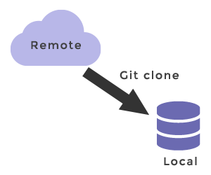

# Git commands (Tips & Tricks)

## Contents

 - [git clone](#git-clone)
 - [git branch](#git-branch)
 - [`git checkout <branch-name>`](#git-checkout)
 - [git add](#git-add)
 - [git commit](#git-commit)
 - [git pull](#git-pull)
 - [git push](#git-push)

---

<div id="git-clone"></div>

## git clone

> O comando **clone** serve para criar um repositório na sua máquina local mesmo que seja uma cópia de um repositório em um servidor, por exemplo, o github.

**NOTE:**  
Em outras palavras, o comando **clone** faz download do código que está no servidor, mas ao mesmo tempo cria um repositório na sua máquina local.

  

---

<div id="git-branch"></div>

## git branch

Para entender o comando **git branch**, primeiro você deve saber o que é uma branch.

> Uma **branch** é um ramo do projeto, uma divisão do projeto se baseando na principal porém que esteja seguindo linhas de pensamento diferentes.

Por exemplo:

 - Correção de bugs de uma versão que está online estaria em uma Branch.
 - A atualização ou criação de um outro layout estaria em outra Branch.
 - A criação de alguma nova funcionalidade poderia estar em outra Branch diferente das anteriores.

O comando **git branch** sem nenhum argumento exibe as branchs visíveis, ou seja, aquelas que você já utilizou:

**CONSOLE:**  
```
git branch
```

**OUTPUT:**  
```
* git-docs
  linux-from-theory-to-practice
  master
  python-codes
```

> **NOTE:**  
> O **asterisco (*)** indica qual branch você estar nesse momento.

Para visualizar TODAS as branchs do seu *remote* utiliza-se **git branch -a**:


**CONSOLE:**  
```
git branch -a
```

**OUTPUT:**  
```
$ git branch -a
* git-docs
  linux-from-theory-to-practice
  master
  python-codes
  remotes/origin/HEAD -> origin/master        
  remotes/origin/ai-codes
  remotes/origin/akitando
  remotes/origin/analysis-of-algorithms       
  remotes/origin/aws-from-scratch-to-expert   
  remotes/origin/c-codes
  remotes/origin/cc-codes
  remotes/origin/compilers
  remotes/origin/database-theory-and-practice 
  remotes/origin/docker-guide
  remotes/origin/electrician
  remotes/origin/gcp-notes
  remotes/origin/git-docs
  remotes/origin/java-codes
  remotes/origin/javascript-codes
  remotes/origin/linux-from-theory-to-practice
  remotes/origin/lives
  remotes/origin/master
  remotes/origin/math-codes
  remotes/origin/old-ai
  remotes/origin/oop
  remotes/origin/python-codes
  remotes/origin/restful-api
  remotes/origin/rocketseat-samples
  remotes/origin/scientific-paper
  remotes/origin/settings
  remotes/origin/stack-bootcamp-ds-2021-10
  remotes/origin/the-black-swan
  remotes/origin/wsl-tips-and-tricks
```

> **NOTE:**  
> Vejam que agora nós estamos visualizando todas as branch, até as do remoto que nós nunca utilizamos.

Para deletar uma branch é muito simples basta digitar o comando com a opção **-D** mais o nome da branch que você deseja deletar:

**CONSOLE:**  
```
git branch -D <branch-name> 
```

**OUTPUT:**  
```
Deleted branch <branch-name> (was 4a80b57)
```

Para criar uma nova branch a partir da branch atual temos 2 alternativas:

 - `git branch <branch-name>`
 - `git checkout -b <branch-name>`

> **NOTE:**  
> A diferença é que a opção `git checkout -b <branch-name>` além de criar uma nova branch, ela já muda automaticamente para essa nova branch sem precisar utilizar o comando `git checkout <branch-name>`.

---

<div id="git-checkout"></div>

## `git checkout <branch-name>`

> O comando `git checkout <branch-name>` serve para você mudar/alternat de uma branch para outra.

> **NOTE:**  
> O comando `git checkout -b <branch-name>` além de criar uma nova branch, ela já muda automaticamente para essa nova branch sem precisar utilizar o comando `git checkout <branch-name>`.

**CONSOLE:**  
```
git checkout -b fix-999
```

**OUTPUT:**  
```
Switched to a new branch 'fix-999'
```

---

<div id="git-add"></div>

## git add

> O comando **git add** adiciona um arquivo ou diretório (ou vários) no **repositório local**, na **branch vigente** do mesmo.

É como você dissesse pro repositório:

```
"Hey repositório, eu tenho um arquivo/diretório novo aqui e quero que você guarde ele para mim, segura ele, mas não guarda ainda não tá?".
```

Repare que o repositório não terá ainda teu arquivo, ele apenas saberá que ele existe.

 - adiciona um arquivo/diretório no repositório local;
 - Na branch vigente;
 - Segura um arquivo/diretório mas não guarda no repositório ainda.

---

<div id="git-commit"></div>

## git commit

Com o comando **git commit** agora sim, você está entregando o arquivo/diretório para que o repositório guarde-o. Mas novamente, vale notar que este arquivo só está **versionado** (guardado), no **repositório local**, na **branch vigente**.

 - No **repositório local**
 - Na **branch vigente**

---

<div id="git-pull"></div>

## git pull

> O comando **git pull** baixa os documentos mais atuais do servidor (ex: GitHub), para o **repositório local** e **branch vigente**.

---

<div id="git-push"></div>

## git push

O comando **git push** vai envia tudo que está no seu **repositório local** e **branch vigente** para o repositório do servidor (Ex: github). Ou seja, só após você executar este comando é que as pessoas do projeto conseguirão ver o que você fez até então!

 - Primeiro, o comando **add** pede para guardar um arquivo/diretório;
 - Segundo, o comando **commit -m "msg"** guarda o/os arquivo/diretório no **repositório local** e **branch vigente**;
 - Terceiro, o comando **push** envia tudo que está no seu **repositório local** e **branch vigente** para o repositório do servidor (Ex: github).

---

**REFERENCES:**  
https://git-scm.com/book/pt-br/v1/  
https://git-scm.com/book/en/v2/  

---

Ro**drigo** **L**eite da **S**ilva - **drigols**
