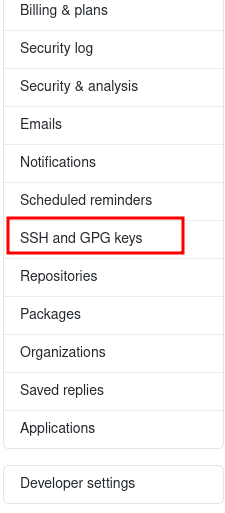
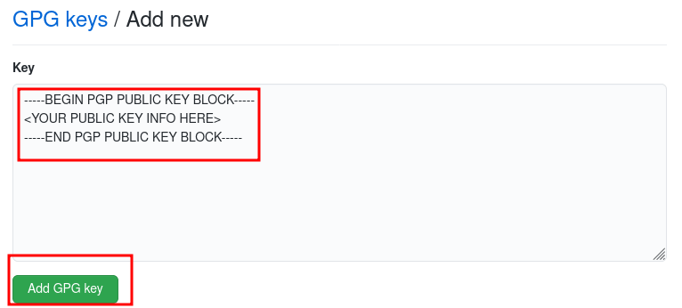

# Setting

## Contents

 - [Configurando sua identidade (Username + Email)](#identity)
 - [Verificando suas configurações (git config --list)](#check)
 - [Configurando uma chave GPG para assinar commits](#sign-commits)
 - [**References**](#references)

---

<div id="identity"></div>

## Configurando sua identidade (Username + Email)

A primeira coisa que você deve fazer quando instalar o **Git** é definir o seu:

 - **Nome de usuário;**
 - **Endereço de e-mail.**

Isso é importante porque todos os commits no **Git** utilizam essas informações, e está imutavelmente anexado nos commits que você realizar:

```python
$ git config --global user.name "drigols"
$ git config --global user.email drigols.creative@gmail.com
```
  
Relembrando, você só precisará fazer isso uma vez caso passe a opção <strong>--global</strong>, pois o Git sempre usará essa informação para qualquer coisa que você faça nesse sistema.

> **NOTE:**  
> Caso você queira sobrepor estas com um nome ou endereço de e-mail diferentes para projetos específicos, você pode executar o comando <strong>sem a opção --global</strong> quando estiver no próprio projeto.

---

<div id="check"></div>

## Verificando suas configurações (git config --list)

Caso você queira verificar suas configurações, você pode utilizar o comando **git config --list** para listar todas as configurações que o Git encontrar naquele momento:

```python
user.name=drigols
user.email=drigols.creative@gmail.com
core.editor=emacs
core.repositoryformatversion=0
core.filemode=true
core.bare=false
core.logallrefupdates=true
```

**NOTE:**  
Você também pode verificar qual o valor que uma determinada **chave** tem para o **Git** digitando **git config {key}**:

**Check username:**  
```python
git config user.name
drigols
```

**Check email:**  
```python
git config user.email
drigols.creative@gmail.com
```

---

<div id="sign-commits"></div>

## Configurando uma chave GPG para assinar commits

### Teoria Inicial

> Antes de configurar uma **chave GPG para assinar nossos commits**, primeiros nós devemos saber **"por que utilizar uma?"**.

Bem, se eu utilizar os comandos:

```bash
git config user.name your-user-name
```

e

```bash
git config user.email your-email
```

**NOTE:**  
Se eu adicionar o username de outra pessoa e o e-mail dela corretamente o Git vai entender que é ela quem está fazendo o commit. E isso nos gera um problema de **"autenticidade"**. Ou seja, eu não posso garantir que sou a pessoa **"x"** sem assinar o commit.

 - Do ponto de vista do Git, isso está realmente funcionando conforme o esperado. Os detalhes do committer são projetados apenas para identificar quem de seus colaboradores fez uma alteração e não devem ser usados ​​para autenticar pessoas.
 - Ser capaz de representar outros committers não introduz uma vulnerabilidade por si só:

No entanto, embora isso não seja uma vulnerabilidade de segurança em si, pode causar outros problemas. Ao ver um commit não assinado, **você não tem garantia de que**:

 - O autor é realmente a pessoa cujo nome está no commit.
 - A mudança de código que você vê é realmente o que o autor escreveu (ou seja, não foi adulterado).
 - Outro exemplo é alguém criando uma Pull Request maliciosa em um projeto de código aberto e fazendo com que pareça outra pessoa, por exemplo, alguém com uma grande reputação, co-autor dela, para tornar mais provável que o PR seja aceito (se você mantiver bibliotecas de código aberto, você sabe como pode ser demorado revisar completa e minuciosamente cada PR).

Em vez disso, criar o hábito de assinar seus commits do Git dá a você:

 - A capacidade de provar que você foi o autor de uma alteração de código específica.
 - Oferece a capacidade de garantir que ninguém possa modificar seu commit (ou seus metadados, como a hora em que você afirmou que foi feito) no futuro.

> **NOTE:**  
> Observe que só porque você assina seus commits do Git, isso não impede que outras pessoas se passem por você. Porém, **elas não podem garantir que são você**.

### Listando chaves GPG

Os comandos utilizados para listas chaves GPG no Linux são:

 - **gpg --list-keys:**
   - Lista as chaves públicas.
   - As chaves públicas são identificadas pelo campo **"pub"**.
   - Essas chaves ficam armazenas em `"~/.gnupg/pubring.kbx"`.
 - **gpg --list-secret-keys:**
   - Lista as chaves privadas.
   - As chaves privadas são identificadas pelo campo **"sec"**.
   - Essas chaves também ficam armazenas em `"~/.gnupg/pubring.kbx"`.

Por exemplo:

```bash
pub   rsa4096 2023-05-24 [SC]
      09AEE02AC25FED16041267B04A233C93156944C5 <--- YOUR PUBLIC KEY
uid           [ultimate] Test Key (This is a test key) <testkey@gmail.com>
sub   rsa4096 2023-05-24 [E]

sec   rsa4096 2023-05-24 [SC]
      09AEE02AC25FED16041267B04A233C93156944C5 <---- YOUR SECRET KEY
uid           [ultimate] Test Key (This is a test key) <testkey@gmail.com>
ssb   rsa4096 2023-05-24 [E]
```

> **Ué, as chaves (públicas e privadas) são as mesmas, por quê?**

O **GPG (GNU Privacy Guard)** mostra a mesma chave para os campos **"sec" (Secret)** e **"pub" (Public)** porque, no **GPG**, a chave pública e a chave privada são essencialmente partes da mesma chave.

Em **criptografia de chave pública**, um par de chaves é usado:

 - **A chave pública é usada para:**
   - Verificar assinaturas.
   - E criptografar mensagens para o proprietário da chave privada.
 - **A chave privada é usada para:**
   - Descriptografar esses dados.
 - **Ambas as chaves são matematicamente relacionadas e derivadas uma da outra.**

No **GPG**, quando você gera um par de chaves, a chave privada é armazenada em seu **chaveiro (keyring)** junto com sua identificação e outras informações associadas. A chave pública correspondente também é derivada da chave privada e é armazenada no chaveiro junto com a chave privada.

 - Ao listar as chaves com o comando **"gpg --list-keys"** ou **"gpg --list-secret-keys"**, você verá a mesma chave listada tanto para **"sec"** quanto para **"pub"**. Isso ocorre porque é a mesma chave, com a chave pública derivada da chave privada.
 - Portanto, quando você compartilha sua chave pública com outros usuários, eles podem usar essa chave para criptografar mensagens para você, e você pode usar sua chave privada correspondente para descriptografar essas mensagens.

Você também pode utilizar o argumento **"--keyid-format=long"** para listar o formato longo das chaves GPG e também obter os **IDs** das chaves públicas e privadas (que vai ser o mesmo ID para ambas).

Por exemplo:

```bash
pub   rsa4096/4A233C93156944C5 2023-05-24 [SC]
      09AEE02AC25FED16041267B04A233C93156944C5
uid                 [ultimate] Test Key (This is a test key) <testkey@gmail.com>
sub   rsa4096/F8B889612DA0BE52 2023-05-24 [E]

sec   rsa4096/4A233C93156944C5 2023-05-24 [SC]
      09AEE02AC25FED16041267B04A233C93156944C5
uid                 [ultimate] Test Key (This is a test key) <testkey@gmail.com>
ssb   rsa4096/F8B889612DA0BE52 2023-05-24 [E]
```

Nós exemplos acima:

 - **O ID da chave pública (pub):** 4A233C93156944C5
 - **O ID da chave privada (sec):** 4A233C93156944C5

### Criando um par de chave GPG

Se você não tiver uma chave, poderá gerar uma com o comando **"gpg --full-generate-key"**:

**INPUT:**
```bash
gpg --full-generate-key
```

O **GPG** lhe fará várias perguntas, responda e ela lhe retornará um output com várias informações sobre sua nova chave criada.

**OUTPUT:**
```bash
We need to generate a lot of random bytes. It is a good idea to perform
some other action (type on the keyboard, move the mouse, utilize the
disks) during the prime generation; this gives the random number
generator a better chance to gain enough entropy.
We need to generate a lot of random bytes. It is a good idea to perform
some other action (type on the keyboard, move the mouse, utilize the
disks) during the prime generation; this gives the random number
generator a better chance to gain enough entropy.
gpg: key ABA466EE517C403F marked as ultimately trusted
gpg: revocation certificate stored as 'source/.gnupg/openpgp-revocs.d/E43A4E0A13E0C738EC67B198ABA466EE517C403F.rev'
public and secret key created and signed.

pub   rsa3072 2023-05-24 [SC]
      E43A4E0A13E0C738EC67B198ABA466EE517C403F
uid                      test gpg (this is a GPG test key) <testgpg@gmail.com>
sub   rsa3072 2023-05-24 [E]
```

Você pode listar novamente para ver quais chaves você tem agora:

**INPUT:**
```bash
gpg --list-keys
```

**OUTPUT:**
```bash
pub   rsa3072 2023-05-24 [SC]
      E43A4E0A13E0C738EC67B198ABA466EE517C403F
uid           [ultimate] test gpg (this is a GPG test key) <testgpg@gmail.com>
sub   rsa3072 2023-05-24 [E]
```

### Ativando assinatura de commits no cliente Git

Antes de de fato adicionar nossas chaves GPG no cliente Git, nós precisamos configurar para ele aceitar assinatura de commits.

**INPUT:**
```bash
git config commit.gpgsign true
```

**INPUT:**
```bash
git config --list
```

**OUTPUT:**
```bash
...
...
...
core.logallrefupdates=true
```

### Adicionando o ID da chave GPG ao cliente Git

Aqui vai ser interessante você utilizar o argumento **"--keyid-format=long"** para pegar o ID da sua chave.

**INPUT:**
```bash
gpg --list-keys --keyid-format=long
```

**OUTPUT:**
```bash
pub   rsa4096/4A233C93156944C5 2023-05-24 [SC]
      09AEE02AC25FED16041267B04A233C93156944C5
uid                 [ultimate] Test Key (This is a test key) <testkey@gmail.com>
sub   rsa4096/F8B889612DA0BE52 2023-05-24 [E]
```

Em seguida, precisamos dizer ao nosso cliente Git para usar a chave GPG gerada para assinar os commits. Nós fazemos isso passando o **ID** da nossa chave para o argumento **"git config --global user.signingkey"**:

**INPUT:**
```bash
git config --global user.signingkey 4A233C93156944C5
```

Se você rodar o comando **"git config --list"** novamente vai ver que o ID da chave foi adicionado:

**INPUT:**
```bash
git config --list
```

**OUTPUT:**
```bash
user.name=your-git-username
user.email=your-git-email
user.signingkey=4A233C93156944C5
```

Agora, toda vez que você fizer um git commit, ele será assinado com esta chave GPG.

### Adicionando sua chave no GitHub

Bem, até aqui nós estamos apenas **assinando nossos commits com a chave pública**, mas para o GitHub verificar nós precisamos passar nossa chave pública completa para ele.

Para isso nós utilizamos o comando **"gpg --export key-id"**:

**INPUT:**
```bash
gpg --export 4A233C93156944C5
```

**OUTPUT:**
```bash
&����?4�߸��M����0�&O�#薸P�����<'��שx�⋝��֯�����
```

> **WHAT?**

**NOTE:**  
Bem isso acontece porque o comando **"gpg --export"** emite os dados em *binário*. Ou seja, isso não pode ser exibido diretamente como texto.

O que nós podemos fazer para resolver isso é transformar esse binário em hexadecimal (base16) com a opção **"-a"** ou **"--armor"**:

**INPUT:**
```bash
gpg --export 4A233C93156944C5
```

**OUTPUT:**
```bash
-----BEGIN PGP PUBLIC KEY BLOCK-----
mQINBGRuawABEACvSKRLFX9+h7Oyx8Txmj1e0c4ZL/tqv4i0YeIAwlYqlRih3PSr
2uXNV94vJoOicmGDM7nJhrUF2TQyWYK1CeOAUndouXxfYY38K8EsocS/+20lJp83
/h4FvPa4Aop3GfIO26ObJvUca0Ij6SflMx0svuofqPWl/8AkYngaJq3m+44eHz80
m9+4D/oUmE367/aKMPAmT4Yj6Ja4UPq687zziNE8J42h16l46OKLnebn1q+2wOXB
gzwDIBPsAEVPqKvsfDyLaTBXwBKdG3q5d6Hf3axBB0UCmDrPnc8mUSEEZCDcw6gi
rpf2BkaQihP434nU2yuXnWwqZO6Nz+0W/fSPelFFhH96zGfaogKOMk1nu/7lhYt/
Yog2RXO0ezvsre0XhRdTCll8EORyYDsmgZaMhyhdo6cNJdV9y6hMJ4kaS0hkXD+M
tLue9aRx8dDbAvF2wEP8Bml49xY4n+V/sJ5J7n2HHtyDtoLWUZiKX5tbVmMDZVEl
30mZNccvNHqvWUKLMQitnvITNldKyCqHhr0zroftPiPu1Z5n+zC+iHHjWUbT8GM0
aqqJwPpO32xdpCurKbbsV74ld9kvoxozo3um5hGTgxdjFiZbdrphGCDOpNGmzo+b
j9pdjDDxS+JdQNb6oMOZGmMLHsJ1hVCSVqXur8vk5rPjEhGFB4eOmgSfkQARAQAB
tDFUZXN0IEtleSAoVGhpcyBpcyBhIHRlc3Qga2V5KSA8dGVzdGtleUBnbWFpbC5j
b20+iQJOBBMBCgA4FiEECa7gKsJf7RYEEmewSiM8kxVpRMUFAmRuawACGwMFCwkI
BwIGFQoJCAsCBBYCAwECHgECF4AACgkQSiM8kxVpRMXhZg//WdrwsjbrQO7Ulq40
EdNlNQ2b+5+xIWg0AoFTSOC+1lHYs9sm7FMHjMCdqOpEEXE52itl2ucTgB2nqynr
KH7gzNGJNJd1qxaXYIf1/Djfof6AMZmA2yf4utN52SzEY34+f8Z9GMIVPgQ4xiC4
fi/48HzGYmabQhZJHueQHBkKppl8bQf4V8IOpMnYhEo3B27CGSNWUhWDi1tmxTZ2
tSD9qADWcHsrW7Ma60g8g5jd76xUs1NWhSjtWp07dwZnOO1/X5C4iMqg6/Nc6sJ3
R89EtW3iLm4/QsyqMH+NBFxQIT/qPv3m7A7vdIIWHrc0qrrjSXC36xJmLztCD1iL
8XkSrnTEedISQ177sMeyYXy+G8I6v9gNa7TwqeRgIFSoqGjuNhBrHWnXgZy927QS
yC71r97Kb/pyh0XC80oPQ6aPeZfiDziZKV+GTtEUrJhcD0Cj/gQ5WnRHW/GtzNcH
NfjwlccMemP5PGUwGezyQs/qNiBLnpGQ1QIFSa70HJFFSgr8U0O9OrjxqlUIw0eA
FtRdaBRV+9VTUp5K++D2JoBePv6UvperMNCboI0fTPHcMr62CrAiSQ1nMJ2/XPXh
8HEEnJypJcotZgR8IM+m68VCM/Jjwy607YaZXn4Arw7T+BASjkI24XKa8K19tO+7
1nqSJJPabEbAyWUSz5/jb+3pNmO5Ag0EZG5rAAEQANPuOzcduNxjGWY4YG623pfN
YVdCrluo5ltHNtgBURdrGhUuPq6XM2kXfz2aI96cljDvD1F8h2DLxOaK3LoXQTDf
9FnsogGKSNaSZnR9fcnmcuqyaqKdHwiygnXyXSu9zcq8TmtbbDs5KruoQO6GRYIY
7B1lb5g3nD+cD9N+Sse2nPcbMvzFV3y2rTywc6q6mGH+Bbn93OYVFZAB4AajRGzH
06r/aBv46rSoihCVy1baYGnpJDSzzhe8QQlMpA/oFCdcstp/XjWRK5zZgaYA88i4
pR4Ul/WRELt3auQVlUMLi3YsAdTVjS0cDfqsP34dMmCukJsytKGY95g0DJ7BPqWl
bRvXBNRGGpKV+5oPJa3p19NmwTO/OyynyNVaeeH7zX1YkPly00sLQMgEy6OGQv5d
r0joaOu6GJWCqlNo6RAhBEbMkjD2oha+x1k9fEpxyvqBgiBuP7uBRu+P5lOI75H1
GDvIce03i5IJkbKRAMOml+A+vCMnr+wd/0t/vce4F+EjZxf+KhAky7BJ6F/XJOgq
/VfUGD+xEIBBq621TNyCztynXR0oylvK97y74NT/0lK4uEEEr9/jO2cpuPbUxPVJ
0DTNVLPhH4Ze+b3nbfDvg8QzzrP1D4DuRT/RRryVXNRsway8tr4BOj8BbzJgeFs8
fm86i16DnbThI9lJpZtXABEBAAGJAjYEGAEKACAWIQQJruAqwl/tFgQSZ7BKIzyT
FWlExQUCZG5rAAIbDAAKCRBKIzyTFWlExVh8D/0cGE4qb8uByen8ab2GeRhBWLyN
IzK5YUeZdhL8okwm8vZOx9Wc+inkXQ/xaQ/R8AqKuZaHnwwiO+B0f5iJFVX2jGa3
qkIEA/mt/3nw2jg9deqgcpXodQehNvJuZcXgC3CZYXYz3kXe6E3lpIE21ZVl72XJ
24vKTSTnRlvLS5nkEmpn03zUyd4qRV2OzRHTa4siSDtqHSPuwsECnmo3E11IyEL7
d8icPaQntChwQUh4afP22xfMfekPUwxScMdSPu+9h0UiqsETIxB+Anx6SQN3zDpY
xuDPCsH/TkbkZRq3Wp8Lkxo9b5PbbXpXYvw6v3iW1Xsm41Fg3VDdPqRJ/zsUAJVw
abrhIQO/lgpD9nQlf7ofLogRflhgvSIr4NktYTIbWuBQ5HKpBilDGkEQuD7kKnLn
UST2YhBQZVHrhuXTlUWOdMnGwG5+pQc0+8nFXob7eIINuulkC4tKxVgf6OwCZ/LI
Xnud/12vZUO2OBF1Zj+oyi1j66ekSF11Y4MNFXy5J6FYlA0s1ZCtyDCsSiS73PZ4
RnqbGg+5Qsv9KEMjk77iDIC9M/vSUtnMFajMvKzPyCAjW58/4r+VvfbcDBMbN1VH
JMS/P+9v2xdGP0H2BObfVP18vpytWWBsJv0dyd1Ru6vfbOiJrfEqEAZg+plbwf21
5l3hK2Iff8w4J9VKAw==
=bOfB
-----END PGP PUBLIC KEY BLOCK-----
```

 - Ótimo, agora nós temos TODA nossa chave pública que vai ser utilizada pelo GitHub para garantir que somos nós que estamos assinando nosso commit.
 - **NOTE:** Outra observação é que se você quiser ver toda a sua chave **"privada"** rode o comando **"gpg --export-secret-key -a key-id"**.

Continuando... Copie todo o conteúdo das informações da chave pública, vá no GitHub em **settings/SSH and GPG Keys**:

  

Selecione **"New GPG key"**:

  

Cole todo o bloco de chave pública aqui e selecione **"Add GPG key"**:

  

Sua chave agora foi adicionada ao GitHub.

Quando um commit assinado for enviado para o GitHub, ele será verificado pela chave pública e o commit aparecerá como **“Verified”** nos logs de commit. Por exemplo:

  

### Salvando seu par de chaves

> **OK, mas eu tenho outro computador, como eu posso utilizar esse mesmo par de chaves nele?**

Existem várias abordagens, por exemplo, vamos baixar (exportar) esse par de chaves:

**INPUT:**
```bash
cd ~/Downloads/
```

**INPUT:**
```bash
gpg --export --armor YOUR_ID_KEY_HERE > public.asc
gpg --export-secret-keys --armor YOUR_ID_KEY_HERE > private.asc
```

> **NOTE:**  
> Você vai precisar colocar a **senha de acesso a chave** para exportar a *chave privada*.

Agora copie esses arquivos e coloque na máquina de destino. Com os arquivos na máquina nova, vamos importar a chave:

**INPUT:**
```bash
gpg --import public.asc private.asc
```

> **NOTE:**  
> Aqui você também vai precisar colocar a **senha de acesso a chave** para importar a *chave privada*.

<!--- ( References ) -->

---

<div id="references"></div>

## References

 - [Using GPG keys on GitHub: Creating and updating expired keys](https://inspirezone.tech/using-gpg-keys-on-github/)
 - [How (and why) to sign Git commits](https://withblue.ink/2020/05/17/how-and-why-to-sign-git-commits.html)
 - [ChatGPT](https://chat.openai.com/)

---

Ro**drigo** **L**eite da **S**ilva - **drigols**
