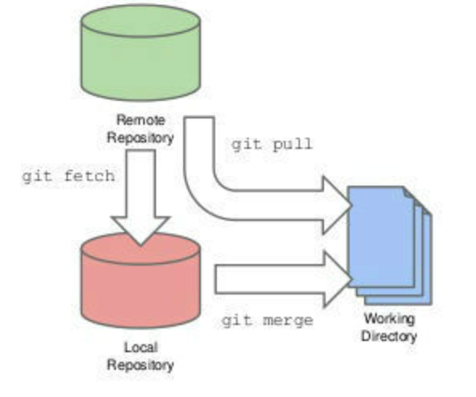
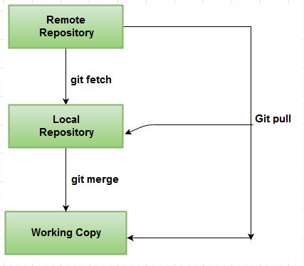

## Trabalhando com remotos (+fetch vs. pull)

## Contents

 - [Exibindo seus remotos](#show)
 - [Adicionando repositórios remotos](#add)
 - [Fazendo o fetch e pull de seus remotos (diferença de fetch e pull)](#fetch-pull)
 - [Pushing para seus remotos](#pushing)
 - [Removendo e renomeando remotos](#remove-rename)
 - [fetch vs. pull](#fetch-x-pull)

---

<div id="show"></div>

## Exibindo seus remotos

Para ver quais servidores remotos você configurou, você pode executar o comando **git remote** e ele listará o nome de cada remoto que você especificou. Se você tiver clonado seu repositório, você deve pelo menos ver um chamado ***origin*** — Esse é o nome padrão que o **Git** dá ao servidor de onde você fez o clone.

**CONSOLE:**  
```
git remote
```

**OUTPUT:**  
```
origin
```

Você também pode especificar **-v**, que mostra a URL que o Git armazenou para o nome do remoto:

**CONSOLE:**  
```
git remote -v
```

**OUTPUT:**  
```
origin  https://github.com/drigols/studies (fetch)
origin  https://github.com/drigols/studies (push)
```

Se você tem mais de um remoto, o comando lista todos. Por exemplo, meu repositório Grit se parece com isso.  

**CONSOLE:**  
```
git remote -v
```

**OUTPUT:**  
```
bakkdoor  git://github.com/bakkdoor/grit.git
cho45     git://github.com/cho45/grit.git
defunkt   git://github.com/defunkt/grit.git
koke      git://github.com/koke/grit.git
origin    git@github.com:mojombo/grit.git
```

**NOTE:**  
Isso significa que podemos puxar contribuições de qualquer um desses usuários muito facilmente. Mas note que somente o **remoto origin** é uma URL SSH, sendo o único pra onde eu posso fazer o push.  

---

<div id="add"></div>

## Adicionando repositórios remotos

Para adicionar um novo repositório remoto no **Git** com um nome curto, para que você possa fazer referência facilmente, execute `git remote add [nomecurto] [url]`:

**CONSOLE:** 
```
git remote
```

**OUTPUT:** 
```
origin
```

**CONSOLE:** 
```
$ git remote add pb git://github.com/paulboone/ticgit.git
```

**CONSOLE:** 
```
$ git remote -v
```

**OUTPUT:** 
```
origin git://github.com/schacon/ticgit.git
pb     git://github.com/paulboone/ticgit.git
```

**NOTE:**  
Agora você pode usar a string **pb** na linha de comando em lugar da URL completa. Por exemplo, se você quer fazer o fetch de todos os dados de Paul que você ainda não tem no seu repositório, você pode executar **git fetch pb**:

**CONSOLE:** 
```
$ git fetch pb
```

**OUTPUT:**  
```
remote: Counting objects: 58, done.
remote: Compressing objects: 100% (41/41), done.
remote: Total 44 (delta 24), reused 1 (delta 0)
Unpacking objects: 100% (44/44), done.
From git://github.com/paulboone/ticgit
 * [new branch]      master     -> pb/master
 * [new branch]      ticgit     -> pb/ticgit
```  

**NOTE:**  
O branch master de Paul é localmente acessível como **pb/master** — você pode fazer o merge dele em um de seus branches, ou fazer o checkout de um branch local a partir deste ponto se você quiser inspecioná-lo.

---

<div id="fetch-pull"></div>

## Fazendo o fetch e pull de seus remotos (diferença de fetch e pull)

Como você acabou de ver, para pegar dados dos seus projetos remotos, você pode executar:

```python
git fetch [remote-name]
```

 - Esse comando <strong>vai até o projeto remoto e pega todos os dados que você ainda não tem</strong>. Depois de fazer isso, você deve ter referências para todos os branches desse remoto, onde você pode fazer o <strong>merge</strong> ou <strong>inspecionar</strong> a qualquer momento.
 - Se você clonar um repositório, o comando automaticamente adiciona o remoto com o nome origin. Então, <strong>git fetch origin</strong> busca qualquer novo trabalho que foi enviado para esse servidor desde que você o clonou (ou fez a última busca).

<strong>OBSERVAÇÃO:</strong>  
É importante notar que o comando <strong>fetch</strong> traz os dados para o seu <strong>repositório local</strong> — ele não faz o merge automaticamente com o seus dados ou modifica o que você está trabalhando atualmente. Você terá que fazer o merge manualmente no seu trabalho quando estiver pronto.

**git pull**  
Se você tem um branch configurado para acompanhar um branch remoto, você pode usar o comando <strong>git pull</strong> para automaticamente fazer o <strong>fetch</strong> e o <strong>merge</strong> de um branch remoto no seu <strong>branch atual</strong>.

Executar <strong>git pull</strong> geralmente busca os dados do servidor de onde você fez o clone originalmente e automaticamente tenta fazer o merge dele no código que você está trabalhando atualmente.

---

<div id="pushing"></div>

## Pushing para seus remotos

Quando o seu projeto estiver pronto para ser compartilhado, você tem que enviá-lo para a fonte. O comando para isso é simples:

```
git push [remote-name] [branch]
```

Se você quer enviar o seu branch master para o servidor **origin**, então você pode rodar o comando abaixo para enviar o seu trabalho para o servidor:

```
git push origin master
```

**NOTE:**  
Este comando funciona apenas se você clonou de um servidor que você têm permissão para escrita, e se mais ninguém enviou dados no meio tempo. Se você e mais alguém clonarem ao mesmo tempo, e você enviar suas modificações após a pessoa ter enviado as dela, o seu **push** será rejeitado. Antes, você terá que fazer um pull das modificações deste outro alguém, e incorporá-las às suas para que você tenha permissão para enviá-las.

---

<div id="remove-rename"></div>

## Removendo e renomeando remotos

Se você quiser renomear uma referência, em versões novas do Git você pode rodar <strong>git remote rename</strong> para modificar um apelido de um remoto. Por exemplo, se você quiser renomear **pb** para **paul**, você pode com <strong>git remote rename</strong>:

```
$ git remote rename pb paul
$ git remote
origin
paul
```

**NOTE:**  
É válido mencionar que isso modifica também os nomes dos branches no servidor remoto. O que costumava ser referenciado como <strong>pb/master</strong> agora é <strong>paul/master</strong>.

Se você quiser remover uma referência por qualquer razão — você moveu o servidor ou não está mais usando um mirror específico, ou talvez um contribuidor não está mais contribuindo — você usa <strong>git remote rm</strong>:

```
$ git remote rm paul
$ git remote
origin
```

---

<div id="fetch-x-pull"></div>

## fetch vs. pull

 - **git fetch**
   - git fetch is the command that tells your local git to retrieve the latest meta-data info from the original (yet doesn’t do any file transferring. It’s more like just checking to see if there are any changes available).
   - If you only want to see all of the current branches and changes in your remote repository, Git fetch can get you all of the information you need without actually making any local changes to your work.
   - git fetch updates your remote-tracking branches under refs/remotes/<remote>/. This operation is safe to run at any time since it never changes any of your local branches under refs/heads.
   - git fetch is the command that says "bring my local copy of the remote repository up to date."
 - **git pull**
   - git pull on the other hand does that AND brings (copy) those changes from the remote repository.
   - git pull brings a local branch up-to-date with its remote version, while also updating your other remote-tracking branches.
   - git pull says "bring the changes in the remote repository to where I keep my own code."

### Visual representations:

  

---

  

---

  

---

  

---

  

---

**REFERENCES:**  
https://git-scm.com/book/pt-br/v1/  
https://git-scm.com/book/en/v2/  

---

Ro**drigo** **L**eite da **S**ilva - **drigols**
