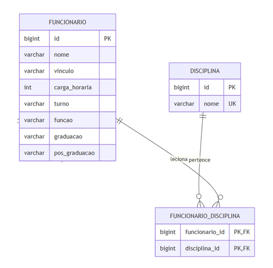
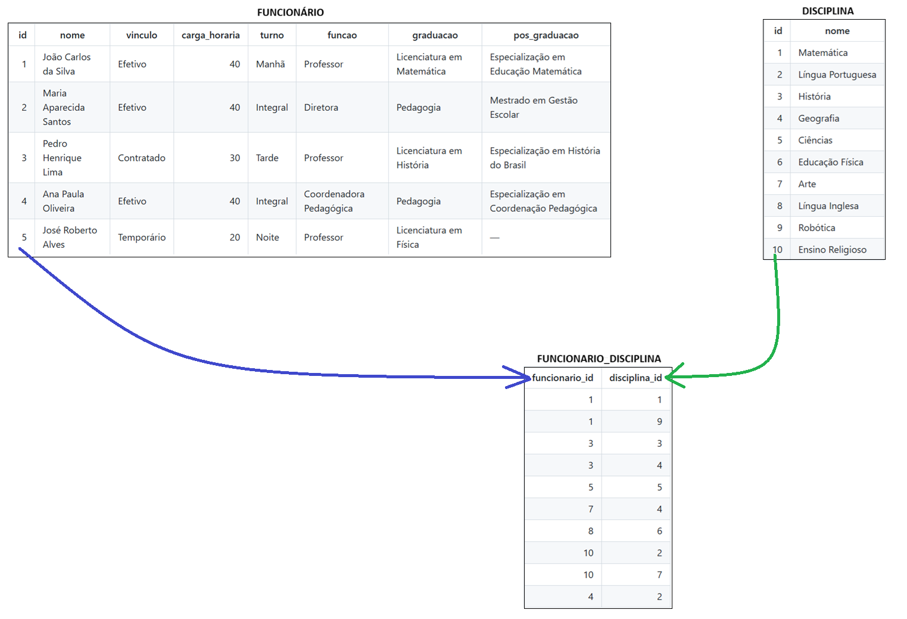
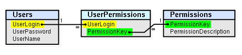

# Como criar uma "Entidade Associativa"

## Conteúdo

 - [`O que é uma Entidade Associativa?`](#intro)
 - **Exemplos de Tabela Associativa (ou tabela de junção):**
   - [`Entidade Associativa (tabela de junção) entre "Usuários" + "Permissões"`](#users-permissions)
 - [**REFERÊNCIAS**](#ref)
<!---
[WHITESPACE RULES]
- "20" Whitespace character.
--->


---

<div id="intro"></div>

## `O que é uma Entidade Associativa?`

Uma **Entidade Associativa** é uma *tabela base* que será responsável por mapear um relacionamento de `muitos-para-muitos (N:N)`.

  

No exemplo (mapeamento) acima nós temos que:

 - Um funcionário para lecionar (ter) várias disciplinas.
 - Uma disciplina para ter mais de um funcionário.

#### `Exemplo de registros`

  

 - Os campos `funcionario_id` e `disciplina_id` são *chaves estrangeiras* das tabelas **FUNCIONARIO** e **TURMA**.
 - A combinação dos campos `funcionario_id` e `disciplina_id` forma a **chave primária composta** da tabela:
   - Isso **impede** que o mesmo vínculo entre um funcionário e uma disciplina seja cadastrado mais de uma vez.
   - Mas **não impede** que um funcionário esteja associado a diversas disciplinas e que uma mesma disciplina seja ministrada por diversos funcionários.


---

<div id="users-permissions"></div>

## `Entidade Associativa (tabela de junção) entre "Usuários" + "Permissões"`

> Um exemplo prático do uso de uma **tabela associativa** é atribuir <u>permissões aos usuários</u>.

Pode haver vários usuários, e cada usuário pode receber zero ou mais permissões. Da mesma forma, uma permissão pode ser concedida a um ou mais usuários.

```sql
CREATE TABLE Users (
    UserLogin varchar(50) PRIMARY KEY,
    UserPassword varchar(50) NOT NULL,
    UserName varchar(50) NOT NULL
);

CREATE TABLE Permissions (
    PermissionKey varchar(50) PRIMARY KEY,
    PermissionDescription varchar(500) NOT NULL
);

-- Esta é a tabela de junção.
CREATE TABLE UserPermissions (
    UserLogin varchar(50) REFERENCES Users (UserLogin),
    PermissionKey varchar(50) REFERENCES Permissions (PermissionKey),
    PRIMARY KEY (UserLogin, PermissionKey)
);
```



### `Consultando em uma Entidade Associativa (tabela de junção)`

Uma instrução **SELECT** em uma `Entidade Associativa (tabela de junção)` normalmente envolve um *JOIN* entre a *tabela principal* e a *Entidade Associativa (tabela de junção)*:

```sql
SELECT
    *
FROM Users JOIN UserPermissions USING (UserLogin);
```

**OBSERVAÇÃO:**  
Isso retornará uma lista de todos os **usuários** e suas respectivas **permissões**.

### `Inserindo em uma Entidade Associativa (tabela de junção)`

Inserir dados em uma `Entidade Associativa (tabela de junção)` envolve várias etapas:

 - Primeiro, inserir nas tabelas principais;
 - E, em seguida, atualizar a tabela de junção.

```sql
-- Criando um novo usuário
INSERT INTO Users (UserLogin, UserPassword, UserName)
VALUES ('SomeUser', 'SecretPassword', 'UserName');

-- Criando uma nova permissão
INSERT INTO Permissions (PermissionKey, PermissionDescription)
VALUES ('TheKey', 'A key used for several permissions');

-- Por fim, atualizando a Entidade Associativa (tabela de junção)
INSERT INTO UserPermissions (UserLogin, PermissionKey)
VALUES ('SomeUser', 'TheKey');
```

**OBSERVAÇÃO:**  
Utilizando chaves estrangeiras, o banco de dados fará automaticamente a referência dos valores da tabela `UserPermissions` para suas respectivas tabelas.


---

<div id="ref"></div>

## `REFERÊNCIAS`

 - [Associative entity](https://en.wikipedia.org/wiki/Associative_entity)
 - [Table associations in relational databases](https://codeburst.io/table-associations-in-relational-databases-4da90ddbd642)

---

**Rodrigo** **L**eite da **S**ilva - **rodrigols89**
