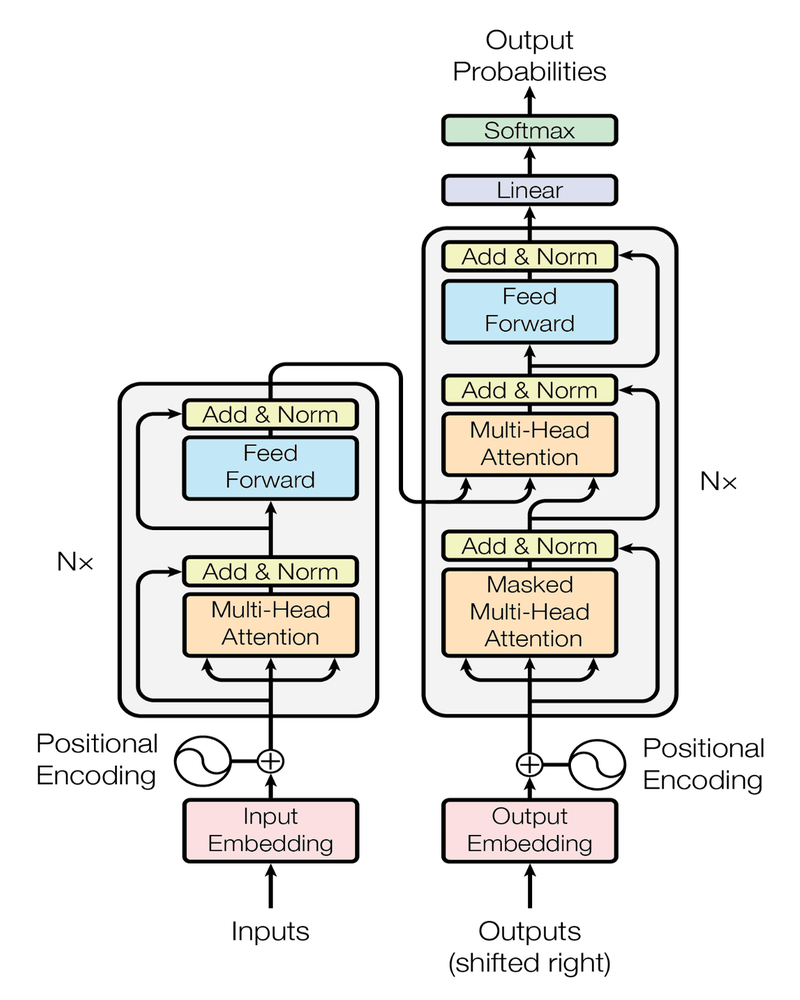
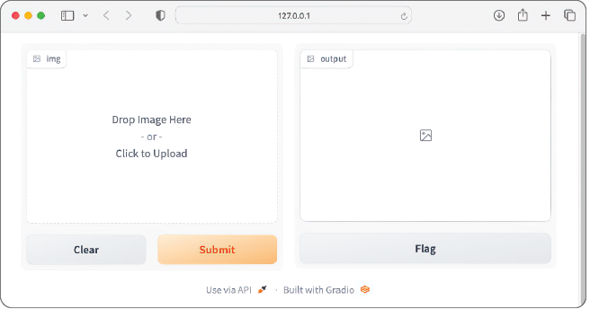
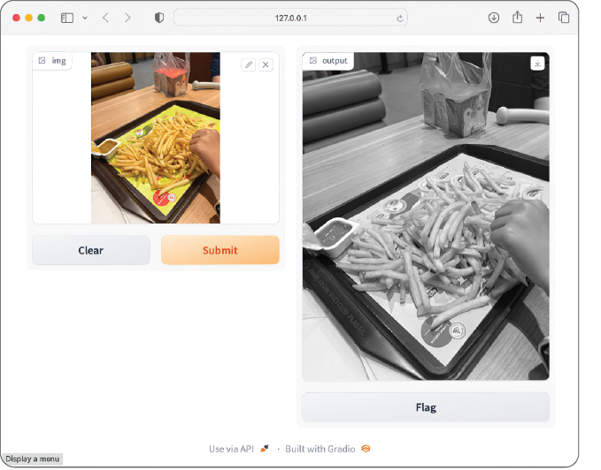

# Hugging Face in Action

- **1 Introduzindo o Hugging Face:**
  - [`Introdução à biblioteca Transformers`](#intro-to-transformers)
  - [`Modelos do Hugging Face`](#hugging-face-models)
  - [`Biblioteca "Gradio" do Hugging Face`](#hugging-face-gradio)
 - **Configurações:**
   - [Criando o Ambiente Virtual](#settings)
<!---
[WHITESPACE RULES]
- Same topic = "20" Whitespace character.
- Different topic = "200" Whitespace character.
--->


<!--- ( 1 Introducing Hugging Face ) --->

---

<div id="intro-to-transformers"></div>

## `Introdução à biblioteca Transformers`

A biblioteca `Transformers` é um pacote Python que contém implementações *open source* da [**Arquitetura Transformer (Attention Is All You Need)**](https://arxiv.org/abs/1706.03762) para modelos aplicados a tarefas de *texto*, *imagem* e *áudio*.

  


---

<div id="hugging-face-models"></div>

## `Modelos do Hugging Face`

> A **página de Modelos do Hugging Face Hub (https://huggingface.co/models)** hospeda diversos modelos pré-treinados para uma grande variedade de tarefas de *machine learning*.

 - Todos os modelos pré-treinados são armazenados em repositórios, e o Hugging Face facilita a exploração dos detalhes de cada modelo.
 - Muitos modelos possuem um *widget* que permite testá-los diretamente, executando inferências no navegador.


---

<div id="hugging-face-gradio"></div>

## `Biblioteca "Gradio" do Hugging Face`

 - Como desenvolvedor de IA, você passa muito tempo construindo e treinando seus modelos de *machine learning* ou *deep learning*.
 - Quando seu modelo é treinado de forma satisfatória, o próximo passo lógico é permitir que os usuários o testem.
 - Normalmente, isso significa criar uma interface dedicada (geralmente uma aplicação web) ou expor seus modelos por meio de uma API REST, o que exige gastar tempo desenvolvendo todas essas interfaces de usuário.

> **Não seria ótimo ter um pacote que expõe automaticamente o seu modelo para que os usuários possam testá-lo rapidamente?**  
> É aqui que o [Gradio](https://huggingface.co/gradio) entra em cena.

 - O [Gradio](https://huggingface.co/gradio) é uma biblioteca Python *open source* que facilita a criação de interfaces de usuário personalizáveis para modelos de *machine learning* e fluxos de trabalho de *data science*.
 - Com poucas linhas de código, você pode encapsular seu modelo em uma interface web simples, onde os usuários podem enviar entradas (como texto, imagens ou áudio) e visualizar as saídas em tempo real.
 - Ele é amplamente utilizado para demonstrar modelos, coletar feedback dos usuários e construir aplicações interativas de *machine learning*.
 - O [Gradio](https://huggingface.co/gradio) também se integra *perfeitamente* ao [Hugging Face Spaces](https://huggingface.co/spaces), permitindo que desenvolvedores compartilhem suas aplicações com a comunidade.

Para começar, primeiro vamos instalar o pacote `gradio`:

```bash
pip install -U gradio
```

Agora, para entender como o Gradio funciona, considere o seguinte exemplo. Suponha que você tenha uma função chamada `transform_image()` que recebe uma imagem e retorna a mesma imagem no formato em escala de cinza:

**Dependência Adicional:**
```bash
pip install -U scikit-image
```

[chapter01/gradio-01.py](codes/chapter01/gradio-01.py)
```python
import gradio as gr

from skimage.color import rgb2gray


def transform_image(img):
    return rgb2gray(img)


demo = gr.Interface(
    fn = transform_image,
    inputs = gr.Image(),
    outputs = "image"
)

demo.launch()
```

Quando você executa esse código, o Gradio hospeda sua aplicação na máquina local e cria uma interface de usuário (UI):

  
**O Gradio fornece uma interface de usuário personalizável para seus projetos de *machine learning*.**

Arraste uma imagem para o lado esquerdo da página e clique no botão **"Submit"** para enviar a imagem para a função `transform_image()`. O resultado será exibido no lado direito da página:

  


<!--- ( Configurações ) --->

---

<div id="settings"></div>

## Criando o Ambiente Virtual

**CRIANDO O AMBIENTE VIRTUAL:**  
```bash
python3 -m venv environment
```

**ATIVANDO O AMBIENTE VIRTUAL (WINDOWS):**  
```bash
source environment/Scripts/activate
```

**ATIVANDO O AMBIENTE VIRTUAL (LINUX):**  
```bash
source environment/bin/activate
```

**ATUALIZANDO O PIP:**
```bash
python -m pip install --upgrade pip
```

**INSTALANDO AS DEPENDENCIAS:**  
```bash
pip install -U -v --require-virtualenv -r requirements.txt
```

**Now, Be Happy!!!** 😬


