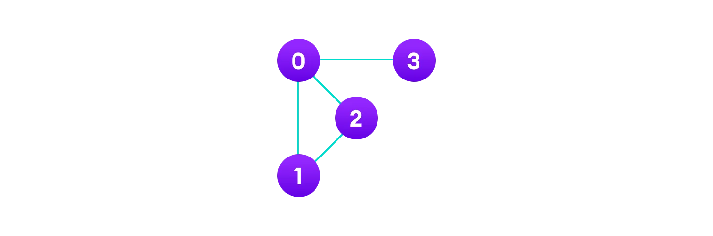
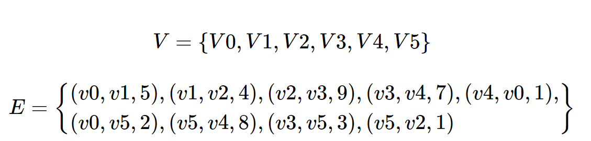
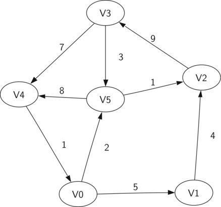
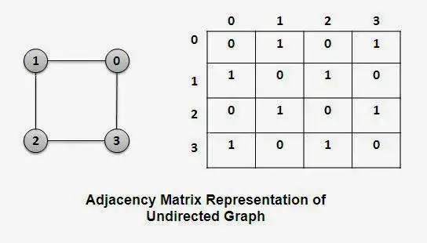
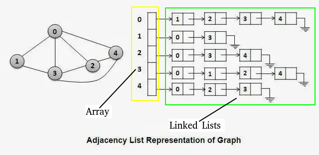
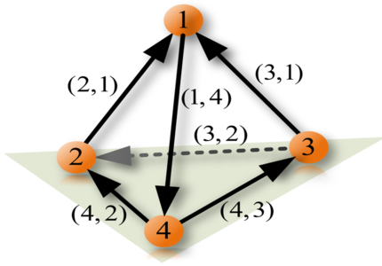

# Graphs

## Contents

 - **Fundamentals:**
   - [`What are the components of a graph?`](#intro-to-graphs)
 - [**Undirected Graphs**](#undirected-graph)
   - [Adjacency Matrix for Undirected Graphs](#adj-matrix-for-ug)
   - [Adjacency List for Undirected Graphs](#adj-list-for-ug)
 - [**Directed Graphs**](#directed-graph)
 - [REFERENCES](#ref)


<!--- ( Fundamentals ) --->

---

<div id="intro-to-graphs"></div>

## `What are the components of a graph?`

> **What are the (main) components of a graph?**

<details>

<summary>ANSWER</summary>

<br/>

> A ***Graph*** is a *non-linear* data structure consisting of **vertices (nodes)** and **edges**.

 - The vertices are sometimes also referred to as nodes.
 - The edges are lines or arcs that connect any two vertices (nodes) in the graph.

**NOTE:**  
More formally a *Graph* is composed of **"a set of vertices (V)"** and **"a set of edges (E)"**.

A Graph is denoted by **"G(V, E)"**. For example:

```bash
V = {0, 1, 2, 3}  # Set of vertices.
E = {(0, 1), (0, 2), (0, 3), (1, 2)}  # Set of edges.

G = {V, E}  # The Graph.
```

The **visual graph** to the above example is:

  

Looking at the example above we have more two concepts of graphs: 

 - **Adjacency:**
   - A *vertex* is said to be `adjacent` to another *vertex* if there is an edge connecting them.
   - **NOTE:** Looking at our visual example Vertices 2 and 3 are not adjacent because there is no edge between them.
 - **Path:**
   - A sequence of edges that allows you to go from vertex A to vertex B is called a path.
   - **NOTE:** Looking at our visual example *0-1* and *1-2* is a paths from *vertex 0* to *vertex 2*.

### Graphs with "weights"

 - *Edges* may be **weighted** to show that there is a cost to go from one vertex to another.
 - For example in a graph of roads that connect one city to another, the *weight* on the *edge* might represent the distance between the two cities.

For example, imagine we have a **"Graph = (V, E)"**, denoted by:

  

> **NOTES:**  
> See that again we have a **"set of vertices"** and a **"set of edges"**. However, `"our edges have weights"`.

See the graph for our example below:

  

 - **Cycle:**
   - A *Cycle* in a graph is a path that starts and ends at the same vertex:
     - For example, in our example above the path **(V5, V2, V3, V5)** is a cycle.
   - **NOTE:** A graph with no cycles is called an **"Acyclic Graph"**.
   - **NOTE:** A *Directed Graph* with no cycles is called a **Directed Acyclic Graph** or a **DAG**:
     - We will see that we can solve several important problems if the problem can be represented as a **DAG**.

</details>


<!--- ( Undirected Graphs ) --->

---

<div id="undirected-graph"></div>

## Undirected Graphs

> **When is a graph considered an "Undirected Graph"?**

<details>

<summary>ANSWER</summary>

<br/>

An ***"Undirected Graphs (Symmetry or Bidirectional)"*** is a *graph* where the *edges* do not have a specific direction and it is `bidirectional` in nature it does not have a parent-child relation concept as there is no particular direction.

For example:

  

#### Undirected Graph is Symmetry

 - *Symmetry* is present in the undirected graph as each edge is `bidirectional`, so it’s not like anyone’s the boss.
 - The graph is connected, so you can always find a way to get to any node you want to, and the degree of each vertex tells you how popular that node is in the graph.

#### Algorithms for Undirected Graphs

 - **Depth-First Search (DFS).**
 - **Breadth-First Search (BFS).**

</details>


<!--- ( Undirected Graphs/ Adjacency Matrix ) --->

---

<div id="adj-matrix-for-ug"></div>

## Adjacency Matrix for Undirected Graphs

> **What is an "Adjacency Matrix" for Undirected Graphs?**

<details>

<summary>ANSWER</summary>

<br/>

An ***Adjacency Matrix*** is one of the most popular ways to represent a graph because it's the easiest one to understand, implement and works reasonably well for many applications.

 - It uses an **"nxn matrix"** to represent a graph *(where "n" is the number of vertices in the graph)*.
   - In other words, the number of rows and columns is equal to the number of vertices in the graph.

To understand more easily, see the **Undirected Graph** and your **Adjacency Matrix** example below:

  

</details>


<!--- ( Undirected Graphs/ Adjacency List ) --->

---

<div id="adj-list-for-ug"></div>

## Adjacency List for Undirected Graphs

> **What is an "Adjacency List" for Undirected Graphs?**

<details>

<summary>ANSWER</summary>

<br/>

> An **Adjacency List** represents a graph as **an array (or list) of Linked Lists**. This approach is the most efficient way to store a graph.

 - It allows you to store only edges that are present in a graph:
   - Which is the opposite of an *Adjacency Matrix*, which explicitly stores all possible edges (both existent and non-existent).

To implement an *Adjacency List*, first, let's implement the **Node class to represent each Vertex of the Graph**:

  

See that:

 - **We have an Array of Linked Lists:**
   - *Each index* in the array *represents a Vertex*:
     - `| 0 | 1 | 2 | 3 | 4 |`
   - Each index (vertex) has a linked list where each node contains the vertex to which the current index (vertex) is connected.

</details>


<!--- ( Directed Graphs ) --->

---

<div id="directed-graph"></div>

## Directed Graphs

> **When is a graph considered an "Directed Graphs"?**

<details>

<summary>ANSWER</summary>

<br/>

A **"Directed Graphs (Asymmetry or Unidirectional)"** is a *graph* that is `unidirectional` in this the edges have a specific direction and the edges have directions specified with them also a directed graph can contain cycles.

For example:



#### Directed Graphs is Asymmetry

*Asymmetry* is present in the Directed Graph as the edges are all one-way, so it’s not like everyone is on equal footing and the graph might not be connected, which means there might be some nodes that are totally out of the loop.

#### Algorithms for Directed Graphs

 - **Topological Sort.**
 - **Dijkstra’s Algorithm.**

</details>


<!--- ( REFERENCES ) --->

---

<div id="ref"></div>

## REFERENCES

 - [Python Graphs (Using dictionaries)](https://www.tutorialspoint.com/python_data_structure/python_graphs.htm)
 - [Graph Data Stucture](https://www.programiz.com/dsa/graph)
 - [Introduction to Graphs – Data Structure and Algorithm Tutorials](https://www.geeksforgeeks.org/introduction-to-graphs-data-structure-and-algorithm-tutorials/)
 - [Types of Graphs with Examples](https://www.geeksforgeeks.org/graph-types-and-applications/)
 - [Adjacency Matrix](https://www.programiz.com/dsa/graph-adjacency-matrix)
 - [Adjacency List](https://www.programiz.com/dsa/graph-adjacency-list)
 - [Data Structures & Algorithms in Python](https://learning.oreilly.com/library/view/data-structures/9780134855912/)
 - [Problem Solving with Algorithms and Data Structures using Python](https://runestone.academy/ns/books/published/pythonds/index.html)
 - [What is Undirected Graph? | Undirected Graph meaning](https://www.geeksforgeeks.org/what-is-unidrected-graph-undirected-graph-meaning/)
 - [What is Directed Graph? | Directed Graph meaning](https://www.geeksforgeeks.org/what-is-directed-graph-directed-graph-meaning/)
 - [Kruskal’s Minimum Spanning Tree (MST) Algorithm](https://www.geeksforgeeks.org/kruskals-minimum-spanning-tree-algorithm-greedy-algo-2/)
 - [Prim’s Algorithm for Minimum Spanning Tree (MST)](https://www.geeksforgeeks.org/prims-minimum-spanning-tree-mst-greedy-algo-5/)
 - [How to find Shortest Paths from Source to all Vertices using Dijkstra’s Algorithm](https://www.geeksforgeeks.org/dijkstras-shortest-path-algorithm-greedy-algo-7/)
 - [Breadth First Search or BFS for a Graph](https://www.geeksforgeeks.org/breadth-first-search-or-bfs-for-a-graph/)
 - [Depth First Search or DFS for a Graph](https://www.geeksforgeeks.org/depth-first-search-or-dfs-for-a-graph/)
 - [Difference between BFS and DFS](https://www.geeksforgeeks.org/difference-between-bfs-and-dfs/)
 - [Add and Remove Edge in Adjacency List representation of a Graph](https://www.geeksforgeeks.org/add-and-remove-edge-in-adjacency-list-representation-of-a-graph/)
 - [Convert Adjacency Matrix to Adjacency List representation of Graph](https://www.geeksforgeeks.org/convert-adjacency-matrix-to-adjacency-list-representation-of-graph/)
 - [Convert Adjacency List to Adjacency Matrix representation of a Graph](https://www.geeksforgeeks.org/convert-adjacency-list-to-adjacency-matrix-representation-of-a-graph/)
 - [Graph as adjacency list – Graph implementation 1](https://www.lavivienpost.net/graph-implementation-as-adjacency-list/)
 - [Weighted graph as adjacency list – Graph implementation 2](https://www.lavivienpost.net/weighted-graph-as-adjacency-list/)
 - [Representation of Graphs: Adjacency Matrix and Adjacency List](https://www.thecrazyprogrammer.com/2014/03/representation-of-graphs-adjacency-matrix-and-adjacency-list.html)

---

**Rodrigo** **L**eite da **S**ilva - **rodrigols89**

<details>

<summary></summary>

<br/>

ANSWER

```bash

```

  

</details>
