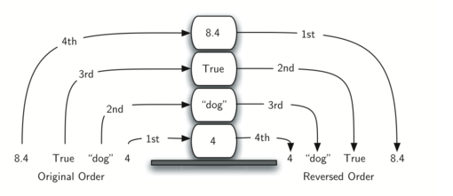

# Stacks (LIFO: Last-In, First-Out)

## Contents

 - **Stack using Arrays (Fixed Size Approach):**
 - **Stack using Linked List (Dynamic Size Approach):**
 - **Reverse Stack Problems:**
   - [`What types of problems are solved with "Reverse Stack"?`](#reverse-stack-theory)
   - [`Reversing a Word/Phrase`](#reversing-word-phrase)
 - [REFERENCES](#ref)
<!--- 
[WHITESPACE RULES]
- Same topic = "10" Whitespace character.
- Different topic = "50" Whitespace character.
--->


<!--- ( Reverse Stack Problems ) --->

---

<div id="reverse-stack-theory"></div>

## `What types of problems are solved with "Reverse Stack"?`

> **What types of problems are solved with "Reverse Stack"?**

<details>

<summary>ANSWER</summary>

</br>

Consider what happens when you reverse objects in a Stack. The order in which they are removed is exactly the reverse of the order in which they were placed.

For example, see the image below:

  

See that in the above image, we **reversed Python objects**:

 - **Before reverse:**
   - The "4" is the *base (or bottom)*.
   - The "8.4" is the *top*.
 - **After reverse:**
   - The "8.4" is the *base (or bottom)*.
   - The "4" is the *top*.

> **Ok, but when reverse stack is needed?**

 - **WEB BROWSER:**
   - For example, *every web browser* has a *Back button*;
   - As you navigate from web page to web page, those pages are placed on a stack *(actually it is the URLs that are going on the stack)*;
   - The current page that you are viewing is on the *top* and the first page you looked at is at the *base (or bottom)*;
   - If you click on the *Back button*, you begin to move in reverse order through the pages.
 - **A TEXT EDITOR (UNDO/REDO):**
   - A text editor that allows undo and redo operations can use a reserve stack to store undone operations. When the user clicks "undo", the last operation is popped from the reserve stack and pushed onto a redo stack.
 - **UNDO SYSTEM IN GAMES:**
   - In games, it is common to have an *undo system* to allow the player to undo their last actions. A reserve stack can be used to store undone actions, and when the player clicks "redo," the corresponding action is popped from the reserve stack and pushed onto a redo stack.
 - **FUNCTION CALL MANAGEMENT:**
   - A reserve stack can be used to manage function calls in a program. When a function is called, its arguments are pushed onto the reserve stack, and when the function returns, the arguments are popped.

</details>


<!--- ( REFERENCES ) --->

---

<div id="ref"></div>

## REFERENCES

 - **General:**
   - [Problem Solving with Algorithms and Data Structures using Python](https://runestone.academy/ns/books/published/pythonds/index.html)
   - [Introduction to Stack – Data Structure and Algorithm Tutorials](https://www.geeksforgeeks.org/introduction-to-stack-data-structure-and-algorithm-tutorials/)
   - [Implement a stack using singly linked list](https://www.geeksforgeeks.org/implement-a-stack-using-singly-linked-list/)
   - [Data Structures & Algorithms in Python](https://learning.oreilly.com/library/view/data-structures/9780134855912/)
   - [Runtime Calculator](https://www.timecomplexity.ai/)
   - [Big O Calc](https://www.bigocalc.com/)
   - [ChatGPT](https://chat.openai.com/)
   - [Bard](https://bard.google.com/)

---

Ro**drigo** **L**eite da **S**ilva - **drigols**

<details>

<summary></summary>

<br/>

ANSWER

```bash

```

  

</details>
