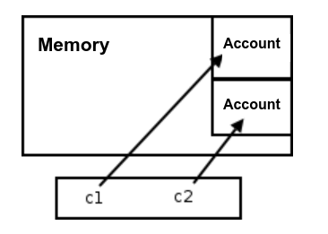
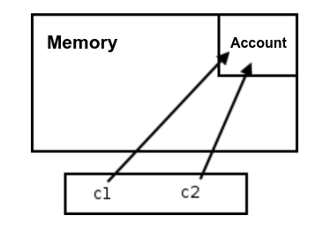

# Java

## Contents

 - **Object-Oriented Programming (OOP):**
   - **Classes & Objects:**
     - [References variables](#references-variables)
     - [Class attributes](#class-attributes)
   - [**Constructors**](#intro-to-constructors)
   - **Encapsulation:**
     - [Encapsulation problem and get/set solution](#encapsulation-problem)
 - **Web Development:**
 - **APIs:**
 - **Testing:**
 - **Databases:**
 - **Automation, Web scraping, Bots:**
 - **Command-Line Interface (CLI):**
 - **Tools:**
 - **Settings:**
   - [Java Development Kit (JDK)](#intro-to-jdk)
     - [Installing the JDK manually](#install-jdk)
   - **Compilation:**
     - [Compiling and running your first Java program](#ex01)
 - [**REFERENCES**](#ref)
<!--- 
[WHITESPACE RULES]
- Same topic = "10" Whitespace character.
- Different topic = "50" Whitespace character.
--->


<!--- ( OOP/Classes & Objects ) --->

---

<div id="references-variables"></div>

## References variables

> When we declare that a variable is associated with an object, the variable does not actually store the object but rather (mas sim) a way to access it, called a **"reference"**.

For example:

```java
Account myAccount; // Reference variable.
```

Now let's look at an example where we declare a reference variable and then instantiate an object:

```java
public static void main(String[] args) {
    Account c1;         // Reference variable.
    c1 = new Account(); // Instance Account Object.

    Account c2;         // Reference variable.
    c2 = new Account(); // Instance Account Object.
}
```

See that:

 - To instantiate an object, we use the **new** keyword.
 - The `c1` and `c2` are reference variables.

The code above will look something like this in memory:

  

Now, imagine we have the following code:

```java
Account c1 = new Account();

// Passes the memory address saved in reference variable c1 to c2.
Account c2 = c1;
```

The code above will look something like this in memory:

  

---

<div id="class-attributes"></div>

## Class attributes

To understand the need for **"Class Attributes"**, let's imagine we need to count how many objects have been created by class.

For example, how many accounts have been created by the class below?

```java
public static void main(String[] args) {
    Account c1;         // Reference variable.
    c1 = new Account(); // Instance Account Object.

    Account c2;         // Reference variable.
    c2 = new Account(); // Instance Account Object.
}
```

Visually, we can see that we have two instances of the `Account` class...

> **But how count and save that value?**  
> To solve that we can create a **"Class Attribute"**.

To create a **"Class Attribute"** we need to use the **"static"** keyword:

```java
class Account {

    // Class Attributes.
    private static int totalAccounts;

    // Instance Attributes.
    private int number;
    private String holder;
    private double balance;
    private double limit;

    // construtors.
    Account(String holder) {
        this.holder = holder;
    }

    Account() {
        Account.totalAccounts = Account.totalAccounts + 1;
    }
    
    // Get total accounts.
    public static int getTotalAccounts() {
        return Account.totalAccounts;
    }

  //...
}
```

See that now we have:

 - **Class Attributes:**
   - Used by any instance of the class.
   - **NOTE:** In other words, it is shared by all instances of the class.
 - **Instance Attributes:**
   - Used by only the current instance of the class.
 - **A constructor that increments each time a new instance is created.**
 - **Get method to show total accounts.**

For example, let's count how many accounts have been created by the class below:

**Drive:**
```java
public class Driver {
    public static void main(String[] args) {

        Account c1 = new Account();
        System.out.println("Total Accounts: " + c1.getTotalAccounts());

        Account c2 = new Account();
        System.out.println("Total Accounts: " + c2.getTotalAccounts());

        Account c3 = new Account();
        System.out.println("Total Accounts: " + c3.getTotalAccounts());

        Account c4 = new Account();
        System.out.println("Total Accounts: " + c4.getTotalAccounts());

    }
}
```

**OUTPUT:**
```bash
Total Accounts: 0
Total Accounts: 1
Total Accounts: 2
Total Accounts: 3
```

**Static Methods and Attributes:**  
Static Methods and Attributes can only access other methods and static attributes of the same class, which makes perfect sense since within a static method we do not have access to the `this` reference, as a static method is called through the class, and not an object.


<!--- ( OOP/Constructors ) --->

---

<div id="intro-to-constructors"></div>

## Constructors

To understand the need for **"constructors"**, let's imagine we have the following `Account` class:

[Account.java](src/Account.java)
```java
class Account {

    // Attributes.
    int number;
    String holder;
    double balance;
    double limit;
}
```

**Drive:**
```java
public class Driver {
    public static void main(String[] args) {

        Account c1 = new Account();

        System.out.println("Holder: " + c1.holder);
    }
}
```

**OUTPUT:**
```bash
Holder: null
```

Now think with me...

> **Make sense an Account without a Holder?**  
> *Not!* Ok, but how to force an Account to have a Holder?

### Constructors

> A constructor tells which arguments are required to instantiate an object.

For example, let's force an Account to have a Holder:

[Account.java](src/Account.java)
```java
class Account {

    // Attributes.
    int number;
    String holder;
    double balance;
    double limit;

    // construtor
    Account(String holder) {
        this.holder = holder;
    }
}
```

Now to instantiate an Account first we need to set a Holder:

**Drive:**
```java
public class Driver {
    public static void main(String[] args) {

        Account c1 = new Account("Rodrigo");

        System.out.println("Holder: " + c1.holder);
    }
}
```

**OUTPUT:**
```bash
Holder: Rodrigo
```


<!--- ( Encapsulation ) --->

---

<div id="encapsulation-problem"></div>

## Encapsulation problem and get/set solution

Here, let's analyze a possible problem when working with encapsulated data. For example, imagine we have the following `Account` class:

[Account.java](src/Account.java)
```java
class Account {

    // Attributes.
    private int number;
    private String holder;
    private double balance;
    private double limit;

    // construtor
    Account(String holder) {
        this.holder = holder;
    }
}
```

**NOTE:**  
Note that all attributes are **"private"**. In other words, we cannot access/modify them from outside the class.

For example:

**Drive:**
```java
public class Driver {
    public static void main(String[] args) {

        Account c1 = new Account("Rodrigo");
        c1.balance = 100.0;
    }
}
```

**OUTPUT:**
```bash
Driver.java:5: error: balance has private access in Account
        c1.balance = 100.0;
          ^
1 error
```

> **Okay, but how to solve this?**

### Getters and Setters

Getters and setters are used to access and modify private attributes. For example:

[Account.java](src/Account.java)
```java
class Account {

    // Attributes.
    private int number;
    private String holder;
    private double balance;
    private double limit;

    // construtor
    Account(String holder) {
        this.holder = holder;
    }

    public int getNumber() {
        return number;
    }

    public void setNumber(int number) {
        this.number = number;
    }

    public String getHolder() {
        return holder;
    }

    public void setHolder(String holder) {
        this.holder = holder;
    }

    public double getBalance() {
        return balance;
    }

    public void setBalance(double balance) {
        this.balance = balance;
    }

    public double getLimit() {
        return limit;
    }

    public void setLimit(double limit) {
        this.limit = limit;
    }
}
```

See that now we have two methods to each attribute:

 - **getAttribute:**
   - Just return the value.
   - **NOTE:** As this method returns a value, it has a type of the type of the returned value.
 - **setAttribute:**
   - Receives a new value and set him.
   - **NOTE:** As this method does not return anything, it is of type `void`.

Now, we can access/modify the attributes from outside the class by using the **getters** and **setters** methods:

**Drive:**
```java
public class Driver {
    public static void main(String[] args) {

        Account c1 = new Account("Rodrigo");
        c1.setBalance(100.0);

        System.out.println("Balance: " + c1.getBalance());
    }
}
```

**OUTPUT:**
```bash
Balance: 100.0
```


<!--- ( Settings/Java Development Kit (JDK) ) --->

---

<div id="intro-to-jdk"></div>

## Java Development Kit (JDK)

> The **Java Development Kit (JDK)** is a software development environment used for developing Java applications and applets.

It includes:

 - Java Runtime Environment (JRE).
 - An interpreter/loader (Java).
 - A compiler (javac).
 - An archiver (jar).
 - A documentation generator (Javadoc).
 - And other tools needed in Java development. 

  

---

<div id="install-jdk"></div>

## Installing the JDK manually

```bash
cd /opt/
```

```bash
sudo mkdir -p java/jdk && cd java/jdk
```

Now:

 - Download the [JDK](https://openjdk.org/projects/jdk/):
   - For example, here have [JDK 22](https://jdk.java.net/22/):
 - Move the JDK to `/opt/java/jdk`.
 - Finally, install JDK...

```bash
sudo tar xvzf <your-jdk>.tar.gz
```

 - Change to the new JDK directory:
 - Check your JDK version...

```bash
./bin/java -version
```

The version output of the JVM looks similar to this:

**OUTPUT:**  
```bash
openjdk version "22.0.2" 2024-07-16
OpenJDK Runtime Environment (build 22.0.2+9-70)
OpenJDK 64-Bit Server VM (build 22.0.2+9-70, mixed mode, sharing)
```

To ensure that a given application works correctly, we needs to know exactly how to locate the JVM.

Two main variables should be set: `JAVA_HOME` and `PATH`:

```bash
nano ~/.bashrc
```

```bash
export JAVA_HOME=/opt/java/jdk/jdk-22.0.2
export PATH=$JAVA_HOME/bin:$PATH
```

```bash
source ~/.bashrc
```

Now your java is configured to be recognized in any directory in the terminal.


<!--- ( Settings/Compilation ) --->

---

<div id="ex01"></div>

## Compiling your first Java program

Assuming that you already have the JDK installed, the most used programs to compile a Java program are:

 - **javac:**
   - Compiles Java source files.
 - **java:**
   - Runs a Java program.

For this example we will have the following directory and file structure:

```bash
firstproject/
├── src/
│   ├── Main.java
│   ├── Calculator.java
│   ├── MathUtils.java
├── test/
│   ├── CalculatorTest.java
│   └── MathUtilsTest.java
└── bin/
```

To create this project structure, you can use the following commands:

**Create the directory structure:**
```bash
mkdir -p firstproject/src \
firstproject/test \
firstproject/bin
```

**Create the files:**
```bash
touch firstproject/src/Main.java \
firstproject/src/Calculator.java \
firstproject/src/MathUtils.java \
firstproject/test/CalculatorTest.java \
firstproject/test/MathUtilsTest.java
```

Now, let's implement the useful Java classes and methods:

[Calculator.java](projects/firstproject/src/Calculator.java)
```java
public class Calculator {
    public int add(int a, int b) {
        return a + b;
    }

    public int subtract(int a, int b) {
        return a - b;
    }
}
```

[MathUtils.java](projects/firstproject/src/MathUtils.java)
```java
public class MathUtils {
    public static int square(int x) {
        return x * x;
    }
}
```

Now, let's implement the `Main.java `file:

[Main.java](projects/firstproject/src/Main.java)
```java
public class Main {
    public static void main(String[] args) {

        Calculator calculator = new Calculator();

        int sum_result = calculator.add(2, 3);
        System.out.println("Result: " + sum_result);

        int square_result = MathUtils.square(4);
        System.out.println("Square: " + square_result);
    }
}
```

Finally, let's implement some tests:

[CalculatorTest.java](projects/firstproject/test/CalculatorTest.java)
```java
public class CalculatorTest {
    public static void main(String[] args) {
        Calculator calculator = new Calculator();

        assert calculator.add(2, 3) == 5 : "Addition test failed";
        assert calculator.subtract(5, 3) == 2 : "Subtraction test failed";

        System.out.println("All Calculator tests passed.");
    }
}
```

[MathUtilsTest.java](projects/firstproject/test/MathUtilsTest.java)
```java
public class MathUtilsTest {
    public static void main(String[] args) {
        assert MathUtils.square(4) == 16 : "Square test failed";

        System.out.println("All MathUtils tests passed.");
    }
}
```

Ok, we have all the codes ready... Now let's compile them:

```bash
javac -d bin src/*.java test/*.java
```

 - **javac:**
   - Compile the Java source files.
 - **-d:**
   - Specify the output directory.
 - `src/*.java` and `test/*.java`:
   - The files to compile.

Now, if you look at the `\bin` directory, you will see the compiled files (`.class` files):

```bash
firstproject/

..............

└── bin/
│   ├── Calculator.class
│   ├── CalculatorTest.class
│   ├── Main.class
│   ├── MathUtils.class
│   ├── MathUtilsTest.class
```

Now, let's run the program (`Main.class`):

**INPUT:**
```bash
java -cp bin Main
```

 - **java:**
   - Run the Java program.
 - `-cp:`
   - Specify the *classpath*.
 - **bin:**
   - The directory containing the file(s) to run.
 - **Main:**
   - The name of the class to run.

**OUTPUT:**
```bash
Result: 5
Square: 16
```

Now, let's run the tests:

**INPUT:**
```bash
java -cp bin CalculatorTest && \
java -cp bin MathUtilsTest
```

**OUTPUT:**
```bash
All Calculator tests passed.
All MathUtils tests passed.
```


---

<div id="ref"></div>

## REFERENCES

 - **General:**
   - [JAVA E ORIENTAÇÃO A OBJETOS (Caelum/Alura)](https://www.alura.com.br/apostila-java-orientacao-objetos/)
 - **Settings:**
   - [Differences between JDK, JRE and JVM](https://www.geeksforgeeks.org/differences-jdk-jre-jvm/)
   - [Install Java manually on Linux](https://opensource.com/article/21/9/install-java-manually-linux)

---

**Rodrigo** **L**eite da **S**ilva
