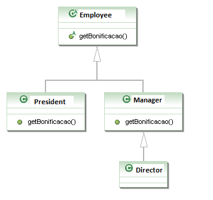
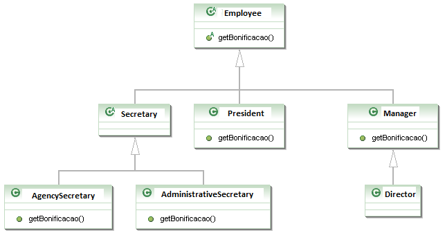

# Classes Abstratas

## Conteúdo

 - [01 - Classe Abstrata](#abstract-class)
 - [02 - Métodos Abstratos](#abstract-methods)
 - [03 - Aumentando o exemplo](#raising-the-example)

<div id="abstract-class"></div>

## 01 - Classe Abstrata

O que, exatamente, vem a ser a nossa classe Funcionario? Nossa empresa tem apenas **Diretores**, **Gerentes**, **Secretárias**, etc. Ela é uma classe que apenas idealiza um tipo, define apenas um *rascunho*.

Para o nosso sistema, é inadmissível que um objeto seja apenas do tipo Funcionario *(pode existir um sistema em que faça sentido ter objetos do tipo Funcionario ou apenas Pessoa, mas, no nosso caso, não)*.

**NOTE:**  
A palavra chave **abstract** impede que uma classe seja instanciada. Esse é o efeito direto de se usar o modificador **abstract** na declaração de uma classe:

[Employee.java](src/Employee.java)
```java
public abstract class Employee {

  //...
}

```

Por exemplo, se eu tentar dentro de outro programa (por exemplo em um main):

```java
Employee e = new Employee() // ERROR!!!
```

**NOTE:**  
O código acima retornaria um erro. Isso porque nossa classe [Employee.java](src/Employee.java) tem o modificador **abstract** na sua declaração.

**O problema é instanciar a classe - criar referência, você pode:**  
Se ela não pode ser instanciada, para que serve?

> **Serve para o polimorfismo e herança dos atributos e métodos, que são recursos muito poderosos**.

<div id="abstract-methods"></div>

## 02 - Métodos Abstratos

Levando em consideração que cada funcionário em nosso sistema tem uma regra totalmente diferente para ser bonificado, faz algum sentido ter esse método na classe Funcionario? Será que existe uma bonificação padrão para todo tipo de Funcionario? Parece que não, cada classe filha terá um método diferente de bonificação pois, de acordo com nosso sistema, não existe uma regra geral: queremos que cada pessoa que escreve a classe de um Funcionario diferente (subclasses de Funcionario) reescreva o método **getBonus()** de acordo com as suas regras.

Poderíamos, então, jogar fora esse método da classe Funcionario? O problema é que, se ele não existisse, não poderíamos chamar o método apenas com uma referência a um Funcionario, pois ninguém garante que essa referência aponta para um objeto que possui esse método. Será que então devemos retornar um código, como um número negativo? Isso não resolve o problema: se esquecermos de reescrever esse método, teremos dados errados sendo utilizados como bônus.

> Em uma **Classe Abstrata**, **podemos escrever que determinado método será sempre escrito pelas classes filhas**. Isto é, um **método abstrato**:

Ele indica que todas as classes filhas (concretas, isto é, que não forem abstratas) devem reescrever esse método ou não compilarão. É como se você herdasse a responsabilidade de ter aquele método.

**Como declarar um método abstrato?**  
Às vezes, não fica claro como declarar um método abstrato. Basta escrever a palavra chave **abstract** na assinatura do mesmo e colocar um ponto e vírgula em vez de abre e fecha chaves!

[Employee.java](src/Employee.java)
```java
public abstract class Employee {

  //..

  public abstract double getBonus();

  //...
}

```

**NOTE:**  
Agora quem herda da classe [Employee.java](src/Employee.java) obrigatoriamente terá que reescrever o método **getBonus()**.

Repare que não colocamos o corpo do método e usamos a palavra chave **abstract** para definir o mesmo. Por que não colocar corpo algum? Porque esse método nunca vai ser chamado, sempre que alguém chamar o método getBonus(), vai cair em uma das suas filhas, que realmente escreveram o método.

Qualquer classe que estender a classe Funcionario será obrigada a reescrever este método, tornando-o **"concreto"**. Se não reescreverem esse método, um erro de compilação ocorrerá.

<div id="raising-the-example"></div>

## 03 - Aumentando o exemplo

E se, no nosso exemplo de empresa, tivéssemos o seguinte diagrama de classes com os seguintes métodos:

  

Ou seja, tenho a classe abstrata Funcionario, com o método abstrato **getBonus()**; as classes Gerente e Presidente estendendo Funcionario e implementando o método **getBonus()**; e, por fim, a classe Diretor, que estende Gerente, mas não implementa o método **getBonus()**.

> **Essas classes vão compilar? Vão rodar?**

**A resposta é sim!**
E, além de tudo, farão exatamente o que nós queremos, pois, quando Gerente e Presidente possuem os métodos perfeitamente implementados, a classe Diretor, que não possui o método implementado, vai usar a implementação herdada de Gerente.

Agora dê uma olhada nessa incrementação do nosso diagrama de classes:

  

**Agora vem a pergunta chave:**  
Esse diagrama, no qual incluímos uma classe abstrata Secretary sem o método **getBonus()**, que é estendida por mais duas classes *(AgencySecretary, AdministrativeSecretary)* que, por sua vez, implementam o método **getBonus()**, vai compilar? Vai rodar?

**De novo, a resposta é sim!**  
Pois Secretary é uma classe abstrata e, por isso, o Java tem certeza de que ninguém vai conseguir instanciá-la e, muito menos, chamar o método **getBonus()** dela. Lembrando que, nesse caso, não precisamos nem ao menos escrever o método abstrato **getBonus()** na classe Secretary.

**Se eu não reescrever um método abstrato da minha classe mãe, o código não compilará.**  
Mas posso, em vez disso, declarar a classe como abstrata!

---

**Rodrigo Leite -** *Software Engineer*
