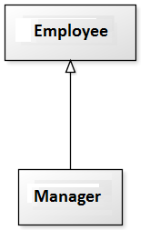
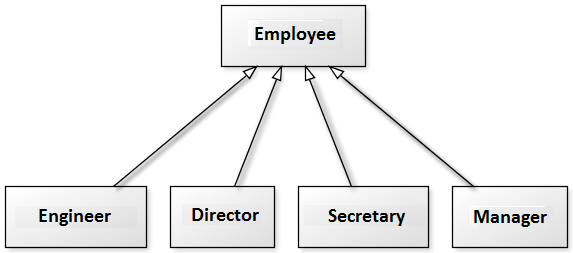

# Herança, Reescrita & Polimorfismo

## Conteúdo

 - [01 - Herança](#inheritance)
 - [02 - Reescrita](#rewriting)
 - [03 - Polimorfismo](#polymorphism)

<div id="inheritance"></div>

## 01 - Herança

Para começar com nossos exemplos, suponha que nós temos um Banco e queremos criar um sistema para o mesmo. Como toda empresa, nosso Banco possui Funcionários.

Vamos modelar a classe Funcionário:

[Employee.java](src/Employee.java)
```java
public class Employee {

  // Attributes.
  private String name;
  private String socialSecurity;
  private double salary;

  //...
}
```

Agora no nosso banco também temos um Funcionário com o cargo de Gerente. Será que é realmente necessário criar uma outra classe com todos os atributos que um Funcionário também tem?

Bem, é ai que entra o conceito de Herança. Nós podemos fazer com que nossa classe Gerente herde alguns atributos em comum com os Funcionários, mas também tenha os seus atributos específicos.

Para aplicar Herança em Java é muito simples, basta utilizar a palavra reservada **extends**:

[Manager.java](src/Manager.java)
```java
public class Manager extends Employee {

  private int password;
  private int managedEmployees;

  //...
}
```

Agora toda vez que criarmos um objeto do tipo Gerente, este objeto também possuirá os atributos definidos na classe Funcionário, pois um Gerente é um Funcionário:

  

**NOTE:**  
E se precisamos acessar os atributos que herdamos? Não gostaríamos de deixar os atributos de Funcionario, public, pois dessa maneira qualquer um poderia alterar os atributos dos objetos deste tipo. Existe um outro modificador de acesso, o **protected**, que fica entre o private e o public. Um atributo **protected** só pode ser acessado (visível) pela:

 - Própria classe;
 - Por suas subclasses;
 - E pelas classes que se encontram no mesmo pacote.

[Employee.java](src/Employee.java)
```java
public class Employee {

  // Attributes.
  protected String name;
  protected String socialSecurity;
  protected double salary;

  //...
}
```

**NOTE:**  
Uma classe pode ter várias filhas, mas pode ter apenas uma mãe, é a chamada herança simples do java.

  

<div id="rewriting"></div>

## 02 - Reescrita

Agora pensem o seguinte... Todo fim de ano, os Funcionários do nosso banco recebem um **bonus**:

 - Os Funcionários comuns recebem **10%** do valor do salário;
 - E os Gerentes **15%** do valor do salário.

Então, como aplicar isso na prática?

 - **Criar dois métodos?**
   - Um método de **10%** para os Funcionários comuns;
   - E outro método para os Gerentes com **15%**.

Bem, essa não é uma abordagem muito inteligente. O ideal aqui é nós aplicarmos o conceito de **Reescrita**, onde nós criamos um método na classe mãe com as carasterísticas mais comuns e *reescrevemos* esse método nas classes filhas, porém, mudando seu comportamento para se adequar as nossas necessidades.

Veja o exemplo abaixo:

[Employee.java](src/Employee.java)
```java
public class Employee {

  //...

  public double getBonus() {
    return this.salary * 0.10;
  }
}
```

Na classe mãe nós criamos o método com as características mais comuns **(10%)**, agora vamos *reescrever* esse método em uma classe filha para se adequar a nossa necessidade **(15%)**:

[Manager.java](src/Manager.java)
```java
public class Manager extends Employee {

  //...

  @Override
  public double getBonus() {
    return this.salary * 0.15;
  }
}
```

**NOTE:**  
Há como deixar explícito no seu código que determinado método é a *reescrita* de um método da sua classe mãe. Fazemos isso colocando **@Override** em cima do método. Isso é chamado de *anotação*. Existem diversas anotações e cada uma vai ter um efeito diferente sobre seu código.

Repare que, por questões de compatibilidade, isso não é obrigatório. Mas caso um método esteja anotado com **@Override**, ele necessariamente precisa estar reescrevendo um método da classe mãe.

Agora imagine que para calcular o **bonus** de um Gerente devemos fazer igual ao cálculo de um Funcionario porém adicionando **R$ 1000**.

Poderíamos fazer assim:

[Manager.java](src/Manager.java)
```java
public class Manager extends Employee {

  //...

  @Override
  public double getBonus() {
    return (this.salary * 0.10) + 1000;
  }
}
```

**Aqui teríamos um problema:**  
O dia que o **getBonus()** do Funcionario mudar, precisaremos mudar o método do Gerente para acompanhar a nova bonificação. Para evitar isso, o **getBonus()** do Gerente pode chamar o do Funcionario utilizando a palavra chave **super**:

[Manager.java](src/Manager.java)
```java
public class Manager extends Employee {

  //...

  @Override
  public double getBonus() {
    return super.getBonus() + 1000;
  }
}
```

**NOTE:**  
Essa invocação vai procurar o método com o nome **getBonus()** de uma super classe de Gerente. No caso ele logo vai encontrar esse método em Funcionario.

Essa é uma prática comum, pois muitos casos o método reescrito geralmente faz **"algo a mais"** que o método da classe mãe. Chamar ou não o método de cima é uma decisão sua e depende do seu problema. Algumas vezes não faz sentido invocar o método que reescrevemos.

<div id="polymorphism"><div>

## 03 - Polimorfismo

O que guarda uma variável do tipo Funcionario?

> **Uma referência para um Funcionario, nunca o objeto em si.**

```java
Employee employee // Reference.
```

Na herança, vimos que todo Gerente é um Funcionario, pois é uma extensão deste. Então, podemos nos referir a um Gerente como sendo um Funcionario.

Veja o código abaixo:

```java
Manager manage = new Manager();
Employee employee = manage; // Passes manager reference to employee reference.
employee.setSalary(5000.0);
```

**NOTE:**  
Basicamente, o código acima fez o seguinte: **Passsou a referência do *manage* para a referência *employee***.

> **O Polimorfismo é a capacidade de um objeto poder ser referenciado de várias formas.**

**NOTE:**  
Cuidado, polimorfismo não quer dizer que o objeto fica se transformando, muito pelo contrário, um objeto nasce de um tipo e morre daquele tipo, o que pode mudar é a maneira como nos referimos a ele.

Continuando... Se eu rodar o seguinte código:

```java
employee.getBonus();
```

O nosso retorno vai ser:
 - Do método na classe Funcionário?
 - Ou do método na classe Gerente?

**NOTE:**  
Bem, se você sabe o básico sobre referência de objetos você vai entender que vai ser **o método da classe Gerente**.

> Isso porque a referência **"employee"** tem no seu endereço de memória outra referência que é a do Gerente **(semelhante a ponteiros em C)**.

Agora suponha que nós temos que fazer um controle em todos esses bonus e devemos cadastrar todos os Funcionários (até os Gerentes).

Veja o código abaixo:

[BonusControl.java](src/BonusControl.java)
```java
class BonusControl {

  private double totalBonus = 0;

  public void registry(Employee employee) {
    this.totalBonus += employee.getBonus();
  }

  public double getTotalBonus() {
    return this.totalBonus;
  }
}
```

Agora vamos criar uma classe só para testar esse controle acima:

[TesteBonus.java](src/TesteBonus.java)
```java
public class TesteBonus {

  public static void main(String[] args) {
    
    BonusControl control = new BonusControl();

    Manager employee1 = new Manager();
    employee1.setSalary(5000.0);
    control.registry(employee1);
    System.out.println("Total Bonus: "+control.getTotalBonus());

    Employee employee2 = new Employee();
    employee2.setSalary(1000.0);
    control.registry(employee2);
    System.out.println("Total Bonus: "+control.getTotalBonus());
  }
}
```

**OUTPUT:**  
```java
Total Bonus: 1500.0
Total Bonus: 1600.0
```

**NOTE:**  
Repare que conseguimos passar um Gerente para um método que recebe um Funcionario como argumento. Pense como numa porta na agência bancária com o seguinte aviso: "Permitida a entrada apenas de Funcionários". Um gerente pode passar nessa porta? Sim, pois Gerente é um Funcionario.

---

**REFERENCES:**  
[HERANÇA, REESCRITA E POLIMORFISMO - Caelum](https://www.caelum.com.br/apostila-java-orientacao-objetos/heranca-reescrita-e-polimorfismo)

---

**Rodrigo Leite -** *Software Engineer*
