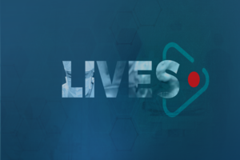

# Lives

> My *codes*, *notes* from online **Lives** and **Bootcamps**.

## Contents

 - **Artificial Intelligence:**
   - [Resolvendo o problema do Titanic no Kaggle (Mario Filho)](modules/ai/titanic/titanic-notebook.ipynb)

---

**Rodrigo Leite -** *drigols*
