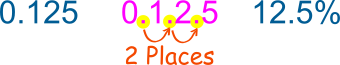
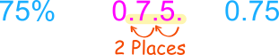

# Algebra

## Contents

 - **Algebraic Expressions:**
   - [Operator Precedence AKA Order of Operations](#operator-precedence)
 - [**Percents:**](#percents)
   - [Decimals to Percents (Move the decimal point 2 places to the right / →)](#decimals-to-percents)
   - [Percents to Decimals (Move the decimal point 2 places to the left / ←)](#percents-to-decimals)
   - [Percentage Difference (MathIsFun Link)](https://www.mathsisfun.com/percentage-difference.html)
   - **Tips & Tricks:**
     - [Percentages calculus are Symmetry (or Bidirectional)](#percentages-calculus-symmetry)
     - [Percent vs Percentage](#percent-vs-percentage)
   - **Percentages Questions:**
     - [Apples percentage question](#apple-question)
 - [**REFERENCES**](#ref)


<!--- ( Algebraic Expressions ) --->

---

<div id="operator-precedence"></div>

## Operator Precedence AKA Order of Operations

There are situations in algebra when more than one operator is used in an expression. We must now determine which operation to do first.

 - Anything in `parentheses ()` and `brackets {}` is calculated first, regardless of the operator inside.
 - *Exponents* and *square roots* are calculated second.
 - Third, *Multiplications* and *divisions*
 - Finally, we have the addition and subtraction.

For example, imagine we have the following expression:

$8 \div 2 (2 + 2)$

First, we need to solve the `parentheses ()`:

$8 \div 2 \cdot 4$

> **The division and multiplication have the same order of operations. How to solve that?**

**NOTE:**  
If the algebraic expression contains the same order of priority, the expression will be evaluated from **left to right (left➔right)**:

For example:

$8 \div 2 \cdot 4$  
$4 \cdot 4 = 16$


<!--- ( Percents ) --->

---

<div id="percents"></div>

## Percents

> When we say **"Percent"** we are really saying **"per 100"**.

For example, one percent (1%) means 1 per 100:

  

To understand more easily, let's take a look at the examples below:

**50% means 50 per 100:**
  

**25% means 25 per 100:**


Because **"Percent"** means **"per 100"** think:

> **"this should be divided by 100"**

**NOTE:**  
So, **75%** really means $\frac{75}{100}$.

---

<div id="decimals-to-percents"></div>

## Decimals to Percents (Move the decimal point 2 places to the right / →)

> To convert from decimal to percentage, we need to **"multiply the decimal number by 100** and **add the “%” sign**.

For example:

$0.125 \times 100\ = 12.5\%$  

**NOTE:**  
Another easy way to multiply by 100 is to move the decimal point 2 places to the right. For example:

  
**Move the decimal point 2 places to the right (and add the "%" sign!)**

**Example-01: Convert 0.35 to percent**  
```md
0.35 → 3.5 (zero here is removed) → 35.
Answer 0.35 = 35%
```

**Example: Convert 0.985 to percent**  
```md
0.985 → 9.85 (zero here is removed) → 98.5
Answer 0.985 = 98.5%
```

**Example: Convert 1.2 to percent**
```md
1.2 → 12. → 120.
Answer 1.2 = 120%

NOTE: See that here we had to adds a zero and not remove it.
```

---

<div id="percents-to-decimals"></div>

## Percents to Decimals (Move the decimal point 2 places to the left / ←)

> To convert from percentage to decimal, we need to **divide the percentage (%) by 100** and **remove the “%” sign**.

For example, let's convert **75%** to decimal:

$75\% = \frac{75}{100} = 0.75$  

**NOTE:**  
Another easy way to divide by 100 is to move the decimal point 2 places to the left. For example:

  
**Move the decimal point 2 places to the left, and remove the *"%"* sign.**  

**Example-01: Convert 8.5% to decimal**  
```md
8.5 → 0.85 → 0.085
```

**NOTE:**  
Note how we inserted an extra **"0"** as needed. So, the answer is **8.5% = 0.085**.

**Example-02: Convert 250% to decimal**  
```md
Move the decimal point two places to the left:
250. → 25. (zero here is removed, that's, not use 25.0) → 2.5
```

So, the answer is **250% = 2.5**.

---

<div id="percentages-calculus-symmetry"></div>

## Percentages calculus are Symmetry (or Bidirectional)

This little rule can make some percentage calculations easier:

**x% of y = y% of x**

For example:

 - **8% of 50** is the same as **50% of 8**:
   - And **50%** of **8** is **4**.
 - So, **8% of 50** is also **4**.

---

<div id="percent-vs-percentage"></div>

## Percent vs Percentage

In the Dictionary says:

 - *"Percentage"* is the *"result obtained by multiplying a quantity by a percent"*.
 - So 10 percent of 50 apples is 5 apples:
   - The 5 apples is the percentage.

**NOTE:**  
But in practice people use both words the same way.

---

<div id="apple-question"></div>

## Apples percentage question

Imagine we have 200 apples...

> ***15%* of *200* apples are bad. How many apples are bad?**

$15\% = \frac{15}{100}$  
$= \ \frac{15}{100} \times 200 = 15 \times \frac{200}{100}$  
$= 15 \times 2$  
$= 30$  

**NOTE:**  
So, 30 apples are bad.

> **Now imagine if only *10* of the *200* apples are bad, what percent is that?**

$As \ a \ fraction, \frac{10}{200} = 0.05$  
$As \ a \ percentage \ it \ is: \frac{10}{200} \times 100 = 5\%$  

**NOTE:**  
So, **"5%"** of those apples are bad.


<!--- ( REFERENCES ) --->

---

<div id="ref"></div>

## REFERENCES

 - **Algebraic Expressions:**
   - [How to Use Operator Precedence in Algebra](https://www.intmath.com/blog/mathematics/how-to-use-operator-precedence-in-algebra-12416)
   - [Expression example](https://www.instagram.com/p/Cw6GF4kLrz9/)
 - **Percents:**
   - [Percent example](https://www.instagram.com/p/Cw0qpWVPA46/)
   - [Percents (%)](https://www.mathsisfun.com/percentage.html)
   - [Convert Percents to Decimals](https://www.mathsisfun.com/converting-percents-decimals.html)
   - [Convert Decimals to Percents](https://www.mathsisfun.com/converting-decimals-percents.html)

---

Ro**drigo** **L**eite da **S**ilva - **drigols**
