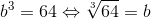
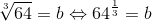
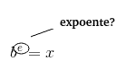
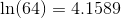

# Potenciação, Radicais e Logs

# Contents

 - [01 - Potenciação](#01)
 - [02 - Radicais (Raízes)](#02)
 - [03 - Logaritmos](#03)

<div id='01'></div>

## 01 - Potenciação

Bem, já no início dos nossos estudos vou deixar uma parte teórica muito importante que é explicar qual é o foco da potenciação.

> Dada uma base ***b*** e um expoente ***e*** qual o **resultado *x*** da potenciação?

  

Na potenciação nós queremos saber qual o **resultado da potenciação**, ou seja, **qual o valor de x**? Por exemplo, suponha que nós temos a seguinte potenciação: **2<sup>2</sup>**:

  

Veja que o foco aqui é o resultado da potenciação, por isso:

 - Dado um número ***b***;
 - E um expoente ***e***;
 - Qual o resultado? ***(x)***

Em Python, nós usamos o operador **`**`** (asterisco duplo):

[test_pow.py](src/test_pow.py)
```python
def test_pow(b, e):
  return b ** e

if __name__ =='__main__':
  x = test_pow(2, 2)
  print(x)

  x = test_pow(2, 3)
  print(x)

  x = test_pow(4, 7)
  print(x)
```

**OUTPUT:**  
```python
4
8
16384
```

**NOTE:**  
Multiplicar um número por si só duas ou três vezes para calcular o quadrado ou o cubo de um número é uma operação comum, mas você pode aumentar um número por qualquer exponencial. Por exemplo, a seguinte notação mostra 4 à potência de 7 (ou 4 x 4 x 4 x 4 x 4 x 4 x 4), que tem o valor:

  

Na terminologia matemática:

 - **4** é a base;
 - **7** é o expoente.

<div id='02'></div>

## 02 - Radicais (Raízes)

Bem, agora o jogo virou galera. Lembram que na potenciação o foco é saber qual o resultado da potenciação? Na radiciação o foco é saber **qual a base da potenciação**.

> Dado um resultado ***x*** e um expoente ***e*** qual a base ***b*** desta potenciação?

  

Para trabalhar com radiciação nós utilizamos o símbolo **&radic;** que tem a seguinte nomenclatura:


Veja que essas nomenclaturas podem ser equivalentes:

  

Embora seja comum precisar calcular a solução para uma determinada potenciação, às vezes você precisará calcular um ou outro dos elementos em si **(base ou expoente)**. Por exemplo, considere a seguinte expressão:


> Esta expressão está perguntando, dado um número 9 ***x*** e um expoente 2 ***e***, qual é a base ***b***?

Em outras palavras, qual número elevado ao expoente 2 resulta em 9? Este tipo de operação é referido como o cálculo da raiz e, neste caso particular, é a raiz quadrada. Nesse caso, a resposta é 3, porque **3 x 3 = 9**


 - Outras raízes comuns incluem a *raiz cúbica*:
   - A base para um número especificado dado o exponencial **3**.

Por exemplo, a raiz cúbica de 64 é 4 (porque 4 x 4 x 4 = 64). Para mostrar que esta é a raiz cúbica, incluímos o expoente 3 no símbolo **&radic;**, assim:


**NOTE:**  
> Veja que agora nós estamos mostrando o expoente **3**; quando nós estamos trabalhando com raizes quadradas (expoente = 2) nós omitimos esse valor no símbolo **&radic;**.

Podemos calcular qualquer raiz de qualquer número não negativo, indicando o expoente no símbolo **&radic;**.

> O pacote __math__ do Python inclui uma função __sqrt()__ que calcula a **raiz quadrada de um número**

[test_sqrt-v1.py](src/test_sqrt-v1.py)
```python
from math import sqrt

x = 25
print('Raiz quadrada de {0}: {1}'.format(x, sqrt(x)))
```

**OUTPUT:**  
```
Raiz quadrada de 25: 5.0
```

Até aqui tudo lindo e maravilhoso calcular uma raiz quadra de um número. A função sqrt() faz tudo sozinha, mas e para calcular a raiz de um número qualquer **b**?

 - **1ª -** Pega a raiz que você deseja saber e eleva ao expoente dado;
   - *Se o expoente estiver omitido já sabemos que é uma raiz quadrada*
 - **2ª -** Pega o número 1 e divine pelo expoente dado.

Vai ficar algo parecido com isso:


Bem, suponha que nós queremos a **raiz cúbica de 64** como vimos antes e vamos começar com uma imagem para abstrair e ver a relação da radiciação e exponenciação:



Como ficaria isso seguindo os 2 passos para saber a raiz de qualquer número?



Vamos ver na prática isso em Python:

[test_sqrt-v2.py](src/test_sqrt-v2.py)
```python
def my_sqrt(x, e):
  b = round(x ** (1. / e))
  print("A raiz de {0} elevado {1}ª potência: {2}".format(x, round(e), b))

if __name__ =='__main__':
  x = float(input("Digite a raiz que você deseja saber: "))
  e = float(input("Elevado a qual potência essa raiz? "))

  my_sqrt(x, e)
```

**NOTE:**  
A função **round()** do Python é responsável por *arrendondar números*.

**OUTPUT:**  
```
# Teste com algumas entradas:
A raiz de 27.0 elevado 3ª potência: 3
A raiz de 64.0 elevado 3ª potência: 4
```

<div id='03'></div>

## 03 - Logaritmos

Ok, já sabemos que na *potenciação o foco é no resultado de uma potenciação*; na *radiciação o foco é na base de uma potenciação*... 

Mas e os expoentes?

> Dado um resultado/valor **x** e uma base ***b*** qual o expoente ***e***?

  

Então, é aqui que entra os **logaritmos**. A nomenclatura de um logaritmos é a seguinte:

  

Você pode lê isso da seguinde maneira:

  

Outras considerações é que os *logaritmos* também são equivalente aos conceitos que nós aplicamos a *potenciação* e *radiciação*. Veja as equivalências a seguir:


Vamos ver outro exemplo. Considere a seguinte expressão:

  

> Em outras palavras, dado um resultado/valor 16 **x** e uma base 4 **b** qual o expoente **e** devemos elevar essa equação?

A resposta para isso é 2, porque **4x4 = 16**. A notação se parece com isto:

  

Pode ser lido também da seguinte forma:
 - Logaritmos de 16
 - Na base 4

Em Python, você pode calcular o logaritmo de um número usando a função de **log()** do pacote **math**, indicando:

 - O número;
 - E a base.

[test_log.py](src/test_log.py)
```python
from math import log

def my_log(x, b):
  e = round(log(x, b))
  print("O logaritmo de {0} na base {1}: {2}".format(round(x), round(b), round(e)))

if __name__ =='__main__':
  x = float(input("Digite o número: "))
  b = float(input("Digite a base do logaritmo: "))

  my_log(x, b)
```

**OUTPUT:**  
```
O logaritmo de 1000 na base 10: 3
```

#### Logaritmos especiais - (Comum + Natural)

O ***logaritmo comum*** de um número é seu exponencial para a **base 10**. Você verá ocasionalmente isso escrito usando a notação de **log** usual com a base omitida:


Ou seja, nós omitimos a base 10.

Outro logaritmo especial é algo chamado ***log natural***.

> O ***log natural*** é um exponencial de um número para base **b**, onde **b** é uma constante com o valor aproximado de 2.718.

Esse número ocorre naturalmente em vários cenários, e você verá isso com frequência ao trabalhar com dados em muitos contextos analíticos.

O log natural às vezes é escrito como **ln**. Veja o exemplo a seguir:

  

Vamos testar esse **log natural** utilizando nossa função [test_log.py](src/test_log.py) passando:

 - O número 64;
 - E a base 2.718.

**NOTE:**  
Antes vamos tirar os arredondamentos para ficar mais claro nosso exemplo.

```python
from math import log

def my_log(x, b):
  e = log(x, b)
  print("O logaritmo de {0} na base {1}: {2}".format(x, b, e))

if __name__ =='__main__':
  x = float(input("Digite o número: "))
  b = float(input("Digite a base do logaritmo: "))

  my_log(x, b)
```

**OUTPUT:**  
```
O logaritmo de 64.0 na base 2.718: 4.159314338834953
```

Veja que realmente bateu o nosso teste.

#### math.log vs math.log10

Ok, mas se passarmos para a função **log()** da biblioteca *math* apenas o número que queremos saber o logaritmo, sem passar a base. Qual dos log ele vai retornar?

 - Log Comum?
 - Log Natual?

> **Log Natual**

Vamos fazer um teste para ver?

[test_logs-v2.py](src/test_logs-v2.py)
```python
import math

e = math.log(64)
print("O logaritmo de 64: {0}".format(e))
```

**OUTPUT:**  
```
O logaritmo de 64: 4.1588830833596715
```

Ok, então já sabemos como pegar o **Log Natural (ln)** e quando aparecer um problema onde será necessário utilizar o **Log Comum**?

Para a nossa felicidade o a biblioteca *math* tem uma outra função para logaritmos, a função **log10()**, especial para trabalhar com logaritmos na base 10. Vamos ver na prática?

[test_logs-v2.py](src/test_logs-v2.py)
```python
import math

e = math.log(64)
print("O Logaritmo Natural de 64: {0}".format(e))

e = math.log10(1000)
print("O Logaritmo Comum de 1000: {0}".format(round(e)))
```

**OUTPUT:**  
```
O Logaritmo Natural de 64: 4.1588830833596715
O Logaritmo Comum de 1000: 3
```

---

**Rodrigo Leite** *- Software Engineer*
