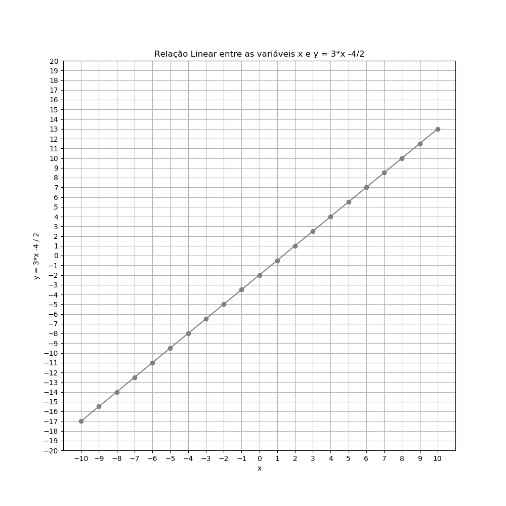
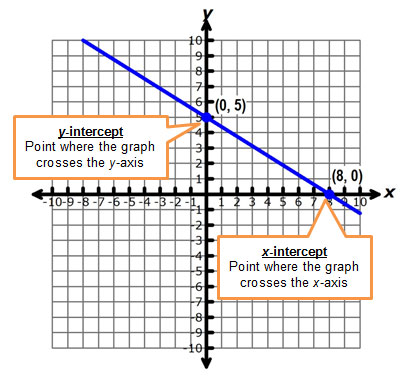

# Equações Lineares

Aqui mesmo nesse lindo e maravilhoso GitHub já estudamos sobre equações que incluíam **uma variável**, para a qual você resolveu a equação para encontrar seu valor - **Agora vamos ver as equações com várias variáveis**.

>  Por razões que se tornarão aparentes, as equações **com duas variáveis** ​​são conhecidas como **Equações Lineares**.

# Contents

 - [01 - Resolvendo uma Equação Linear](#01)
 - [02 - Introdução a Interceptações](#02)
 - [03 - Inclinação (Slope)](#03)
 - [04 - Desenhando uma reta para testar nossa inclinação (Slope/Gradient) a partir do ponto interceptação-y](#04)
 - [05 - Testando a inclinação a partir do ponto interceptação-y com a Equação da Reta: y = mx + b](#05)

<div id='01'></div>

## 01 - Resolvendo uma Equação Linear

Como sempre vamos começar bem básico. Considere a seguinte equação:

  

Essa equação inclui duas variáveis ​​diferentes, **x** e **y**.

 - **1ª -** Essas variáveis ​​dependem uma da outra;
 - **2ª -** O valor de **x** é determinado em parte pelo valor de **y** e **vice-versa**;

Portanto, não podemos resolver a equação e encontrar valores absolutos para **x** e **y**. No entanto, nós podemos resolver a equação para uma das variáveis e depois obter um resultado que descreve uma relação relativa entre as variáveis.

Por exemplo, vamos resolver esta equação para **y**. Primeiro, vamos nos livrar da constante à direita adicionando **1** a ambos os lados:

  

Em seguida, usaremos a mesma técnica para mover a constante da esquerda para a direita para isolar o termo **y** subtraindo **4** de ambos os lados:

  

Agora podemos lidar com o coeficiente de **y** dividindo os dois lados por **2**:

  

**NOTE:**  
Nossa equação agora está resolvida para **y**. Definimos **y** como **3x-4/2**.

Embora não possamos expressar **y** como um valor específico, *podemos calculá-lo para qualquer valor* de **x**. Por exemplo, se **x** tiver um valor 6, **y** pode ser calculado como:

  

**NOTE:**  
Lembre-se, que nós não temos apenas multiplicação no numerador; Ou seja, não da para simplificar direto.

Logo, isso vai dá o resultado **14/2** o qual pode ser simplificada para **7**:

  

Nós podemos visualizar os valores de **y** para um intervalo de valores **x** aplicando a equação a eles usando o seguinte código Python:

[eq01.py](src/eq01.py)
```python
import pandas as pd

# Cria um dataframe com uma coluna "x" com valores de -10 a 10.
df = pd.DataFrame ({'x': range(-10, 10+1)})

# Cria uma segunda coluna contendo para cada valor de "x" a nossa equação: 3*x - 4 / 2.
df['y'] = (3*df['x'] - 4) / 2

print(df)
```

**OUTPUT:**  
```
     x     y
0  -10 -17.0
1   -9 -15.5
2   -8 -14.0
3   -7 -12.5
4   -6 -11.0
5   -5  -9.5
6   -4  -8.0
7   -3  -6.5
8   -2  -5.0
9   -1  -3.5
10   0  -2.0
11   1  -0.5
12   2   1.0
13   3   2.5
14   4   4.0
15   5   5.5
16   6   7.0 <<<
17   7   8.5
18   8  10.0
19   9  11.5
20  10  13.0
```

Se você fizer as contas manual em uma folhinha de papel vai ver que realmente a nossa equação bate para valores de **x** na equação **y**.

Também podemos traçar esses valores para visualizar a relação entre **x** e **y** como uma linha.

> ***Por esse motivo, as equações que descrevem um relacionamento relativo entre duas variáveis ​​são conhecidas como equações lineares***

[eq_graph.py](src/eq_graph.py)
```python
from matplotlib import pyplot as plt
import pandas as pd

df = pd.DataFrame ({'x': range(-10, 10+1)})
df['y'] = (3*df['x'] - 4) / 2

plt.figure(figsize=(10, 10))
plt.plot(df.x, df.y, color="grey", marker = "o")
plt.xlabel('x')
plt.ylabel('y = 3*x -4 / 2')
plt.title("Relação Linear entre as variáveis x e y = 3*x -4/2")
plt.xticks(range(-10, 10+1, 1))
plt.yticks(range(-20, 20+1, 1))
plt.grid()
plt.savefig('../images/plot-01.png', format='png')
plt.show()
```

**OUTPUT:**  

  

Em uma equação linear, uma solução válida é descrita por um `par ordenado` de valores **x** e **y**. Por exemplo, soluções válidas para a equação linear acima incluem:

 - (-10, -17);
 - (0, -2);
 - (9, 11,5)...

O interessante das *Equações Lineares* é que podemos plotar os pontos de algumas soluções de pares ordenados específicos para criar a linha e, em seguida, interpolar o valor **x** para qualquer valor **y** `(ou vice-versa)` ao longo da linha.

<div id='02'></div>

## 02 - Introdução a Interceptações

Quando usamos uma *Equação Linear* para plotar uma linha, podemos ver facilmente onde a linha cruza os eixos **x** e **y** da plotagem. Esses pontos são conhecidos como *Interceptações*.

 - A **Interceptação x** é o local onde a linha cruza o eixo **x** (horizontal):
   - *Nesse ponto o meu **y** vai ser sempre zero.*
 - E a **Interceptação y** é o local em que a linha cruza o eixo **y** (vertical):
   - *Nesse ponto o meu **x** vai ser sempre zero.*

Vamos dar uma olhada na linha da nossa *Equação Linear* com os eixos **x** e **y** mostrados através da origem **(0,0)**:

[plot_intercepts.py](src/plot_intercepts.py)
```python
from matplotlib import pyplot as plt
import pandas as pd

df = pd.DataFrame ({'x': range(-10, 10+1)})
df['y'] = (3*df['x'] - 4) / 2

plt.figure(figsize=(10, 10))
plt.plot(df.x, df.y, color="grey", marker = "o")
plt.xlabel('x')
plt.ylabel('y = 3*x -4 / 2')
plt.title("Relação Linear entre as variáveis x e y = 3*x -4/2")
plt.xticks(range(-10, 10+1, 1))
plt.yticks(range(-20, 20+1, 1))
plt.axhline() # Adiciona uma linda na horizontal (h) - (eixo-x)
plt.axvline() # Adiciona uma linha na vertical (v) - (eixo-y)
plt.grid()
plt.savefig('../images/plot-02.png', format='png')
plt.show()
```

**OUTPUT:**  

  

 - A interceptação **x** é o ponto em que a linha cruza o eixo **x** e, nesse ponto, o valor **y** é sempre 0.
 - Da mesma forma, a interceptação em **y** é o local em que a linha cruza o eixo **y**, momento em que o valor **x** é 0.

Veja a imagem abaixo para ficar mais claro:

  

**NOTE:**  
Veja que realmente:

 - Quando a linha cruza o eixo **x** > **O valor de y é sempre 0**;
 - E quando a linha cruza o eixo **y** > **O valor de x é sempre 0**.

> Então, para encontrar as interceptações, precisamos resolver a equação de **x** quando **y** é ***0***.

Para a interceptação **x**, nossa equação é a seguinte:

  

**NOTE:**  
Lembram que para interceptação de **x** o valor de **y = 0**? Então, foi isso que nós fazemos acima.

Agora podemos multiplicar ambos os lados por 2 para se livrar da fração:

  

Em seguida, podemos adicionar **4** a ambos os lados para se livrar da constante à esquerda:

  

E, finalmente, podemos dividir os dois lados por **3** para obter o valor de **x**:

  

O que simplifica para:

  

Assim, a intersecção de **x** é **1`*`1/3** - `(aproximadamente 1,333)`.

**NOTE:**  
Para obter a interceptação em **y**, resolvemos a equação para **y** `quando x é 0`:

  

Como **3 vezes 0** é **0**, isso pode ser simplificado para:

  

E agora como **-4** dividido por **2** é **-2**, então:

  

E agora isso nos dá a interceptação em **y**, para que possamos plotar ambas as interceptações no gráfico:

 - ***x = 1, 333***
 - ***y = -2***

Vamos ver como fica isso em Python:

[eq_annotate.py](src/eq_annotate.py)
```python
from matplotlib import pyplot as plt
import pandas as pd

df = pd.DataFrame ({'x': range(-10, 10+1)})
df['y'] = (3*df['x'] - 4) / 2

plt.figure(figsize=(10, 10))
plt.plot(df.x, df.y, color="grey", marker = "o")
plt.xlabel('x')
plt.ylabel('y = 3*x -4 / 2')
plt.title("Relação Linear entre as variáveis x e y = 3*x -4/2")
plt.xticks(range(-10, 10+1, 1))
plt.yticks(range(-20, 20+1, 1))
plt.axhline() # Adiciona uma linda na horizontal (h) - (eixo-x)
plt.axvline() # Adiciona uma linha na vertical (v) - (eixo-y)
plt.annotate('x-intercept',(1.333, 0)) # Adiciona um texto em uma coordenada (x, y) predefinida.
plt.annotate('y-intercept',(0,-2)) # Adiciona um texto em uma coordenada (x, y) predefinida.
plt.grid()
plt.savefig('../images/plot-03.png', format='png')
plt.show()
```

**OUTPUT:**  

  

**NOTE:**  
A capacidade de calcular as interceptações para uma *Equação Linear* é útil, porque você pode calcular apenas esses dois pontos e desenhar uma linha reta através deles para criar a linha inteira para a equação.

<div id='03'></div>

## 03 - Inclinação (Slope)

> Uma abordagem interessante seria **quantificar a inclinação** de uma linha/reta (variável).

Por exemplo, *quantificar a inclinação* em termos de quanto **x** aumenta (ou diminui) para uma determinada mudança em **y**. Ou seja:

> **Quanto x aumenta quando y aumenta e vice-versa?**

Na notação para isso, usamos a letra grega **Δ (delta)** para representar a mudança:

  

Às vezes, a inclinação é representada pela variável **m**, e a equação é escrita como:

  

Mas, de onde vem essa fórmula? E qual sentido ela tem?

  

Pois bem... Se você olhar com atenção na imagem acima vai ficar bem claro que a equação é:

> A mudança no **eixo-y** divida pelo a mudança no **eixo-x**.

**Qual tipo de mudança? Positivo? Negativo?**  
Nós também temos que prestar atenção em qual tipo de mudança essa inclinação está representando:

 - Positiva?
 - Negativa?

Veja a imagem abaixo para ficar mais claro:

  

Ao medir a linha nós temos:

 - Começando da esquerda e cruzar para a direita é positivo **(mas cruzar para a esquerda é negativo)**;
 - Para cima é positivo;
 - E para baixo é negativo.

Por exemplo, essa linha abaixo como seria sua inclinação (Slope/Gradient)?

  

> Essa linha **desce** à medida que você se move, por isso tem uma **inclinação (Slope/Gradient) negativa**.

Vamos ver outro exemplo:

  

> Uma linha reta (horizontal) tem **inclinação (Slope/Gradient) zero**.

Agora vamos deixar mais divertido... E esse exemplo abaixo?

  

**NOTE:**  
Este último é um pouco complicado... **Você não pode dividir por zero**!.
Então a inclinação de uma linha **"reta para cima e para baixo"** (vertical) é **"indefinida"**.

Embora essa forma da equação seja pouco detalhada, ela nos dá uma pista de como calculamos a inclinação **(quanto está aumentando a inclinação)**. O que precisamos é de dois pares ordenados de valores **x**, **y** para a linha - por exemplo, sabemos que nossa linha passa pelos dois pontos a seguir:

 - (0, -2);
 - (6, 7).

Agora nós vamos:

 - Pegar os valores **x** e **y** do primeiro par e rotulá-los **x<sub>1</sub>** e **y<sub>1</sub>**;
 - E, em seguida, pegar os valores **x** e **y** do segundo par e rotulá-los como **x<sub>2</sub>** e **y<sub>2</sub>**.

Sabendo disso agora podemos inserir os pares ordenados em nossa equação de inclinação (Slope/Gradient):

  

É como no final nós temos uma fração imprópria **3/2** *(númerador > denominador)* podemos simplificar desta maneira:

  

Isso nos dá o resultado: **1,5**

OK, até ai tudo ótimo, mas o que isso realmente significa? Bem, isso nos diz que:

 - Para *cada mudança* de **1** em **x**; **y** muda por **1.1/2** ou **1.5**.
 - Portanto, se começarmos de qualquer ponto da linha e movermos 1 unidade para a direita *(ao longo do eixo X)*:
   - Precisaremos mover 1,5 unidades para cima *(ao longo do eixo Y)*.

<div id='04'></div>

## 04 - Desenhando uma reta para testar nossa inclinação (Slope/Gradient) a partir do ponto interceptação-y

Bem, agora que nós já sabemos sobre interceptações nos eixos **x** e **y** e também como calcular a **inclinação (tava de variação)** de uma Equação Linear.  
Com essas informações nós podemos testar se realmente isso bate com a nossa equação. Vamos ver isso com Python:


[test_slope.py](src/test_slope.py)
```python
from matplotlib import pyplot as plt
import pandas as pd

df = pd.DataFrame ({'x': range(-10, 10+1)})
df['y'] = (3*df['x'] - 4) / 2

plt.figure(figsize=(10, 10))
plt.plot(df.x, df.y, color="grey", marker = "o")
plt.xlabel('x')
plt.ylabel('y = 3*x -4 / 2')
plt.title("Relação Linear entre as variáveis x e y = 3*x -4/2")
plt.xticks(range(-10, 10+1, 1))
plt.yticks(range(-20, 20+1, 1))
plt.axhline() # Adiciona uma linda na horizontal (h) - (eixo-x)
plt.axvline() # Adiciona uma linha na vertical (v) - (eixo-y)
plt.annotate('x-intercept',(1.333, 0)) # Adiciona um texto em uma coordenada (x, y) predefinida.
plt.annotate('y-intercept',(0,-2)) # Adiciona um texto em uma coordenada (x, y) predefinida.

m = 1.5 # Salva a inclinação (slope) que nós calculamos.
yInt = -2 # Pega a interceptação no eixo "y" - (Quando x é zero).

# Traçar a inclinação (slope) da interceptação em y para 1x
mx = [0, 1] # Vai começar no x = 0 e aumentar 1 unidade, ou seja, x = 1.
my = [yInt, yInt + m] # y vai começar na interceptação -2, quando x = 0, e vai incrementar inclinação m = 1,5.
plt.plot(mx, my, color='red', lw=5)

plt.grid()
plt.savefig('../images/plot-04.png', format='png')
plt.show()
```

**OUTPUT:**  
  

 - **1ª -** Nós sabemos que o resultado da nossa *inclinação (slope)* é **1.5**:
   - Ou seja, sempre que aumentar **1** unidade em **x**; **y** vai aumentar **1.5**.
 - **2ª -** Nós começamos com **x = 0** e aumentamos uma unidade, **x = 1**;
 - **3ª -** O nosso **y** começou no **-2** e quando **x** aumentou **1** unidade; **y** aumentou **1.5** *(inclinação/slope)*:
   - Ou seja, o **y** foi de **-2** para **-0.5** no gráfico/plot.
 - **4ª -** Por fim, nós desenhamos uma linha/reta (vermelha) para demonstrar essa inclinação no gráfico/plot.

Se você prestar atenção no plot/gráfico você vai ver que realmente a nossa nossa função de inclinação **Δ (delta)** realmente bate.

<div id ='05'></div>

## 05 - Testando a inclinação a partir do ponto interceptação-y com a Equação da Reta: y = mx + b

> Uma das grandes vantagens das expressões algébricas é que você pode escrever a mesma equação de várias *maneiras* ou *formas* diferentes.

A forma generalizada de interceptação de inclinação é assim:

  

Nesta notação:

 - **m** é a inclinação;
 - E **b** é a interceptação em **y**:
   - Quando **x** é zero.

Por exemplo, vamos relembrar a equação linear resolvida com a qual trabalhamos até agora nesta seção:

  

Agora que sabemos a ***inclinação*** e a ***interceptação*** em **y** da linha que esta equação define, podemos reescrever a equação como:

  

Você pode ver intuitivamente que isso é verdade. Em nossa fórmula original da equação, para encontrar **y**:

 - Multiplicamos **x** por três;
 - Subtraímos **4**;
 - E dividimos por dois;
 - Em outras palavras, **x** é metade de **3x - 4**:
   - Que é **1,5x** - **2**.

Mas a Equação da Reta **(y = mx + b)** tem  tem a vantagem de ser mais simples e, incluindo duas informações importantes.

 - Conhecemos o **intercepto-y** pelo qual a linha passa **(0, -2)**:
   - Quando **x** é zero.
 - E conhecemos a inclinação da linha:
   - Para cada unidade aumentada em **x**, adicionamos **1,5** a **y**.

Agora vamos recriar nosso conjunto de valores de teste **x** e **y** para a **Equação da Reta** para causa o mesmo efeito de antes:

[new_form.py](src/new_form.py)
```python
from matplotlib import pyplot as plt
import pandas as pd

df = pd.DataFrame ({'x': range(-2, 2)})

# Define slope and y-intercept
m = 1.5 # Inclinação (Slope)
yInt = -2 # Interceptação "y" - (Quando X = 0)

# Adiciona a coluna "y" seguindo a nossa nova fórmula - y = m*x + b (b = ponto de interceptação y)
df['y'] = m*df['x'] + yInt

plt.figure(figsize=(10, 10))
plt.plot(df.x, df.y, color="grey")
plt.xlabel('x')
plt.ylabel('y')
plt.grid()
plt.axhline()
plt.axvline()

# Adiciona notação na interceptação "y" quando x = 0.
plt.annotate('y-intercept',(0, yInt))

# plota a inclinação da interceptçaão em y para 1x
mx = [0, 1]
my = [yInt, yInt + m]
plt.plot(mx,my, color='red', lw=5)
plt.savefig('../images/plot-05.png', format='png')
plt.show()
```

**OUTPUT:**  


Viram como foi mais simples e prático?

**NOTE:**  
Com essa equação agora você pode também:

> Escolha qualquer valor para **x** e encontrar o valor correspondente para **y**.

Por exemplo, quando **x** é **1**:

```python
Slope = 1.5
y-intercept = -2

y = 1.5*1 + (-2) = -0.5
```

Ou podemos escolher outro valor para **x**, como **7**:

```python
Slope = 1.5
y-intercept = -2

y = 1.5*7 + (-2) = 8.5
```

Para isso ficar mais claro, vamos pegar nosso script em Python que tem as relações entre os valores de **x** e os respectivos **y**:

[eq01.py](src/eq01.py)
```python
import pandas as pd

# Cria um dataframe com uma coluna "x" com valores de -10 a 10.
df = pd.DataFrame ({'x': range(-10, 10+1)})

# Cria uma segunda coluna contendo para cada valor de "x" a nossa equação: 3*x - 4 / 2.
df['y'] = (3*df['x'] - 4) / 2

print(df)
```

**OUTPUT:**  
```
     x     y
0  -10 -17.0
1   -9 -15.5
2   -8 -14.0
3   -7 -12.5
4   -6 -11.0
5   -5  -9.5
6   -4  -8.0
7   -3  -6.5
8   -2  -5.0
9   -1  -3.5
10   0  -2.0
11   1  -0.5 <<<
12   2   1.0
13   3   2.5
14   4   4.0
15   5   5.5
16   6   7.0
17   7   8.5 <<<
18   8  10.0
19   9  11.5
20  10  13.0
```

**NOTE:**  
Vale lembrar que os termos **m** e **b** da *Equação da Reta* também são conhecidos como:

 - **b -** Coeficiente Angular;
 - **m -** Coeficiente Linear.

Veja a imagem abaixo para ficar mais claro:

  

**NOTE:**  
 - **Coeficiente Angular (m):**
   - Veja que quando o coeficient angular é positivo nossa inclinação é positiva;
   - E quando é negativo a inclinação é negativa.
 - **Coeficiente Linear (b):**
   - O mesmo se aplica ao coeficient angular; Quando esse termo é positivo, deslocamos a reta positivamente;
   - E o resultado oposto se aplica quando o termo é negativo.

---

**REFERENCES:**  
[Revisão sobre interceptações em retas (interceptações em x e em y)](https://pt.khanacademy.org/math/algebra/two-var-linear-equations/x-and-y-intercepts/a/intercepts-of-lines-review-x-intercepts-and-y-intercepts)  
[Slope (Gradient) of a Straight Line](https://www.mathsisfun.com/geometry/slope.html)  
[Equation of a Straight Line](https://www.mathsisfun.com/equation_of_line.html)  
[Explore the Properties of a Straight Line Graph](https://www.mathsisfun.com/data/straight_line_graph.html)  

---

**Rodrigo Leite** *- Software Engineer*
