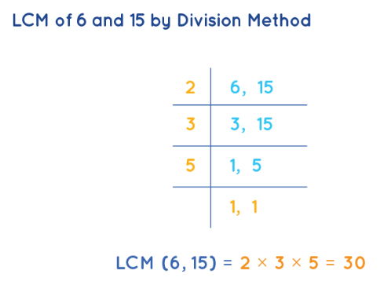
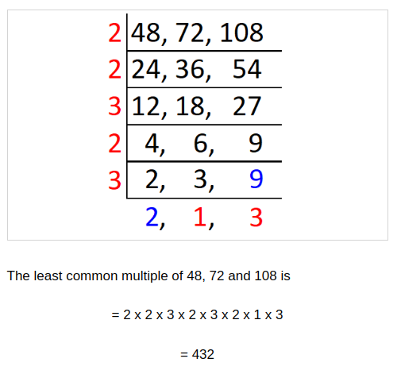
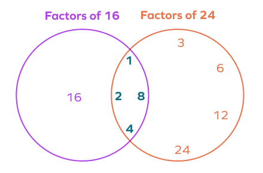

# Least Common Multiple (LCM) and Greatest Common Divisor (GCD)

## Contents

 - **Fundamentals:**
   - [What are Multiples of a Number?](#intro-to-multiple)
     - [Properties of Multiples](#multiple-properties)
   - [Prime Numbers](#intro-to-prime-numbers)
   - [Prime Factorization](#intro-to-prime-factorization)
   - [Divisors of a Number](#intro-to-divisors)
     - [Properties of Divisors](#divisors-properties)
 - [**Least Common Multiple (LCM):**](#intro-to-lcm)
   - [Finding LCM using Division Method](#finding-lcm-division)
   - [Finding LCM using Prime Factorization Method](#finding-lcm-prime-factorization)
 - [**Greatest Common Divisor (GCD):**](#intro-to-gcd)
 - [**References**](#ref)
<!--- 
[WHITESPACE RULES]
- Same topic = "5" Whitespace character.
- Different topic = "50" Whitespace character.
--->


<!--- ( Fundamentals ) --->

---

<div id="intro-to-multiple"></div>

## What are Multiples of a Number?

> Multiples of a number are the results of multiplying that number by any integer.

In other words, a multiple of a number **"x"** is a value that can be expressed as `x * n`, where `n` is an integer. For example, the multiples of **"3"** are:

3 x 0 = **0**  
3 x 1 = **3**  
3 x 2 = **6**  
3 x 3 = **9**  
3 x 4 = **12**  
3 x 5 = **15**  

Now, let's see some multiples of **"5"**:

5 x 0 = **0**  
5 x 1 = **5**  
5 x 2 = **10**  
5 x 3 = **15**  
5 x 4 = **20**  
5 x 5 = **25**  

---

<div id="multiple-properties"></div>

## Properties of Multiples

 - The smallest (or first) multiple of any number is zero, because `x * 0 = 0`.
 - All multiples of a number are divisible by it:
   - For example, **"6"** is a multiple of **"3"**, so `6 ÷ 3 = 2`.
 - Each number has infinitely many multiples, as we can multiply by any integer, positive or negative.


---

<div id="intro-to-prime-numbers"></div>

## Prime Numbers

Prime numbers are whole *"numbers greater than 1"* that have exactly two divisors:

 - The number 1.
 - And themselves.

In other words, a prime number can only be divided exactly (without a remainder) by **1** and the number **itself**.

For example:

 - The number **"5"** is prime because it can only be divided by **"1"** and **"5"**.
 - The number **"7"** is prime because its only exact divisions are 7 ÷ 1 and 7 ÷ 7.

**Examples of Prime Numbers:**

```md
2
3
5
7
11
13
17
19
23
29
31
37
```


---

<div id="intro-to-prime-factorization"></div>

## Prime Factorization

> The **Prime factorization** is the process of expressing a number as the product of prime numbers.

For example, let's factor the number **"60"** into its prime factors:

The smallest prime number is 2... So let's divide 60 by 2:

**60 ÷ 2 = 30**  

Now, divide 30 by 2 again:

**30 ÷ 2 = 15**  

15 is not divisible by 2, so we move to the next prime number, which is 3... So let's divide 15 by 3:

**15 ÷ 3 = 5**  

 - When we are factoring a number, the goal is to break the number down into prime factors, and when we reach a prime number, we can no longer divide it by any other numbers except **"1"** and **"itself"**.
 - So, we can stop here (if we continue the result will be the same).

For example:

**5 ÷ 5 = 1**  

Now we can express **60** as the product of its prime factors:

**60 = 2<sup>2</sup> × 3<sup>1</sup> × 5<sup>1</sup>**  

> **NOTE:**  
> The power (expoent) means how many times the prime number appears.

### Visualization with Factor Trees

This process can be represented using a **factor tree**, as shown in the previous explanation. Here's the factor tree for 60:

```md
                 60
                /  \
(Prime Factor) 2    30
                   /  \
   (Prime Factor) 2    15
                      /  \
      (Prime Factor) 3    5
                         /  \
         (Prime Factor) 5    1

60 = 2² × 3¹ × 5¹
```


---

<div id="intro-to-divisors"></div>

## Divisors of a Number

> **Divisors** of a number are all the integers that can divide that number without leaving a remainder (i.e., the division results in an integer).

For example, let's see the divisors of the number **12**:

12 ÷ 1 = **12**  
12 ÷ 2 = **6**  
12 ÷ 3 = **4**  
12 ÷ 4 = **3**  
12 ÷ 6 = **2**  
12 ÷ 12 = **1**  

So, the divisors of **"12"** are: 1, 2, 3, 4, 6, 12.

Now, let's see the divisors of the number **15**:

15 ÷ 1 = **15**  
15 ÷ 3 = **5**  
15 ÷ 5 = **3**  
15 ÷ 15 = **1**  

---

<div id="divisors-properties"></div>

## Properties of Divisors

 - **Every number has at least two divisors:**
   - The number 1 and itself.
   - For example, the divisors of 7 are 1 and 7 because 7 is a prime number.
 - **Divisors come in pairs:**
   - This happens because if `d` is a divisor of `n`, then `n/d` is also a divisor.
   - For example, for 12, the divisor pairs are `(1, 12), (2, 6), (3, 4)`.
 - **Prime numbers have exactly two divisors:**
   - The number 1 and the number itself.
   - For example, the divisors of 11 are 1 and 11, since 11 is prime.


<!--- ( Least Common Multiple (LCM) ) --->

---

<div id="intro-to-lcm"></div>

## Least Common Multiple (LCM)

> The smallest positive number that is a multiple of two or more numbers is known as the **"Least Common Multiple (LCM)"**.

To understand more easily see the multiples of the **2"** and **"5"** below:

**Multiples of 2:**    
2 x 0 = **0**  
2 x 1 = **2**  
2 x 2 = **4**  
2 x 3 = **6**  
2 x 4 = **8**  
2 x 5 = **10 (LCM)**  
2 x 6 = **12**  
2 x 7 = **14**  
2 x 8 = **16**  
2 x 9 = **18**  
2 x 10 = **20**  

**Multiples of 5:**  
5 x 0 = **0**  
5 x 1 = **5**  
5 x 2 = **10 (LCM)**  
5 x 3 = **15**  
5 x 4 = **20**  
5 x 5 = **25**  
5 x 6 = **30**  
5 x 7 = **35**  
5 x 8 = **40**  
5 x 9 = **45**  
5 x 10 = **50**  

Looking at the multiples above, which one is the smallest (or first) that is a multiple of both **"2"** and **"5"** simultaneously?

  

> **NOTE:**  
> See that the smallest (or first) one is the **"10"**.


---


<div id="finding-lcm-division"></div>

## Finding LCM using Division Method

> To find the **Least Common Multiple (LCM)** of two or more numbers, we can use the **Division Method**.

For example, let's see the LCM of **"6"** and **"15"**:

  

See that:

 - We find a *"Prime Number"* that *simultaneously* divides **"6"** and **"15"**.
 - When this *"Prime Number"* does not divide the two (or more) numbers simultaneously, we look for the next *"Prime Number"* that divides the two (or more) numbers simultaneously and continues until the divisions reach 1.
 - **NOTE:** Finally we multiply each of the *"Prime Numbers"* used and find the LCM.

See other examples of this method below:

**EXAMPLE-01:**  
  

**EXAMPLE-02:**  
  

> **NOTE:**  
> Note that in this example, since we didn't finish dividing until they all reached 1, we had to add the other numbers in the multiplication.


---

<div id="finding-lcm-prime-factorization"></div>

## Finding LCM using Prime Factorization Method

> To find the **Least Common Multiple (LCM)** of two or more numbers, we can use the **Prime Factorization** method.

For example, let's see the LCM of **"12"** and **"18"**:

**Prime Factorization of "12":**  

12 ÷ 2 = 6 (2 is prime)  
6 ÷ 2 = 3 (2 is prime)  
3 ÷ 3 = 1 (3 is prime)  

So, 12 = 2² × 3¹  

**Prime Factorization of "18":**  

18 ÷ 2 = 9 (2 is prime)  
9 ÷ 3 = 3 (3 is prime)  
3 ÷ 3 = 1 (3 is prime)  

So, 18 = 2¹ × 3³  

**The LCM is formed by the prime factors of both numbers, using the "largest exponent" of each factor:**

```bash
    Largest exponent of 18 Prime Factor
                   |
                   |
                   |
LCM(12, 18) = 2² × 3³ = 4 × 9 = 96
              |
              |
              |
  Largest exponent of 12 Prime Factor
```

So, the LCM of **"12"** and **"18"** is **"36"**.


<!--- ( Greatest Common Divisor (GCD) ) --->

---

<div id="intro-to-gcd"></div>

## Greatest Common Divisor (GCD)

> The greatest positive number that divides two or more numbers is known as the **"Greatest Common Divisor (GCD)"**.

**Divisors of 12:**  
12 ÷ 1 = **12**  
12 ÷ 2 = **6**  
12 ÷ 3 = **4**  
12 ÷ 4 = **3**  
12 ÷ 6 = **2**  
12 ÷ 12 = **1**  

**Divisors of 15:**  
15 ÷ 1 = **15**  
15 ÷ 3 = **5**  
15 ÷ 5 = **3**  
15 ÷ 15 = **1**  

> **What are the common divisors between *"12"* and *"15"*?**

**Answer:**  
*"1"* and *"3"*.

> **Now, what is the greatest?**  

**Answer:**  
*"3"*.

So the GCD between **"12"** and **"15"** is **"3"**.

Let's look at another example, but using the Venn Diagram:

**Divisors of 16:**  
16 ÷ 1 = **16**  
16 ÷ 2 = **8**  
16 ÷ 4 = **4**  
16 ÷ 8 = **2**  
16 ÷ 16 = **1**  

**Divisors of 24:**  
24 ÷ 1 = **24**  
24 ÷ 2 = **12**  
24 ÷ 3 = **8**  
24 ÷ 4 = **6**  
24 ÷ 6 = **4**  
24 ÷ 8 = **3**  
24 ÷ 12 = **2**  
24 ÷ 24 = **1**

**Venn Diagram:**  
  

So the **GCD** between **"16"** and **"24"** is **"8"**.


<!--- ( References ) --->

---

<div id="ref"></div>

## References

 - **Least Common Multiple (LCM):**
   - [LEAST COMMON MULTIPLE BY DIVISION METHOD](https://www.onlinemath4all.com/least-common-multiple-by-division-method.html)
   - [Least Common Multiple](https://www.mathsisfun.com/least-common-multiple.html)
   - [Least Common Multiple](https://www.cuemath.com/numbers/lcm-least-common-multiple/)
 - **Greatest Common Divisor (GCD):**
   - [Greatest Common Divisor (GCD): Definition, Methods,  Examples](https://www.splashlearn.com/math-vocabulary/greatest-common-divisor-gcd)

---

**Rodrigo** **L**eite da **S**ilva
