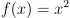
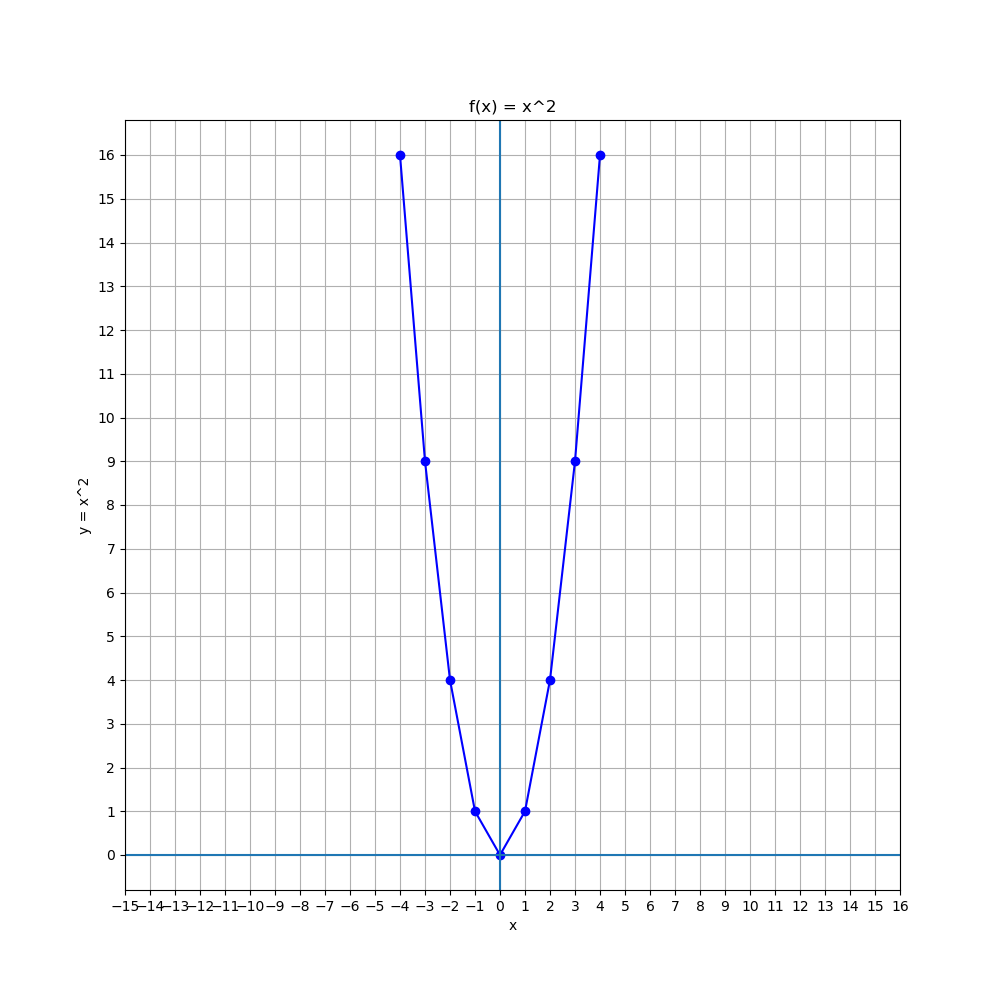
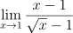
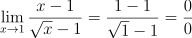
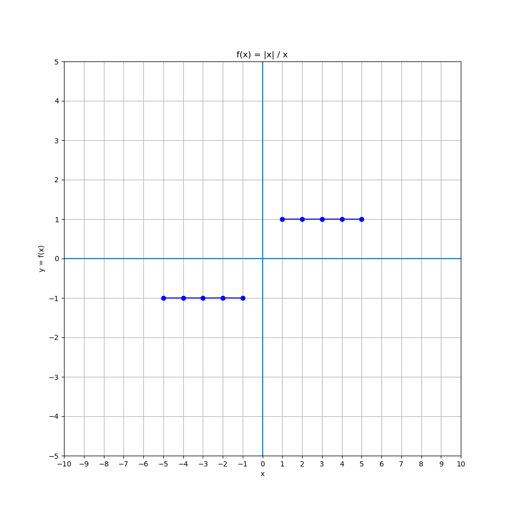
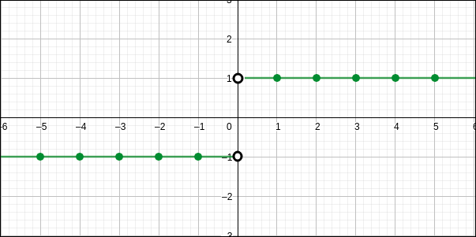
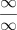
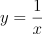
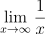
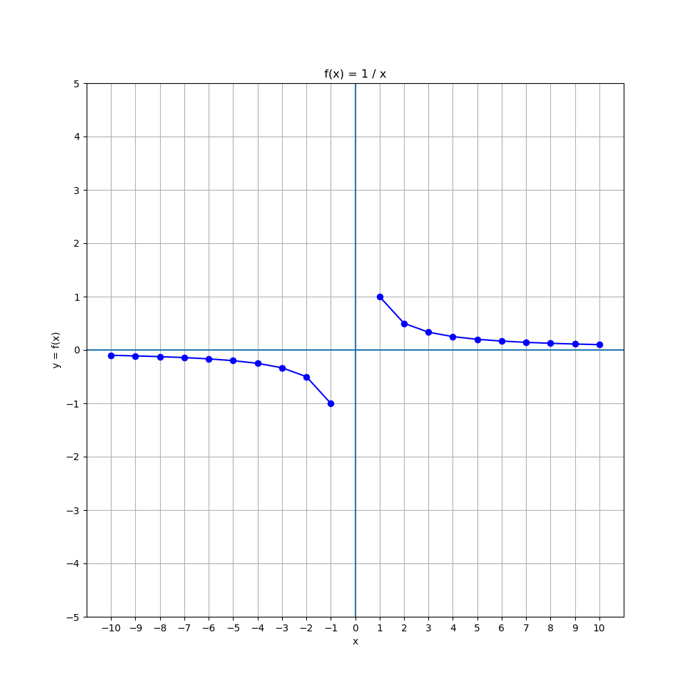

# Limites

## Conteúdo

 - [01 - Ideia Principal](#01)
 - [02 - Recapitulando o que é o Infinito (∞)](#02)

<div id='01'></div>

## 01 - Ideia Principal

Bem, vamos começar nossos estudos relacionados aos *limites* com a seguinte ideia principal. Suponha que nós temos a seguinte função:

  

Essa é uma função bem simples correto? Vamos ver como ela fica em Python para algumas entradas de **x**:

[square_function.py](src/square_function.py)
```python
def f(x):
  return x**2

if __name__ =='__main__':
  from matplotlib import pyplot as plt
  import pandas as pd

  df = pd.DataFrame ({'x': range(-4, 4+1)}) # x values.
  df['y'] = f(df['x']) # y values.

  print(df)

  plt.figure(figsize=(10, 10))
  plt.plot(df.x, df.y, color="b", marker='o')
  plt.title('f(x) = x^2')
  plt.xlabel('x')
  plt.ylabel('y = x^2')
  plt.grid()
  plt.xticks(range(-16+1, 16+1, 1))
  plt.yticks(range(0, 16+1, 1))
  plt.axhline()
  plt.axvline()
  plt.savefig('../images/plot-01.png', format='png')
  plt.show()
```

**OUTPUT:**  
```python
   x   y
0 -4  16
1 -3   9
2 -2   4
3 -1   1
4  0   0
5  1   1
6  2   4
7  3   9
8  4  16
```

  

Ok, nós temos um lindo gráfico mostrando a relação de valores de entradas para **x** com a função **f(x) = x<sup>2</sup>**. Agora suponha que nós temos o seguinte problema:

> Dado um valor qualquer de **x** (por exemplo, 4) qual o mais próximo possível que nós podemos chegar de um valor **n<sub>n</sub>** (por exemplo, 3).

Basicamente o nosso problema pode ser pensado assim...

> Olha, saindo do ponto **x = 4**, qual o mais próximo possível você pode chegar até o ponto **x = 3**? Lembrando que é **o mais próximo possível**.

Ah, isso é muito fácil é só ir voltando no gráfico:

```python
x = 4
x = 3.9
x = 3.8
.
.
.
x = 3.2
x = 3.1 <-- (Opa)
```

**NOTE:**  
Vale lembrar que a medida que nós vamos voltando valores de **x**, nós vamos descobrindo outros valores para **y**. Ou seja:

```python
x = 4   - y = 16
x = 3.9 - y = 15.21
x = 3.8 - y = 14.44
.
.
.
x = 3.2 - y = 10.24
x = 3.1 - y = 9.61   <-- (Opa)
```

Veja que **o mais próximo** que nós conseguimos chegar ao ponto de **x = 3** saindo do ponto **x = 4** foi:

```python
x = 3.1 - y = 9.61
```

Isso é o que nós conhecemos como **Limite de uma Função** e nós podemos expressar da seguinte maneira:

  

Lê-se da seguinte maneira:

> A função **x<sup>2</sup>** quando o meu **x** tende a **3**.

---

Agora vamos deixar a brincadeira um pouco mais difícil. Suponha que nós temos a seguinte função:

  

Continuando... Agora nós queremos saber qual o valor desta função quando o meu **x** tende a **1**, ou seja:

  

Ué, muito fácil, basta substituir o nosso valor de **x** por **1**:

  

**What?**  
Como assim **0/0**, **eu não posso dividir nada por zero!** Ou seja, isso violaria as leis da matemática. Se você colocar essa função em uma plataforma gráfica você vai ver que realmente no ponto **x = 1** o valor é indefinido para essa função:

Veja o resultado que eu consegui utilizando o [Geogebra](https://www.geogebra.org/):

  

Como podemos ver no nosso gráfico, para **x = 1** não foi possível nem plotar as coordenadas porque o valor era indefinido.

Pensando como limite de uma função, nós queremos saber:

> Quando x tende a 1 naquela função, ou seja, qual o mais próximo possível que eu posso chegar de 1?

O nosso gráfico pensando como o limite da função ficaria assim:

  

**NOTE:**  
Vejam que diferente dos outros pontos de intersecção entre **x** e **y** o 1 tem uma bolinha aberta, ou seja, não vamos pegar aquele valor - **nós vamos chegar ao mais próximo possível de 1**.

**RECAPITULANDO INTERVALOS MATEMÁTICOS:**  
Não sei se você lembra desse conceito de *intervalos* na matemática, mas veja a imagem abaixo para ficar mais claro:

  

Repare que se parece muito com o nosso gráfico quando **x** tende a **1**. Quando a bolinha está aberta nós não pegamos aquele número.

Até aqui tudo ok né? Vamos tentar deixar a brincadeira um pouco (mas só um pouco) mais divertida? Suponha que agora nós temos a seguinte função:

  

Agora vamos ver como ela fica em um gráfico:

[test_function-v1.py](src/test_function-v1.py)
```python
def f(x):
  return abs(x) / x

if __name__ =='__main__':
  from matplotlib import pyplot as plt
  import pandas as pd

  df = pd.DataFrame ({'x': range(-5, 5+1)}) # x Values.
  df['y'] = f(df['x']) # y Values.

  print(df)

  plt.figure(figsize=(10, 10))
  plt.plot(df.x, df.y, color="b", marker='o')
  plt.title('f(x) = |x| / x')
  plt.xlabel('x')
  plt.ylabel('y = f(x)')
  plt.grid()
  plt.xticks(range(-10, 10+1, 1))
  plt.yticks(range(-5, 5+1, 1))
  plt.axhline()
  plt.axvline()
  plt.savefig('../images/plot-02.png', format='png')
  plt.show()
```

**OUTPUT:**  
```python
    x    y
0  -5 -1.0
1  -4 -1.0
2  -3 -1.0
3  -2 -1.0
4  -1 -1.0
5   0  NaN <-- Não podemos dividir nada por zero!
6   1  1.0
7   2  1.0
8   3  1.0
9   4  1.0
10  5  1.0
```

  

**NOTE:**  
Veja que para todos os valores de **x**, o nosso **y** é **1** ou **-1** e isso óbvio porque todo número dividido por ele mesmo é **1** ou **-1**.

Agora nós também sabemos que se nós colocarmos **x = 0** para essa função já vai dar uma merdinha né? Isso foi visto na nossa saída acima, o Python até retornou o valor **NaN**.

  

Então, é aqui que entra a nossa noção de Limites, ou seja:

> Qual o *limite* desta função quando **x** tende a **0**?

  

Na verdade, nós temos que pensar na mesma lógica de antes, voltando de um ponto **x** qualquer até **o mais próximo possível de 0, sem chegar nele**.

  

**NOTE**  
Olhando para a imagem acima nós podemos imaginar que nós estamos voltando a partir do ponto **x = 5** e ir voltando valores até o mais próximo possível de **x = 0** e se você reparar o nosso **y** vai ser **y = 1** no limite da função, porém agora o nosso limite tem 2 casos:

 - Quando nós saímos do **5** o nosso limite vai ser **1**;
 - E quando nós saímos do **-5** o nosso limite vai ser **-1**.

Ou seja, diferente da outra função que nós analisamos, essa pode ter *2 limites* dependendo de onde nós estamos vindo:

 - **1** quando saímos do lado positivo;
 - **-1** quando saímos do lado negativo.

> Isso significa que nós temos **limites laterais diferentes (bilaterais)**.

E como diferenciar no limite quando sair do valor positivo ou negativo? Basta utilizar a seguinte nomenclatura na hora de definir o limite:

**SAINDO DE VALORES POSITIVOS:**  
  

**SAINDO DE VALORES NEGATIVOS:**  
  

**NOTE:**  
Quando não for definido **(+)** ou **(-)** que dizer que estamos partindo de pontos *positivos*.

<div id='02'></div>

## 02 - Recapitulando o que é o Infinito (∞)

Como nós sabemos quando falamos de **infinito** estamos falando de algo quem **não tem fim**. O Simbolo do infito é muito conhecido **(∞)**, mas vale salientar que não podemos trabalhar com esse simbolo como um número de uma expressão algébrica.

Por exemplo:

  

Isso seria totalmente errado. Por exemplo, na expressão acima como poderiamos dividir o infinito? Isso é impossível porque sabemos que **o infinito é algo que não tem fim**.

> O **∞** é apenas um *símbolo* que representa o infinito.

Por outro lado, suponha que nós queremos dividir o número de grãos de areia da terra por **2**

  

**NOTE:**  
O número de *grãos de areia* da terra é um número absurdamente enorme, **mas não é infinito**.

---

Por exemplo **(é só um exemplo)**, suponha que a seguinte função vai contar todas as estrelas do universo:

  

Agora nós já temos um problema:

 - **1ª -** O universo é infinito **(∞)**;
 - **2ª -** Se o universo é infinito o número de estrelas também é infinito **(∞)**.

Ué, como resolver isso? Então, é aqui que entra o nosso conhecimento de Limites e vamos pensar da seguinte forma:

> **Qual o *limite* desta função quando *x* tende ao *Infinito (∞)*?**

Então, pensando em limites nós teríamos a seguinte fórmula:

  

Ou seja, sabendo que nós temos um número ***infinito (∞)*** de estrelas, queremos saber **o mais próximo possível que podemos chegar**.

Vamos ver em Python um gráfico dessa função para analisar melhor:

[stars_function.py](src/stars_function.py)  
```python
def f(x):
  return 1 / x

if __name__ =='__main__':
  from matplotlib import pyplot as plt
  import pandas as pd

  df = pd.DataFrame ({'x': range(-10, 10+1)}) # x Values.
  df['y'] = f(df['x']) # y Values.

  print(df)

  plt.figure(figsize=(10, 10))
  plt.plot(df.x, df.y, color="b", marker='o')
  plt.title('f(x) = 1 / x')
  plt.xlabel('x')
  plt.ylabel('y = f(x)')
  plt.grid()
  plt.xticks(range(-10, 10+1, 1))
  plt.yticks(range(-5, 5+1, 1))
  plt.axhline()
  plt.axvline()
  plt.savefig('../images/plot-03.png', format='png')
  plt.show()
```

**OUTPUT:**  
```python
     x         y
0  -10 -0.100000
1   -9 -0.111111
2   -8 -0.125000
3   -7 -0.142857
4   -6 -0.166667
5   -5 -0.200000
6   -4 -0.250000
7   -3 -0.333333
8   -2 -0.500000
9   -1 -1.000000
10   0       inf   <-- Infinito (∞)
11   1  1.000000
12   2  0.500000
13   3  0.333333
14   4  0.250000
15   5  0.200000
16   6  0.166667
17   7  0.142857
18   8  0.125000
19   9  0.111111
20  10  0.100000
```

  

Prestando atenção na nossa saída nós vemos que se nós fomos voltando valores de **x** (por exemplo, 10) em relação a nossa função **f(x)** no eixo-y quando **x** foi **0**, o resultado tende ao infinito, ou seja o resultado da nossa função é essa:

  

---

**REFERENCES:**  
[Cálculo (AULA 1): Limites](https://www.youtube.com/watch?v=gDkvNDoh0nE&t=824s)  

---

**Rodrigo Leite** *- Software Engineer*
