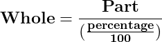
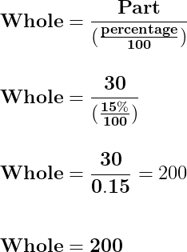
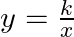

# Financial Math

## Contents

 - [**Percents:**](#percents)
   - [Percentage = part/whole x 100](#percentage-part)
   - [Part = (percentage/100) x whole](#finding-the-part)
   - [Whole = part / (percentage / 100)](#finding-the-whole)
   - **Percentage Conversions:**
     - [Percents to Decimals (Divide by 100 or Move two places to the left "←")](#percents-to-decimals)
     - [Decimals to Percents (Multiply by 100 or Move two places to the right "→")](#decimals-to-percents)
   - **Percents - Tips & Tricks:**
     - [Percentages calculus are symmetry (or bidirectional)](#percentages-calculus-symmetry)
 - [**Proportions (+Cross-Multiplication Approach):**](#proportions)
   - [Direct Proportion](#direct-proportion)
   - [Inverse Proportion](#inverse-proportion)
 - [**Settings**](#settings)
 - [**REFERENCES**](#ref)


<!--- ( Percents ) --->

---

<div id="percents"></div>

## Percents

> When we say **"Percent"** we are really saying **"per 100"**.

For example, one percent (1%) means 1 per 100:

  

To understand more easily, let's take a look at the examples below:

**50% means 50 per 100:**
  

**25% means 25 per 100:**


Because **"Percent"** means **"per 100"** think:

> **"This should be divided by 100"**

**NOTE:**  
So, **75%** really means $\frac{75}{100}$.

---

<div id="percentage-part"></div>

## Percentage = part/whole x 100

To determine the percentage of a number, we need to:

 - Divide the *"given value (part)"*;
 - By the *"total value (whole)"*;
 - And then *"multiply the resultant by 100"*.

  

For example, imagine we have *200 apples* and *10* of them are bad...

> **What is the percentage those 10 apples represent?**

Using our formula we have:

  

---

<div id="finding-the-part"></div>

## Part = (percentage/100) x whole

To find out the part of a percentage we use the following formula:

  

> **NOTE:**  
> - See that first, we need to *divide the percentage by 100*. This is because we first need to *convert the percentage to decimal*.
> - That's, we can also use the ["Percents to Decimals"](#percents-to-decimals) tip to *first convert to decimal* and then divide by *whole*.

For example, imagine we have 200 apples...

> ***15%* of *200* apples are bad. How many apples are bad?**

Using our formula we have:


> **So, "30" apples are bad!**

---

<div id="finding-the-whole"></div>

## Whole = part / (percentage / 100)

To find the whole of a percentage of a part we use the following formula:



For example:

> If I have 30 apples that represent 15% of the whole, how many apples do I have?



> **So, the whole is 200 apples.**


<!--- ( Percents/Percentage Conversions ) --->

---


<div id="percents-to-decimals"></div>

## Percents to Decimals (Divide by 100 or Move two places to the left "←")

> To convert from percentage to decimal, we need to **divide the percentage (%) by 100** and **remove the “%” sign**.

For example, let's convert **75%** to decimal:

  

**NOTE:**  
Another easy way to divide by 100 is to move the decimal point 2 places to the left. For example:

  
**Move the decimal point 2 places to the left, and remove the *"%"* sign.**  

**Example-01: Convert 8.5% to decimal**  
```md
8.5 → 0.85 → 0.085
```

**NOTE:**  
Note how we inserted an extra **"0"** as needed. So, the answer is **8.5% = 0.085**.

**Example-02: Convert 250% to decimal**  
```md
Move the decimal point two places to the left:
250. → 25. (zero here is removed, that's, not use 25.0) → 2.5
```

So, the answer is **250% = 2.5**.

---

<div id="decimals-to-percents"></div>

## Decimals to Percents (Multiply by 100 or Move two places to the right "→")

> To convert from decimal to percentage, we need to **"multiply the decimal number by 100** and **add the “%” sign**.

For example:

  

**NOTE:**  
Another easy way to multiply by 100 is to move the decimal point 2 places to the right. For example:

  
**Move the decimal point 2 places to the right (and add the "%" sign!)**

**Example-01: Convert 0.35 to percent**  
```md
0.35 → 3.5 (zero here is removed) → 35.
Answer 0.35 = 35%
```

**Example: Convert 0.985 to percent**  
```md
0.985 → 9.85 (zero here is removed) → 98.5
Answer 0.985 = 98.5%
```

**Example: Convert 1.2 to percent**
```md
1.2 → 12. → 120.
Answer 1.2 = 120%

NOTE: See that here we had to adds a zero and not remove it.
```


<!--- ( Percents/Tips and Tricks ) --->

---

<div id="percentages-calculus-symmetry"></div>

## Percentages calculus are symmetry (or bidirectional)

This little rule can make some percentage calculations easier:

**x% of y = y% of x**

For example:

 - **8% of 50** is the same as **50% of 8**:
   - If **50%** of **8** is **4**.
   - So, **8% of 50** is also **4**.


<!--- ( Proportions ) --->

---

<div id="proportions"></div>

## Proportions (+Cross-Multiplication Approach)

> A **proportion** can be used to *solve problems involving ratios*.

For example, imagine that **10 hours** is equal to **600 minutes**:

> **How many minutes are there in 50 hours?**

  

**To solve a proportion like this, we will use a procedure called "Cross-Multiplication":**

 - **First**, this process involves multiplying the two extremes.

  

**After Cross Multiplication:**  
  

> **NOTE:**  
> See that we have an *equality (igualdade)*.

Knowing we have an equality, we can apply some equation techniques to solve this problem:

  

Now, we know that:

 - If **10 hours** is equal to **600 minutes**.
 - Then **50 hours** is equal to **3.000 minutes**.

---

<div id="direct-proportion"></div>

## Direct Proportion

The **"Direct Proportion"** describes the *"relationship between two quantities"*, which:

> **The increases in one quantity, there is an increase in the other quantity also (O aumento em uma quantidade, há um aumento na outra quantidade também.).**

For example:

 - **Distance and Time (Constant Speed):**
   - If you travel at a constant speed, the distance you cover is directly proportional to the time you spend traveling.
   - **NOTE:** The faster you go (higher speed), the greater the distance covered in a set time.
 - **Recipe and Ingredients:**
   - When following a recipe, the amount of each ingredient is directly proportional to the number of people you're cooking for.
   - **NOTE:** Doubling the recipe means doubling all ingredients.
 - **Price and Quantity (Fixed Price per Unit):**
   - When buying an item with a fixed price per unit (e.g., apples at $1 each), the total price is directly proportional to the quantity you buy.
   - **NOTE:** The more you buy, the higher the total price.

> **NOTE:**  
> Similarly, if one quantity decreases, the other quantity also decreases.

**NOTE:**  
To solve a **"Direct Proportion"** we can use the **"Cross-Multiplication"** technique *seen (vista/passado)* in [Proportions (+Cross-Multiplication Approach)](#proportions).

---

<div id="inverse-proportion"></div>

## Inverse Proportion

The **"Inverse Proportion"** describes the *"relationship between two quantities"*, where:

> **In *"which an increase in one quantity leads to a decrease in the other quantity" (Em “que um aumento em uma quantidade leva a uma diminuição na outra quantidade”)*.**

For example:

 - **Supply and Demand (Price Fluctuations):**
   - In economics, the availability of a good (supply) is inversely proportional to its price.
   - **NOTE:** When there's a high supply of a good, the price tends to decrease.
 - **Loan (emprestimo) Term and Monthly Payment (Fixed Loan Amount):**
   - For a fixed loan (emprestimo) amount, the monthly payment is inversely proportional to the loan term.
   - **NOTE:** A shorter loan (emprestimo) term requires higher monthly payments to settle the debt faster.
 - **Strength of WiFi Signal and Distance from Router:**
   - The strength of a WiFi signal is inversely proportional to the distance from the router.
   - **NOTE:** The farther you are from the router, the weaker the signal strength.

For example, if **"y"** is inversely proporttional to **"x"**, we can write this relationship as $y ∝ \frac{1}{x}$.

> **NOTE:**  
> The symbol **"∝"** is the *"proportionality symbol"* and it *"represents a proportional relationship between two variables"*.

As $y \times x = k$, where "k" is the constant of proportionality, we can deduce the inverse proportion formula:

  


<!--- ( Settings ) --->

---

<div id="settings"></div>

## Settings

**CREATE VIRTUAL ENVIRONMENT:**  
```bash
python -m venv math-environment
```

**ACTIVATE THE VIRTUAL ENVIRONMENT (LINUX):**  
```bash
source math-environment/bin/activate
```

**ACTIVATE THE VIRTUAL ENVIRONMENT (WINDOWS):**  
```bash
source math-environment/Scripts/activate
```

**UPDATE PIP:**
```bash
python -m pip install --upgrade pip
```

**INSTALL PYTHON DEPENDENCIES:**  
```bash
pip install -U -v --require-virtualenv -r requirements.txt
```

**Now, Be Happy!!!** 😬


<!--- ( REFERENCES ) --->

---

<div id="ref"></div>

## REFERENCES

 - **Percentage:**
   - [Percent example](https://www.instagram.com/p/Cw0qpWVPA46/)
   - [Percents (%)](https://www.mathsisfun.com/percentage.html)
   - [Convert Percents to Decimals](https://www.mathsisfun.com/converting-percents-decimals.html)
   - [Convert Decimals to Percents](https://www.mathsisfun.com/converting-decimals-percents.html)
   - [Percentage](https://byjus.com/maths/percentage/)
   - [Percentage Difference Calculator](https://www.justcalculateit.com/percentage-difference-calculator/)
 - **Proportions:**
   - [Proportions and Ratios (freemathhelp)](https://www.freemathhelp.com/proportions/)
   - [Ratios and Proportion (byjus)](https://byjus.com/maths/ratios-and-proportion/#Direct%20Proportion)

---

Ro**drigo** **L**eite da **S**ilva - **drigols**
