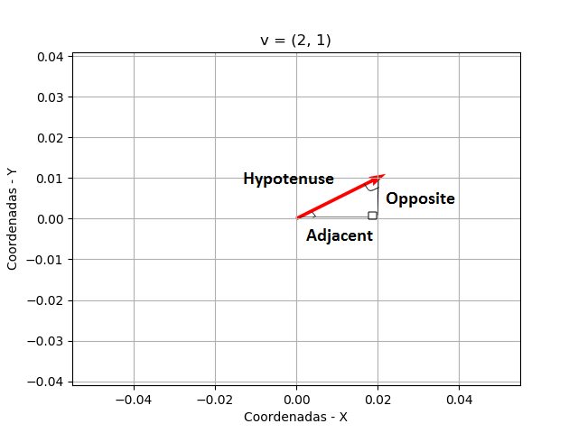
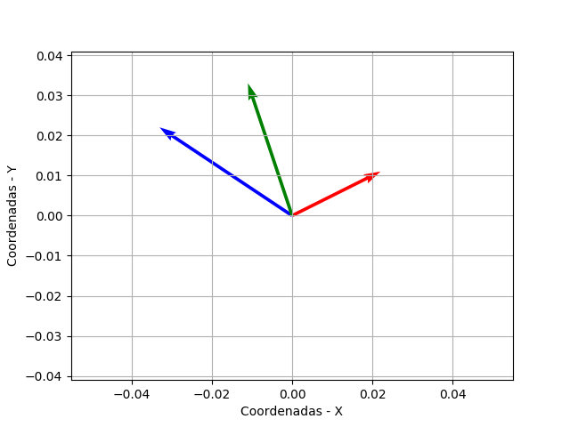

# Introdução aos vetores

# Contents

 - [01 - Introdução aos Vetores](#01)
 - [02 - Calculando a Magnitude (distância) e Direção (amplitude) do vetor](#02)
   - [02.1 - Calculando Magnitude (distância) de um vetor](#02-1)
   - [02.2 - Calculando de Direção (amplitude) de um vetor](#02-2)
 - [03 - Adição de Vetores](#03)
 - [04 - Multiplicação vetorial (escalar)](#04)
 - [05 - Divisão Vetorial (escalar)](#05)
 - [06 - Multiplicação de Produtos - (dot)](#06)
 - [07 - Multiplicação cruzada de produtos - (cross)](#07)

<div id='01'></div>

## 01 - Introdução aos Vetores

Ok, pessoa vamos começar nossos estudos sobre vetores com uma simples introdução sobre alguns conceitos bem básicos. A primeira coisa que nós devemos saber é que um Vector sempre tem uma **Magnitude** e **direção**. O que isso represente?

 - A **magnitude** representa uma distância `- (por exemplo, "2 milhas")`;
 - A **direção** indica para qual caminho o vetor está indo `- (por exemplo, "Leste")`.

Tudo isso parece um pouco complicado, então vamos começar com um exemplo simples e **bidimensional (duas coordenadas - X e Y)**. Neste caso, usaremos:

 - **2** para **x**;
 - E **1** para **y**.

Nosso vetor pode ser escrito como **v = (2,1)**, porém, mais formalmente usaríamos a seguinte notação, na qual os valores de coordenadas dimensionais para o vetor são mostrados como uma matriz:

  

Então o que exatamente isso significa? Bem, a coordenada é bidimensional e descreve os movimentos necessários para chegar ao ponto final (da `cabeça/head`) do vetor.

 - Nesse caso, precisamos mover 2 unidades na dimensão x;
 - E 1 unidade na dimensão y.

**NOTE:**  
Note que não especificamos um ponto de partida para o vetor - estamos simplesmente descrevendo uma coordenada de destino que encapsula o ***magnitide*** e a ***direção*** do vetor.

> Pense nisso como as orientações que você precisa seguir para chegar **lá** a **partir daqui**, sem especificar em que aqui realmente é!

É bastante simples. Nós apenas definimos um plano **bidimensional (duas coordenadas - X e Y)**, escolhemos um ponto de partida `(qualquer ponto no nosso exemplo, já que não foi especificado)` e plotamos a coordenada descrita pelo vetor em relação ao ponto inicial.

Veja o código a seguir para visualizar o vetor **v** `(que lembre-se é descrito pela coordenada (2,1))`:

[first_vector.py](src/first_vector.py)
```python
import numpy as np
import matplotlib.pyplot as plt

# Cria um Vetor com a função array do NumPy.
v = np.array([2,1])

# Utiliza a função quiver() do Matplotlib para criar o plot/gráfico.
# A função quiver() recebe 4 argumentos principais:
# - As coordenadas iniciais do vetor - x = 0 e y = 0, no nosso caso
# - Quantas posições o vetor vai andar - x = 1 e y =1, nosso caso - *v
plt.quiver(0, 0, *v, scale=10, color='r')
plt.axis('equal') # Define o dimensionamento do plot igual.

plt.grid()
plt.title('v = (2, 1)')
plt.xlabel('Coordenadas - X')
plt.ylabel('Coordenadas - Y')
plt.savefig('../images/plot-01.png', format='png')
plt.show()
```

**OUTPUT:**  


**NOTE:**  
> Note que podemos usar um array numpy para criar um vetor em Python.

Então, para criar nosso vetor (2,1), simplesmente criamos um array numpy com os elementos [2,1]; Em seguida, usamos o plot/gráfico **quiver()** para visualizar o vetor; `usando o ponto [0, 0] como ponto de partida (ou origem)`; Nosso vetor de (2,1) é mostrado como uma seta que começa em 0,0 (inicialmente x = 0 e x = 0) e move:

 - 2 unidades ao longo do eixo x (a direita);
 - 1 unidade ao longo do eixo y (para cima).

<div id='02'></div>

## 02 - Calculando a Magnitude (distância) e Direção (amplitude) do vetor

Temos a tendência de trabalhar com vetores expressando seus componentes como coordenadas cartesianas; isto é, **x** e **y** `(e outra dimensão)` valores que definem o número de unidades percorridas ao longo de cada dimensão. Assim, as coordenadas do nosso vetor (2,1) indicam que devemos:

 - Percorrer **2** unidades ao longo do eixo **x**;
 - E **1** unidade ao longo do eixo **y**.

No entanto, você também pode trabalhar com vetores em termos de suas coordenadas polares; isto é, coordenadas que descrevem a ***Magnitude*** e ***Direção*** do *vetor*:

 - A ***magnitude*** é a distância total do vetor da cauda a sua cabeça;
 - A ***Direção*** é o ângulo no qual o vetor é orientado.

<div id='02-1'></div>

### 02.1 - Calculando Magnitude (distância) de um vetor

Antes de começar a estudar como como calcular a `Magnitude (distância)` de um vetor vamos prestar atenção em alguns detalhes e rever alguns conceitos. Primeiro vamos ver o nosso gráfico/plot criado na nossa introdução:

  

**NOTE:**  
Se você prestar atenção o nosso vetor pode ser comparado com um `Triângulo retângulo`. Vai ficar algo parecido com isso:

  

Opa, Então dá para calcular o tamanho do nosso vetor utilizando a mesma fórmula que utilizamos para calcular a hipotenusa de um `Triângulo retângulo`? ***Yes, boy!***

> A soma dos quadrados dos catetos; é igual ao quadrado da hipotenusa.

Voltando ao que interessa...  

> Calcular a `Magnitude (distância)` do vetor a partir de suas coordenadas cartesianas requer ***medir a distância entre o ponto de partida arbitrário e o ponto de cabeça do vetor***.

Para um vetor bidimensional, **na verdade, estamos apenas calculando o comprimento da hipotenusa em um triângulo retângulo** - para que pudéssemos simplesmente invocar o `Teorema de Pitágoras` e calcular a raiz quadrada da soma dos quadrados de seus componentes, assim:

  

> A notação para a magnitude de um vetor é cercar o nome do vetor com barras verticais - você pode usar barras simples (por exemplo, |__v__|) ou barras duplas (||__v__||). Barras duplas são frequentemente usadas para evitar confusão com valores absolutos. Note que os componentes do vetor são indicados por índices subscritos (v<sub>1</sub>, v<sub>2</sub>,...v<sub>*n*</sub>).

Nesse caso, o vetor **v** tem dois componentes com valores **2** e **1**, então nosso cálculo de magnitude é:

  

Qual é:

  

Assim:

  

Vamos ver como resolver isso em Python:

[magnitude.py](src/magnitude.py)
```python
import math
import numpy as np

# Cria um Vetor com a função array do NumPy.
v = np.array([2,1])

# Tira a Magnitude do Vetor.
vMag = math.sqrt(v[0]**2 + v[1]**2)
print("Magnitude (distância) do meu vetor {0} é {1}".format(v, vMag))
```

**OUTPUT:**  
```
Magnitude (distância) do meu vetor [2 1] é 2.23606797749979
```

**NOTE:**  
> Este cálculo funciona para vetores de ***qualquer dimensionalidade*** - você apenas pega a raiz quadrada da soma dos componentes quadrados:

  


Em Python, nós podemos utilizar **linalg.norm()** do *NumPy* para calcular a magnitude de um vetor. Isso é interessante porque nós impede de por exemplo criar um erro semântico na hora de criar o código:

[magnitude_linalg_norm.py](src/magnitude_linalg_norm.py)
```python
import numpy as np

# Cria um Vetor com a função array do NumPy.
v = np.array([2, 1])

# Tira a Magnitude do Vetor.
vMag = np.linalg.norm(v)
print("Magnitude (distância) do meu vetor {0} é {1}".format(v, vMag))
```

**OUTPUT:**  
```
Magnitude (distância) do meu vetor [2 1] é 2.23606797749979
```

Veja que agora nós nem precisamos importar a biblioteca **Math**. Apenas com NumPy já resolvemos tudo.

<div id='02-2'></div>

### 02.2 - Calculando de Direção (amplitude) de um vetor

Para calcular a Direção, ou `amplitude`, de um vetor de suas coordenadas cartesianas, você deve empregar um pouco de trigonometria.

> Podemos obter o ângulo do vetor calculando a `tangente inversa`; às vezes conhecido como o `arctan` (a tangente calcula um ângulo como uma razão - a tangente inversa, ou **tan<sup>-1</sup> (O -1 não é um expoente, ele apenas indica um sinal de função inversa)**, expressa isso em graus).

**NOTE:**  
> Em qualquer triângulo retângulo, a tangente é calculada como o `oposto` do `adjacente`. Em um vetor bidimensional, esse é o valor de `y` sobre o valor de `x`, portanto, para nosso vetor __v__ (2,1):

  

Isso produz o resultado **0,5**, a partir do qual podemos usar uma calculadora para calcular a tangente inversa para obter o ângulo em graus:

  

Note que o ângulo de direção é indicado como ***&theta;***.  
  
Veja o seguinte código Python para confirmar isso:

[inverse_tan.py](src/inverse_tan.py)
```python
import math
import numpy as np

v = np.array([2,1]) # Cria uma representação do nosso Vetor.
vTan = v[1] / v[0] # Calcula a tangente.
print ('tan = ' + str(vTan)) # Imprime a tangente.

vAtan = math.atan(vTan) 
print('inverse-tan = ' + str(math.degrees(vAtan)))
```

**OUTPUT:**  
```
tan = 0.5
inverse-tan = 26.56505117707799
```

<div id='03'></div>

## 03 - Adição de Vetores

Até agora, trabalhamos com um vetor de cada vez. O que acontece quando você precisa adicionar dois vetores?

Vamos dar uma olhada em um exemplo, já temos um vetor chamado **v**, como definido aqui:

  

Agora vamos criar um segundo vetor, e chamado **s** assim:

  
  
Veja o plot/gráfico a seguir como isso fica:


[two_vectors.py](src/two_vectors.py)
```python
import math
import numpy as np
import matplotlib.pyplot as plt

v = np.array([2, 1]) # Cria o Vetor "v" com array NumPy.
s = np.array([-3, 2]) # Cria o Vetor "s" com array NumPy.
vectors = np.array([v, s]) # Adiciona os Vetores "v" e "s" dentro de um terceiro Vetor.

print("A soma dos vetores v = {0} e s = {1}:\n {2}".format(v, s, vectors))

# Cria um plot com quiver() e passa como argumento:
# - Os pontos inicias - x = 0 e y = 0;
# - Todo o Vetor "v" - vectors[:, 0];
# - Todo o Vetor "s" - vectors[:, 1];
# - as cores para cada Vetor, respectivamente;
# - Scale - é uma forma de dimensionar dentro do plot.
plt.quiver(0, 0, vectors[:,0], vectors[:,1], color=['r', 'b'], scale=10)
plt.axis('equal') # Define o dimensionamento do plot igual.
plt.title('v = (2, 1), s = (-3, 2)')
plt.xlabel('Coordenadas - X')
plt.ylabel('Coordenadas - Y')
plt.grid()
plt.savefig('../images/plot-02.png', format='png')
plt.show()
```

**OUTPUT:**  
```
A soma dos vetores v = [2 1] e s = [-3  2]:
 [[ 2  1]
 [-3  2]]
```

  

Você pode ver no gráfico que os dois vetores têm diferentes Direções e Magnitudes. Então, o que acontece quando os adicionamos juntos?

Aqui está a fórmula:

  
  
Em termos de nossas matrizes vetoriais, isso se parece com isto:

  
  
Que dá o seguinte resultado:

  

Vamos ver como fica isso em Python:

[vector_addition.py](src/vector_addition.py)
```python
import numpy as np
import matplotlib.pyplot as plt

v = np.array([2, 1]) # Cria o Vetor "v" com array NumPy.
s = np.array([-3, 2]) # Cria o Vetor "s" com array NumPy.
z = v + s # soma os vetores "v" e "s".
vectors = np.array([v, s, z]) # Adiciona os Vetores "v", "s" e "z" dentro de um terceiro Vetor.

print("v = {0}\n s = {1}\n v + s = {2}\n v + s + z = {3}".format(v, s, z, vectors))

# Cria um plot com quiver() para exibir os 3 vetores.
plt.quiver(0, 0, vectors[:,0], vectors[:,1], color=['r', 'b', 'g'], scale=10)
plt.axis('equal') 
plt.xlabel('Coordenadas - X')
plt.ylabel('Coordenadas - Y')
plt.grid()
plt.savefig('../images/plot-03.png', format='png')
plt.show()
```

**OUTPUT:**  
```
v = [2 1]
s = [-3  2]
v + s = [-1  3]
v + s + z = [[ 2  1]
             [-3  2]
             [-1  3]]
```

  

<div id='04'></div>

## 04 - Multiplicação vetorial (escalar)

Vamos começar com a Multiplicação `Escalar` - em outras palavras, multiplicando um vetor por um único valor numérico.

Suponha que eu queira multiplicar meu vetor por 2, o que eu poderia escrever assim:

  

Observe que o resultado desse cálculo é um novo vetor chamado **w**. Então, como calcularíamos isso? Lembre-se de que **v** é definido assim:

  

Para calcular 2v, basta aplicar a operação para cada valor de dimensão na matriz vetorial, assim:

  

Qual nos dá o seguinte resultado:

  

Em Python, você pode aplicar esse tipo de operações de vetor diretamente a matrizes numpy, então podemos simplesmente calcular **w** assim:

[scalar_multiplication.py](src/scalar_multiplication.py)
```python
import numpy as np
import matplotlib.pyplot as plt

v = np.array([2,1]) # Cria o Vetor do nosso exemplo.
w = 2 * v # Faz uma multiplicação Escalar - Por 2.
print('Vetor v: {0}\n Vetor multiplicado w: {1}\n'.format(v, w))

# Cria um plot/gráfico com quiver() para exibir o vetor multiplicado.
plt.quiver(0, 0, *w, scale=10)
plt.axis('equal')
plt.grid()
plt.savefig('../images/plot-04.png', format='png')
plt.show()
```

**OUTPUT:**  
```
Vetor v: [2 1]
Vetor multiplicado w: [4 2]
```

  

<div id='05'></div>

## 05 - Divisão Vetorial (escalar)

A mesma abordagem que nós adotada para multiplicação escalar pode ser aplicada na divisão escalar:

  

[scalar_division.py](src/scalar_division.py)
```python
import numpy as np
import matplotlib.pyplot as plt

v = np.array([2,1]) # Cria o Vetor do nosso exemplo.
b = v / 2 # Divide o Vetor "v" por 2 - Scale.
print(b) # Imprime o Vetor dividido.

# Cria um plot/gráfico com quiver() para exibir o vetor multiplicado.
plt.quiver(0, 0, *b, scale=10)
plt.axis('equal')
plt.grid()
plt.savefig('../images/plot-05.png', format='png')
plt.show()
```

**OUTPUT:**  
```
[1.  0.5]
```

  

<div id='06'></div>

## 06 - Multiplicação de Produtos - (dot)

Então, vimos como multiplicar um vetor por um `escalar`. Que tal multiplicar dois vetores juntos? Na verdade, existem duas maneiras de fazer isso, dependendo se você deseja que o resultado seja:

 - Um produto escalar (em outras palavras, um número);
 - Um produto vetorial (um vetor).

Para obter um produto escalar, calculamos o `produto escalar`. Isso leva uma abordagem semelhante à multiplicação de um vetor por um escalar, exceto que ele multiplica cada par de componentes dos vetores e soma os resultados. Para indicar que estamos executando uma operação de produto escalar, usamos o operador &bull;:

  

Então, para nossos vetores **v (2,1)** e **s (-3,2)**, nosso cálculo se parece com isto:

  

Portanto, o produto escalar de **v** &bull; **s** é **-4**.

Em Python junto com o NumPy você pode utilizar a função **dot()** para calcular esse tipo de problema.

[dot_test.py](src/dot_test.py)
```python
import numpy as np

# Cria os vetores "v" e "s".
v = np.array([2,1]) # Cria o vetor "v".
s = np.array([-3,2]) # Cria o vetor "s".

d = np.dot(v,s) # Aplica o dot().

print("v = {0}\n s = {1}\n Multiplicação (scalar) com Dot(): \n{2}".format(v, s, d))
```

**OUTPUT:**  
```python
v = [2 1]
s = [-3  2]
Multiplicação (scalar) com Dot(): -4
```

<div id='07'></div>

## 07 - Multiplicação cruzada de produtos - (cross)

Para obter o `produto vetorial` de multiplicar dois vetores juntos, você deve calcular o `produto cruzado`. O resultado disso é um novo vetor que está em ângulo reto com ambos os outros vetores no espaço Euclidiano 3D. Isso significa que o produto cruzado só faz sentido ao trabalhar com vetores que contêm três componentes.

Por exemplo, vamos supor que temos os seguintes vetores:

  
  
Para calcular o produto cruzado destes vectores, escritos como **p** x **q**, é necessário criar um novo vector (chamemos-lhe **r**) com três componentes **(r<sub>1</sub>, r<sub>2</sub>, and r<sub>3</sub>)**. Os valores para esses componentes são calculados da seguinte forma:

  
  
  

Então, no nosso caso:

  

Em Python junto com NumPy você pode utilizar a função **cross()** para resolver esse tipo de problema:

[cross_test.py](src/cross_test.py)
```python
import numpy as np

p = np.array([2,3,1]) # Cria o vetor "p" do nosso exemplo.
q = np.array([1,2,-2]) # Cria o vetor "q" do nosso exemplo.

# Aplica a multiplicação cruzada com a função cross().
r = np.cross(p,q)

print(r)
```

**OUTPUT:**  
```
[-8  5  1]
```

---

**REFERENCES:**  
[BONUS - Operações básicas com vetores (Álgebra linear/ Cálculo vetorial)](https://www.youtube.com/watch?v=HwgOnEU9NYo&t=2s)  

---

**Rodrigo Leite** *- Software Engineer*
