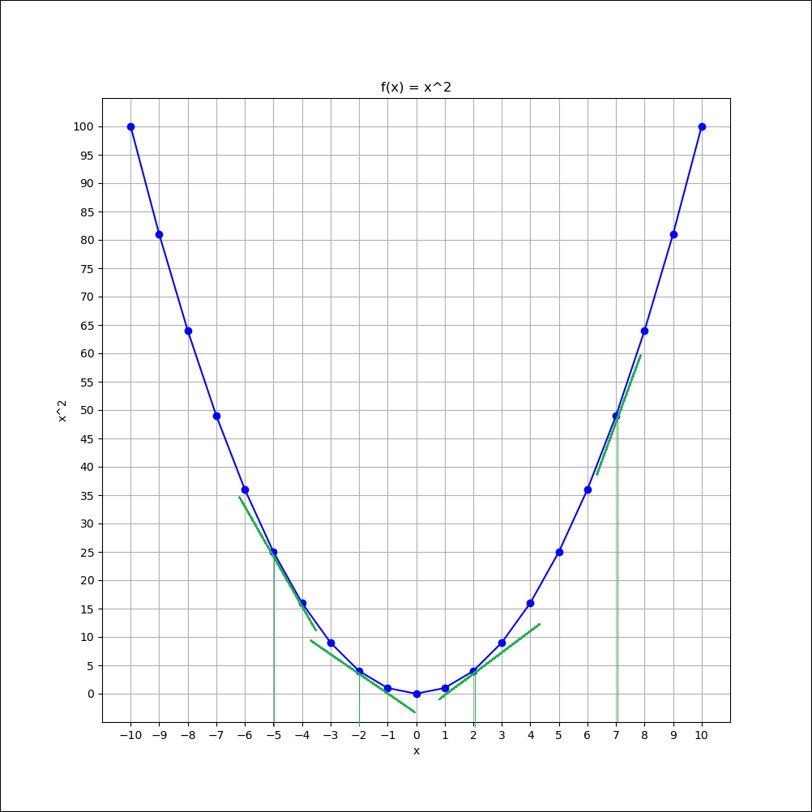
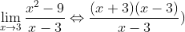

# Derivadas (diferenciação)

## Contents

 - [01 - O problema da Taxa de Variação em uma Parabola](#01)
 - [02 - A ideia principal por trás das Derivadas](#02)
 - [03 - Resolvendo o problema da Taxa de Variação em uma Parabola](#03)
 - [04 - Propriedades das Derivadas](#04)
 - [05 - A soma da Derivada das partes](#05)
 - [06 - Derivada da Derivada](#06)
 - [07 - Derivadas Parciais (Ideia/Problema Principal)](#07)
   - [07.1 - Resolvendo Derivadas Parciais](#07-1)

<div id='01'></div>

## 01 - O problema da Taxa de Variação em uma Parabola

Suponha que nós tenhamos a seguinte função:

  

Agora vamos criar um gráfico com Python para ver visualmente:

[test_ffunction.py](src/test_ffunction.py)
```python
def f(x):
  return x**2

if __name__ =='__main__':
  from matplotlib import pyplot as plt
  import pandas as pd

  df = pd.DataFrame({'x': range(-10, 10+1)}) # x Values.
  df['y'] = [f(x) for x in df.x] # y Values.

  print(df)

  plt.figure(figsize=(10, 10))
  plt.plot(df.x, df.y, color='blue', marker='o')
  plt.title("f(x) = x^2")
  plt.xlabel('x')
  plt.ylabel('x^2')
  plt.xticks(range(-10, 10+1, 1))
  plt.yticks(range(0, 100+1, 5))
  plt.grid()
  plt.savefig("../images/plot-01.png", format='png')
  plt.show()
```

**OUTPUT:**  
```python
     x    y
0  -10  100
1   -9   81
2   -8   64
3   -7   49
4   -6   36
5   -5   25
6   -4   16
7   -3    9
8   -2    4
9   -1    1
10   0    0
11   1    1
12   2    4
13   3    9
14   4   16
15   5   25
16   6   36
17   7   49
18   8   64
19   9   81
20  10  100
```

  

> Como podemos ver o gráfico da função é uma parábola, ou seja, o **crescimento é exponencial** e **não constante**.

**NOTE:**  
Ou seja, a *Taxa de Variação* vai está sempre mudando a medida que vamos percorrendo a parabola.

Então, como encontrar a *Taxa de variação* para um problema assim? Bem, vamos por partes.. A primeira coisa que precisamos prestar atenção é que para cada ponto na nossa parabola nós temos uma **inclinaçãozinha**.

Vou selecionar alguns pontos aleatórios do nosso gráfico acima para demonstrar como funciona:

  

Veja que nos pontos **(-5, 25)**, **(-2, -4.8)**, **(2, 4.8)** e **(7, 48)** nós criamos algumas **retas tangentes** que tangenciam a curva. Essas **retas tangentes** representam a inclinação naquele ponto, ou seja, a *Taxa de Variação* daqueles pontos.

<div id='02'></div>

## 02 - A ideia principal por trás das Derivadas

Agora vamos deixar de lado esse exemplo da função **x<sup>2</sup>** *(mas só por enquanto)*, para prestar atenção em um gráfico de uma função abstrada que nós criamos...

O mais importante por agora é você prestar atenção na curva da função:

  

Bem só de olhar para o gráfico dessa função (que é só um exemplo) já dá para ver **3** coisas:

 - **1ª -** Que a função não tem uma inclinação constante;
 - **2ª -** Que não é uma parabola;
 - **3ª -** Por fim, já de cara dá para saber que nossa *Taxa de Variação* não é constante.

Bem, mas onde nós queremos chegar? Bem seguindo o gráfico desta função o meu objetivo é:

> **Encontrar a taxa de variação em qualquer ponto da curva.**

Por exemplo, suponha que nós queremos encontrar a *Taxa de Variação* no ponto **x = 3**:

  

> A *Taxa de Variação* naquele ponto é dada por uma reta tangente aquele ponto, ou seja, uma reta que tangencia apenas aquele ponto.

Vai ficar algo parecido com isso:

  

> Se você pensar bem essa reta tangente vai se movimento durante toda a nossa função calculando a *Taxa de Variação* para cada ponto específico.  

Não entendeu? Veja a imagem abaixo para entender melhor como isso funcionaria:

  

Bem, voltando ao nosso exemplo com a nossa reta tangente **(que representa a taxa de variação no ponto x = 3)**. Agora vamos adicionar uma **reta secante** que vai cruzar dois pontos da função, sendo que um dos nossos pontos vai ser **x = 3**:

  

Vamos chamar esse dois pontos de **x<sub>1</sub>** e **x<sub>2</sub>** na nossa função:

  

**Ok, legal!!**  
Mas de que adianta essa **reta secante** cruzando em dois pontos, sendo que o que importa para nós é a reta tangente?

Bem se nós pegarmos o ponto **x = 3** que nós apelidamos de **x<sub>1</sub>** e deixar ele fixo; e ir voltando valores do segundo ponto **x<sub>2</sub>** nós vamos de encontro com a nossa **reta tangente**.

  

O que nós estamos fazendo é ir do nosso **x<sub>2</sub>** de encontro ao **x<sub>1</sub>** *o mais próximo possível* até chegar onde a *reta verde* está, ou seja, **nossa reta tangente**.  
Então, essa vai ser a nossa estratégia para encontrar a **reta tangente**:

 - **1ª -** Nós criamos uma reta que cruze dois pontos - **reta secante**;
 - **2ª -** Nós caminhamos nessa **reta secante** (mantendo o **x<sub>1</sub>** fixo) até chegar na nossa reta tangente **(ou taxa de variação)**.

Ok, tudo lindo é maravilhoso, mas como nós equacionamos isso? Ou seja, transformar isso em matemática? Ok, vamos por partes...

Primeiro, vamos prestar atenção na nossa **reta secante**. Se você prestar atenção você vai ver que essa reta tem um ângulo e isso é claro de ver, até porque em algum momento essa reta vai cruzar o eixo-x.

Então, sabendo disso nós podemos calcular a taxa de variação dessa **reta secante** seguindo a nossa regra geométrica - **C.O/C.A = Taxa de Variação de uma reta**. 

  

Ok, agora vamos explicar essa bagaça né?

A primeira coisa que nós fizemos foi calcular o *Cateto Adjacente* / **x<sub>2</sub> - x<sub>1</sub>**:

  

Agora que já temos o *Cateto Adjacente* vamos calcular o *Cateto Oposto* / **f(x)<sub>2</sub> - f(x)<sub>1</sub>**:

  

> Então, depois de todo esse *paranauê* nós temos a seguinte fórmula para a nossa **reta secante**:

  

Você também vai ver essa fórmula abstraída para a seguinte quando estivermos falando de Derivadas:

  

 - **Δ (delta) para f(x)** - É calculado subtraindo os valores de **f(x)** de nossos pontos;
 - **Δ (delta) para x** - É calculado subtraindo os valores de **x** de nossos pontos.

**Ta nós já temos a fórmula para a nossa *Reta Secante*, mas como eu chego na minha *reta tangente* com isso?**  
Agora sente a malandragem... Primeiro, nós sabemos que para chegar na **reta tangente** nós devemos deslocar o meu **x<sub>2</sub>** *o mais próximo possível* de **x<sub>1</sub>** (ou seja, estamos deslocando nossa reta secante até a reta tangente).

Sabendo disso é muito simples, basta aplicar nossos conhecimentos de **Limites** para a nossa equação/função da **reta secante** ir o mais próximo possível de **x<sub>2</sub>** até **x<sub>1</sub>**:

  

Então agora com essa fórmula é possível descobrir a **Taxa de Variação**:

 - Para qualquer função;
 - Em qualquer ponto da função.

  

<div id='03'></div>

## 03 - Resolvendo o problema da Taxa de Variação em uma Parabola

Bem, agora que nós sabemos como calcular a *Taxa de Variação* **para qualquer função** em **qualquer ponto da função**, vamos voltar a nossa função **x<sup>2</sup>**:

  

O gráfico para essa função nós já sabemos que é esse:

  

Agora suponha que nós queremos saber a *Taxa de Variação* da nossa função **f(x) = x<sup>2</sup>** para **x = 3**.

No gráfico vai ficar assim:


Bem, primeiro vamos pegar a nossa fórmula genérica que nós aplicamos a nossa *linha secante* anteriormente:

  

Agora vamos aplicar nessa fórmula a função  **f(x) = x<sup>2</sup>** para **x = 3**:

  

Se você não entendeu bem o que aconteceu no nosso limite acima, foi o seguinte:

 - A *Taxa de Variação* do nosso ponto **x = 3** vai ser:
   - O meu **x** tendendo a **3** (ou seja, o mais próximo possível de 3);
   - Da função **f(x) = x<sup>2</sup>** menos (-) **9**:
     - Ou seja o Cateto Oposto;
   - Dividido por **x** menos (-) **3**:
     - Ou seja, o Cateto Adjacente.

O que acontece se nós aplicarmos **3** a nossa fórmula acima? Ela vai ficar assim:

  

Ué, temos um probleminha então... Não podemos dividir nada por zero!  
Sabendo disso chegou a hora de usar algumas **bruxarias algébricas** para transformar nossa equação em algo aceitável matemáticamente:

  

Veja que agora essas expressões são equivalentes. Outra coisa que devemos prestar atenção é que se colocarmos o *denominador* da nossa expressão entre parênteses **(x - 3)** podemos simplificar nossa expressão algébrica para essa:

  

Ou seja, o nosso limite de **x** tendendo a **3** para a função **f(x) = x<sup>2</sup>** agora vai ser:

  

Agora que nós já temos uma fórmula aceitável matemáticamente, vamos aplicar o **x = 3** para descobrir a *Taxa de Variação* naquele ponto:

  

Opa, agora sim nós temos a *Taxa de Variação* da função **f(x) = x<sup>2</sup>** quando **x** tende a **3** - ***(6)***

**NOTE:**  
Ok, nós temos a *Taxa de Variação* da função **f(x) = x<sup>2</sup>** para **x = 3**.
Agora e para os outros pontos? Tem como generalizar para encontrar em qualquer ponto da função **f(x) = x<sup>2</sup>** a *Taxa de Variação*? 

> Ou seja, nós queremos a **Derivada** da função **f(x) = x<sup>2</sup>** em relação **x**.

A representação para isso vai ficar assim:

  

Nós lemos isso assim:

> A *Derivada* de **x<sup>2</sup>** em relação a **x**.

Vamos apelidar agora essa função de Derivada de **g(x)**:

  

Ok, agora vamos recuperar a nossa fórmula que nós utilizamos para calcular a nossa reta secante, lembram dela?

  

Dá para aplicar a nossa função **f(x) = x<sup>2</sup>** nessa fórmula? Claro que dá:

  

**NOTE:**  
 - Lembram que nós já testamos isso antes, porém para **x = 3**?
 - Lembram também que do jeito que está essa expressão o resultado daria **0/0**?

Pois eh, nós vamos ter que fazer aquela mesma **bruxaria algébrica** para fazer essa expressão ser aceitável matematicamente, porém agora para a função inteira **x<sup>2</sup>** e não somente para o ponto **x = 3**:

  

Resumindo tudo isso nós teremos:

  

Agora é só substituir o nosso x<sub>2</sub> para tender a x<sub>1</sub> como está explicito no nosso limite e teremos o seguinte:

  

Ou seja, a *Derivada* da função **x<sup>2</sup>** é **2x**. Agora é só representar isso com a nossa função **g(x)**:

  
  
  

Ok, nós já fizemos o teste para essa função no ponto **x = 3**. Será que vai ser o mesmo?

  

Opa, realmente bateu! A Taxa de Variação no meu ponto **x = 3** realmente era **6** para a função **f(x) = x<sup>2</sup>**.

**NOTE:**  
Ou seja, para a função **f(x) = x<sup>2</sup>** em qualquer ponto é só aplicar **g(x) = 2x** que nós vamos conseguir a *Taxa de Variação* nesse ponto **x**.

  

<div id='04'></div>

## 04 - Propriedades das Derivadas

Bem, deduzir tudo isso em muitos casos pode dar muito trabalho. Por isso é interessante saber de algumas Derivadas de cabeça, veja as Derivadas das funções abaixo:

  
  
  
  
  
  
Se você prestar atenção em todos esses polinômios você vai ver um certo padrão. Esse padrão pode ser descrito assim:

  

Bem agora é fácil né, quando nós tivermos polinômios é só procurar e ver se ele é aceitável nessa fórmula e aplicar para obter o resultado.

Por exemplo, nós quremos saber a Derivada da função **f(x) = x<sup>3</sup>**:

  

Ou seja, a Derivada da nossa função **f(x) = x<sup>3</sup>** vai ser **3x<sup>2</sup>**.

<div id='05'></div>

## 05 - A soma da Derivada das partes

Agora suponha que nós temos a seguinte equação:

  

 - **1ª -** Cada termo acima tem sua própria *Derivada*;
 - **2ª -** A Derivada de uma `soma` ou `subtração` é igual a - **A soma da Derivada das partes**

O que isso que dizer? Isso significa que nós podemos tirar a *Derivada* de cada termo e individual e depois aplicar a adição ou subtração.

Então, vamos tirar a Derivada da nossa equação **y**?

  

**NOTE:**  
Como a gente não é nada besta primeiro vamos pegar nossa fórmula para descobrir *Derivadas* de cada polinômio separado:

  

Agora sim vamos por a mão na massa e descobrir a derivada da equação **y**:

  

Simplificando nós teremos:

  

Opa, perai... Mas qual a Derivada do termo **2** lá no finalzinho da minha equação **y**?  
O **2** é uma constante, logo não tem Taxa de Variação, por isso a Derivada de qualquer constante é igual a zero **(0)**.

Logo,

  

**NOTE:**  
Ué, mas e esse **4** ai parado sozinho, não é uma constante?  
Não sei se você lembra mas lá na nossa equação, ela foi multiplicada por **x (4x)**; E como a Derivada de um polinômio elevado a **1 (x<sup>1</sup> por exemplo)** é **1** ficamos com apenas o número **4**... Mas esse **4** não representa um valor constante é apenas o resto de uma operação algébrica.

Ok, isso acima foi apenas uma observação... A *Derivada* da nossa equação **y** nós já temos:

  

Ou seja, para a minha equação **y** se eu quiser saber a **Taxa de Variação** em qualquer ponto é só eu aplicar na Derivada que descobrimos acima o ponto **x** e descobrir essa **Taxa de Variação** nesse ponto **x**.

  

<div id='06'></div>

## 06 - Derivada da Derivada

Bem nós já descobrimos a *Derivada* da nossa equação **y** que foi a seguinte:

  

Mas, eai... Dá para tirar a *Derivada* dessa *Derivada*? Claro né meu filho... Vai ficar assim:

  

**NOTE:**  
Não sei se você prestou atenção mas a nossa Derivada **dy/dx<sup>2</sup>** está elevada ao quadrado. Isso é o que nós chamamos de **Derivada de Segunda Ordem**.  
A medida que vamos Derivando uma Derivada vamos adicionando uma ordem a mais na Derivada.

<div id='07'></div>

## 07 - Derivadas Parciais (Ideia/Problema Principal)

Bem, antes de começar a falar sobre Derivadas Parciais vamos recapitular nossa função **y**:   

  

Ok, até aqui está tudo lindo e maravilhoso.

> Nós temos uma função **y** que *depende* da variável **x**.

Mas em uma função com mais de uma váriável? Por exemplo, em um plano tridimensional com três variáveis **- (x, y, z)**:

  

Opa, agora nós temos um problema envolvendo três variáveis! Como resolver isso?  
Ou seja, como tirar a **Derivada (Taxa de Variação)** de uma função com mais de uma variável?

Por exemplo, considere a seguinte função **z** abaixo:

  

Bem agora nós temos uma função **z** que *depende* das variáveis **x** e **y**, como tirar a Derivada dessa função?  
Bem, para começar, vamos pensar que a nossa função **z** pode ser escrita assim:

  
  

Ou seja, agora nós temos uma função **z** que *depende* de **x** ou **y**... O que significa essa dependência que minha função **z** tem de **x** ou **y**?

Então, isso é bem claro:

 - 1ª - Se eu variar o meu valor de **x**, eu vou alterar o valor da minha função **z**;
 - 2ª - E se eu variar meu valor de **y** eu também vou alterar o valor da minha função **z**.

Por isso, a minha função **z** *depende* de **x** ou **y**, e não igual antigamente que as nossas funçôes dependiam de apenas uma variável **(x)**.

<div id='07-1'></div>

## 07.1 - Resolvendo Derivadas Parciais

Agora vamos pegar nossa função maluca **z** com mais de uma variável:

  

Ok, agora pense comigo...

> Se eu Derivar minha função **z** para **x**; o que acontece com o meu **y**?

Então, agora que entra o conceito de **Derivadas Parciais**. Nós devemos Derivar uma variável por vez e imaginar que a outra é uma constante. Como assim?

Por exemplo, suponha que nós queremos Derivar a nossa função **z** para **x**. A fórmula agora vai ser a seguinte:

  

Opa, veja que agora nós temo uma diferença da nossa fórmula antiga de Derivadas. Vamos comparar às duas?


**PARA DERIVAR UMA FUNÇÃO COM UMA ÚNICA VARIÁVEL - (x)**:  
  
  
**PARA DERIVAR UMA FUNÇÃO COM MAIS DE UMA VARIÁVEL - (x, y, z, ..., n)**:  
  

**NOTE:**  
O que acontece é que além de nós mudarmos o símbolo ***d*** para ***∂***; nós também vamos especificar no *denominador* qual variável nós vamos *Derivar* **- (x, y, z, ..., n)**.

Sabendo disso vamos Derivar a nossa função **z** para **x** e ignorar o **y**, ou seja, vamos pensar que o nosso **y** é uma constante:

  
  
  

Bem o que nós fizemos foi o seguinte:

 - **1ª -** Tiramos a Derivada de **2x<sup>3</sup>**:
   - **6x<sup>2</sup>**
 - **2ª -** Como a nossa variável **y** agora vai ser tratada como uma *constante* vamos ter as seguintes situações:
   - Toda constante é igual a zero em uma Derivada;
   - como o meu **y<sup>2</sup>** está multiplicando a Derivada do nosso **x<sup>3</sup>** (e vice-versa) eu vou manter multiplicando;
   - Agora como o meu **2y** não está multiplicando nenhum termo de **x** eu apenas foi eliminar ele porque toda constante em uma *Derivada* é igual a zero.
 - **3ª -** Por fim, tiramos a Derivada de **4x**:
   - **4** 

Ou seja:

> A nossa Derivada de da função **z** para **x**:

  

Agora vamos Derivar a nossa função **z** para **y** (ou seja, agora o nosso **x** que vai ser constante):

  

Pretty nice hein galera? Mas em uma função com mais de 2 variáveis, muda algo? Não a lógica é a mesma:

 - **1ª -** Você especifica qual a função (no numerador);
 - **2ª -** Qual a variável você deseja trabalhar (no denominador);
 - **3ª -** Por fim, lembre que as outras variáveis vão ser tratadas como constantes.

Por exemplo, uma função **w** com três variáveis poderia ser a seguinte:

  

Agora é só Derivar uma variável por vez e tratar as demais como constantes:

  
  
  
  
  

  

---

**REFERENCES:**  
[Cálculo (AULA 2): Derivada](https://www.youtube.com/watch?v=vFHa2BK-xuU&t=2284s)  
[Cálculo (AULA 3): Derivadas Parciais](https://www.youtube.com/watch?v=_-xBDLCQ7pk&t=9s)  

---

**Rodrigo Leite** *- Software Engineer*
