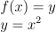
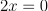
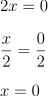
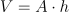
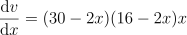
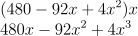
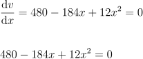

# Máximos e Mínimos de Funções

## Contents

 - [01 - Ideia Principal](#01)
 - [02 - Resolvendo um problema real de Máximo e Mínimo de uma função](#02)

<div id='01'></div>

## 01 - Ideia Principal

Antes de iniciar nossos estudos sobre pontos **máximos** e **mínimos** de uma função vamos relembrar alguns conceitos de Derivadas:

> *Derivada* é a **Taxa de Variação** em um ponto na *função*.

Para começar a entender melhor o que são os pontos **Máximos** e **Mínimos** de uma *função* vamos prestar atenção no seguinte gráfico abaixo:

  

Não sei se vocês lembram, **mas para cada ponto na nossa função nós temos uma Taxa de Variação** que pode ser **representada por uma reta tangente** que vai se movimentando ponto a ponto. Algo parecido com isso:

  

**NOTE:**  
Se você prestar atenção no gráfico da função abstrada em alguns momentos na curva a nossa **reta tangente** vai ficar paralela ao nosso **eixo-x**.

> Quando isso acontecer, *A Taxa de Variação* naquele ponto **x** é **0**.

  

Opa... Agora nós sabemos que sempre que a minha **reta tangente** na curva ficar paralela ao meu *eixo-x*, a minha *Taxa de Variação* naquele ponto da curva é igual a **0**.

**Ok, mas o que isso muda?**  
Esses pontos em que minha **reta tangente** fica paralela ao meu *eixo-x*, são o que nós conhecemos como pontos **máximo** e **mínimos** de uma função.

> Como vocês podem ver na mesma função nós podemos ter mais de um ponto **máximo** e mais de um ponto **mínimo**:

  

Prestando atenção na imagem acima, agora nós sabemos que uma função pode ter:

 - Um ponto máximo e/ou ponto mínimo;
 - Pontos máximos e mínimos por áreas da função;
 - Pontos máximos e mínimos (global/absoluto) - Ou seja, o **maior** ou **menor** de toda a função.

Continuando com a nossa linha de pensamento:

 - **1ª -** Nós sabemos que quando minha **reta tangente** na curva ficar paralela ao meu *eixo-x* a minha *Taxa de Variação* naquele ponto da curva é igual a **0**;
 - **2ª -** Esses pontos podem ser representados por pontos **máximos** e **mínimos** da função - `Locais ou Globais`.

Ok, mas e se fosse uma parábola? Vamos criar uma parábola aqui em Python para ver visualmente:

  

[parabola.py](src/parabola.py)
```python
def y(x):
  return x**2

if __name__ =='__main__':
  from matplotlib import pyplot as plt
  import pandas as pd

  df = pd.DataFrame({'x': range(-10, 10+1)})
  df['y'] = [y(x) for x in df.x]

  print(df)

  plt.figure(figsize=(10, 7))
  plt.plot(df.x, df.y, color='blue', marker='o')
  plt.title('y = x^2')
  plt.xlabel('x')
  plt.ylabel('x^2')
  plt.xticks(range(-10, 10+1, 1))
  plt.yticks(range(0, 100+1, 10))
  plt.grid()
  plt.savefig("../images/plot-01.png", format='png')
  plt.show()
```

**OUTPUT:**  
```
     x    y
0  -10  100
1   -9   81
2   -8   64
3   -7   49
4   -6   36
5   -5   25
6   -4   16
7   -3    9
8   -2    4
9   -1    1
10   0    0
11   1    1
12   2    4
13   3    9
14   4   16
15   5   25
16   6   36
17   7   49
18   8   64
19   9   81
20  10  100
```

  

Olhando para o gráfico acima criado com Python temos duas observações bem claras:

 - **1ª -** Nós temos um ponto mínimo (global/absoluto) para a nossa função;
 - **2ª -** Não vamos ter nenhum ponto máximo (global/absoluto) - Porque uma parábola tente ao infinito.

**NOTE:**  
Lembrem que em parábolas de um polinômio a função se altera muito se o polinômio for *positivo* ou *negativo*.

Vamos mudar a nossa função então para:

  

Agora vamos ver essa alteração em Python:

[parabola-v2.py](src/parabola-v2.py)
```python
def y(x):
  return -x**2

if __name__ =='__main__':
  from matplotlib import pyplot as plt
  import pandas as pd

  df = pd.DataFrame({'x': range(-10, 10+1)})
  df['y'] = [y(x) for x in df.x]

  print(df)

  plt.figure(figsize=(10, 7))
  plt.plot(df.x, df.y, color='blue', marker='o')
  plt.title('y = -x^2')
  plt.xlabel('x')
  plt.ylabel('-x^2')
  plt.grid()
  plt.savefig("../images/plot-02.png", format='png')
  plt.show()
```

**OUTPUT:**  
```
     x    y
0  -10 -100
1   -9  -81
2   -8  -64
3   -7  -49
4   -6  -36
5   -5  -25
6   -4  -16
7   -3   -9
8   -2   -4
9   -1   -1
10   0    0
11   1   -1
12   2   -4
13   3   -9
14   4  -16
15   5  -25
16   6  -36
17   7  -49
18   8  -64
19   9  -81
20  10 -100
```

  

Opa, vejam que agora nós temos o inverso:

 - **1ª -** Nenhum ponto mínimo (global/absoluto) - Porque uma parábola tente ao infinito;
 - **2ª -** Um ponto máximo (global/absoluto).

Bem, continuando com a nossa linha se pensamento...

 - **1ª -** Nós sabemos que quando a minha **reta tangente** na curva ficar paralela ao eixo-x, a minha *Taxa de Variação* naquele ponto na curva vai ser igual a **0**;
 - **2ª -** Nós sabemos também que nesse ponto na curva nós teremos o ponto máximo e/ou mínimo da função;
 - **3ª -** E por fim, nós sabemos que na minha função podemos ter:
   - Mais de um ponto máximo ou mínimo (por áreas);
   - E pontos máximos e mínimos globais (ou absolutos).

Ou seja, se eu quiser saber o ponto máximo ou mínimo da minha função é só eu **igualar a Taxa de Variação da minha função y para x a 0**. Colocando na fórmula vai ficar assim:

  

Vamos aplicar todo esse paranauê na nossa função **y = x<sup>2</sup>**? Vai ficar assim:

Primeiro, vamos tirar a Derivada da nossa **y = x<sup>2</sup>**:

  

Agora vamos igualar o resultado a **0**:

  

Agora vamos aplicar aquela bruxaria algébrica que só a gente sabe, para obter o resultado:

  

Ou seja, o nosso ponto de mínimo ou máximo para a função **y = x<sup>2</sup>** foi **0**. E se nós olharmos novamente no gráfico vai ficar bem claro isso:

  

<div id='02'></div>

## 02 - Resolvendo um problema real de Máximo e Mínimo de uma função

Bem, suponha que nós temos uma Cartolina/Papel qualquer e queremos montar uma caixa... Ficou algo parecido com isso:

  

Abstração bonitinha hein? Rss.. Veja que nós já cortamos as pontas da cartolina/papel e temos as dimensões da cartolina/papel **- 30cm por 16cm**.

**NOTE:**  
Quando eu dobrar essa cartolina/papel qual a altura ela vai ter? Ué, a altura vai ser **x**, quando eu dobrar todas as partes para cima a minha altura vai ser **x**.

Agora como calcular o volume dessa caixa? Se você não se lembra como calcular volume a fórmula é a seguinte:

  

Então, vamos abstrair para isso:

  

Pronto, agora que nós sabemos a fórmula do volume nós podemos tentar resolver o seguinte problema:

> Eu quero cortar essa cartolina/papel de uma maneira a ter **o maior volume possível**.

Ou seja, eu tenho uma cartolina/papel que pode ser cortada de várias maneiras para criar uma caixa; Porém, eu quero cortar ela para ter **o maior volume possível**.

Outra maneira de pensar nesse problema (que é a que vamos utilizar) é a seguinte:

> Eu quero cortar essa cartolina/papel de um tamanho **x** que me der **o maior volume possível**.

Antes de nós calcularmos esse volume primeiro eu vou equacionar o volume dependendo da variável **x**. Vamos voltar para a nossa cartolina/papel e prestar atenção em alguns detalhes:

  

Bem, se você não prestou atenção a nossa cartolina/papel não vai ter as dimensões **30cm por 16cm** quando a gente dobrar ela. Isso porque ela vai diminuir algumas partes, veja abaixo para ficar mais claro:

  

Ou seja, ela vai ter as dimensões das linhas azuis agora. Mas como representar essa alteração matematicamente? Mais uma vez vamos ver aqui em baixo isso visualmente:

  

Ou seja a minha equação do *volume* dependendo da variável **x** agora vai ser:

  
  
  


Agora quando eu descobrir qual é o valor de **x** é só eu colocar na equação e vamos descobrir qual é o volume da caixa.

**NOTE:**  
Mas lembrem de uma coisa, o meu problema aqui é o seguinte:

> Eu quero cortar essa cartolina/papel de um tamanho **x** que me der **o maior volume possível**.

Ou seja, para qual valor de **x** o meu *volume vai ser o máximo possível*? Isso é fácil e nós já aprendemos isso.

 - É só derivar essa função **v** para **x**;
 - Pegar essa Derivada e igualar a zero que nós vamos ter o ponto máximo da função.

  

Bem, primeiro vamos Derivar nossa função **v (volume)** para **x**:

  

Antes de aplicar a nossa Derivada vamos fazer algumas bruxarias algébricas para transformar essa equação em algo mais aceitável. Primeiro vamos trabalhar essa distribuição **(30 - 2x)(16 - 2x)** - **Área de Base**:

  

Voltando para a nossa Derivada nós temos o seguinte agora:

  

Dá para melhorar isso ai não dá? Vamos multiplicar a **Área da Base** pelo a **Altura**?

  

Agora sim, ficou algo mais bonito de trabalhar:

  

Agora é só a gente tirar a Derivada, vamos lá?

  

Pronto, agora é só igualar isso a 0 que nós vamos ter o **ponto máximo da minha função**:

  

Então, agora nós temo uma Equação polinomial do Segundo Grau, o que fazer? Muito simples, é só aplicar a fórmula de Bhaskara e ver quais os pontos máximos que nós vamos ter:

**NOTE:**  
Eu sei que a gente ama matemática e se divertir com isso, mas desta vez você quem vai aplicar a fórmula de Bhaskara.

Bem, o nosso resultado foi depois de aplicar a fórmula de Bhaskara foi:

  

**NOTE:**  
Ou seja, para esses dois valores de **x = 3,33** e **x = 12** se eu colocar na minha equação da Derivada o resultado vai ser igual a **0**.

Lembrando que um desses pontos **x** vai ser o ponto máximo (global/absoluto) da minha função, ou seja, o maior volume máximo possível para **x**... Eai, qual dos dois é?

Vamos voltar para a nossa Cartolina/Papel para ver visualmente nosso problema novamente:

  

Se você pensar comigo uma das propriedades para o nosso **x** é que ele tem que ser menor do que **16**. Por quê? Porque uma das dimensões da minha Cartolina/Papel é **(16cm - 2x)**, ou seja, se eu aplica um algebrismo nisso aqui vou ter:

  

Ou seja, agora nós sabemos que o meu **x** tem que ser menor do que ***8***. Ué, resolvemos... Quais foram as saídas da nossa fórmula de Bhaskara?

  

Sabendo que o meu **x** tem que ser menor do que **8 (x < 8)**, o meu ponto máximo para a função de Volume:

  

Ou seja, o maior valor de **x** possível para montar minha caixa com uma folha de Cartolina/Papel com as dimensões **30cm** por **16cm** é **x = 3,33**

  

---

**REFERENCES:**  
[Cálculo (AULA 4): Máximos e Mínimos de funções, com exemplos](https://www.youtube.com/watch?v=-3joNcXXBdw&t=10s)  

---

**Rodrigo Leite** - *Software Engineer*
