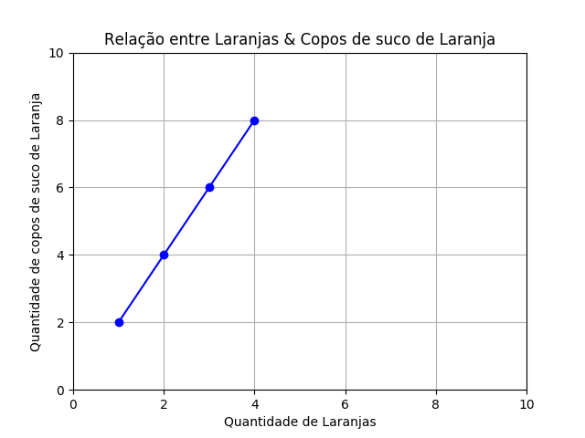

# Funções

# Contents

 - [01 - Introdução a Funções](#01)
 - [02 - Coeficiente Angular - f(x) = ax](#02)
 - [03 - Coeficiente Linear - f(x) = ax + b](#03)

<div id='01'></div>

## 01 - Introdução a Funções

> Uma função expressa a **relação** entre **duas ou mais variáveis**.

Bem, suponha que nós temos 2 variáveis **copos de suco de laranja** e **laranjas**. Como representar a relação entre essas variáveis?

Vamos ver a seguinte analogia... Suponha que nós temos a função **f(x)**, onde **x** representa a quantidade de laranjas; e seu resultado vai ser quantos copos de suco de laranja é possível fazer com uma quantidade **x** de laranjas.

Ou seja:

 - **x -** Vai representar o número de laranjas;
 - **y -** Quantos copos de suco de laranja podem ser feitos com uma quantidade **x** de laranja.

Então, viram que nós temos uma ***relação entre duas variáveis***? Como isso é expressado algebricamente?

  


Da para escrever um gráfico para representar essa relação? Dá, e vamos fazer isso agora com Python:

[function_plot.py](src/function_plot.py)
```python
def f(x):
  return 2 * x

def create_plot(x, y):
  import matplotlib.pyplot as plt
  plt.plot(x, y, color='blue', marker='o') # marker='o' marca o ponto de intersecção da função
  plt.title('Relação entre Laranjas & Copos de suco de Laranja')
  plt.xlabel('Quantidade de Laranjas')
  plt.ylabel('Quantidade de copos de suco de Laranja')
  plt.axis([0, 10, 0, 10])
  plt.grid()
  plt.savefig('../images/plot-01.png', format='png')
  plt.show()

if __name__ =='__main__':
  oranges = [1, 2, 3, 4] # Vamos testar apenas com até 4 laranjas.
  y = [] # Copos de suco vai começar vazio

  for orange in oranges:
    # Para cada laranja adicionamos quantos copos de suco será.
    y.append(f(orange))

  create_plot(oranges, y)
```

**OUTPUT:**  


Veja que a nossa relação entre as variáveis **"laranjas"** e **"copos de suco de laranja"** batem:
 - Quando **x = 1**, **y = 2**;
 - Quando **x = 2**, **y = 4**;
 - Quando **x = 3**, **y = 6**;
 - Quando **x = 4**, **y = 8**.

> Veja que essas variáveis tem uma relação diretamente proporcional - A medida que eu aumento os meus valores de **x** os meus valores de **y** também vão aumentando.

<div id='02'></div>

## 02 - Coeficiente Angular - f(x) = ax

Uma função que tem um Coeficiente Angular é algo muito parecido com isso:


Lembram da nossa função:

  

Então, o nosso **2** é o **Coeficiente Angular**. Por que angular?

> Porque quanto maior for esse **coeficiente (angular)** mais inclinada vai ser nossa reta.

Por exemplo, suponha que agora o nosso coefiente angular seja 10, ou seja, nossa função vai ser a seguinte:

  

[angular_coefficient.py](src/angular_coefficient.py)
```python
def f(x):
  return 10 * x

def create_plot(x, y):
  import matplotlib.pyplot as plt
  plt.plot(x, y, color='blue', marker='o')
  plt.title('f(x) = 10x (Coeficiente Angular)')
  plt.xlabel('Eixo - X')
  plt.ylabel('Eixo - Y')
  plt.axis([0, 50, 0, 50])
  plt.grid()
  plt.savefig('../images/plot-02.png', format='png')
  plt.show()

if __name__ =='__main__':
  x = [1, 2, 3, 4]
  y = []

  for xs in x:
    y.append(f(xs))

  create_plot(x, y)
```

**OUTPUT:**  


Se você prestar atenção na diferença nos gráficos das funções **f(x) = 2x** e **f(x) = 10x** você vai ver que o coeficiente angular é uma variável muito importante em nossas funções.

Vamos ver de novo em parelelo as diferenças de inclinações:


**NOTE:**  
As funções tem a mesma lógica; mas o *coeficiente angular* alterar muito a inclinação das retas por conta dos seus valores - **Quanto maior o seu valor, maior a inclinação**.

<div id='03'></div>

## 03 - Coeficiente Linear - f(x) = ax + b

Bem, já aprendemos o que é um *Coeficiente Angular (relacionado a inclinação de uma reta)* agora chegou a hora de aprender o que é um **Coeficiente Linear**.

As funções que tem **coeficientes lineares** tem o seguinte formato:

  

ou

  

Veja que agora nós temos mais um termo, mas como fica isso em um gráfico, vamos ver?

[linear_coefficient.py](src/linear_coefficient.py)
```python
def f(x):
  return 2 * x + 3

def create_plot(x, y):
  import matplotlib.pyplot as plt
  plt.plot(x, y, color='blue', marker='o')
  plt.title('f(x) = ax + b (Coeficiente Linear)')
  plt.xlabel('Eixo - X')
  plt.ylabel('Eixo - Y')
  plt.axis([0, 15, 0, 15])
  plt.grid()
  plt.savefig('../images/plot-03.png', format='png')
  plt.show()

if __name__ =='__main__':
  x = [1, 2, 3, 4]
  y = []

  for xs in x:
    y.append(f(xs))

  create_plot(x, y)
```


Mas o que influencia esse novo termo? Ou seja, o **"+3"**... Porque a função é quase a mesma, só mudou que temos mais um termo **b** chamado - **Coeficiente Linear**.

> O **Coeficiente Linear** faz o deslocamento paralelo da minha reta.

O que isso significa? Significa que vamos ter outra reta paralela a nossa **f(x) = ax**, ou seja, a reta **f(x) = ab + b**.

Pode ser um pouco confuso, mas se visualizarmos as duas 2 funções **f(x) = ax** e **f(x) = ax + b** em um gráfico podemos visualizar uma segunda reta paralela a da função **f(x) = ax**, porém com um deslocamento de **+3**.

Vamos ver isso na prática:

[angular_linear.py](src/angular_linear.py)
```python
import matplotlib.pyplot as plt

def angular_a(x):
  return 2 * x

def linear_b(x):
  return 2 * x + 3

if __name__ =='__main__':
  x = [1, 2, 3, 4]
  y_angular = []
  y_linear  = []

  for xs in x:
    y_angular.append(angular_a(xs))

  for xs in x:
    y_linear.append(linear_b(xs))
  
  plt.plot(x, y_angular, x, y_linear, marker='o')
  plt.legend(['f(x) = 2x', 'f(x) 2x + 3'])
  plt.title('Diferença entre coeficientes Angular & Linear')
  plt.xlabel('Eixo - X')
  plt.ylabel('Eixo - Y')
  plt.axis([0, 15, 0, 15])
  plt.grid()
  plt.savefig('../images/plot-04.png', format='png')
  plt.show()
```

**OUTPUT:**  


---

**Rodrigo Leite** *- Software Engineer*
