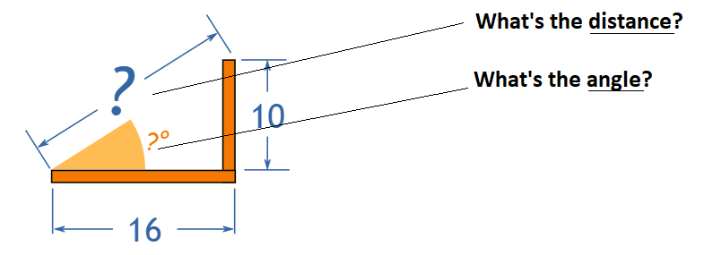
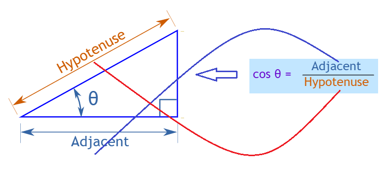
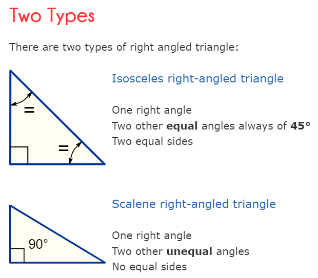
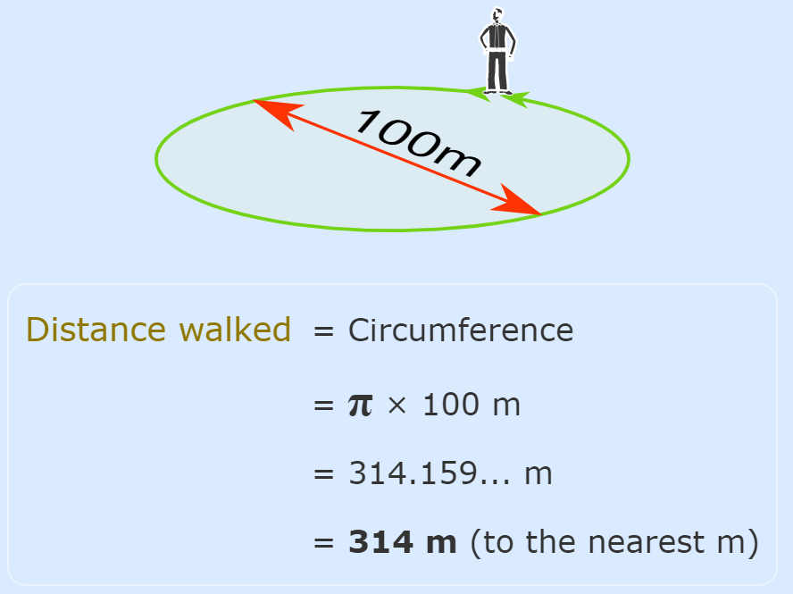

# Geometry & Trigonometry

## Contents

 - [**Trigonometry:**](#trigono)
   - [Sine](#sine)
   - [Cosine](#cosine)
   - [Tangent](#tangent)
 - **Tips & Tricks:**
   - **Components of a Circle:**
     - [Arc](#arc)
     - [Radius (Raio)](#radius)
     - [Radians (Radianos)](#radians)
   - **Angles:**
     - [Clockwise and Counterclockwise](#clockwise-counterclockwise)
     - [Parts of an Angle](#angle-parts)
     - [How to Label Angles](#label-angles)
     - [Names of Angles](#angles-names)
     - [Angle degrees](#angle-degrees)
   - [**Triangles:**](#triangles)
     - [Triangle names](#triangle-names)
     - [Triangle perimeter](#triangle-perimeter)
     - [Triangle area](#triangle-area)
     - [Right-Angled Triangles](#right-angled-triangles)
   - [**Pi (π)**](#pi)
     - [Finding a Circumference using Pi (π)](#finding-circumference-using-pi)
     - [Finding a Diameter using Pi (π)](#finding-diameter-using-pi)
 - [**References**](#references)

<!--- ( Trigonometry ) -->

---

## Trigonometry

> ***Trigonometry*** (from Greek **trigonon "triangle"** + **metron "measure"**.

The most interest triangle in the Trigonometry is the *Right-Angled Rriangle*. The **right angle** is shown by the little box in the corner (canto):

For example, see the **Right-Angled Rriangle** below:

  

 - **Another angle is often labeled (frequentemente rotulado) *θ*, and the three sides are then called:**
   - **Opposite:** opposite to the angle **θ**.
   - **Adjacent:** adjacent (next to) the angle **θ**.
   - **Hypotenuse:** The longest side is the *Hypotenuse*.

> **Ok, but why a Right-Angled Triangle?**

Imagine we can measure along and up but **want to know the direct distance** and **angle**:

  

> **NOTE:**  
> **Trigonometry** can find that missing **angle** and **distance**.

Or maybe we have a *distance* and *angle* and **need to "plot the dot (traçar uma reta)" along and up**:

  

> **Questions like these are common in engineering, computer animation and more.**
> And trigonometry gives the answers!

---

### Sine

The ***Sine /saɪn/* formula** is:

  

For example, given the triangle below:

  

Find the value of **sin t**:

 - The side **opposite** to the angle **t** is **7**.
 - And the **hypotenuse** of the triangle is **15**.
 - Then, **sin(t) = 7/25**.

> **Ok, but why the Sine formula is (Opposite/Hypotenuse)?**

---

### Cosine

The **Cosine /ˈkoʊ.saɪn/ formula** is:

  

For example, given the triangle below:

  

Find the value of **cos α**:

 - The side **adjacent** to the angle is **15**.
 - And the **hypotenuse** of the triangle is **17**.
 - Then, **cos(α) = 15/17**.

> **Ok, but why the Tangent formula is (Adjacent/Adjacent)?**

---

### Tangent

The **Tangent /ˈtæn.dʒənt/ formula** is:

  

> **Ok, but why the Tangent formula is (Opposite/Adjacent)?**

<!--- ( Tips & Tricks ) -->

---

### Arc

> The **Arc** is a part of the *circumference* of a *circle*.

  

### Radius (Raio)

> The **Radius (raio)** is *half of the diameter*.

  

**NOTE:**  
That's, a **Radius (raio)** is the distance between the circle center to any point on the circumference.

Another definition of **Radius (raio)** is:

> A **Radius (raio)** is the line drawn from the centre of the circle to any point on the boundary (limite) of the circle.

  

Following this definition we can say that:

> A *circle* can have an uncountable number of **Radius (raios)**.

  

### Radians (Radianos)

> A **Radian (Radiano)** is an Arc that has the same length as the radius.

  

**NOTE:**  
We know that a unit circle has a radius length of 1. That means that for a unit circle 1 radian will have an arc with the length of 1:

  

**NOTE:**  
Another note is 1 Radian (Radiano) is about (cerca de) 57,2958 degrees:

  

> **Why "57,2958..." degrees?** 

Let us see because **1 Radian** is equal to **57,2958... degrees**:

  

In a *half circle (semicírculo)* there are *π radians*, which is also *180°*:

  

 - **To go from radians to degrees:**
   - Multiply by **180**, divide by **Pi π**.
 - **To go from degrees to radians:**
   - Multiply by **Pi π**, divide by **180**.

Here is a table of equivalent values:

  

---

### Clockwise and Counterclockwise

**NOTE:**  
Before *diving headfirst (cair de cabeça)* into the study of *Angles*, let's learning about ***Clockwise and Counterclockwise***.

**Clockwise** means moving in the *direction of the hands on a clock*. For example, see the image below to understand more easily

> **NOTE:**  
> Most screws and bolts are tightened, and faucets/taps are closed, by turning clockwise.

 - The opposite direction is called **Counterclockwise in the US**.
 - **Anticlockwise in the UK**.
 - Or the less common but pretty cool **widdershins**!

**Compass bearings (rumos da bússola)** also are measured Clockwise:

#### Angles use Counterclockwise

However, **Angles** from a line are measured Counterclockwise *(and a negative angle goes Clockwise)*:

> **So which way?**

 - **Clockwise:**
   - Clock hands go clockwise.
   - Taps are closed clockwise.
   - Screws are tightened clockwise.
   - Compass bearings go clockwise.
 - **Counterclockwise:**
   - But **Angles are measured Counterclockwise**.

**Abbreviation:**  
Such long words deserve to be shortened:

 - So Clockwise can be shortened to **CW**.
 - And CounterClockWise to **CCW** *(or maybe ACW for anticlockwise)*.

### Parts of an Angle

 - The **corner (canto)** point of an angle is called the **vertex**.
 - The two **straight sides (lados retos)** are called **arms**.

For example, see the image below to understand more easily:

  

> **NOTE:**  
> The Angle is the amount of turn between each arm.

### How to Label Angles

There are two main ways to label angles:

 - Give the Angle a name, usually a lower-case letter like **a** or **b**, or sometimes a Greek letter like **α (alpha)** or **θ (theta)**.
 - Or by the three letters on the shape that define the angle, with the middle letter being where the angle actually is (its vertex).

Example, the Angle **"a"** is **"BAC"**; And Angle **"θ"** is **"BCD"**:

  

### Names of Angles

As the **Angle** increases, the name changes. For example, see the **Angles** names by size below:

  

### Angle degrees

We can measure Angles in **degrees**. For example, see the image below:

  
  

There are **360 degrees in one Full Rotation** *(one complete circle around)*.

**The degree symbol  "°"**  
We use a little circle **"°"** following the number to mean degrees.

> **NOTE:**  
> For example **90°** means **90 degrees**.

---

## Triangles

 - A *Triangle* has **THREE SIDES** and **THREE ANGLES**:
   - **NOTE:** The **THREE ANGLES** always **ADD (SOMAM 180°) TO 180°**.

For example, see the **Triangle** below:

  

See that:

 - **The triangle above has:**
   - Three sides.
   - Theree Angles.
   - **EN:** Finally, the sum of all angles has been always 180° regardless () of how I move the angles.
   - **PT:** Finalmente, a soma de todos os ângulos é sempre 180° independentemente de como eu movo os ângulos.

### Triangle names

There are three special **names** given to triangles that tell **how many sides (or angles) are equal**:

  

 - **How to remember? Alphabetically they go 3, 2, none:**
   - **Equilateral:** "equal"-lateral (lateral means side) so they have all equal sides.
   - **Isosceles:** means "equal legs", and we have two legs, right? Also *Isosceles* has two equal "Sides" joined by an "Odd" side.
   - **Scalene:** means "uneven" or "odd", so no equal sides.

### Triangle perimeter

> **The *triangle perimeter* is the distance around the edge (borda, beira, margem) of the triangle:** Just add up the three sides.

For example, see the image below:

  

See that:

 - **EN -** Note that the wider the sides of the triangle, the larger the perimeter.
 - **PT -** Veja que, quantos mais largo os lados do triângulo, maior o perímetro.

### Triangle area

> **EN - The *triangle area* is half of the base times height.**
> **PT - A *área do triângulo* é metade da base vezes a altura.**

For example:

 - **"b (base)"** is the distance along the base.
 - **"h (height)"** is the height (measured at right angles to the base/medida em ângulos retos com a base).

The **formula** to the **Triangle area** is:

  

> **NOTE:**  
> The formula works for all triangles.

  

 - **EN -** The base can be any side, Just be sure the "height" is measured at right angles to the "base".
 - **PT -** A base pode ser qualquer lado, apenas certifique-se de que a "altura" seja medida em ângulos retos com a "base".

## Right-Angled Triangles

> A **Right-Angled Triangle** (also called a **right triangle**) is a triangle with a *right angle (90°)* in it.

**NOTE:**  
The **little square** in the corner (canto) tells us it is a right angled triangle:

  

 - **The right angled triangle is one of the most useful shapes in all of mathematics:**
   - Pythagoras Theorem;
   - Sine;
   - Cosine;
   - Tangent...

  

---

## Pi (π)

The definition of **Pi (π)** is:

> The ***Pi (π)*** is the **circumference** divided by the **diameter** of a *circle*.

For example, see the image below to understand more easily:

  

See that:

 - We have a **circle**.
   - The ***circle*** have:
     - A *circumference*;
     - A *diameter*.
 - And ***Pi (π)*** is **circumference/diameter**.

> **NOTE:**  
> The *Circumference* divided by the *diameter* of a circle is always **Pi (π)**, no matter how large or small the circle is!

  

### Finding a Circumference using Pi (π)

We can use **Pi (π)** to find a **Circumference** when we know the **Diameter**. The formula is:

  

For example, imagine you walk around a circle which has a **diameter of 100 m**, how far have you walked?

  

### Finding a Diameter using Pi (π)

Also we can use **Pi (π)** to find a **Diameter** when we know the **Circumference**. The formula is:

  

For example, imagine you **measured 94 mm around the outside of a pipe**... what is its **diameter**?

  

<!--- ( References ) -->

---

## References

 - [Clockwise and Counterclockwise](https://www.mathsisfun.com/geometry/clockwise-counterclockwise.html)
 - [Angles](https://www.mathsisfun.com/angles.html)
 - [Degrees (Angles)](https://www.mathsisfun.com/geometry/degrees.html)
 - [7.1 Angles](https://openstax.org/books/algebra-and-trigonometry-2e/pages/7-1-angles)
 - [Triangles](https://www.mathsisfun.com/triangle.html)
 - [Right-Angled Triangles](https://www.mathsisfun.com/right_angle_triangle.html)
 - [Pi (π)](https://www.mathsisfun.com/numbers/pi.html)
 - [Radians](https://www.mathsisfun.com/geometry/radians.html)
 - [What are radians?](https://jarnowouda.com/what-are-radians/)

---

Ro**drigo** **L**eite da **S**ilva - **drigols**
