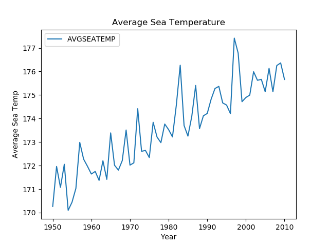
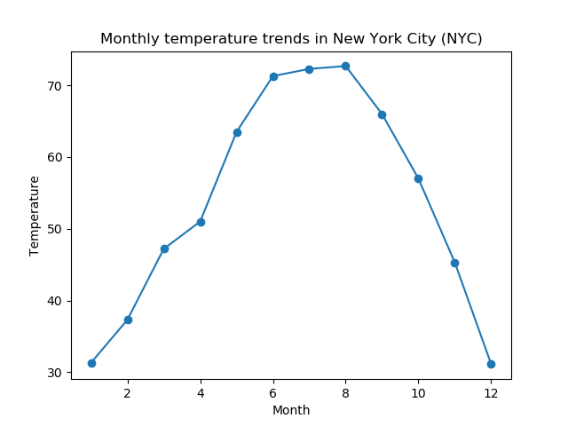
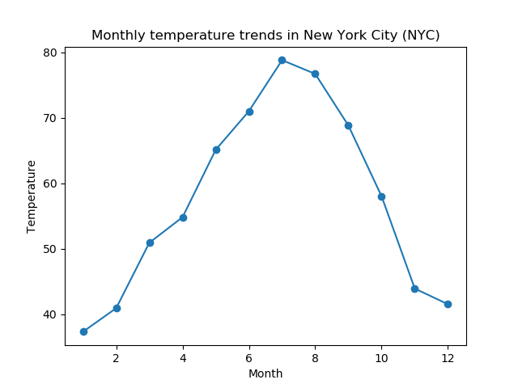
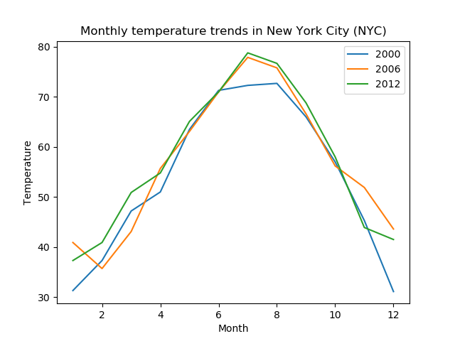

# Gráficos de Linhas (Line Charts)

## Conteúdo

 - [01 - Introdução ao Gráficos de linhas (Line Charts)](#01)
 - [02 - Gráficos de Linhas (Line Charts) na prática com Python, Matplotlib e Statsmodels](#02)
 - [03 - Criando um Gráficos de Linhas (Line Charts) para analisar graficamente a temperatura média anual em Nova York](#03)
   - [03.1 - Marcando pontos de Intersecção no seu Gráfico](#03-1)
   - [03.2 - Criando dados para representar os anos e temperaturas média de cada ano em Nova York](#03-2)
   - [03.3 - Comparando as tendências mensais de temperatura da cidade de Nova York](#03-3)
   - [03.4 - Criando um Gráficos de linhas (Line Charts) com uma linha para cada ano das temperaturas de New York no mesmo gráfico](#03-4)

---

<div id="01"></div>

## 01 - Introdução ao Gráficos de linhas (Line Charts)

Os **Gráficos de Linhas (Line Charts)** são uma ótima maneira de ver as alterações nos valores ao longo de uma série - geralmente (mas nem sempre) com base em um período de tempo.

---

<div id="02"></div>

## 02 - Gráficos de Linhas (Line Charts) na prática com Python, Matplotlib e Statsmodels

Um ótimo dataset para exemplificar um **Gráficos de Linhas (Line Charts)** é o `Elnino Temperatures` que observa a temperatura da superfície do mar entre 1950 e 2010:

[line_chart.py](src/line_chart.py)
```python
import statsmodels.api as sm

df = sm.datasets.elnino.load_pandas().data
print(df.head(10))
```

**OUTPUT:**  
```
     YEAR    JAN    FEB    MAR    APR    MAY    JUN    JUL    AUG    SEP    OCT    NOV    DEC
0  1950.0  23.11  24.20  25.37  23.86  23.03  21.57  20.63  20.15  19.67  20.03  20.02  21.80
1  1951.0  24.19  25.28  25.60  25.37  24.79  24.69  23.86  22.32  21.44  21.77  22.33  22.89
2  1952.0  24.52  26.21  26.37  24.73  23.71  22.34  20.89  20.02  19.63  20.40  20.77  22.39
3  1953.0  24.15  26.34  27.36  27.03  25.47  23.49  22.20  21.45  21.25  20.95  21.60  22.44
4  1954.0  23.02  25.00  25.33  22.97  21.73  20.77  19.52  19.33  18.95  19.11  20.27  21.30
5  1955.0  23.75  24.82  25.14  24.22  22.16  21.20  20.46  19.63  19.24  19.16  19.84  21.19
6  1956.0  23.24  24.71  25.90  24.66  23.14  22.04  21.47  20.55  19.89  19.69  20.57  21.58
7  1957.0  23.13  26.30  27.63  27.15  26.72  25.04  23.83  22.34  21.80  21.80  22.39  23.69
8  1958.0  24.89  26.55  27.09  26.37  24.71  23.23  22.31  20.72  20.62  21.05  21.52  22.50
9  1959.0  23.97  25.90  26.94  25.84  24.23  22.57  21.50  20.15  20.23  20.86  21.88  22.55
```

Continuando com o nosso exemplo nós teremos o seguinte código para ver isso em um gráfico:

[line_chart.py](src/line_chart.py)
```python
from matplotlib import pyplot as plt
import statsmodels.api as sm

df = sm.datasets.elnino.load_pandas().data # Take Elnino Temperature dataset.

# Add a column with average per year - "AVGSEATEMP".
# - Sum all months - January to December;
# - Divide by month numbers (12).
df['AVGSEATEMP'] = df.mean(1) # The mean start into indice 1 (January).

print(df.head(10))

df.plot(title='Average Sea Temperature', x='YEAR', y='AVGSEATEMP')
plt.xlabel('Year')
plt.ylabel('Average Sea Temp')
plt.savefig('../images/line-chart.png', format='png')
plt.show()
```

**OUTPUT:**  
```
     YEAR    JAN    FEB    MAR    APR    MAY    JUN    JUL    AUG    SEP    OCT    NOV    DEC  AVGSEATEMP
0  1950.0  23.11  24.20  25.37  23.86  23.03  21.57  20.63  20.15  19.67  20.03  20.02  21.80  170.264615
1  1951.0  24.19  25.28  25.60  25.37  24.79  24.69  23.86  22.32  21.44  21.77  22.33  22.89  171.963846
2  1952.0  24.52  26.21  26.37  24.73  23.71  22.34  20.89  20.02  19.63  20.40  20.77  22.39  171.075385
3  1953.0  24.15  26.34  27.36  27.03  25.47  23.49  22.20  21.45  21.25  20.95  21.60  22.44  172.056154
4  1954.0  23.02  25.00  25.33  22.97  21.73  20.77  19.52  19.33  18.95  19.11  20.27  21.30  170.100000
5  1955.0  23.75  24.82  25.14  24.22  22.16  21.20  20.46  19.63  19.24  19.16  19.84  21.19  170.446923
6  1956.0  23.24  24.71  25.90  24.66  23.14  22.04  21.47  20.55  19.89  19.69  20.57  21.58  171.033846
7  1957.0  23.13  26.30  27.63  27.15  26.72  25.04  23.83  22.34  21.80  21.80  22.39  23.69  172.986154
8  1958.0  24.89  26.55  27.09  26.37  24.71  23.23  22.31  20.72  20.62  21.05  21.52  22.50  172.273846
9  1959.0  23.97  25.90  26.94  25.84  24.23  22.57  21.50  20.15  20.23  20.86  21.88  22.55  171.970769
```



O gráfico de linhas mostra a tendência da temperatura da esquerda para a direita durante o período de observações. A partir deste gráfico, você pode ver que a temperatura média flutua de ano para ano, mas a tendência geral mostra um aumento.

---

<div id="03"></div>

## 03 - Criando um Gráficos de Linhas (Line Charts) para analisar graficamente a temperatura média anual em Nova York

Para esse exemplo que vamos criar, vamos começar com um gráfico bem simples e com o passar do tutorial vamos adicionando novas funcionalidades:

[nyc_average-v1.py](src/nyc_average-v1.py)
```python
def create_plot(x, y):
  from pylab import plot, show, savefig
  plot(x, y)
  savefig('../images/new-york-tem-01.png', format='png')
  show()  

if __name__ =='__main__':

  x_numbers = [1, 2, 3] # Create a list to represent axis-X.
  y_numbers = [2, 4, 6] # Create a list to represent axis-y.

  create_plot(x_numbers, y_numbers)
```

**OUTPUT:**  


Veja que nós temos um plot bem simples, só passamos as coordenadas **x**, **y**, salvamos e exibimos o plot.

<div id='03-1'></div>

## 03.1 - Marcando pontos de Intersecção no seu Gráfico

Bem, como já está no título vamos marcar a *intersecção* entre os pontos **x** e **y**. Para marcar o ponto de *intersecção* nós utilizamos o atributo **"marker"** para criar pontos de Intersecção no seu gráfico

[nyc_average-v2.py](src/nyc_average-v2.py)
```python
def create_plot(x, y):
  from pylab import plot, show, savefig
  plot(x, y, marker='o')
  savefig('../images/new-york-tem-02.png', format='png')
  show()  

if __name__ =='__main__':

  x_numbers = [1, 2, 3] # Create a list to represent axis-X.
  y_numbers = [2, 4, 6] # Create a list to represent axis-y.

  create_plot(x_numbers, y_numbers)
```

**OUTPUT:**  


**NOTE:**  
O atributo **"marker"** pode receber como argumento: **o**, **`*`**, **x**, ...

<div id="03-2"></div>

# 03.2 - Criando dados para representar os anos e temperaturas média de cada ano em Nova York

Agora já imaginou criar um gráfico/plot para representar a **relação** entre as variáveis **anos (years)** e **temperatura média por ano**?

Veja o exemplo abaixo:

[nyc_average-v3.py](src/nyc_average-v3.py)
```python
def create_plot(x, y):
  import matplotlib.pyplot as plt

  # Display to each "x" the temperature average "y".
  for year, average_temp in zip(x, y):
    print("In year {0} the average New York temperature was {1}°".format(year, average_temp))

  plt.plot(x, y, marker='o')
  plt.savefig('../images/new-york-tem-03.png', format='png')
  plt.show()

if __name__ =='__main__':

  # Create a list to represent New York temperatures from 2000 to 2021.
  nyc_temp = [53.9, 56.3, 56.4, 53.4, 54.5, 55.8, 56.8, 55.0, 55.3, 54.0, 56.7, 56.4, 57.3]

  # Use range() function to create a predefined list (2000 to 2021).
  # NOTE: Remember that range() function never display the last element. That is from 2000 to 2013.
  years = range(2000, 2013)

  # Cria a plot with create_plot() function.
  create_plot(years, nyc_temp)
```

**OUTPUT:**  
```python
In year 2000 the average New York temperature was 53.9°
In year 2001 the average New York temperature was 56.3°
In year 2002 the average New York temperature was 56.4°
In year 2003 the average New York temperature was 53.4°
In year 2004 the average New York temperature was 54.5°
In year 2005 the average New York temperature was 55.8°
In year 2006 the average New York temperature was 56.8°
In year 2007 the average New York temperature was 55.0°
In year 2008 the average New York temperature was 55.3°
In year 2009 the average New York temperature was 54.0°
In year 2010 the average New York temperature was 56.7°
In year 2011 the average New York temperature was 56.4°
In year 2012 the average New York temperature was 57.3°
```


Veja que a nossa relação corresponde tanto na saíde de anos **x** e suas respectivas temperaturas **y** com o nosso gráfico/plot.

<div id="03-3"></div>

## 03.3 - Comparando as tendências mensais de temperatura da cidade de Nova York

Bem, nós já fizemos uma **relação** entre as variáveis **anos (years)** e **temperatura média por ano (nyc_temp)**.

> Agora vamos fazer a **relação** entre as variáveis de **meses do ano (x)** e suas respectivas **temperaturas dos meses do ano (y)**.

O código vai mudar pouco, veja a seguir:

[year_average.py](src/year_average.py)
```python
def create_plot(x, *y):
  import matplotlib.pyplot as plt
  image_number = 1

  # Display relationship between months of year and yours respective temperatures (by year "y").
  for actual_month_of_year_y in y:
    for actual_month, actual_temp in zip(x, actual_month_of_year_y):
      print("In Month {0} the average New York temperature was {1}°".format(actual_month, actual_temp))
    print("")
    # For each year, will be display a plot with the relationship between yours months and temperatures.
    plt.plot(x, actual_month_of_year_y, marker='o')
    plt.title('Monthly temperature trends in New York City (NYC)')
    plt.xlabel('Month')
    plt.ylabel('Temperature')
    plt.savefig('../images/year-{0}.png'.format(image_number), format='png')
    plt.show()
    image_number += 1

if __name__ =='__main__':

  # Create a list to represent New York year 2000 temperature.
  nyc_temp_2000 = [31.3, 37.3, 47.2, 51.0, 63.5, 71.3, 72.3, 72.7, 66.0, 57.0, 45.3, 31.1]

  # Create a list to represent New York year 2006 temperature.
  nyc_temp_2006 = [40.9, 35.7, 43.1, 55.7, 63.1, 71.0, 77.9, 75.8, 66.6, 56.2, 51.9, 43.6]

  # Create a list to represent New York year 2012 temperature.
  nyc_temp_2012 = [37.3, 40.9, 50.9, 54.8, 65.1, 71.0, 78.8, 76.7, 68.8, 58.0, 43.9, 41.5]

  # Month representations
  months = range(1, 13)

  # Create a plot with create_plot() function.
  create_plot(months, nyc_temp_2000, nyc_temp_2006, nyc_temp_2012)
```

**OUTPUT:**  
```python
In Month 1 the average New York temperature was 31.3°
In Month 2 the average New York temperature was 37.3°
In Month 3 the average New York temperature was 47.2°
In Month 4 the average New York temperature was 51.0°
In Month 5 the average New York temperature was 63.5°
In Month 6 the average New York temperature was 71.3°
In Month 7 the average New York temperature was 72.3°
In Month 8 the average New York temperature was 72.7°
In Month 9 the average New York temperature was 66.0°
In Month 10 the average New York temperature was 57.0°
In Month 11 the average New York temperature was 45.3°
In Month 12 the average New York temperature was 31.1°
```

  

```
In Month 1 the average New York temperature was 40.9°
In Month 2 the average New York temperature was 35.7°
In Month 3 the average New York temperature was 43.1°
In Month 4 the average New York temperature was 55.7°
In Month 5 the average New York temperature was 63.1°
In Month 6 the average New York temperature was 71.0°
In Month 7 the average New York temperature was 77.9°
In Month 8 the average New York temperature was 75.8°
In Month 9 the average New York temperature was 66.6°
In Month 10 the average New York temperature was 56.2°
In Month 11 the average New York temperature was 51.9°
In Month 12 the average New York temperature was 43.6°
```

  

```
In Month 1 the average New York temperature was 37.3°
In Month 2 the average New York temperature was 40.9°
In Month 3 the average New York temperature was 50.9°
In Month 4 the average New York temperature was 54.8°
In Month 5 the average New York temperature was 65.1°
In Month 6 the average New York temperature was 71.0°
In Month 7 the average New York temperature was 78.8°
In Month 8 the average New York temperature was 76.7°
In Month 9 the average New York temperature was 68.8°
In Month 10 the average New York temperature was 58.0°
In Month 11 the average New York temperature was 43.9°
In Month 12 the average New York temperature was 41.5°
```

  

Olha que lindo o nosso código não? Para cada ano ele exibe:
 - As temperaturas dos seus respectivos meses;
 - Um gráfico/plot exibindo a **relação** entre as variáveis **mês** e **temperatura do mês**.

<div id="03-4"></div>

## 03.4 - Criando um Gráficos de linhas (Line Charts) com uma linha para cada ano das temperaturas de New York no mesmo gráfico

Mas como eu crio um gráfico com essas 3 linhas, ou seja, esses 3 anos? Na programação quase tudo é possível né?

Veja o código a seguir:

[complete_graph.py](src/complete_graph.py)
```python
import matplotlib.pyplot as plt

# Cria uma lista para representar as temperaturas de New York no ano de 2000
nyc_temp_2000 = [31.3, 37.3, 47.2, 51.0, 63.5, 71.3, 72.3, 72.7, 66.0, 57.0, 45.3, 31.1]

# Cria uma lista para representar as temperaturas de New York no ano de 2006
nyc_temp_2006 = [40.9, 35.7, 43.1, 55.7, 63.1, 71.0, 77.9, 75.8, 66.6, 56.2, 51.9, 43.6]

# Cria uma lista para representar as temperaturas de New York no ano de 2012
nyc_temp_2012 = [37.3, 40.9, 50.9, 54.8, 65.1, 71.0, 78.8, 76.7, 68.8, 58.0, 43.9, 41.5]

# Months representation
months = range(1, 13)

plt.plot(months, nyc_temp_2000, months, nyc_temp_2006, months, nyc_temp_2012)
plt.legend([2000, 2006, 2012]) # Adiciona legenda para cada ano respectivamente.
plt.title('Tendências mensais de temperatura em Nova York - NYC')
plt.xlabel('Meses')
plt.ylabel('Temperatura')
plt.savefig('../images/plot-05.png', format='png')
plt.show()
```

**OUTPUT:**  


---

**REFERÊNCIA:**  
[Essential Math for Machine Learning: Python Edition](https://learning.edx.org/course/course-v1:Microsoft+DAT256x+2T2018/home)  
