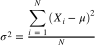
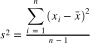
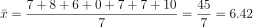
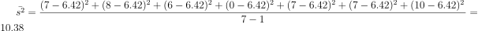
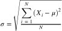
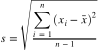
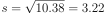
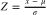
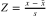
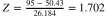

# Gráficos de Linhas (Line Charts)

## Conteúdo

 - [10 - Variância & Desvio Padrão](#11)
 - [11 - Z Score](#12)
 - [BONUS - Resumindo a distribuição de dados no Python](#13)

---

<div id='11'></div>

## 10 - Variância & Desvio Padrão

### 10.1 - Variância

Para entender melhor como funciona a variância vamos voltar ao exemplo de horas dormidas por uma pessoa que nós vimos antes. Suponha que nós temos a seguinte amostra:

| Sunday | Monday | Tuesday | Wednesday | Thursday | Friday | Saturday |
|--------|--------|---------|-----------|----------|--------|----------|
|   7    |    8   |    6    |     0     |     7    |    7   |    10    |

As equações para uma *população complete* e *uma amostra* são as seguintes:

> Para uma **população completa**, é indicada por uma letra grega quadrada *sigma* (***&sigma;<sup>2</sup>***) e calculada assim:

  

> Para **uma amostra**, é indicada como ***s<sup>2</sup>*** calculado da seguinte forma:

  

> Em ambos os casos, somamos a diferença entre os valores de dados individuais e a média e o quadrado do resultado.

 - Para **uma população completa**, apenas dividimos pelo número de itens de dados para obter a média.
 - Para **uma amostra**, `dividimos pelo número total de itens menos 1 para corrigir o viés da amostra`.

Vamos ver como ficaria isso para a nossa amostra de horas dormidas por uma pessoa. Primeiro vamos tirar a média das horas dormidas (para uma amostra):

  

Agora vamos:

 - Subtrair as horas dormidas todos os dias pelo a média tirada antes - **6.42**;
 - E elevar as subtrações ao quadrado - **n<sup>2</sup>**;
 - Somar todos os resultados - **Σ**.

Vai ficar algo parecido com isso:

  

E para que server a **variância** afinal?

> ***A variância server para mostrar quão distante está meus dados (amostra) da média.***

Ou seja:

 - Quando **mais distantes** os meus valores estiverem uns dos outros (em relação a média) - **Maior vai ser a variância**;
 - Quando **menos distantes** os meus valores estiverem uns dos outros (em relação a média) - **Menor vai ser a variância**.
 - Quando a **variância é pequena** eu sei que meus dados (amostra) é **Uniformemente distribuído**:
   - Ou seja, eles estão muito próximos uns dos outros.

**NOTE:**  
No Python, você pode usar a função **var()** da classe **pandas.dataframe** para calcular a variação de uma coluna em um dataframe. Vamos testar a variação/variância das notas dos alunos de uma escola:

```python
import pandas as pd

df = pd.DataFrame({
  'Name': ['Dan', 'Joann', 'Pedro', 'Rosie', 'Ethan', 'Vicky', 'Frederic'],
  'Salary':[50000, 54000, 50000, 189000, 55000, 40000, 59000],
  'Hours':[41, 40, 36, 17, 35, 39, 40],
  'Grade':[50, 50, 46, 95, 50, 5,57]
  })

# Pega a label/coluna "Grade" do DataFrame
# e calcula a variância com a função var(). 
print(df['Grade'].var())
```

**OUTPUT:**  
```
685.6190476190476
```

### 10.2 - Desvio Padrão

> O **Desvio Padrão** é simplesmente a Raiz quadrada da variação (variância).

Nós também seguimos o mesmo modelo para uma **população complete** e **uma amostra**:

  

Ou assim, para um exemplo (amostra):

  

**NOTE:**  
Note que em ambos os casos, é apenas a raiz quadrada da *variante da fórmula correspondente*!

Ou seja, para a nossa *variância* de horas dormidas por uma amostra **s** o ***Desvio Padrão*** vai ser:

  

No Python nós utilizamos a função **std()** do Pandas para realizar o Desvio Padrão. Vamos ver o Desvio Padrão das notas de uma classe de alunos:

```python
import pandas as pd

df = pd.DataFrame({
  'Name': ['Dan', 'Joann', 'Pedro', 'Rosie', 'Ethan', 'Vicky', 'Frederic'],
  'Salary':[50000, 54000, 50000, 189000, 55000, 40000, 59000],
  'Hours':[41, 40, 36, 17, 35, 39, 40],
  'Grade':[50, 50, 46, 95, 50, 5,57]
  })

# Calcula o Desvio Padrão das notas.
print(df['Grade'].std())
```

**OUTPUT:**  
```
26.184328282754315
```

**PARA QUE SERVER O *DESVIO PADRÃO***?  

> O objetivo do **Desvio Padrão** é trazer a minha *variância* para uma ordem de grandeza que que fique mais próximo dos meus valores de amostra.

Voltando para a nossa amostra de horas dormidas de uma amostra:

| Sunday | Monday | Tuesday | Wednesday | Thursday | Friday | Saturday |
|--------|--------|---------|-----------|----------|--------|----------|
|   7    |    8   |    6    |     0     |     7    |    7   |    10    |

Com a variança **(10.38)** por sí só não vai dar para enxergar o que ele significa com relação aos nossos dados de horas dormidas. Talvez para várias amostras de pessoas **s** seja possível encontrar uma relação de horas dormidas e suas variâncias. Mas para uma pessoa só fica difícil.

É ai que entra o **Desvio Padrão**. Ou seja, vamos trazer a **variância (10.38)** para a ordem de grandeza dos nossos dados:

  

Então, com o nosso **Desvio Padrão (3.22)**, podemos *tentar* comparar com horas dormidas de uma única amostra para *ver uma variância em uma grandeza mais próxima*.

O que isso significa na prática?

 - Podemos imaginar que uma pessoa dormiu *para mais* ou *para menos* **3.22** horas:
   - Isso pode nós dizer que talvez a nossa amostra não esteja *Uniformemente Distribuída*;
 - Se o meu **Desvio Padrão** fosse de 0.5 horas pode nós dizer que a pessoa dormiu apenas 30m/meia hora *para mais* ou *para menos*:
   - Ou seja, talvez a nossa amostra esteja *Uniformemente Distribuída*.

**Média vs Desvio Padrão:**  

 - *A Média* da uma ordem de grandeza - **Como os dados estão distribuídos**;
 - *O Desvio Padrão* vai mostrar quanto eles estão distantes desta média **- Da distribuição**.

## 10.3 Desvio padrão em uma distribuição normal

Em estatística e ciência de dados, gastamos muito tempo considerando distribuições normais; porque eles ocorrem com muita frequência. O __Desvio Padrão__ tem uma relação importante para jogar em uma distribuição normal.

Veja o seguinte histograma que representa uma __distribuição normal padrão__ `(que é uma distribuição com uma média de 0 e um desvio padrão de 1)`:

```python
import pandas as pd
import matplotlib.pyplot as plt
import numpy as np
import scipy.stats as stats

# Cria uma distribuição normal padrão aleatória com np.random.randn() e salva no DataFrame - df:
# - Os argumentos para a função random.randn() são as dimensões: (100000, 1) = 100.000 linhas por 1 coluna.
# - columns=['Grade'] é onde armazenar os dados no df. Se não específicar o df não vai ter uma label específico.
df = pd.DataFrame(np.random.randn(100000, 1), columns=['Grade'])

grade = df['Grade'] # Pega a distribuição criada no label/coluna "Grade".
density = stats.gaussian_kde(grade) # Pega a densidade da distribuição.

n, x, _ = plt.hist(grade, color='lightgrey', density=True, bins=100) # Cria o Histograma. 
plt.plot(x, density(x)) # Adiciona a densidade/linha de densidade no plot/gráfico.

s = df['Grade'].std() # Pega o Desvio Padrão da distribuição normal padrão criada.
m = df['Grade'].mean() # Pega a média da distribuição normal padrão criada.

# Annotate 1 stdev
x1 = [m-s, m+s]
y1 = [0.25, 0.25]
plt.plot(x1,y1, color='magenta')
plt.annotate('1s (68.26%)', (x1[1],y1[1]))

# Annotate 2 stdevs
x2 = [m-(s*2), m+(s*2)]
y2 = [0.05, 0.05]
plt.plot(x2,y2, color='green')
plt.annotate('2s (95.45%)', (x2[1],y2[1]))

# Annotate 3 stdevs
x3 = [m-(s*3), m+(s*3)]
y3 = [0.005, 0.005]
plt.plot(x3,y3, color='orange')
plt.annotate('3s (99.73%)', (x3[1],y3[1]))

# Adiciona a média(mean) no plot/gráfico.
plt.axvline(grade.mean(), color='grey', linestyle='dashed', linewidth=1)
plt.show()
```

**OUTPUT:**  
  

As linhas coloridas horizontais mostram a porcentagem de dados dentro de 1, 2 e 3 desvios padrão da média (mais ou menos).

Em qualquer distribuição normal:

 - Aproximadamente 68,26% dos valores estão dentro de um desvio padrão da média.
 - Aproximadamente 95,45% dos valores estão dentro de dois desvios padrão da média.
 - Aproximadamente 99,73% dos valores estão dentro de três desvios padrão da méddia.

<div id='12'></div>

## 11 - Z Score

Portanto, em uma distribuição normal (ou próxima do normal), o desvio padrão fornece uma maneira de avaliar a que distância de uma média um determinado intervalo de valores cai, permitindo comparar onde um determinado valor está dentro da distribuição. Por exemplo, suponha que Rosie lhe diga que ela foi a aluna de maior pontuação entre suas amigas - isso não nos ajuda realmente a avaliar o quão bem ela marcou. Ela pode ter marcado apenas uma fração de um ponto acima do segundo maior aluno de pontuação. Mesmo se soubermos que ela estava no quartil superior; Se não sabemos como o resto das notas são distribuídas, ainda não está claro o quão bem ela se apresentou em comparação com seus amigos.

No entanto, se ela disser quantos desvios padrão são maiores do que a média de sua pontuação, isso ajudará você a comparar sua pontuação com a de seus colegas de classe.

Então, como sabemos quantos desvios padrão estão acima ou abaixo da média de um determinado valor? Nós chamamos isso de Z Score , e é calculado assim para uma população completa:

  

ou assim para uma amostra:

  

Então, vamos examinar a nota de Rosie de 95. Agora que sabemos que a nota média é 50,43 e o desvio padrão é 26,184, podemos calcular a pontuação Z para essa nota assim:

  

Portanto, o grau de Rosie é de 1,702 desvios-padrão acima da média.

<div id='13'></div>

## BONUS - Resumindo a distribuição de dados no Python

Vimos como obter estatísticas individuais em Python, mas você também pode usar a função describe para recuperar estatísticas de resumo de todas as colunas numéricas em um dataframe. Estas estatísticas resumidas incluem muitas das estatísticas que examinamos até agora __(embora seja importante notar que a mediana não está incluída)__:


```python
import pandas as pd

df = pd.DataFrame({
  'Name': ['Dan', 'Joann', 'Pedro', 'Rosie', 'Ethan', 'Vicky', 'Frederic'],
  'Salary':[50000, 54000, 50000, 189000, 55000, 40000, 59000],
  'Hours':[41, 40, 36, 17, 35, 39, 40],
  'Grade':[50, 50, 46, 95, 50, 5,57]
  })

# Pega um resumo estatístico de todas as colunas.
print(df.describe())
```

**OUTPUT:**  
```
        Grade      Hours         Salary
count   7.000000   7.000000       7.000000
mean   50.428571  35.428571   71000.000000
std    26.184328   8.423324   52370.475143
min     5.000000  17.000000   40000.000000
25%    48.000000  35.500000   50000.000000
50%    50.000000  39.000000   54000.000000
75%    53.500000  40.000000   57000.000000
max    95.000000  41.000000  189000.000000
```

---

**REFERENCES:**  
[Distribuição - Simétrica vs Assimétrica](https://www.youtube.com/watch?v=yhWyPiMi-i4)  
[Gráfico de Caixa - Box Plot](https://www.youtube.com/watch?v=_kVF1VOe140)  
[Lendo Gráficos de Caixa - Box plot](https://www.youtube.com/watch?v=jbut5E7543k&t=5s)  
[Variância & Desvio Padrão](https://www.youtube.com/watch?v=I2r2HPE8L7Q)  
[Distribuição Normal](https://www.youtube.com/watch?v=MoGes4OzsIk)  
[Média x Mediana: qual é melhor?](https://www.youtube.com/watch?v=jKZ2WSFagcU&t=3s)  
[Variância e desvio padrão: como calcular e para que serve?](https://www.youtube.com/watch?v=pKwL379DdCg&t=5s)

---

**Rodrigo Leite** *- Software Engineer*

