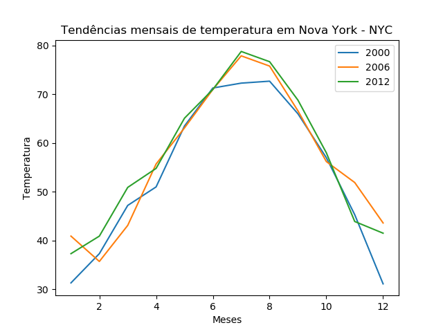
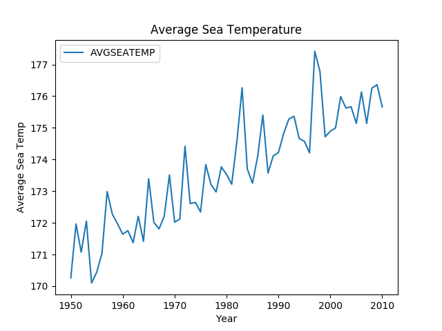

# Histograms

## Conteúdo

 - [](#01)

---

### 02.4 - Gráficos de dispersão (Scatter Plots)

__Muitas vezes você vai querer comparar valores quantitativos__. Isso pode ser especialmente útil em cenários de ciência de dados em que você está explorando dados antes de criar um modelo de `Machine Learning(Aprendizado de máquina)`, pois ele pode ajudar a identificar relações aparentes entre recursos numéricos.

> Gráficos de dispersão também podem ajudar a identificar possíveis valores discrepantes - __valores que estão significativamente fora do intervalo normal de valores__.

O código Python a seguir cria um gráfico de dispersão que plota os pontos de interseção para __midparentHeight__ no eixo *x* e __childHeight__ no eixo *y*:

[scatter.py](src/scatter.py)
```python
from matplotlib import pyplot as plt
import statsmodels.api as sm


df = sm.datasets.get_rdataset('GaltonFamilies', package='HistData').data
parentHeights = df[['midparentHeight', 'childHeight']] # Pega os dados "midparentHeight" e "childHeight"

parentHeights.plot(kind='scatter', title='Parent vs Child Heights', x='midparentHeight', y='childHeight')
plt.xlabel('Avg Parent Height')
plt.ylabel('Child Height')
plt.savefig('../images/plot-05.png', format='png')
plt.show()
```

**OUTPUT:**  


Em um `Gráfico de Dispersão(Scatter Plot)`, __cada ponto marca o ponto de interseção dos dois valores sendo plotados__. Neste gráfico, a maioria das alturas está agrupada em torno do centro; o que indica que a maioria dos pais e filhos tendem a ter uma altura que está em algum lugar no meio do intervalo de alturas observado.

 - __No canto inferior esquerdo__, há um pequeno aglomerado de pontos que mostra alguns pais da extremidade mais curta do grupo que têm filhos que também são mais curtos do que seus pares.  
 - __No canto superior direito__, há alguns pais extremamente altos que têm filhos extremamente altos.  
 - Também é interessante notar que a __parte superior esquerda__ e a __parte inferior direita do gráfico__ __`estão vazias`__ - não há casos de pais extremamente curtos com filhos extremamente altos ou vice-versa.

<div id='02-5'></div>

### 02.5 - Gráficos de linhas - (Line Charts)

Os `Gráficos de Linhas - (Line Charts)` são uma ótima maneira de __ver as alterações nos valores ao longo de uma série - geralmente (mas nem sempre) com base em um período de tempo__.  
  
O conjunto de dados do Galton não inclui nenhum dado desse tipo, portanto usaremos um conjunto de dados diferente que inclui observações da temperatura da superfície do mar entre 1950 e 2010 para este exemplo:

[line_chart.py](src/line_chart.py)
```python
import statsmodels.api as sm # Importa a biblioteca statsmodels.

df = sm.datasets.elnino.load_pandas().data # Pega o dataset elnino das temperaturas.
print(df.head(10))
```

**OUTPUT:**  
```
     YEAR    JAN    FEB    MAR    APR    MAY    JUN    JUL    AUG    SEP    OCT    NOV    DEC
0  1950.0  23.11  24.20  25.37  23.86  23.03  21.57  20.63  20.15  19.67  20.03  20.02  21.80
1  1951.0  24.19  25.28  25.60  25.37  24.79  24.69  23.86  22.32  21.44  21.77  22.33  22.89
2  1952.0  24.52  26.21  26.37  24.73  23.71  22.34  20.89  20.02  19.63  20.40  20.77  22.39
3  1953.0  24.15  26.34  27.36  27.03  25.47  23.49  22.20  21.45  21.25  20.95  21.60  22.44
4  1954.0  23.02  25.00  25.33  22.97  21.73  20.77  19.52  19.33  18.95  19.11  20.27  21.30
5  1955.0  23.75  24.82  25.14  24.22  22.16  21.20  20.46  19.63  19.24  19.16  19.84  21.19
6  1956.0  23.24  24.71  25.90  24.66  23.14  22.04  21.47  20.55  19.89  19.69  20.57  21.58
7  1957.0  23.13  26.30  27.63  27.15  26.72  25.04  23.83  22.34  21.80  21.80  22.39  23.69
8  1958.0  24.89  26.55  27.09  26.37  24.71  23.23  22.31  20.72  20.62  21.05  21.52  22.50
9  1959.0  23.97  25.90  26.94  25.84  24.23  22.57  21.50  20.15  20.23  20.86  21.88  22.55
```

Continuando com o nosso exemplo nós teremos o seguinte código para ver isso em um gráfico:

[line_chart.py](src/line_chart.py)
```python
from matplotlib import pyplot as plt
import statsmodels.api as sm

df = sm.datasets.elnino.load_pandas().data # Pega o dataset elnino das temperaturas.

# Adiciona uma coluna ao df com as médias por ano - "AVGSEATEMP".
# - Soma de todos os meses - Janeiro à Dezembro;
# - Divida por o número de meses - 12.
df['AVGSEATEMP'] = df.mean(1) # A média(mean) inicia a partir do índice 1(janeiro).

# Exibe o DataFrame com a nova amostra.
print(df.head(10))

# Cria o plot/gráfico com pyplot.plot - plt.
df.plot(title='Average Sea Temperature', x='YEAR', y='AVGSEATEMP')
plt.xlabel('Year')
plt.ylabel('Average Sea Temp')
plt.savefig('../images/plot-06.png', format='png')
plt.show()
```

```
     YEAR    JAN    FEB    MAR    APR    MAY    JUN    JUL    AUG    SEP    OCT    NOV    DEC  AVGSEATEMP
0  1950.0  23.11  24.20  25.37  23.86  23.03  21.57  20.63  20.15  19.67  20.03  20.02  21.80  170.264615
1  1951.0  24.19  25.28  25.60  25.37  24.79  24.69  23.86  22.32  21.44  21.77  22.33  22.89  171.963846
2  1952.0  24.52  26.21  26.37  24.73  23.71  22.34  20.89  20.02  19.63  20.40  20.77  22.39  171.075385
3  1953.0  24.15  26.34  27.36  27.03  25.47  23.49  22.20  21.45  21.25  20.95  21.60  22.44  172.056154
4  1954.0  23.02  25.00  25.33  22.97  21.73  20.77  19.52  19.33  18.95  19.11  20.27  21.30  170.100000
5  1955.0  23.75  24.82  25.14  24.22  22.16  21.20  20.46  19.63  19.24  19.16  19.84  21.19  170.446923
6  1956.0  23.24  24.71  25.90  24.66  23.14  22.04  21.47  20.55  19.89  19.69  20.57  21.58  171.033846
7  1957.0  23.13  26.30  27.63  27.15  26.72  25.04  23.83  22.34  21.80  21.80  22.39  23.69  172.986154
8  1958.0  24.89  26.55  27.09  26.37  24.71  23.23  22.31  20.72  20.62  21.05  21.52  22.50  172.273846
9  1959.0  23.97  25.90  26.94  25.84  24.23  22.57  21.50  20.15  20.23  20.86  21.88  22.55  171.970769
```

**OUTPUT:**  


O gráfico de linhas mostra a tendência da temperatura da esquerda para a direita durante o período de observações. A partir deste gráfico, você pode ver que a temperatura média flutua de ano para ano, mas a tendência geral mostra um aumento.

---

**REFERÊNCIA:**  
[Essential Math for Machine Learning: Python Edition](https://learning.edx.org/course/course-v1:Microsoft+DAT256x+2T2018/home)  
