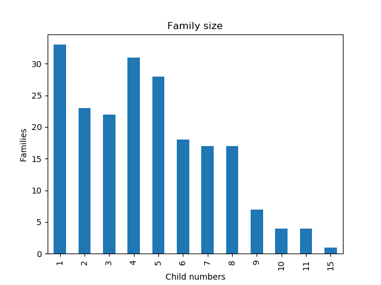

# Gráfico de Barras (Bar Charts)

## Conteúdo

 - [01 - Introdução ao Gráfico de Barras (Bar charts)](#01)

---

<div id="01"></div>

Um **Gráfico de barras (Bar Charts)** é uma boa maneira de

> **comparar quantidades numéricas** ou **contagens entre categorias**.

Por exemplo, no conjunto de dados de **Galton**, você pode querer comparar o número de crianças do sexo feminino e masculino:

[bar_chart.py](src/bar_chart.py)
```python
from matplotlib import pyplot as plt
import statsmodels.api as sm

df = sm.datasets.get_rdataset('GaltonFamilies', package='HistData').data
genderCounts = df['gender'].value_counts()

genderCounts.plot(kind='bar', title='Gender count')
plt.xlabel('Gender')
plt.ylabel('Child numbers')
plt.savefig('../images/bar_chart_childs.png', format='png')
plt.show()
```

**OUTPUT:**  


A partir deste gráfico, você pode ver que há um pouco mais de crianças do sexo masculino do que de crianças do sexo feminino; mas os dados são razoavelmente divididos entre os dois gêneros.

**Mas, em alguns casos, você pode tratar um valor de dados quantitativos discretos (algo que contamos em vez de medir) como uma categoria**:  
Por exemplo, no conjunto de dados de **Galton**, o número de crianças em cada família poderia ser usado como uma maneira de categorizar as famílias. Podemos querer ver quantas famílias têm um filho, em comparação com quantas têm dois filhos, etc.

[bar_chart2.py](src/bar_chart2.py)
```python
from matplotlib import pyplot as plt
import statsmodels.api as sm

df = sm.datasets.get_rdataset('GaltonFamilies', package='HistData').data
families = df[['family', 'children']].drop_duplicates()
childCounts = families['children'].value_counts().sort_index()

childCounts.plot(kind='bar', title='Family size')
plt.xlabel('Child numbers')
plt.ylabel('Families')
plt.savefig('../images/bar_chart_childs_families.png', format='png')
plt.show()

```

**OUTPUT:**  


Aqui basicamente é o seguinte:

 - No **eixo-x** nós temos o número de filhos **(em ordem crescente)**;
 - No **eixo-y** nós temos o número de familias que tem **x** filhos.

__NOTE:__  
Outra observação é que o código classifica os dados de modo que as categorias no eixo **x** estejam em ordem - A atenção a esse tipo de detalhe pode facilitar a leitura de seus gráficos. Neste caso, podemos ver que o número mais comum de crianças por família é 1, seguido por 4 e 5.

---

**REFERÊNCIA:**  
[Essential Math for Machine Learning: Python Edition](https://learning.edx.org/course/course-v1:Microsoft+DAT256x+2T2018/home)  
