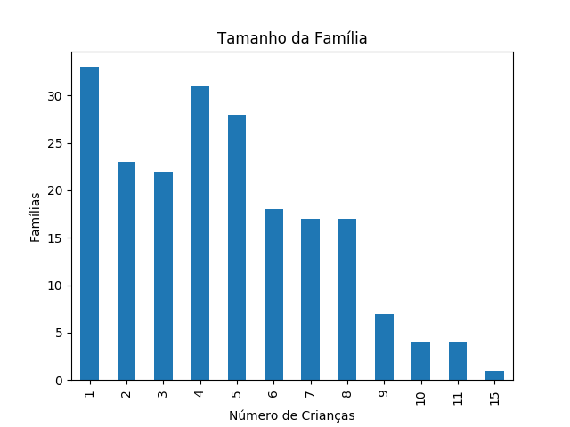
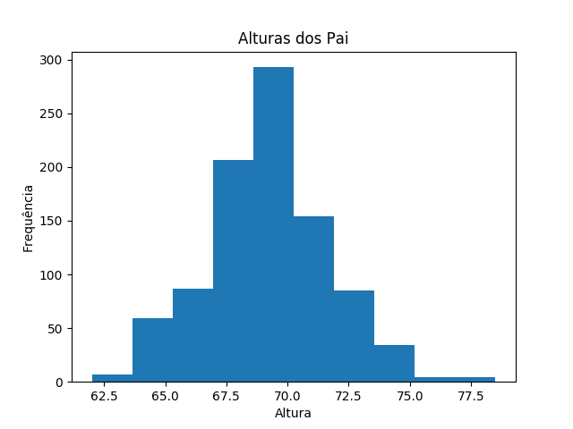
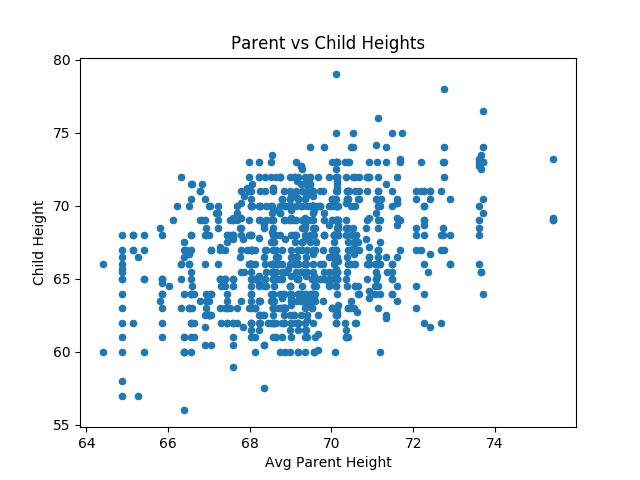

# Dados & Visualização de Dados

# Contents

 - [01 - Introdução aos Dados](#01)
   - [01.1 - Tipos de dados - (Qualitativos vs Quantitativos)](#01-1)
   - [01.2 - Amostra vs População](#01-2)
 - [02 - Visualizando Dados](#02)
   - [02.1 - Gráfico de Barras - (Bar Charts)](#02-1)
   - [02.2 - Histograms](#02-2)
   - [02.3 - Gráficos de pizza - (Pie Charts)](#02-3)
   - [02.4 - Gráficos de dispersão - (Scatter Plots)](#02-4)
   - [02.5 - Gráficos de linhas - (Line Charts)](#02-5)

<div id='01'></div>

## 01 - Introdução aos Dados

As estatísticas são baseadas em dados, que consistem em uma coleção de informações sobre as coisas que você quer estudar. Esta informação podem assumir a forma de:

 - __Descrições__;
 - __Quantidades__;
 - __Medições__;
 - __E outras observações__.

Normalmente, trabalhamos com itens de dados relacionados em um conjunto de dados, que geralmente consiste em uma coleção de observações ou casos. Mais comumente, pensamos nesse conjunto de dados como uma tabela que consiste:

 - __Uma linha para cada observação__;
 - __Uma coluna para cada ponto de dados relacionado a essa observação__.

Vamos dar uma olhada em um exemplo real. Em 1886, `Francis Galton` realizou um estudo sobre a relação entre as alturas dos pais e seus filhos (adultos).

[galton_test.py](src/galton_test.py)
```python
# Importa a biblioteca statsmodels como "sm".
import statsmodels.api as sm

# Pega o dataset de estudos de "Francis Galton" e salva no objeto "df".
df = sm.datasets.get_rdataset('GaltonFamilies', package='HistData').data
print(df.head(10)) # Imprime as 10 primeiras amostras.
```

**OUTPUT:**  
```
  family  father  mother  midparentHeight  children  childNum  gender  childHeight
0    001    78.5    67.0            75.43         4         1    male         73.2
1    001    78.5    67.0            75.43         4         2  female         69.2
2    001    78.5    67.0            75.43         4         3  female         69.0
3    001    78.5    67.0            75.43         4         4  female         69.0
4    002    75.5    66.5            73.66         4         1    male         73.5
5    002    75.5    66.5            73.66         4         2    male         72.5
6    002    75.5    66.5            73.66         4         3  female         65.5
7    002    75.5    66.5            73.66         4         4  female         65.5
8    003    75.0    64.0            72.06         2         1    male         71.0
9    003    75.0    64.0            72.06         2         2  female         68.0
```

<div id='01-1'></div>

### 01.1 Tipos de dados - (Qualitativos vs Quantitativos)

Agora, vamos dar uma olhada mais de perto nesses dados. Existem 933 observações, cada uma registrando informações relativas a uma criança individual. As informações registradas consistem nos seguintes recursos:

 - **family**: Um identificador para a família à qual a criança pertence;
 - **father**: A altura do pai;
 - **mother**: A altura da mãe;
 - **midparentHeight**: O ponto médio entre as alturas do pai e da mãe __(calculado como (father + 1,08 x mother) ÷ 2 )__;
 - **children**: O número total de crianças na família;
 - **childNum**: O número da criança a quem esta observação pertence __(Galton numerou as crianças em ordem decrescente de altura, com os filhos do sexo masculino listados antes das crianças do sexo feminino)__;
 - **gender**: O gênero da criança a quem esta observação pertence;
 - **childHeight**: A altura da criança a quem esta observação pertence.

Vale a pena notar que existem vários tipos distintos de dados registrados aqui. Para começar, há alguns recursos que representam qualidades ou características da criança - por exemplo, gênero. Outras características representam uma quantidade ou medida, como a altura da criança. Então, de maneira ampla, podemos dividir os dados em dados __Qualitativos__ e __Quantitativos__.

### Dados Qualitativos:
Vamos dar uma olhada nos dados qualitativos primeiro. Esse tipo de dado é categórico - é usado para __categorizar__ ou __identificar__ a entidade que está sendo observada:

 - __Dados nominais - (São valores nomeados para alguma característica)__  
Em suas observações da altura das crianças, Galton atribuiu um identificador a cada família e registrou o gênero de cada criança. `Observe que, embora o identificador da família seja um número, não é uma medida ou quantidade`. A família 002 não é "maior" que a família 001, `assim como um valor de gênero "male" não indica um valor maior ou menor que "female"`. Estes são simplesmente valores nomeados para alguma característica da criança e, como tal, são conhecidos como dados nominais.  
 - __Dados Ordinais - (Indicam algum tipo de ordem inerente ou hierarquia)__  
Então, e o recurso `childNum`? Não é uma medida ou quantidade - é apenas uma maneira de identificar crianças individuais dentro de uma família. No entanto, o número atribuído a cada criança tem algum significado adicional - os números são ordenados. Você pode encontrar dados semelhantes que são baseados em texto; por exemplo, os dados sobre cursos de treinamento podem incluir um atributo "level" que indica o nível do curso como "basic", "intermediate" ou "advanced". Esse tipo de dados, em que o valor não é em si uma quantidade ou medida , mas indica algum tipo de ordem inerente ou hierarquia, é conhecido como `dados ordinais`.

### Dados Quantitativos:
Agora vamos voltar nossa atenção para os __recursos que indicam algum tipo de quantidade ou medida__:  
  
 - __Dados Contínuos - (Medimos em vez de contar)__  
O conjunto de dados também inclui valores de altura para `father`, `mother`, `midparentHeight` e `childHeight`. Estas são medidas ao longo de uma escala e, como tal, são descritas como valores de dados quantitativos contínuos que __medimos em vez de contar__.
 - __Dados Discretos - (É algo que contamos em vez de medir)__  
As observações de Galton incluem o número de crianças(children) em cada família. Este é um valor discreto de dados quantitativos - __é algo que contamos em vez de medir__. Você não pode, por exemplo, ter 2,33 filhos!.

<div id='01-2'></div>

### 01.2 - Amostra vs População

O conjunto de dados de Galton inclui 933 observações. É seguro assumir que isso não conta para todas as pessoas no mundo, ou mesmo apenas no Reino Unido, em 1886, quando os dados foram coletados. Em outras palavras, os dados de Galton representam uma amostra de uma população maior. Vale a pena parar para pensar sobre isso por alguns segundos, porque há algumas implicações para quaisquer conclusões que possamos tirar das observações de Galton.

Pense em quantas vezes você vê uma reivindicação como "um em cada quatro americanos gosta de assistir futebol". Como as pessoas que fazem essa afirmação sabem que isso é um fato? Eles perguntaram a todos os americanos sobre seus hábitos de assistir futebol? Bem, isso seria um pouco impraticável, então o que geralmente acontece é que um estudo é conduzido em um subconjunto da população, e (supondo que este seja um estudo bem conduzido), esse subconjunto será uma amostra representativa da população como um todo. Se a pesquisa foi realizada no estádio onde o Superbowl está sendo jogado, então os resultados provavelmente serão distorcidos por causa de um viés nos participantes do estudo.

Da mesma forma, poderíamos olhar para os dados de Galton e assumir que as alturas das pessoas incluídas no estudo têm alguma relação com as alturas da população em geral em 1886; mas se Galton especificamente selecionasse pessoas anormalmente altas para seu estudo, então essa suposição seria infundada.

Quando lidamos com estatísticas, geralmente trabalhamos com uma amostra dos dados em vez de uma população completa. Como você verá mais adiante, isso afeta a forma como usamos a notação para indicar medidas estatísticas; e, em alguns casos, calculamos as estatísticas de uma amostra de maneira diferente do que de uma população completa para considerar o viés na amostra.

<div id='02'></div>

# 02 - Visualizando Dados

> A visualização de dados é uma das principais maneiras pelas quais podemos examinar dados e obter *insights* a partir deles. `Se uma imagem vale mais que mil palavras`, então um bom plot/gráfico vale mais do que qualquer quantidade de tabelas de dados.  

Vamos examinar alguns tipos comuns de visualização de dados:

<div id='02-1'></div>

### 02.1 - Gráfico de Barras - (Bar Charts)

Um `Gráfico de barras (Bar Charts)` é uma boa maneira de **comparar quantidades numéricas** ou **contagens entre categorias**. Por exemplo, no conjunto de dados de *Galton*, você pode querer comparar o número de crianças do sexo feminino e masculino:

[bar_chart.py](src/bar_chart.py)
```python
from matplotlib import pyplot as plt
import statsmodels.api as sm

df = sm.datasets.get_rdataset('GaltonFamilies', package='HistData').data # Pega o dataset de Galton.
genderCounts = df['gender'].value_counts() # Conta e pega os valores de gênero - male/female

genderCounts.plot(kind='bar', title='Contagens de Gênero')
plt.xlabel('Gênero')
plt.ylabel('Número de Crianças')
plt.savefig('../images/plot-01.png', format='png')
plt.show()
```

**OUTPUT:**  


A partir deste gráfico, você pode ver que há um pouco mais de crianças do sexo masculino do que de crianças do sexo feminino; mas os dados são razoavelmente divididos entre os dois gêneros.

__NOTE:__  
Gráficos de barras(Bar Charts) são __normalmente usados para comparar valores de dados categóricos (qualitativos)__; mas, em __alguns casos, você pode tratar um valor de dados quantitativos discretos (algo que contamos em vez de medir) como uma categoria__.

Por exemplo, no conjunto de dados de *Galton*, o número de crianças em cada família poderia ser usado como uma maneira de categorizar as famílias. Podemos querer ver quantas famílias têm um filho, em comparação com quantas têm dois filhos, etc.

[bar_chart2.py](src/bar_chart2.py)
```python
from matplotlib import pyplot as plt
import statsmodels.api as sm

df = sm.datasets.get_rdataset('GaltonFamilies', package='HistData').data
families = df[['family', 'children']].drop_duplicates() # Pega family/children e remova duplicadas.
childCounts = families['children'].value_counts().sort_index() # Conta e ordena os valores de "children".

# Cria o plot/gráfico com pyplot - plt.
childCounts.plot(kind='bar', title='Tamanho da Família')
plt.xlabel('Número de Crianças')
plt.ylabel('Famílias')
plt.savefig('../images/plot-02.png', format='png')
plt.show()
```

**OUTPUT:**  


__NOTE:__  
Observe que o código classifica os dados de modo que as categorias no eixo **x** estejam em ordem - a atenção a esse tipo de detalhe pode facilitar a leitura de seus gráficos. Neste caso, podemos ver que o número mais comum de crianças por família é 1, seguido por 5 e 6.

<div id='02-2'></div>

### 02.2 - Histograms

Gráficos de barras funcionam bem para comparar valores numéricos categóricos ou discretos. __Quando você precisa comparar valores `quantitativos contínuos`, você pode usar um estilo semelhante de gráfico chamado histograma__.

> Histogramas diferem dos gráficos de barras porque que eles agrupam os valores contínuos em intervalos ou faixas - __Portanto, o gráfico não mostra uma barra para cada valor individual, mas sim uma barra para cada intervalo de valores categorizados.__

__NOTE:__  
Como essas faixas representam dados contínuos em vez de dados discretos, as barras não são separadas por uma lacuna. Normalmente, um histograma é usado para mostrar a frequência relativa dos valores no conjunto de dados.

[histogram.py](src/histogram.py)
```python
import statsmodels.api as sm # Importa a biblioteca statsmodels.
from matplotlib import pyplot as plt # Importa a bibliote pyplot do Matplotlib.

df = sm.datasets.get_rdataset('GaltonFamilies', package='HistData').data

df['father'].plot.hist(title='Alturas dos Pai')
plt.xlabel('Altura')
plt.ylabel('Frequência')
plt.savefig('../images/plot-03.png', format='png')
plt.show()
```

**OUTPUT:**  


O histograma mostra que as alturas mais freqüentes tendem a estar na faixa intermediária. Há menos pais extremamente baixos ou extremamente altos.

<div id='02-3'></div>

### 02.3 - Gráficos de pizza - (Pie Charts)

Gráficos de pizza são __outra maneira de comparar quantidades relativas de categorias__. Eles não são comumente usados por cientistas de dados, mas podem ser úteis em muitos contextos de negócios com números gerenciáveis ​​de categorias, porque eles não apenas facilitam a comparação de quantidades relativas por categorias; eles também mostram essas quantidades como uma proporção de todo o conjunto de dados.

[pie_chart.py](src/pie_chart.py)
```python
from matplotlib import pyplot as plt
import statsmodels.api as sm

df = sm.datasets.get_rdataset('GaltonFamilies', package='HistData').data
genderCounts = df['gender'].value_counts() # Conta e pega os valores de gêneros - male/female

genderCounts.plot(kind='pie', title='Gender Counts', figsize=(6,6))
plt.legend()
plt.savefig('../images/plot-04.png', format='png')
plt.show()
```

**OUTPUT:**  


Observe que o gráfico inclui uma legenda para deixar claro qual categoria cada área colorida no __gráfico de pizza(Pie Charts)__ representa.  
A partir deste gráfico, você pode ver que os homens representam um pouco mais da metade do número total de crianças; com as fêmeas representando o resto.

<div id='02-4'></div>

### 02.4 - Gráficos de dispersão - (Scatter Plots)

__Muitas vezes você vai querer comparar valores quantitativos__. Isso pode ser especialmente útil em cenários de ciência de dados em que você está explorando dados antes de criar um modelo de `Machine Learning(Aprendizado de máquina)`, pois ele pode ajudar a identificar relações aparentes entre recursos numéricos.

> Gráficos de dispersão também podem ajudar a identificar possíveis valores discrepantes - __valores que estão significativamente fora do intervalo normal de valores__.

O código Python a seguir cria um gráfico de dispersão que plota os pontos de interseção para __midparentHeight__ no eixo *x* e __childHeight__ no eixo *y*:

[scatter.py](src/scatter.py)
```python
from matplotlib import pyplot as plt
import statsmodels.api as sm


df = sm.datasets.get_rdataset('GaltonFamilies', package='HistData').data
parentHeights = df[['midparentHeight', 'childHeight']] # Pega os dados "midparentHeight" e "childHeight"

parentHeights.plot(kind='scatter', title='Parent vs Child Heights', x='midparentHeight', y='childHeight')
plt.xlabel('Avg Parent Height')
plt.ylabel('Child Height')
plt.savefig('../images/plot-05.png', format='png')
plt.show()
```

**OUTPUT:**  


Em um `Gráfico de Dispersão(Scatter Plot)`, __cada ponto marca o ponto de interseção dos dois valores sendo plotados__. Neste gráfico, a maioria das alturas está agrupada em torno do centro; o que indica que a maioria dos pais e filhos tendem a ter uma altura que está em algum lugar no meio do intervalo de alturas observado.

 - __No canto inferior esquerdo__, há um pequeno aglomerado de pontos que mostra alguns pais da extremidade mais curta do grupo que têm filhos que também são mais curtos do que seus pares.  
 - __No canto superior direito__, há alguns pais extremamente altos que têm filhos extremamente altos.  
 - Também é interessante notar que a __parte superior esquerda__ e a __parte inferior direita do gráfico__ __`estão vazias`__ - não há casos de pais extremamente curtos com filhos extremamente altos ou vice-versa.

<div id='02-5'></div>

### 02.5 - Gráficos de linhas - (Line Charts)

Os `Gráficos de Linhas - (Line Charts)` são uma ótima maneira de __ver as alterações nos valores ao longo de uma série - geralmente (mas nem sempre) com base em um período de tempo__.  
  
O conjunto de dados do Galton não inclui nenhum dado desse tipo, portanto usaremos um conjunto de dados diferente que inclui observações da temperatura da superfície do mar entre 1950 e 2010 para este exemplo:

[line_chart.py](src/line_chart.py)
```python
import statsmodels.api as sm # Importa a biblioteca statsmodels.

df = sm.datasets.elnino.load_pandas().data # Pega o dataset elnino das temperaturas.
print(df.head(10))
```

**OUTPUT:**  
```
     YEAR    JAN    FEB    MAR    APR    MAY    JUN    JUL    AUG    SEP    OCT    NOV    DEC
0  1950.0  23.11  24.20  25.37  23.86  23.03  21.57  20.63  20.15  19.67  20.03  20.02  21.80
1  1951.0  24.19  25.28  25.60  25.37  24.79  24.69  23.86  22.32  21.44  21.77  22.33  22.89
2  1952.0  24.52  26.21  26.37  24.73  23.71  22.34  20.89  20.02  19.63  20.40  20.77  22.39
3  1953.0  24.15  26.34  27.36  27.03  25.47  23.49  22.20  21.45  21.25  20.95  21.60  22.44
4  1954.0  23.02  25.00  25.33  22.97  21.73  20.77  19.52  19.33  18.95  19.11  20.27  21.30
5  1955.0  23.75  24.82  25.14  24.22  22.16  21.20  20.46  19.63  19.24  19.16  19.84  21.19
6  1956.0  23.24  24.71  25.90  24.66  23.14  22.04  21.47  20.55  19.89  19.69  20.57  21.58
7  1957.0  23.13  26.30  27.63  27.15  26.72  25.04  23.83  22.34  21.80  21.80  22.39  23.69
8  1958.0  24.89  26.55  27.09  26.37  24.71  23.23  22.31  20.72  20.62  21.05  21.52  22.50
9  1959.0  23.97  25.90  26.94  25.84  24.23  22.57  21.50  20.15  20.23  20.86  21.88  22.55
```

Continuando com o nosso exemplo nós teremos o seguinte código para ver isso em um gráfico:

[line_chart.py](src/line_chart.py)
```python
from matplotlib import pyplot as plt
import statsmodels.api as sm

df = sm.datasets.elnino.load_pandas().data # Pega o dataset elnino das temperaturas.

# Adiciona uma coluna ao df com as médias por ano - "AVGSEATEMP".
# - Soma de todos os meses - Janeiro à Dezembro;
# - Divida por o número de meses - 12.
df['AVGSEATEMP'] = df.mean(1) # A média(mean) inicia a partir do índice 1(janeiro).

# Exibe o DataFrame com a nova amostra.
print(df.head(10))

# Cria o plot/gráfico com pyplot.plot - plt.
df.plot(title='Average Sea Temperature', x='YEAR', y='AVGSEATEMP')
plt.xlabel('Year')
plt.ylabel('Average Sea Temp')
plt.savefig('../images/plot-06.png', format='png')
plt.show()
```

```
     YEAR    JAN    FEB    MAR    APR    MAY    JUN    JUL    AUG    SEP    OCT    NOV    DEC  AVGSEATEMP
0  1950.0  23.11  24.20  25.37  23.86  23.03  21.57  20.63  20.15  19.67  20.03  20.02  21.80  170.264615
1  1951.0  24.19  25.28  25.60  25.37  24.79  24.69  23.86  22.32  21.44  21.77  22.33  22.89  171.963846
2  1952.0  24.52  26.21  26.37  24.73  23.71  22.34  20.89  20.02  19.63  20.40  20.77  22.39  171.075385
3  1953.0  24.15  26.34  27.36  27.03  25.47  23.49  22.20  21.45  21.25  20.95  21.60  22.44  172.056154
4  1954.0  23.02  25.00  25.33  22.97  21.73  20.77  19.52  19.33  18.95  19.11  20.27  21.30  170.100000
5  1955.0  23.75  24.82  25.14  24.22  22.16  21.20  20.46  19.63  19.24  19.16  19.84  21.19  170.446923
6  1956.0  23.24  24.71  25.90  24.66  23.14  22.04  21.47  20.55  19.89  19.69  20.57  21.58  171.033846
7  1957.0  23.13  26.30  27.63  27.15  26.72  25.04  23.83  22.34  21.80  21.80  22.39  23.69  172.986154
8  1958.0  24.89  26.55  27.09  26.37  24.71  23.23  22.31  20.72  20.62  21.05  21.52  22.50  172.273846
9  1959.0  23.97  25.90  26.94  25.84  24.23  22.57  21.50  20.15  20.23  20.86  21.88  22.55  171.970769
```

**OUTPUT:**  


O gráfico de linhas mostra a tendência da temperatura da esquerda para a direita durante o período de observações. A partir deste gráfico, você pode ver que a temperatura média flutua de ano para ano, mas a tendência geral mostra um aumento.

---

**Rodrigo Leite** *- Software Engineer*
